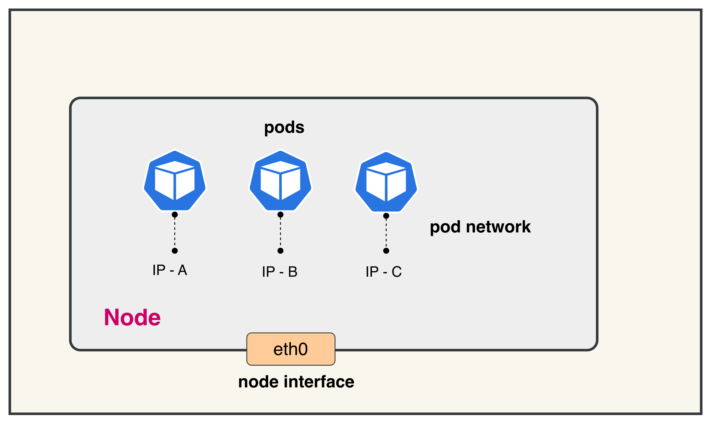

# Calico IP Address Management (IPAM)

This lab demonstrates Calico's IP Address Management (IPAM) functionality in a 3-node Kind Kubernetes cluster.

## Why is IPAM Required

In Kubernetes, every pod needs a unique IP address to communicate with other pods and services. IPAM (IP Address Management) is crucial because:

**1. Dynamic Pod Creation**: Pods are ephemeral and created/destroyed frequently. Each new pod requires an available IP address from the cluster's address space.

**2. Avoiding IP Conflicts**: Without proper IPAM, multiple pods could be assigned the same IP address, causing network conflicts and communication failures.

**3. Efficient Address Allocation**: IPAM systems allocate IP addresses in blocks to nodes, reducing the overhead of individual IP requests and improving scalability.

**4. Cross-Node Communication**: Pods on different nodes need routable IP addresses within the cluster to communicate directly without NAT, which IPAM facilitates through proper subnet allocation.

<mark> Calico's IPAM provides efficient IP allocation by pre-allocating IP blocks to nodes, allowing for fast pod startup times while maintaining proper IP address management across the entire cluster. </mark>



## Lab Setup
To setup the lab for this module **[Lab setup](../README.md#lab-setup)**
The lab folder is - `/containerlab/01-calico-ipam`

## Deployment

The `deploy.sh` script automates the complete lab setup process:

1. **ContainerLab Topology Deployment**: Creates a 3-node Kind cluster using the `calico-ipam.clab.yaml` configuration
2. **Kubeconfig Setup**: Exports the Kind cluster's kubeconfig for kubectl access
3. **Calico Installation**: Downloads and installs calicoctl, then deploys Calico CNI components:
   - Calico Operator CRDs
   - Tigera Operator
   - Custom Calico resources with IPAM configuration
4. **Verification**: Waits for all Calico components to become available before completion

Deploy the lab using:
```bash
chmod +x deploy.sh
./deploy.sh
```

### Calico CNI Configuration

The Calico installation uses a custom Installation resource that defines the pod network configuration. Key considerations for the CIDR selection:

**Default IP Pool CIDR: 192.168.0.0/16**
- **Size**: Provides 65,536 IP addresses (sufficient for large clusters)
- **Block Size**: /26 blocks (64 IPs each) are allocated to nodes as needed
- **Avoid Conflicts**: Must not overlap with:
  - Host machine networks
  - Kubernetes service CIDR (10.96.0.0/16)
  - Any existing VPN or corporate network ranges
- **Encapsulation**: Uses VXLANCrossSubnet for pod-to-pod communication across nodes
- **NAT Outgoing**: Enabled to allow pods to reach external networks

The CIDR choice directly impacts cluster scalability and network policy effectiveness. The /16 range allows for approximately 1,024 nodes with /26 blocks, making it suitable for most lab and production environments.

## Post-Deployment Verification

After deployment, verify the cluster is ready:

### 1. Inspect ContainerLab Topology
```bash
containerlab inspect -t calico-ipam.clab.yaml
```
**Output Example:**

```
╭───────────────────────────┬──────────────────────┬─────────┬───────────────────────╮
│            Name           │      Kind/Image      │  State  │     IPv4/6 Address    │
├───────────────────────────┼──────────────────────┼─────────┼───────────────────────┤
│ calico-ipam-control-plane │ k8s-kind             │ running │ 172.18.0.3            │
│                           │ kindest/node:v1.28.0 │         │ fc00:f853:ccd:e793::3 │
├───────────────────────────┼──────────────────────┼─────────┼───────────────────────┤
│ calico-ipam-worker        │ k8s-kind             │ running │ 172.18.0.2            │
│                           │ kindest/node:v1.28.0 │         │ fc00:f853:ccd:e793::2 │
├───────────────────────────┼──────────────────────┼─────────┼───────────────────────┤
│ calico-ipam-worker2       │ k8s-kind             │ running │ 172.18.0.4            │
│                           │ kindest/node:v1.28.0 │         │ fc00:f853:ccd:e793::4 │
╰───────────────────────────┴──────────────────────┴─────────┴───────────────────────╯
```

### 2. Check Calico Installation Status

```bash
export KUBECONFIG=/home/ubuntu/containerlab/1-calico-ipam/calico-ipam.kubeconfig
kubectl get tigerastatus
```

**Output Example:**
```
NAME        AVAILABLE   PROGRESSING   DEGRADED   SINCE
apiserver   True        False         False      2m30s
calico      True        False         False      2m45s
```

**Explanation:**
- **NAME**: Calico component being monitored
- **AVAILABLE**: Whether the component is fully operational
- **PROGRESSING**: Whether the component is still being deployed/updated
- **DEGRADED**: Whether the component has any issues
- **SINCE**: How long the component has been in its current state

All components should show `AVAILABLE: True` and `DEGRADED: False` for a healthy installation.

### 3. Check Node Status

```bash
kubectl get nodes
```

**Output Example:**
```
NAME                       STATUS   ROLES           AGE   VERSION
calico-ipam-control-plane  Ready    control-plane   3m    v1.28.0
calico-ipam-worker         Ready    <none>          3m    v1.28.0
calico-ipam-worker2        Ready    <none>          3m    v1.28.0
```

**Explanation:**
- **NAME**: Node name as assigned by Kind
- **STATUS**: Node readiness state (should be `Ready`)
- **ROLES**: Node role (`control-plane` for master, `<none>` for workers)
- **AGE**: How long the node has been running
- **VERSION**: Kubernetes version running on the node

All nodes should show `STATUS: Ready` indicating they are healthy and can schedule pods.

## IPAM Monitoring Commands

### 1. Overall IPAM Status

```bash
calicoctl ipam show
```

**Output Example:**
```
+----------+-------------------+------------+------------+-------------------+
| GROUPING |       CIDR        | IPS TOTAL  | IPS IN USE |    IPS FREE       |
+----------+-------------------+------------+------------+-------------------+
| IP Pool  | 192.168.0.0/16    |      65536 |         10 |             65526 |
+----------+-------------------+------------+------------+-------------------+
```

**Explanation:**
- Shows the IP pool configuration from your custom-resources.yaml
- **CIDR**: The overall pod network range (192.168.0.0/16)
- **IPs TOTAL**: Total available IP addresses in the pool (65,536)
- **IPs IN USE**: Currently allocated IP addresses to pods
- **IPs FREE**: Available IP addresses for new pod allocation

### 2. Block Affinities List

```bash
kubectl get blockaffinities
```

**Output Example:**
```
NAME                                         AGE
ipam-block-affinity-192-168-0-64-26          2m
ipam-block-affinity-192-168-1-64-26          2m
ipam-block-affinity-192-168-2-0-26           2m
```

**Explanation:**
- **BlockAffinity** resources represent IPAM block assignments to nodes
- Each entry shows which IP block is assigned to which node
- The naming convention is `ipam-block-affinity-<block-cidr-with-dashes>-<prefix-length>`
- Calico allocates /26 blocks (64 IPs each) to nodes as needed

### 3. Detailed Block Affinities

```bash
kubectl get blockaffinities -o yaml
```

**Output Example:**
```yaml
apiVersion: v1
items:
- apiVersion: crd.projectcalico.org/v1
  kind: BlockAffinity
  metadata:
    name: ipam-block-affinity-192-168-0-64-26
    namespace: ""
  spec:
    cidr: 192.168.0.64/26
    deleted: false
    node: calico-ipam-control-plane
    state: confirmed
- apiVersion: crd.projectcalico.org/v1
  kind: BlockAffinity
  metadata:
    name: ipam-block-affinity-192-168-1-64-26
  spec:
    cidr: 192.168.1.64/26
    deleted: false
    node: calico-ipam-worker
    state: confirmed
```

**Explanation:**
- **spec.cidr**: The specific IP block (e.g., 192.168.0.64/26) assigned to a node
- **spec.node**: The Kubernetes node that owns this IP block
- **spec.state**: 
  - `confirmed`: Block is actively assigned and in use
  - `pending`: Block assignment is in progress
- **spec.deleted**: Indicates if the block is marked for deletion

### 4. Formatted Block Affinities

```bash
kubectl get blockaffinities -o=jsonpath='{range .items[*]}{.metadata.name}{"\t"}{.spec.node}{"\t"}{.spec.cidr}{"\n"}{end}'
```

**Output Example:**
```
ipam-block-affinity-192-168-0-64-26    calico-ipam-control-plane    192.168.0.64/26
ipam-block-affinity-192-168-1-64-26    calico-ipam-worker          192.168.1.64/26
ipam-block-affinity-192-168-2-0-26     calico-ipam-worker2         192.168.2.0/26
```

**Explanation:**
- **Column 1**: BlockAffinity resource name
- **Column 2**: Node name that owns the IP block
- **Column 3**: CIDR block assigned to that node

This formatted output provides a clear mapping of which IP blocks are assigned to which nodes, making it easy to understand IP allocation across your cluster.


## Key IPAM Concepts

- **IP Pools**: Large CIDR ranges (like 192.168.0.0/16) that define the overall address space
- **IP Blocks**: Smaller subnets (like /26 blocks) carved out from IP pools and assigned to nodes
- **Block Affinity**: The assignment relationship between IP blocks and nodes
- **IPAM**: Calico automatically manages IP allocation within assigned blocks when pods are created


## Troubleshooting

If you see issues with IP allocation:
1. Check if nodes have sufficient IP blocks assigned
2. Verify Calico pods are running: `kubectl get pods -n calico-system`
3. Check node status: `kubectl get nodes`
4. Review Calico logs: `kubectl logs -n calico-system -l k8s-app=calico-node`

## Lab Cleanup
to cleanup the lab follow steps in **[Lab cleanup](../README.md#lab-cleanup)**

