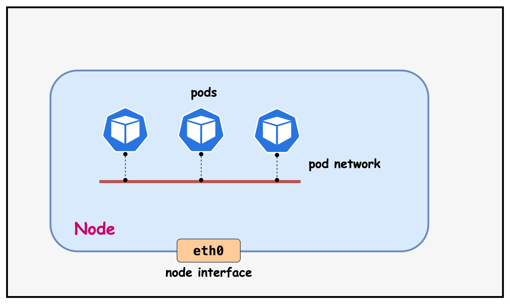
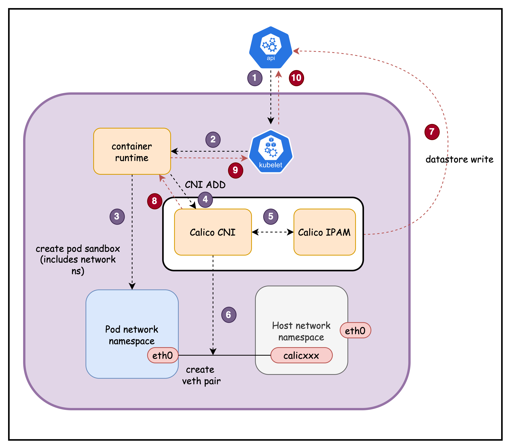
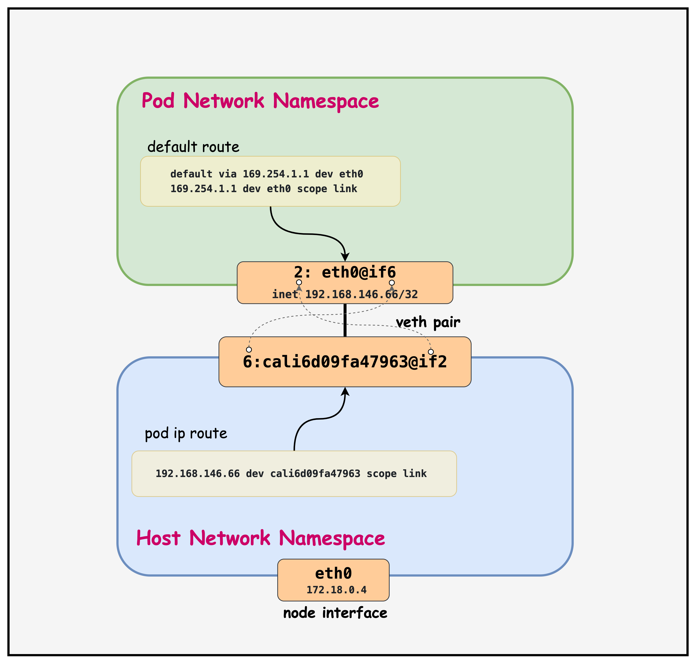

# Calico Pod Networking

This lab demonstrates Calico's routing functionality in a 3-node Kind Kubernetes cluster.


## Why Pod Networking is Required



In Kubernetes, every pod needs a unique IP address and proper network connectivity to function effectively. Pod networking is crucial because:

**1. Dynamic Pod Creation**: Pods are ephemeral and created/destroyed frequently. Each new pod requires network connectivity to communicate with other pods, services, and external resources across the cluster.

**2. Network Isolation**: Each pod gets its own network namespace, providing security isolation while still requiring connectivity mechanisms to bridge between pod and host network namespaces.

**3. Service Discovery**: Proper networking enables pods to reach Kubernetes services, DNS resolution, and communicate with other pods regardless of their physical location in the cluster.

**4. Container-to-Container Communication**: Multiple containers within the same pod need to communicate via localhost, requiring proper network namespace sharing and interface management.

<mark>Calico provides comprehensive pod networking by creating virtual network interfaces, managing IP address allocation, establishing routing tables, and enabling secure pod-to-pod communication across the entire cluster infrastructure.</mark>

## How the Pod Network is Created

When a pod is created, several Kubernetes components work together to establish network connectivity:



1. **kube-apiserver** receives pod creation request and assigns it to a node

2. **kubelet** detects the new pod and calls the **Container Runtime** (containerd/CRI-O)

3. **Container Runtime** creates pod's network namespace 

4. **Container Runtime** calls **Calico CNI plugin**

5. **Calico CNI** requests an IP address from **Calico IPAM** plugin. **Calico IPAM** allocates an IP from the node's assigned IP block.

6. **Calico CNI** creates a **veth pair**: one end stays on host (`cali123abc`), other goes to pod (`eth0`)

7. **Calico CNI** updates the **Calico datastore** with WorkloadEndpoint information (pod IP, interface, node, labels)

8. **Calico CNI** returns success response to **Container Runtime** with network configuration details

9. **Container Runtime** reports successful network setup back to **kubelet**

10. **kubelet** updates **kube-apiserver** with pod status (Running) and assigned IP address

Additionally

**Calico CNI** updates **host routing** with direct route to pod IP via the Calico interface. Also configures **pod's default route** via virtual gateway (169.254.1.1) for cluster communication


**Result**: Pod has unique IP address and can communicate with other pods across the cluster through Calico's routing infrastructure.


## Lab Setup

You need an EC2 instance or VM configured with containerlab. This repo provides a script to provision a preconfigured EC2 instance. 
📖 **[Back to Main Labs](../../README.md)** | 🚀 **[Deploy Lab Environment](../../README.md#deploying-the-lab-environment)**

Make sure you have cloned the repo to this machine prior to going through the rest of the steps in this lab. 

   ```
   git clone https://github.com/aadhilam/k8-networking-calico-containerlab.git
   ```

This lab consists of:
- 3-node Kind cluster (1 control-plane, 2 workers)
- Calico CNI with IPAM enabled
- Pod CIDR: 192.168.0.0/16
- Block size: /26 (64 IPs per block)

## Deployment

The `deploy.sh` script automates the complete lab setup process:

1. **ContainerLab Topology Deployment**: Creates a 3-node Kind cluster using the `pod-network.clab.yaml` configuration
2. **Kubeconfig Setup**: Exports the Kind cluster's kubeconfig for kubectl access
3. **Calico Installation**: Downloads and installs calicoctl, then deploys Calico CNI components:
   - Calico Operator CRDs
   - Tigera Operator
   - Custom Calico resources with IPAM configuration
4. **Verification**: Waits for all Calico components to become available before completion

Deploy the lab using:
```bash
cd containerlab/pod-network
chmod +x deploy.sh
./deploy.sh
```
## Verify cluster setup

After deployment, verify the cluster is ready by checking the ContainerLab topology status:

### 1. Inspect ContainerLab Topology

```bash
containerlab inspect -t pod-network.clab.yaml
```

**Output Example:**
```
╭───────────────────────────┬──────────────────────┬─────────┬───────────────────────╮
│            Name           │      Kind/Image      │  State  │     IPv4/6 Address    │
├───────────────────────────┼──────────────────────┼─────────┼───────────────────────┤
│ pod-network-control-plane │ k8s-kind             │ running │ 172.18.0.4            │
│                           │ kindest/node:v1.28.0 │         │ fc00:f853:ccd:e793::4 │
├───────────────────────────┼──────────────────────┼─────────┼───────────────────────┤
│ pod-network-worker        │ k8s-kind             │ running │ 172.18.0.3            │
│                           │ kindest/node:v1.28.0 │         │ fc00:f853:ccd:e793::3 │
├───────────────────────────┼──────────────────────┼─────────┼───────────────────────┤
│ pod-network-worker2       │ k8s-kind             │ running │ 172.18.0.2            │
│                           │ kindest/node:v1.28.0 │         │ fc00:f853:ccd:e793::2 │
╰───────────────────────────┴──────────────────────┴─────────┴───────────────────────╯
```

**Explanation:**
- **Name**: The ContainerLab node names corresponding to Kubernetes cluster nodes
- **Kind/Image**: Shows `k8s-kind` type using `kindest/node:v1.28.0` image for Kind cluster nodes
- **State**: Node status (`running` indicates healthy nodes)
- **IPv4/6 Address**: Container IP addresses within the ContainerLab Docker network
  - IPv4 addresses (172.18.0.x) for container-to-container communication
  - IPv6 addresses for dual-stack networking support

All nodes should show `State: running` for a healthy cluster setup.

### 2. Check Kubernetes Cluster Status

```bash
# Set kubeconfig to use the cluster
export KUBECONFIG=/home/ubuntu/containerlab/2-pod-network/pod-network.kubeconfig

# Check cluster nodes
kubectl get nodes -o wide
```

**Output:**
```
NAME                        STATUS   ROLES           AGE   VERSION   INTERNAL-IP   EXTERNAL-IP   OS-IMAGE                         KERNEL-VERSION   CONTAINER-RUNTIME
pod-network-control-plane   Ready    control-plane   11m   v1.28.0   172.18.0.4    <none>        Debian GNU/Linux 11 (bullseye)   6.2.0-1012-aws   containerd://1.7.1
pod-network-worker          Ready    <none>          10m   v1.28.0   172.18.0.3    <none>        Debian GNU/Linux 11 (bullseye)   6.2.0-1012-aws   containerd://1.7.1
pod-network-worker2         Ready    <none>          10m   v1.28.0   172.18.0.2    <none>        Debian GNU/Linux 11 (bullseye)   6.2.0-1012-aws   containerd://1.7.1
```

All nodes should show `STATUS: Ready` indicating the Kubernetes cluster is operational and ready for workloads.

## Pod Interfaces and Route Table

Once the cluster is running, you can examine how Calico manages pod networking by inspecting the network interfaces and routing tables within pods.

> [!Note]
> <mark>The outputs in this section will be different in your lab. When running the commands given in this section, make sure you replace IP addresses, interface names, and node names as per your lab.<mark>


### 1. Verify Test Pod is Running

The deployment script automatically creates a multitool pod for network inspection. Verify it's running:

```bash
kubectl get pods -n default
```

**Output Example:**
```
NAME        READY   STATUS    RESTARTS   AGE
multitool   1/1     Running   0          35m
```

The multitool pod should show `STATUS: Running` and `READY: 1/1`, indicating it's available for network analysis.

### 2. Examine Pod Network Interfaces

Connect to the pod and inspect its network configuration:

```bash
kubectl exec -it multitool -- sh
```

#### Check IP Addresses

```bash
ip addr
```

**Output Example:**
```
1: lo: <LOOPBACK,UP,LOWER_UP> mtu 65536 qdisc noqueue state UNKNOWN group default qlen 1000
    link/loopback 00:00:00:00:00:00 brd 00:00:00:00:00:00
    inet 127.0.0.1/8 scope host lo
       valid_lft forever preferred_lft forever
    inet6 ::1/128 scope host 
       valid_lft forever preferred_lft forever
2: eth0@if6: <BROADCAST,MULTICAST,UP,LOWER_UP> mtu 1450 qdisc noqueue state UP group default qlen 1000
    link/ether 7e:08:91:93:9c:3b brd ff:ff:ff:ff:ff:ff link-netnsid 0
    inet 192.168.146.66/32 scope global eth0
       valid_lft forever preferred_lft forever
    inet6 fe80::7c08:91ff:fe93:9c3b/64 scope link 
       valid_lft forever preferred_lft forever
```

**Explanation:**
- **Interface 1 (lo)**: Standard loopback interface for local communication
- **Interface 2 (eth0@if6)**: Pod's primary network interface
  - **MTU 1450**: Reduced from standard 1500 to accommodate VXLAN overhead
  - **inet 192.168.146.66/32**: Pod IP with /32 subnet (single host route)
  - **link-netnsid 0**: Connected to the host network namespace via veth pair
  - **@if6**: Indicates this is one end of a veth pair, connected to interface 6 on the host

#### Check Network Links

```bash
ip link
```

**Output Example:**
```
1: lo: <LOOPBACK,UP,LOWER_UP> mtu 65536 qdisc noqueue state UNKNOWN mode DEFAULT group default qlen 1000
    link/loopback 00:00:00:00:00:00 brd 00:00:00:00:00:00
2: eth0@if6: <BROADCAST,MULTICAST,UP,LOWER_UP> mtu 1450 qdisc noqueue state UP mode DEFAULT group default qlen 1000
    link/ether 7e:08:91:93:9c:3b brd ff:ff:ff:ff:ff:ff link-netnsid 0
```

**Explanation:**
- **@if6**: This notation shows the pod's eth0 is paired with interface 6 on the host
- **link-netnsid 0**: References the host network namespace (netns 0)
- **MAC Address**: Each pod gets a unique MAC address for L2 communication

#### Check Routing Table

```bash
ip route
```

**Output Example:**
```
default via 169.254.1.1 dev eth0 
169.254.1.1 dev eth0 scope link 
```

**Explanation:**
- **Default Route**: All traffic goes via 169.254.1.1 through eth0
- **169.254.1.1**: Calico's virtual next-hop IP (link-local address)
- **scope link**: The next-hop is directly reachable on the same network segment
- **Calico's Approach**: Uses a consistent next-hop IP across all pods, simplifying routing

#### Check DNS Configuration

```
cat /etc/resolv.conf
```
**Output Example:**
```
search default.svc.cluster.local svc.cluster.local cluster.local ec2.internal
nameserver 10.96.0.10
options ndots:5
```

**Explanation:**
- **search domains**: Automatic domain completion for name resolution
  - **default.svc.cluster.local**: Services in the default namespace
  - **svc.cluster.local**: Services in any namespace within the cluster
  - **cluster.local**: Cluster-wide resources and general cluster domain
  - **ec2.internal**: AWS EC2 internal domain (inherited from the host EC2 instance)
- **nameserver 10.96.0.10**: CoreDNS service IP address for all DNS queries
  - This is the cluster IP of the `kube-dns` service in the `kube-system` namespace
  - All pod DNS queries are forwarded to CoreDNS for resolution
- **options ndots:5**: Query behavior configuration
  - Names with fewer than 5 dots are treated as relative names (searched with domain suffixes)
  - Names with 5+ dots are treated as fully qualified domain names (FQDN)
  - Example: `kubernetes` → searches `kubernetes.default.svc.cluster.local`
  - Example: `google.com.` → queried directly as FQDN

This DNS configuration enables Kubernetes service discovery, allowing pods to reach services by short names (e.g., `kubernetes`) or fully qualified names (e.g., `my-service.my-namespace.svc.cluster.local`).

#### Exit from Pod
```
exit
```

### 3. Examine the Host Routing Table

First, identify which node the pod is running on and connect to that specific host:

```bash
# Find which node the pod is running on
kubectl get pods -n default -o wide
```

**Output Example:**
```
NAME        READY   STATUS    RESTARTS   AGE   IP               NODE                 NOMINATED NODE   READINESS GATES
multitool   1/1     Running   0          17m   192.168.146.66   pod-network-worker   <none>           <none>
```

**Explanation:**
- **IP**: Shows the pod's IP address (192.168.146.66)
- **NODE**: Indicates the pod is running on `pod-network-worker`
- This tells us which node's routing table we need to examine

#### Connect to the Host Node

Access the worker node where the pod is scheduled:


```bash
docker exec -it pod-network-worker /bin/bash
```

Now you're inside the Kubernetes worker node and can examine the host routing configuration.

```bash
# Find the route to the pod's IP address on the host
ip route | grep 192.168.146.66
```

**Output Example:**
```
192.168.146.66 dev cali6d09fa47963 scope link 
```

**Explanation:**
- **192.168.146.66**: The pod's IP address from the pod's eth0 interface
- **dev cali6d09fa47963**: Traffic to this pod goes through the Calico veth interface
- **scope link**: The destination is directly reachable on the local network segment

#### Examine the Host-Side Veth Interface

Check the host-side interface that connects to the pod:

```bash
ip addr | grep cali6d09fa47963 -A3
```

**Output Example:**
```
6: cali6d09fa47963@if2: <BROADCAST,MULTICAST,UP,LOWER_UP> mtu 1450 qdisc noqueue state UP group default qlen 1000
    link/ether ee:ee:ee:ee:ee:ee brd ff:ff:ff:ff:ff:ff link-netns cni-03a82789-389d-e76a-7035-f50cab457aa9
    inet6 fe80::ecee:eeff:feee:eeee/64 scope link 
       valid_lft forever preferred_lft forever
```

**Explanation:**
- **cali6d09fa47963@if2**: Host-side veth interface paired with pod's eth0@if6
- **Interface 6 ↔ Interface 2**: The @if6 in the pod corresponds to interface 6 on host, @if2 indicates it's paired with interface 2 in the pod's namespace
- **link-netns cni-03a82789-389d-e76a-7035-f50cab457aa9**: References the pod's network namespace
- **MTU 1450**: Consistent with the pod's interface for VXLAN overhead
- **No IPv4 Address**: The host-side veth interface doesn't need an IP address for L3 routing

#### Key Routing Observations

**Veth Pair Connectivity**: The pod's eth0@if6 is connected to the host's cali6d09fa47963@if2, creating a point-to-point link.

**Direct Host Routes**: Each pod gets a specific /32 route on the host pointing to its dedicated Calico interface.

**Namespace Isolation**: The link-netns reference shows how the pod's network namespace is isolated while remaining connected to the host.


### 4. Key Calico Routing Concepts

This diagram illustrates how a Kubernetes Pod connects to the host network using a veth (virtual Ethernet) pair. The Pod's network namespace contains an eth0 interface with a /32 IP and a default route pointing to a virtual gateway, while the host network namespace routes traffic to the Pod IP through the corresponding cali* interface. This setup enables network isolation, Pod-level routing, and policy enforcement in Calico.




**Point-to-Point Links**: Each pod interface uses a /32 address, creating point-to-point links between the pod and host.

**Virtual Next-Hop**: Calico uses 169.254.1.1 as a virtual gateway, allowing consistent routing configuration across all pods.

**Host-Based Routing**: The actual routing decisions happen on the Kubernetes nodes, where Calico maintains detailed routing tables for pod-to-pod communication.


## Lab Cleanup

When you're finished with the lab, you can clean up all resources using the automated cleanup script:

```bash
chmod +x destroy.sh
./destroy.sh
```
The destroy script will:
1. **Delete the Kind cluster** (pod-network) and all associated containers
2. **Destroy the ContainerLab topology** if it exists
3. **Verify cleanup** by checking for remaining containers and networks
4. **Clean up local files** like generated kubeconfig files
5. **Optionally remove Kind images** (asks for user confirmation)

### (Optional) Manual Cleanup Steps

If you prefer to clean up manually, you can run these commands individually:

### 1. Destroy the ContainerLab Topology

```bash
sudo containerlab destroy -t pod-network.clab.yaml
```

This command will:
- Stop and remove all containers (Kind cluster nodes)
- Remove virtual network links between containers
- Clean up the lab-specific Docker network
- Remove any ContainerLab-generated files

### 2. Verify Cleanup

Check that all lab containers have been removed:

```bash
# Verify no lab containers are running
docker ps | grep pod-network

# Check for any remaining ContainerLab networks
docker network ls | grep clab
```

### 3. Optional: Remove Kind Images

If you want to free up disk space, you can also remove the Kind node images:

```bash
# List Kind images
docker images | grep kindest

# Remove Kind images (optional)
docker rmi kindest/node:v1.28.0
```

### 4. Clean Up Local Files

Remove generated kubeconfig files:

```bash
rm -f pod-network.kubeconfig
```

**Note**: The ContainerLab destroy command is safe and will only remove resources created by this specific lab topology. It will not affect other Docker containers or networks on your system.

