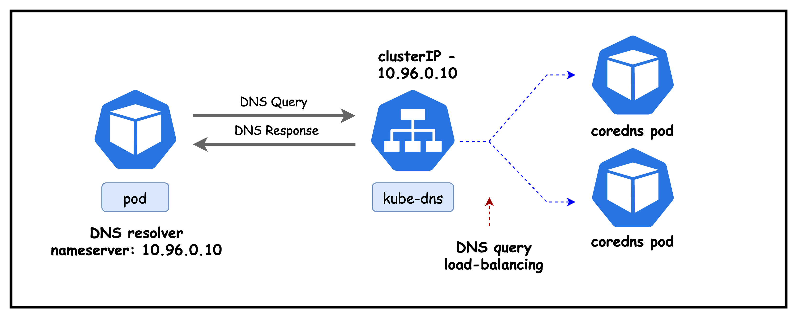

# Kubernetes DNS
This hands-on tutorial explains how DNS works inside a Kubernetes cluster and why it matters for service discovery and connectivity. You’ll see how kubelet configures Pod DNS (`/etc/resolv.conf`), how CoreDNS provides cluster name resolution, and how Pods perform lookups for Services, Pods, and external domains. The lab uses a small cluster so you can inspect CoreDNS, tweak settings, run `dig`/`nslookup` from Pods, and troubleshoot common DNS issues step by step.


## Why is DNS Required in Kubernetes
In Kubernetes, DNS is a foundational service that enables reliable service-to-service communication and simplifies how applications discover each other


- Enables service discovery and name resolution inside the cluster.
- Pods use DNS names (not hard-coded IPs) because Pod/Service IPs change with scaling and restarts.
- Kubelet configures each Pod’s `/etc/resolv.conf` to use the cluster DNS Service (CoreDNS via `kube-dns`).
- Adds cluster search domains (e.g., `<ns>.svc.cluster.local`) so short names like `nginx` resolve to `nginx.<ns>.svc.cluster.local`.
- CoreDNS answers queries for Services and Pods and forwards unknown domains to upstream resolvers.
- Supports both in-cluster lookups (service discovery) and external DNS resolution from Pods.

## Lab Setup
To setup the lab for this module **[Lab setup](../README.md#lab-setup)**

## Lab

After deployment, verify the cluster is ready by checking the ContainerLab topology status:

### 1. Inspect ContainerLab Topology

##### command

```bash
containerlab inspect k8s-dns.clab.yaml
```

##### output
```
20:54:11 INFO Parsing & checking topology file=k8s-dns.clab.yaml
╭───────────────────────┬──────────────────────┬─────────┬───────────────────────╮
│          Name         │      Kind/Image      │  State  │     IPv4/6 Address    │
├───────────────────────┼──────────────────────┼─────────┼───────────────────────┤
│ k8s-dns-control-plane │ k8s-kind             │ running │ 172.18.0.3            │
│                       │ kindest/node:v1.28.0 │         │ fc00:f853:ccd:e793::3 │
├───────────────────────┼──────────────────────┼─────────┼───────────────────────┤
│ k8s-dns-worker        │ k8s-kind             │ running │ 172.18.0.4            │
│                       │ kindest/node:v1.28.0 │         │ fc00:f853:ccd:e793::4 │
├───────────────────────┼──────────────────────┼─────────┼───────────────────────┤
│ k8s-dns-worker2       │ k8s-kind             │ running │ 172.18.0.2            │
│                       │ kindest/node:v1.28.0 │         │ fc00:f853:ccd:e793::2 │
╰───────────────────────┴──────────────────────┴─────────┴───────────────────────╯
```

### 2. Verify pods and services in the default namespace

```
# Set kubeconfig to use the cluster
export KUBECONFIG=/home/ubuntu/containerlab/5-k8s-dns/k8s-dns.kubeconfig

# Check cluster nodes
kubectl get pods -o wide
```

##### output
```
NAME                                READY   STATUS    RESTARTS   AGE
multitool-1-8c8fb                   1/1     Running   0          6d3h
multitool-1-dv8fz                   1/1     Running   0          6d3h
multitool-1-fc2fx                   1/1     Running   0          6d3h
multitool-2-dscdh                   1/1     Running   0          6d3h
multitool-2-ssdks                   1/1     Running   0          6d3h
multitool-2-sxdn2                   1/1     Running   0          6d3h
nginx-deployment-55d7bb4b86-jq7zp   1/1     Running   0          6d3h
nginx-deployment-55d7bb4b86-lsm9c   1/1     Running   0          6d3h
```

### 3. Verify Cluster DNS Setup

In this section, we verify that cluster DNS is up and correctly configured by checking the `kube-dns` Service (the IP Pods use as their nameserver) and inspecting the CoreDNS Corefile that defines how in‑cluster names are resolved and how external queries are forwarded.

#### 3.1 -  Verify `kube-dns` service

##### command
```
kubectl get services -n kube-system 
```

##### output
```
NAME       TYPE        CLUSTER-IP   EXTERNAL-IP   PORT(S)                  AGE
kube-dns   ClusterIP   10.96.0.10   <none>        53/UDP,53/TCP,9153/TCP   6h41m
```

Explanation: Confirms the in-cluster DNS Service (`kube-dns`) is running as a ClusterIP at `10.96.0.10`. Pods use this IP as their DNS `nameserver` on ports 53/UDP and 53/TCP; 9153/TCP exposes CoreDNS Prometheus metrics.

Next lets check the endpoints backing this service

##### command
```
kubectl describe endpoints kube-dns -n kube-system
```

##### ouput 
```
Name:         kube-dns
Namespace:    kube-system
Labels:       k8s-app=kube-dns
              kubernetes.io/cluster-service=true
              kubernetes.io/name=CoreDNS
Annotations:  endpoints.kubernetes.io/last-change-trigger-time: 2025-09-13T17:37:18Z
Subsets:
  Addresses:          192.168.206.6,192.168.206.7
  NotReadyAddresses:  <none>
  Ports:
    Name     Port  Protocol
    ----     ----  --------
    dns-tcp  53    TCP
    dns      53    UDP
    metrics  9153  TCP

Events:  <none>
```

Lists the Endpoints behind the `kube-dns` Service (CoreDNS pods) that Pods actually reach.
- Addresses: `192.168.206.6, 192.168.206.7` are the IPs of the running CoreDNS pods in this cluster.
- Readiness: `NotReadyAddresses: <none>` indicates all CoreDNS endpoints are ready to serve queries.
- Ports: Exposes DNS over UDP/TCP on 53 and Prometheus metrics on 9153/TCP.
- Takeaway: The `kube-dns` ClusterIP load-balances to these CoreDNS endpoints; if resolution fails, verify these addresses and readiness first.




#### 3.2 -  Verify `coredns` pods

Next, let's look at the `coredns` pods

##### command
```
kubectl get pods -n kube-system -l k8s-app=kube-dns -o wide
```


##### output

`````
NAME                       READY   STATUS    RESTARTS   AGE     IP              NODE                    NOMINATED NODE   READINESS GATES
coredns-5dd5756b68-bnd2k   1/1     Running   0          7h23m   192.168.206.6   k8s-dns-control-plane   <none>           <none>
coredns-5dd5756b68-m65p4   1/1     Running   0          7h23m   192.168.206.7   k8s-dns-control-plane   <none>           <none>
`````


##### command
```
kubectl get configmap -n kube-system coredns -o yaml
```

##### output
```
apiVersion: v1
data:
  Corefile: |
    .:53 {
        errors
        health {
           lameduck 5s
        }
        ready
        kubernetes cluster.local in-addr.arpa ip6.arpa {
           pods insecure
           fallthrough in-addr.arpa ip6.arpa
           ttl 30
        }
        prometheus :9153
        forward . /etc/resolv.conf {
           max_concurrent 1000
        }
        cache 30
        loop
        reload
        loadbalance
    }
kind: ConfigMap
metadata:
  creationTimestamp: "2025-09-13T17:34:57Z"
  name: coredns
  namespace: kube-system
  ```

Explanation of key CoreDNS Corefile directives:
- `.:53`: Serve DNS on all zones at port 53.
- `kubernetes cluster.local ...`: Serve cluster records; `pods insecure` enables A records for pod IPs; `ttl 30` sets 30s TTL; `fallthrough` passes reverse lookups not matched to next plugin.
- `forward . /etc/resolv.conf`: Forward non-cluster queries to upstream resolvers from the node’s resolv.conf.
- `cache 30`: Cache answers for 30 seconds to reduce latency/load.
- `health`, `ready`: Expose health/readiness endpoints used by k8s probes.
- `prometheus :9153`: Expose metrics for scraping.
- `reload`: Watches the Corefile for changes and reloads CoreDNS without a pod restart, so config updates take effect quickly.
- `loadbalance`: Randomizes the order of A/AAAA records and rotates upstreams to distribute client load more evenly across endpoints.
- `loop`: Detects and breaks DNS recursion loops (for example, misconfigurations where CoreDNS forwards to a resolver that ultimately forwards back to CoreDNS), preventing stack overflows and high CPU.


#### 3.2 - Inspect Host/Node Resolver

##### command
```
docker exec -it k8s-dns-worker /bin/bash
cat /etc/resolv.conf
```

##### output
```
# Generated by Docker Engine.
# This file can be edited; Docker Engine will not make further changes once it
# has been modified.

nameserver 172.18.0.1
search ec2.internal
options edns0 trust-ad ndots:0

# Based on host file: '/etc/resolv.conf' (internal resolver)
# ExtServers: [host(127.0.0.53)]
# Overrides: []
# Option ndots from: internal
```

Notes:
- `nameserver 172.18.0.1`: Node/container DNS points to the Docker bridge gateway (host resolver path).
- `search ec2.internal`: Short names get this suffix appended during resolution.
- `options edns0 trust-ad ndots:0`: EDNS enabled; trust AD-bit; `ndots:0` treats names as absolute (no search expansion).


### 4. Inspect Pod DNS configuration

We exec into a running Pod to view its resolver settings. This shows how kubelet configures `/etc/resolv.conf` to point at the cluster DNS (CoreDNS) and which search domains and options are applied.

#### 4.1 -  Inspect and Test DNS for Pod in the Default Namespace
##### command
```
kubectl exec -it multitool-1-8c8fb -- sh
cat /etc/resolv.conf
```

##### output
```
search default.svc.cluster.local svc.cluster.local cluster.local ec2.internal
nameserver 10.96.0.10
options ndots:5
```

- search: Suffixes appended to short names. From the `default` namespace, `nginx` expands to `nginx.default.svc.cluster.local`, then `nginx.svc.cluster.local`, then `nginx.cluster.local`, etc. The final `ec2.internal` comes from the node/environment.
- nameserver: ClusterIP of the `kube-dns` Service (CoreDNS). Pod DNS queries are sent here.
- options ndots:5: Names with fewer than 5 dots are treated as relative; the resolver tries search suffixes first before attempting an absolute FQDN, which can generate additional queries for short external names.

Kubernetes injects cluster search domains and points Pods at CoreDNS so short in-cluster names resolve automatically; `ndots:5` means short external names may try those suffixes first.

Next let try to resolve a service name. 

##### command
```
dig nginx-service
```

##### output
output concatenated

```
;; Got answer:
;; ->>HEADER<<- opcode: QUERY, status: SERVFAIL, id: 45816
;; flags: qr rd; QUERY: 1, ANSWER: 0, AUTHORITY: 0, ADDITIONAL: 1
;; WARNING: recursion requested but not available

;; QUESTION SECTION:
;nginx-service.                 IN      A

;; Query time: 4 msec
;; SERVER: 10.96.0.10#53(10.96.0.10)
```

Explanation:
- Queries the bare name `nginx-service` without applying the Pod’s search domains.
- dig shows the final question as the absolute name `nginx-service.` (no suffix applied).
- No such record exists in public/root DNS, so CoreDNS at `10.96.0.10` returns `SERVFAIL`.
- In Kubernetes, short Service names resolve when combined with cluster search suffixes (for example, `nginx-service.<namespace>.svc.cluster.local`) or by using `dig +search nginx-service` to apply `/etc/resolv.conf` search domains.

##### command
```
dig +search nginx-service
```

##### output
output concatenated

```
;; QUESTION SECTION:
;nginx-service.default.svc.cluster.local. IN A

;; ANSWER SECTION:
nginx-service.default.svc.cluster.local. 30 IN A 10.96.169.109
```

Explanation:
- `+search` tells dig to apply the Pod’s search domains from `/etc/resolv.conf`.
- The short name `nginx-service` expands to `nginx-service.default.svc.cluster.local` (in the `default` namespace).
- CoreDNS returns the Service’s ClusterIP, showing cluster service discovery via namespace search suffixes.

Next, let's exec into a multitool-3 pod in the foo namespace to examine it's DNS configuration. 

#### 4.2 -  Inspect and Test DNS for Pod in the foo Namespace

##### command
```
kubectl exec -it multitool-3-rbsdz -n foo -- sh
cat /etc/resolv.conf
```
##### output 
```
search foo.svc.cluster.local svc.cluster.local cluster.local ec2.internal
nameserver 10.96.0.10
options ndots:5
```

- Namespace-specific search: Running in namespace `foo` sets the first search suffix to `foo.svc.cluster.local` (instead of `default.svc.cluster.local`).
- Short-name resolution: A name like `nginx` expands first to `nginx.foo.svc.cluster.local`, then falls back to broader cluster suffixes.
- Resolver target: `nameserver 10.96.0.10` is the CoreDNS Service IP (`kube-dns`) used by all Pods.
- ndots behavior: With `ndots:5`, names with fewer than five dots are tried with search suffixes before being treated as absolute FQDNs.

##### command
```
dig +search nginx-service
```

##### output
```

;; Got answer:
;; ->>HEADER<<- opcode: QUERY, status: SERVFAIL, id: 7457
;; flags: qr rd; QUERY: 1, ANSWER: 0, AUTHORITY: 0, ADDITIONAL: 1

;; QUESTION SECTION:
;nginx-service.                 IN      A
```

Explanation:
- Pod context: Running in namespace `foo`, querying a Service in `default` using only the short name `nginx-service`.
- Search behavior: Resolver first tries `nginx-service.foo.svc.cluster.local` (does not exist), then ends up asking for the absolute name `nginx-service.`
- Result: `nginx-service.` isn’t a valid public/root DNS record, so CoreDNS returns `SERVFAIL`.
- Fix: Include the namespace (`nginx-service.default`) or use the full FQDN `nginx-service.default.svc.cluster.local` for cross-namespace resolution.


##### command

```
dig +search nginx-service.default
```

##### output
output concatenated

```
;; QUESTION SECTION:
;nginx-service.default.svc.cluster.local. IN A

;; ANSWER SECTION:
nginx-service.default.svc.cluster.local. 30 IN A 10.96.169.109
```

Explanation:
- Adding the `.default` namespace gives the resolver enough context to expand the name to `nginx-service.default.svc.cluster.local`.
- CoreDNS resolves that FQDN to the Service’s ClusterIP.
- Takeaway: Short names depend on the active namespace via search domains; including the namespace or using the full FQDN yields deterministic results.

## Summary
This lab demonstrated how Kubernetes DNS works end to end.
- Kubelet configures each Pod’s `/etc/resolv.conf` to use the `kube-dns` ClusterIP (CoreDNS) and injects namespace-scoped search domains.
- CoreDNS serves cluster DNS records (Services, and Pod A records via headless Services) and forwards external queries to upstream resolvers.
- Resolver options like `ndots:5` drive search expansion; short names resolve within a namespace via search suffixes.
- Cross-namespace lookups need the namespace or full FQDN (for example, `service.ns.svc.cluster.local`).


## Lab Cleanup
to cleanup the lab follow steps in **[Lab cleanup](../README.md#lab-cleanup)**
