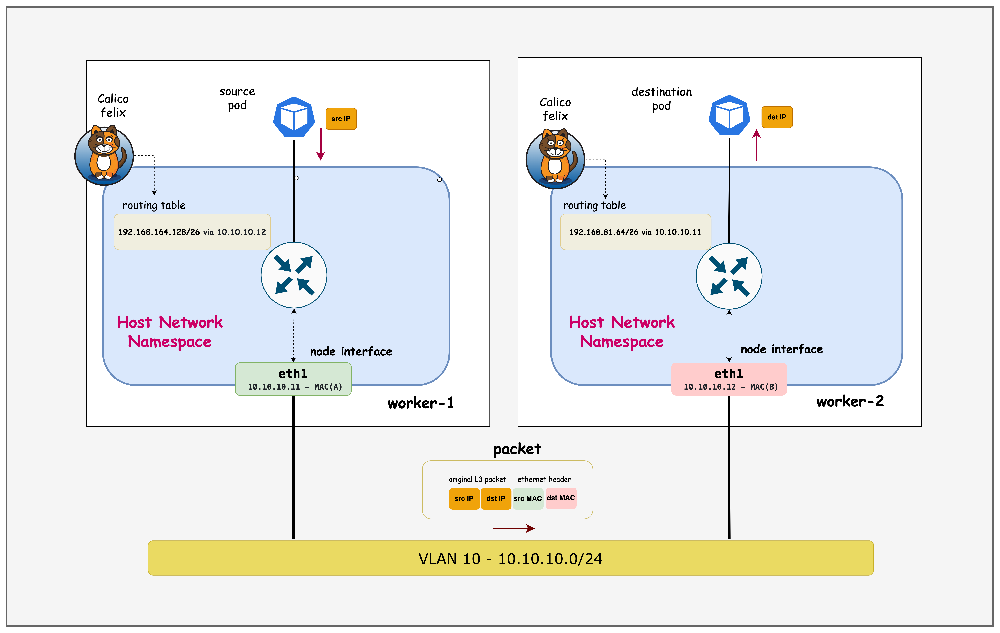
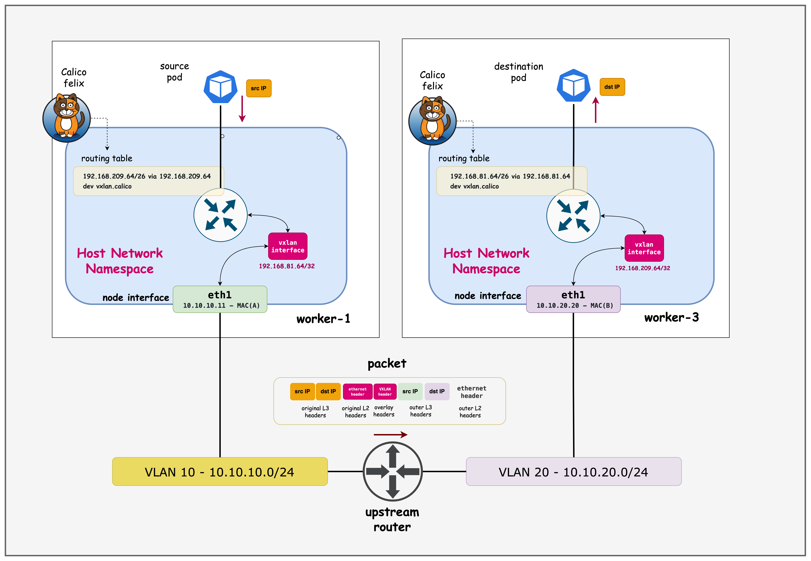

# Calico Overlay Networks

This lab demonstrates Calico CNI overlay networking in a Kubernetes cluster with nodes spread across different network subnets.

Setup:
4 Kubernetes nodes (1 control-plane, 3 workers) created with Kind
Arista switch connecting nodes in two subnets:
10.10.10.0/24 (control-plane, worker, worker2)
10.10.20.0/24 (worker3)

Key Concepts:
- IPPool: Calico resource managing pod IP allocation (192.168.0.0/16)
- VXLAN CrossSubnet: Overlay encapsulation only between different subnets
- Block Affinities: Shows how pod CIDRs are assigned to each node

Purpose:
Demonstrates how Calico handles pod-to-pod communication when Kubernetes nodes are on different network subnets, using VXLAN tunneling for cross-subnet traffic while allowing direct routing within the same subnet.


## Lab Setup
To setup the lab for this module **[Lab setup](../README.md#lab-setup)**
The lab folder is - `/containerlab/06-calico-overlay`

## Lab

> [!Note]
> <mark>The outputs in this section will be different in your lab. When running the commands given in this section, make sure you replace IP addresses, interface names, and node names as per your lab.<mark>

After deployment, verify the cluster is ready by checking the ContainerLab topology status:


### 1. Inspect ContainerLab Topology

##### command
```bash
containerlab inspect topology.clab.yaml 
```

##### output
14:30:48 INFO Parsing & checking topology file=topology.clab.yaml
| Name                      | Kind/Image                | State   | IPv4 Address     | IPv6 Address            |
|---------------------------|---------------------------|---------|------------------|-------------------------|
| k01-control-plane         | ext-container<br>kindest/node:v1.32.2 | running | 172.18.0.2       | fc00:f853:ccd:e793::2   |
| k01-worker                | ext-container<br>kindest/node:v1.32.2 | running | 172.18.0.5       | fc00:f853:ccd:e793::5   |
| k01-worker2               | ext-container<br>kindest/node:v1.32.2 | running | 172.18.0.3       | fc00:f853:ccd:e793::3   |
| k01-worker3               | ext-container<br>kindest/node:v1.32.2 | running | 172.18.0.4       | fc00:f853:ccd:e793::4   |
| clab-calico-overlay-ceos01| arista_ceos<br>ceos:4.34.0F            | running | 172.20.20.2      | 3fff:172:20:20::2       |
| k01-control-plane         | k8s-kind<br>kindest/node:v1.32.2       | running | 172.18.0.2       | fc00:f853:ccd:e793::2   |
| k01-worker                | k8s-kind<br>kindest/node:v1.32.2       | running | 172.18.0.5       | fc00:f853:ccd:e793::5   |
| k01-worker2               | k8s-kind<br>kindest/node:v1.32.2       | running | 172.18.0.3       | fc00:f853:ccd:e793::3   |
| k01-worker3               | k8s-kind<br>kindest/node:v1.32.2       | running | 172.18.0.4       | fc00:f853:ccd:e793::4   |

**ext-container Concept**

`ext-container` is a ContainerLab node type that acts as a wrapper around existing Docker containers, providing additional network configuration capabilities that the original container type doesn't support.


```
k01 (k8s-kind) creates:     ext-container wraps:
├── k01-control-plane  -->  k01-control-plane (ext-container)
├── k01-worker        -->  k01-worker (ext-container)  
├── k01-worker2       -->  k01-worker2 (ext-container)
└── k01-worker3       -->  k01-worker3 (ext-container)
```
Next, let's exec into the Arista container to look at how the interfaces—as well as routing—is configured.

##### command

This command opens a CLI session on the Arista switch container.

```bash
docker exec -it clab-calico-overlay-ceos01 Cli
```

##### command

Displays the status of all Ethernet interfaces, including which Kubernetes node each port connects to, VLAN assignments, and link state.

```bash
ceos>enable
ceos#show interface status
```
##### output
```
Port       Name                            Status       Vlan     Duplex Speed  Type            Flags Encapsulation
Et1        Connection to k01-control-plane connected    10       full   1G     EbraTestPhyPort                   
Et2        Connection to k01-worker        connected    10       full   1G     EbraTestPhyPort                   
Et3        Connection to k01-worker2       connected    10       full   1G     EbraTestPhyPort                   
Et4        Connection to k01-worker3       connected    20       full   1G     EbraTestPhyPort  
```

##### Explanation
- `Et1`–`Et3` connect to the control-plane and two workers in VLAN 10 (subnet 10.10.10.0/24).
- `Et4` connects to worker3 in VLAN 20 (subnet 10.10.20.0/24).
- All links are up and running at 1G speed.

##### command

Lists all switch interfaces with their assigned IP addresses, operational status, and MTU.

```bash
ceos#show ip interface brief
```
##### output
```                                                                                                                                                         Address
Interface         IP Address           Status       Protocol           MTU    Owner  
----------------- -------------------- ------------ -------------- ---------- -------
Management0       172.20.20.2/24       up           up                1500           
Vlan10            10.10.10.1/24        up           up                1500           
Vlan20            10.10.20.1/24        up           up                1500     
```

##### Explanation
- `Vlan10` and `Vlan20` are SVI interfaces for the two subnets, acting as gateways for nodes in each VLAN.
- `Management0` is used for out-of-band management.

##### command

Displays the switch's routing table, showing directly connected networks.

```bash
ceos#show ip route
```

##### output
```
Gateway of last resort is not set

 C        10.10.10.0/24
                     directly connected, Vlan10
 C        10.10.20.0/24
                     directly connected, Vlan20
 C        172.20.20.0/24
                     directly connected, Management0
```

##### Explanation
- The switch has direct routes to both Kubernetes node subnets (10.10.10.0/24 and 10.10.20.0/24) via their respective VLAN interfaces.
- Management subnet is also directly connected.
- No default route is set, so only local subnet traffic is routed.


#### Topology Diagram


This diagram illustrates the Kubernetes nodes distributed across two subnets, connected via an Arista switch, and highlights how Calico uses VXLAN tunneling for cross-subnet pod communication.


### 2. The Calico IPPOOL Resource


The following is a sample Calico `IPPool` resource definition. This resource controls how pod IP addresses are allocated and how overlay networking is configured.

- **allowedUses**: Specifies the types of traffic that can use this IP pool. Here, both `Workload` (pods) and `Tunnel` (overlay traffic) are allowed.
- **cidr**: Defines the IP address range (`192.168.0.0/16`) from which pod IPs will be assigned.
- **vxlanMode**: Set to `CrossSubnet`, which means VXLAN encapsulation is used only for traffic between nodes on different subnets, optimizing performance while still enabling overlay networking.


##### command

```
kubectl get ippools default-ipv4-ippool -o yaml
```

##### output
```
apiVersion: projectcalico.org/v3
kind: IPPool
metadata:
    labels:
        app.kubernetes.io/managed-by: tigera-operator
    name: default-ipv4-ippool
spec:
    allowedUses:
    - Workload
    - Tunnel
    assignmentMode: Automatic
    blockSize: 26
    cidr: 192.168.0.0/16
    disableBGPExport: true
    ipipMode: Never
    natOutgoing: true
    nodeSelector: all()
    vxlanMode: CrossSubnet
```

Next, let's look at the block affinities allocated to the nodes.

```
kubectl get blockaffinities -o=jsonpath='{range .items[*]}{.metadata.name}{"\t"}{.spec.node}{"\t"}{.spec.cidr}{"\n"}{end}'
```

| Node Name                        | Node           | Pod CIDR             |
|-----------------------------------|----------------|----------------------|
| k01-control-plane-192-168-23-64-26      | k01-control-plane | 192.168.23.64/26     |
| k01-worker-192-168-81-64-26             | k01-worker        | 192.168.81.64/26     |
| k01-worker2-192-168-164-128-26          | k01-worker2       | 192.168.164.128/26   |
| k01-worker3-192-168-209-64-26           | k01-worker3       | 192.168.209.64/26    |

We will use this output when verifying the routing tableS in the subsequent steps.

#### Encapsulation/Overlay Modes

Calico supports the following encapsulation types.

- **IP-in-IP**: Default overlay mode; encapsulates pod traffic in IP-in-IP packets for cross-node communication.
- **VXLAN**: Uses VXLAN tunneling to encapsulate pod traffic, enabling communication across different subnets or networks.
- **None**: Disables overlay; requires underlying network to route pod traffic directly (no encapsulation).
- **WireGuard**: Adds encryption to overlay traffic for secure communication between nodes.

### 3. Verify Pod Routing

> [!NOTE]
> The outputs in this section will be different in your lab. When running the commands given here, replace IP addresses and MAC addresses with values from your environment — especially <mark>swap in the IP and MAC addresses from your own setup</mark>.

#### 3.1 Verify Pod Routing for Nodes in the Same Subnet

First, exec into worker node 1.
##### command
```
docker exec -it  k01-worker /bin/bash
```

##### command
Retrieve routes for prefixes which are /26 mask.
> [!TIP]
> Filter with the `/26` mask so the output lines up with the IPAM block affinities; using <mark>the `/26` filter keeps the output aligned with the IPAM block affinities</mark>.

```
ip route | grep /26
```
##### output
```
root@k01-worker:/# ip route | grep /26
192.168.23.64/26 via 10.10.10.10 dev eth1 proto 80 onlink 
blackhole 192.168.81.64/26 proto 80 
192.168.164.128/26 via 10.10.10.12 dev eth1 proto 80 onlink 
192.168.209.64/26 via 192.168.209.64 dev vxlan.calico onlink 
```

##### Expalanation

- Shows that pod CIDRs for nodes in the same subnet are routed directly via the physical interface (`eth1`).
- The `blackhole` entry indicates the local pod CIDR for this node.
- Traffic to pods on a different subnet (192.168.209.64/26) is routed via the VXLAN overlay.
- Demonstrates Calico's CrossSubnet VXLAN mode: direct routing within subnet, overlay for cross-subnet.

##### command
```
docker exec -it  k01-worker2 /bin/bash
```
##### command
```
ip route | grep /26
```
##### output
```
docker exec -it  k01-worker2 /bin/bash

root@k01-worker2:/# ip route | grep /26
192.168.23.64/26 via 10.10.10.10 dev eth1 proto 80 onlink 
192.168.81.64/26 via 10.10.10.11 dev eth1 proto 80 onlink 
blackhole 192.168.164.128/26 proto 80 
192.168.209.64/26 via 192.168.209.64 dev vxlan.calico onlink 
```

##### Expalanation
- Confirms that routing to other nodes in the same subnet is direct (via `eth1`).
- The `blackhole` entry marks the local pod CIDR.
- Routing to a node in a different subnet uses VXLAN encapsulation.
- Validates that Calico optimizes intra-subnet traffic by avoiding overlay tunneling.



#### 3.2 Verify Pod Routing for Nodes in Different Subnets

##### command
```
docker exec -it  k01-worker1 /bin/bash
```
##### command
```
ip addr | grep vxlan.calico
```
##### output
```
root@k01-worker:/# ip addr | grep vxlan.calico
2: vxlan.calico: <BROADCAST,MULTICAST,UP,LOWER_UP> mtu 1450 qdisc noqueue state UNKNOWN group default qlen 1000
    inet 192.168.81.64/32 scope global vxlan.calico
```
##### command
```
ip route | grep 192.168.209.64
```
##### output
```
root@k01-worker:/# ip route | grep 192.168.209.64
192.168.209.64 dev vxlan.calico scope link 
192.168.209.64/26 via 192.168.209.64 dev vxlan.calico onlink 
```
##### Expalanation 

- The `ip addr` output confirms that the `vxlan.calico` interface is present and assigned an IP from the pod CIDR range.
- The routing table shows that traffic destined for the `192.168.209.64/26` pod CIDR (which belongs to a node in a different subnet) is routed via the VXLAN overlay interface while `192.168.209.64/26 via 192.168.209.64 dev vxlan.calico onlink` ensures all traffic to that pod CIDR is encapsulated and sent over the overlay.
- The host route `192.168.209.64 dev vxlan.calico scope link` marks the VXLAN VTEP as directly reachable on that interface, so packets get encapsulated without needing an intermediate gateway.


##### command
```
docker exec -it  k01-worker3 /bin/bash
```

##### command
```
ip addr | grep vxlan.calico
```

##### output
```
root@k01-worker3:/# ip addr | grep vxlan.calico
3: vxlan.calico: <BROADCAST,MULTICAST,UP,LOWER_UP> mtu 1450 qdisc noqueue state UNKNOWN group default qlen 1000
    inet 192.168.209.64/32 scope global vxlan.calico
```
##### command
```
ip route | grep /26
```

##### output

```
root@k01-worker3:/# ip route | grep /26
192.168.23.64/26 via 192.168.23.64 dev vxlan.calico onlink 
192.168.81.64/26 via 192.168.81.64 dev vxlan.calico onlink 
192.168.164.128/26 via 192.168.164.128 dev vxlan.calico onlink 
blackhole 192.168.209.64/26 proto 80 
```

##### Expalanation 
- All routes to pod CIDRs on other nodes use the VXLAN overlay interface (`vxlan.calico`), since this node is in a different subnet.
- The `blackhole` entry is for the local pod CIDR.
- Demonstrates that Calico automatically encapsulates cross-subnet pod traffic using VXLAN.
- Highlights the effectiveness of the CrossSubnet mode for seamless multi-subnet pod communication.




### 4. VXLAN Forwarding

<div style="background-color:rgb(252, 241, 168); border-left: 4px solid #34a853; padding: 10px;">
  <strong>💡 Note:</strong> The outputs in this section will be different in your lab. When running the commands given in this section, make sure you replace IP addresses and mac addresses as per your lab. 
</div>

- **Remote VTEP discovery**: Calico learns remote VTEP addresses through its control plane and installs host routes pointing specific pod CIDRs at `vxlan.calico`.
- **Ingress classification**: When a packet hits the VXLAN interface, the kernel performs an FDB lookup that maps the destination MAC to the remote VTEP.
- **Encapsulation**: Linux wraps the original frame with VXLAN headers plus outer Ethernet/IP/UDP (default UDP dst port 4789), carrying the VNID.
- **Underlay routing**: The outer packet is routed like any other IP packet toward the remote VTEP using the node’s regular routing table.
- **Decapsulation and delivery**: The remote host strips the outer headers, restores the inner frame, and hands it to the local bridge or interface bound to the target pod.

#### 4.1 Verify VXLAN Forwarding

First, exec into worker3

```
docker exec -it  k01-worker3 /bin/bash
```

##### command
```
ip link show type vxlan
```
##### output
```
3: vxlan.calico: <BROADCAST,MULTICAST,UP,LOWER_UP> mtu 1450 qdisc noqueue state UNKNOWN mode DEFAULT group default qlen 1000
    link/ether 66:d2:0c:f0:ef:e5 brd ff:ff:ff:ff:ff:ff
```
##### Explanation
Confirms `vxlan.calico` is administratively up as well as link-up (`LOWER_UP`), so the kernel can source VXLAN encapsulation from this interface. The line also exposes the interface MAC, which becomes the outer Ethernet source address on encapsulated traffic.


##### command
```
ip neighbor show | grep vxlan
```

##### output
```
192.168.81.64 dev vxlan.calico lladdr 66:fb:ad:98:aa:13 PERMANENT 
192.168.164.128 dev vxlan.calico lladdr 66:c7:4d:6e:6b:f3 PERMANENT 
192.168.23.64 dev vxlan.calico lladdr 66:15:9d:fa:c6:aa PERMANENT 
```

##### Explanation
Calico programs these neighbor entries as `PERMANENT`, pinning each remote pod CIDR's gateway IP to the corresponding VTEP MAC on `vxlan.calico`. That lets the kernel skip ARP resolution and immediately build the outer Ethernet header for the tunnel packet.

##### command
```
bridge fdb show | grep 66:fb:ad:98:aa:13
```
##### Output
```
66:fb:ad:98:aa:13 dev vxlan.calico dst 10.10.10.11 self permanent
```
##### Explanation
The bridge FDB ties that MAC to the remote VTEP underlay IP (`10.10.10.11`), so after the neighbor lookup the kernel knows which underlay destination to use for the UDP VXLAN packet. Together with the static neighbor entry, this closes the loop from inner-destination MAC to remote VTEP IP for forwarding.

Taken together, they show the kernel’s forwarding decision chain: packet hits vxlan.calico, the FDB entry matches the destination MAC→remote VTEP IP, and the neighbor table confirms the VTEP IP→MAC resolution so encapsulation can proceed.

## Summary
This lab demonstrated overlay networks in Kubernetes. We looked at how to:

- Build a four-node Kind cluster across two subnets and wrap the nodes with ContainerLab `ext-container` to integrate an Arista switch.
- Configure Calico with a single VXLAN CrossSubnet IPPool so intra-subnet pods talk directly while cross-subnet traffic is encapsulated.
- Validate routing, VXLAN interface state, neighbor/FDB entries, and encapsulation steps to confirm end-to-end overlay forwarding.

## Lab Cleanup
to cleanup the lab follow steps in **[Lab cleanup](../README.md#lab-cleanup)**
