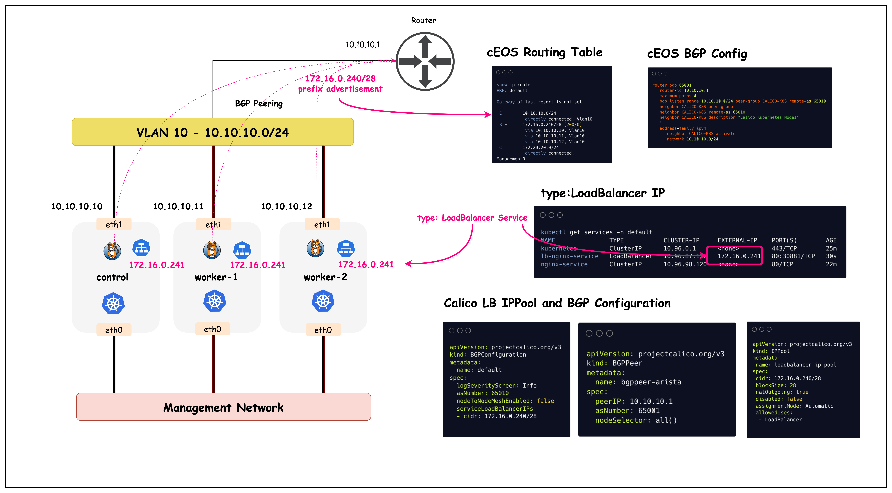

# LoadBalancer Type Service and BGP Advertisements

This lab demonstrates Calico's BGP (Border Gateway Protocol) functionality. BGP peering with upstream networks can be used to advertise pod as well as service CIDRs.

## Lab Setup
To setup the lab for this module **[Lab setup](../README.md#lab-setup)**
The lab folder is - `/containerlab/08-calico-bgp-lb`

## Lab

### 1. Inspect ContainerLab Topology

First, let's inspect the lab topology.

##### command
```bash
containerlab inspect topology.clab.yaml 
```

Next, let's inspect the Kubernetes cluster.
```
export KUBECONFIG=/home/ubuntu/containerlab/8-calico-bgp-lb/k01.kubeconfig
```
```
kubectl get nodes
```

```
NAME                STATUS   ROLES           AGE   VERSION
k01-control-plane   Ready    control-plane   47m   v1.32.2
k01-worker          Ready    <none>          46m   v1.32.2
k01-worker2         Ready    <none>          46m   v1.32.2
```

The objective of this lesson is to advertise the load balancer IPAM prefixes to the upstream router as shown in the diagram below.


### 2. Configure Load Balancer Type Service and BGP Advertisements

This lab has an Nginx deployment that is currently only accessible through a cluster IP service. Cluster IP services can be used by workloads inside the cluster to connect to a service. However, these IPs are not accessible by workloads outside the cluster.

First, let's review the Nginx pods along with the cluster IP service in the default namespace.

##### command
```
kubectl get pods 
```

##### output

```
kubectl get pods 
NAME                                READY   STATUS    RESTARTS   AGE
nginx-deployment-67d6b95dd8-6flfw   1/1     Running   0          6m12s
nginx-deployment-67d6b95dd8-rvr5k   1/1     Running   0          6m12s
```

##### command
```
kubectl get services
```
##### output
```
kubectl get services
NAME               TYPE           CLUSTER-IP     EXTERNAL-IP   PORT(S)        AGE
kubernetes         ClusterIP      10.96.0.1      <none>        443/TCP        8m24s
nginx-service      ClusterIP      10.96.98.120   <none>        80/TCP         6m15s
```

Note that the cluster IP service for `nginx-service` is only accessible by workloads inside the cluster. Next, let's look at how the `nginx-service` can be exposed to workloads outside the cluster.To do so, we need to create a ` type: LoadBalancer` service, that can be advertised to the upstream network.


#### 2.1 Configure a load balancer IPPOOL

Before we can create a ` type: LoadBalancer` service, we need to first create an IP pool that can be used to allocate IPs for such services. Note that this IP pool should be routable in your network and should not conflict with other subnets in your network.

The load balancer IP pool definition for this lab is shown below.
```yaml
apiVersion: projectcalico.org/v3
kind: IPPool
metadata:
 name: loadbalancer-ip-pool
spec:
 cidr: 172.16.0.240/28
 blockSize: 28
 natOutgoing: true
 disabled: false
 assignmentMode: Automatic
 allowedUses:
  - LoadBalancer
```
You can apply this IP pool to the cluster by using:

```
kubectl apply -f ./k8s-manifests/lb-ippool.yaml
```

Once applied, you can verify that the IP pool was configured in the cluster.

##### command
```
kubectl get ippools
```

##### output
```
kubectl get ippools
NAME                   CREATED AT
default-ipv4-ippool    2025-10-01T15:02:09Z
loadbalancer-ip-pool   2025-10-01T15:23:32Z
```


Once configured, Calico's IPAM controller will use the CIDR to allocate IPs to load balancer type services. Now that we have the IP pool configured, let's create a load balancer type service for `nginx-service`

#### 2.2 Create `type: LoadBalancer` Service

The definition of the load balancer type service for `nginx-service` is provided below.

```yaml
apiVersion: v1
kind: Service
metadata:
  name: lb-nginx-service
  namespace: default
spec:
  selector:
    app: nginx
  ports:
    - port: 80
      targetPort: 80
      name: default
  type: LoadBalancer
```

You can apply this service to the cluster by using:

```
kubectl apply -f ./k8s-manifests/lb-nginx-service.yaml 
```

Next, let's verify that the service was created.

##### command
```
kubectl get services -n default
```

##### output
```
kubectl get services -n default
NAME               TYPE           CLUSTER-IP     EXTERNAL-IP    PORT(S)        AGE
kubernetes         ClusterIP      10.96.0.1      <none>         443/TCP        25m
lb-nginx-service   LoadBalancer   10.96.87.127   172.16.0.241   80:30881/TCP   30s
nginx-service      ClusterIP      10.96.98.120   <none>         80/TCP         22m
```

We can see that the `lb-nginx-service` was successfully created and the service has a cluster IP as well as an external IP of `172.16.0.241`, which is an IP from the previously configured load balancer IP pool. 

#### 2.3 Advertise the load balancer CIDR to the upstream network.

To advertise the load balancer CIDR to upstream networks, we have to modify the `BGPConfiguration` resource to include the service load balancer IPs in its prefix advertisements. 

```yaml
apiVersion: projectcalico.org/v3
kind: BGPConfiguration
metadata:
  name: default
spec:
  logSeverityScreen: Info
  asNumber: 65010
  nodeToNodeMeshEnabled: false
  serviceLoadBalancerIPs:
  - cidr: 172.16.0.240/28

```
You can apply this manifest by using:

```
kubectl apply -f ./calico-cni-config/bgpconfiguration-lb.yaml 
```

Once applied, let's confirm that the `BGPConfiguration` resource was modified accordingly.

##### command
```
kubectl get bgpconfiguration -o yaml
```

##### output

```yaml
apiVersion: projectcalico.org/v3
kind: BGPConfiguration
metadata:
  name: default
spec:
  asNumber: 65010
  logSeverityScreen: Info
  nodeToNodeMeshEnabled: false
  serviceLoadBalancerIPs:
  - cidr: 172.16.0.240/28
```

Now that we've configured the load balancer service and advertised the CIDR to the upstream network, next let's verify routing and connectivity to this service from external sources.


### 3. Verify Routing and Connectivity


#### 3.1 Validate routing table in cEOS

Exec into the CEOS container.

```
docker exec -it clab-calico-bgp-lb-ceos01 Cli
```

Next, let's look at the routing table.

##### command
```
enable
show ip route
```

##### output

```
ceos#show ip route

VRF: default

Gateway of last resort is not set

 C        10.10.10.0/24
           directly connected, Vlan10
 B E      172.16.0.240/28 [200/0]
           via 10.10.10.10, Vlan10
 C        172.20.20.0/24
           directly connected, Management0
```

##### Explanation

The routing table shows that the load balancer CIDR `172.16.0.240/28` has been successfully advertised via BGP:

- `B E` indicates this is an External BGP route
- `172.16.0.240/28` is the load balancer IP pool configured in Calico
- `[200/0]` shows the administrative distance (200) and metric (0)
- `via 10.10.10.10, Vlan10` indicates the next hop is the Kubernetes node's interface

This confirms that the upstream router (CEOS) has learned the load balancer CIDR from Calico via BGP peering, enabling external connectivity to LoadBalancer services.

It should be noted that the prefix is advertised by all the cluster nodes, that's because all the nodes in this particular cluster are paired with the upstream router. You can confirm this by running the following steps.

##### command
```
show ip bgp summary
```

##### output
```
ceos#show ip bgp summary
BGP summary information for VRF default
Router identifier 10.10.10.1, local AS number 65001
Neighbor Status Codes: m - Under maintenance
  Description              Neighbor    V AS           MsgRcvd   MsgSent  InQ OutQ  Up/Down State   PfxRcd PfxAcc
  "Calico Kubernetes Nodes 10.10.10.10 4 65010             57        50    0    0 00:38:40 Estab   1      1
  "Calico Kubernetes Nodes 10.10.10.11 4 65010             58        50    0    0 00:38:40 Estab   1      1
  "Calico Kubernetes Nodes 10.10.10.12 4 65010             58        51    0    0 00:38:40 Estab   1      1
```
##### Explanation

The BGP summary shows established peering sessions with all three Kubernetes nodes:

- **`PfxRcd (Prefixes Received)`**: Number of route prefixes received from each BGP neighbor (1 prefix from each node)
- **`PfxAcc (Prefixes Accepted)`**: Number of received prefixes that passed route filtering and were accepted into the routing table (1 prefix accepted from each node)

Each Kubernetes node is advertising the same load balancer CIDR `172.16.0.240/28`, confirming that all nodes can serve as next-hops for LoadBalancer service traffic. The `State: Estab` indicates healthy BGP sessions with proper route exchange.


#### 3.2 Configure multi-path

The cEOS container by default is not configured for equal cost multipath routing. This can be enabled by running the below steps.

```
config t
router bgp 65001
  maximum-paths 4
```

This will configure ECMP and add up to four routes for learnt BGP prefixes. Let's confirm this by looking at the routing table again.

##### command
```
show ip route
```

##### output
```
show ip route
VRF: default

Gateway of last resort is not set

 C        10.10.10.0/24
           directly connected, Vlan10
 B E      172.16.0.240/28 [200/0]
           via 10.10.10.10, Vlan10
           via 10.10.10.11, Vlan10
           via 10.10.10.12, Vlan10
 C        172.20.20.0/24
           directly connected, Management0
```
##### Explanation

After enabling ECMP with `maximum-paths 4`, the routing table now shows multiple next-hops for the load balancer CIDR:

- **Multiple via entries**: The same prefix `172.16.0.240/28` now has three equal-cost paths via all three Kubernetes nodes (10.10.10.10, 10.10.10.11, 10.10.10.12)
- **Load Distribution**: Traffic destined for LoadBalancer services will be distributed across all three nodes, providing redundancy and load sharing
- **High Availability**: If any single node fails, traffic will automatically use the remaining healthy nodes as next-hops

This ECMP configuration ensures optimal traffic distribution and resilience for LoadBalancer service traffic from external sources.


#### 3.3 Verfiy Connectivity

We can now verify connectivity to the nginx service from the cEOS container.

Run the following from the cEOS container.
> [!Note]
> <mark> The LB IP in your lab could be different from the IP shown blow<mark>


##### command
```
telnet 172.16.0.241 80
```

##### output
Type "get" once the connection is established.
```
Trying 172.16.0.241...
Connected to 172.16.0.241.
Escape character is 'off'.
get
HTTP/1.1 400 Bad Request
Server: nginx/1.28.0
Date: Wed, 01 Oct 2025 15:52:26 GMT
Content-Type: text/html
Content-Length: 157
Connection: close

<html>
<head><title>400 Bad Request</title></head>
<body>
<center><h1>400 Bad Request</h1></center>
<hr><center>nginx/1.28.0</center>
</body>
</html>
Connection closed by foreign host.
```

##### Explanation
This output confirms that we received a response from the nginx pod in the cluster. The image below provides an overview of what was configured in this lab




## Summary

This lab demonstrated how to integrate Calico BGP with LoadBalancer services to provide external connectivity to Kubernetes workloads. The setup involved creating a dedicated IP pool for LoadBalancer services, configuring BGP advertisements for service CIDRs, and enabling ECMP routing for high availability and load distribution.

**Key Accomplishments:**
- **LoadBalancer IP Pool**: Configured a dedicated CIDR (172.16.0.240/28) for LoadBalancer service IP allocation using Calico's IPAM
- **BGP Service Advertisement**: Modified BGP configuration to advertise LoadBalancer service CIDRs to upstream network infrastructure
- **ECMP Configuration**: Enabled equal-cost multi-path routing on the upstream switch to distribute traffic across all Kubernetes nodes
- **External Connectivity**: Successfully validated end-to-end connectivity from external sources to Kubernetes services

**Technical Benefits:**
- **High Availability**: Multiple equal-cost paths ensure service availability even if individual nodes fail
- **Load Distribution**: Traffic is automatically distributed across all available Kubernetes nodes
- **Native Routing**: No overlay encapsulation required for external-to-pod communication
- **Infrastructure Integration**: Seamless integration with existing network infrastructure through standard BGP protocols

This approach enables production-grade external access to Kubernetes services while leveraging existing network infrastructure and providing built-in redundancy and load balancing capabilities.

