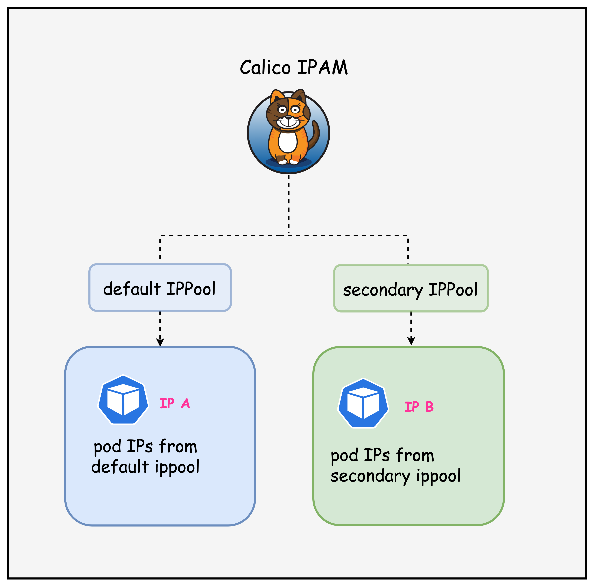

# Calico Multiple IPPools

This lab demonstrates how multiple IP pools can be configured in Calico for advanced network segmentation and IP address management. Multiple IP pools are typically used in scenarios where you want to demarcate workloads in the cluster.

## Lab Setup
To setup the lab for this module **[Lab setup](../README.md#lab-setup)**
The lab folder is - `/containerlab/09-multi-ippool`


## Lab

### 1. Inspect ContainerLab Topology

First, let's inspect the lab topology.

##### command
```bash
containerlab inspect topology.clab.yaml 
```

```
##### output
| Name                   | Kind          | Image                | State   | IPv4 Address | IPv6 Address         |
|------------------------|---------------|----------------------|---------|--------------|----------------------|
| k01-control-plane      | ext-container | kindest/node:v1.32.2 | running | 172.18.0.2   | fc00:f853:ccd:e793::2 |
| k01-worker             | ext-container | kindest/node:v1.32.2 | running | 172.18.0.3   | fc00:f853:ccd:e793::3 |
| k01-worker2            | ext-container | kindest/node:v1.32.2 | running | 172.18.0.4   | fc00:f853:ccd:e793::4 |
| clab-calico-bgp-ceos01 | arista_ceos   | ceos:4.34.0F         | running | 172.20.20.2  | 3fff:172:20:20::2 |
| k01-control-plane      | k8s-kind      | kindest/node:v1.32.2 | running | 172.18.0.2   | fc00:f853:ccd:e793::2 |
| k01-worker             | k8s-kind      | kindest/node:v1.32.2 | running | 172.18.0.3   | fc00:f853:ccd:e793::3 |
| k01-worker2            | k8s-kind      | kindest/node:v1.32.2 | running | 172.18.0.4   | fc00:f853:ccd:e793::4 |
```
Next, let's inspect the lab topology: First, export the kube.config file.
```
export KUBECONFIG=/home/ubuntu/containerlab/9-multi-ippool/k01.kubeconfig
```

Verify the cluster nodes.
##### command
```
kubectl get nodes
```
##### output
```
NAME                STATUS   ROLES           AGE   VERSION
k01-control-plane   Ready    control-plane   18m   v1.32.2
k01-worker          Ready    <none>          17m   v1.32.2
k01-worker2         Ready    <none>          17m   v1.32.2
```

> [!Note]
> We are utilizing the same lab topology as the previous BGP lab that can be found here **[Lab setup](../8-calico-bgp-lb/README.md)**

In this lab, we will look at how multiple IP pools can be used to allocate IP addresses to pods in the cluster as outlined in the diagram below.




### 2. Inspect IP Pools


#### 2.1 Verify the multiple IP pools configured in the `installation` resource

The following IP pools were configured in the installation resource. The installation resource can be found in the following file. [custom-resources.yaml](./calico-cni-config/custom-resources.yaml)

```yaml
    ipPools:
    - name: default-ipv4-ippool
      blockSize: 26
      cidr: 192.168.0.0/17
      encapsulation: VXLANCrossSubnet
      natOutgoing: Enabled
      nodeSelector: all()
      disableBGPExport: true
    - name: secondary-ipv4-ippool
      blockSize: 26
      cidr: 192.168.128.0/17
      encapsulation: VXLANCrossSubnet
      natOutgoing: Enabled
      nodeSelector: "!all()"
      disableBGPExport: true
```

##### Explanation

In this installation resource, there are two IP pools - default IP pool and a secondary IP pool. The secondary IP pool has a node select of ` "!all()"` which means that this IP pool will not be utilized unless a workload resource has specifically requested IPs from this pool.

Next, let's inspect IP pools.

##### command
```
kubectl get ippools
```

##### output
```
default-ipv4-ippool     2025-10-06T20:11:19Z
loadbalancer-ip-pool    2025-10-06T20:12:45Z
secondary-ipv4-ippool   2025-10-06T20:11:19Z
```

##### Explanation
Notice that there is a default and a secondary IP pool. You can ignore the load balance IP pool for this lab.

#### 2.2 Verify the IPAM block affinities

##### command
```
kubectl get blockaffinities
```

##### output
```
kubectl get blockaffinities
NAME                                CREATED AT
k01-control-plane-192-168-69-0-26   2025-10-06T20:11:50Z
k01-worker-192-168-42-192-26        2025-10-06T20:11:53Z
k01-worker2-192-168-88-192-26       2025-10-06T20:11:50Z
load-balancer-172-16-0-240-28       2025-10-06T20:12:45Z
```

##### Explanation
Note that the block affinities are only assigned from the primary IP pool, which means that the secondary IP pool is not considered for IPAM allocation. This also indicates that currently, there are no workloads that have requested IP addresses from the secondary IP pool.

The manifest for the workloads deployed in this lab can be found in this directory - [tools](./tools/)

#### 2.3 Verify workload IPs

##### command

```
kubectl get pods -n default -o wide
```
##### output
```
NAME                                READY   STATUS    RESTARTS   AGE   IP               NODE                NOMINATED NODE   READINESS GATES
multitool-1-2f7vl                   1/1     Running   0          30s   192.168.42.194   k01-worker          <none>           <none>
multitool-1-n4669                   1/1     Running   0          30s   192.168.69.2     k01-control-plane   <none>           <none>
multitool-1-svf7t                   1/1     Running   0          30s   192.168.88.200   k01-worker2         <none>           <none>
multitool-2-hmhh2                   1/1     Running   0          29s   192.168.69.3     k01-control-plane   <none>           <none>
multitool-2-kcv8c                   1/1     Running   0          29s   192.168.88.201   k01-worker2         <none>           <none>
multitool-2-m22jw                   1/1     Running   0          29s   192.168.42.195   k01-worker          <none>           <none>
nginx-deployment-67d6b95dd8-648sk   1/1     Running   0          29s   192.168.88.203   k01-worker2         <none>           <none>
nginx-deployment-67d6b95dd8-rzjt8   1/1     Running   0          29s   192.168.42.197   k01-worker          <none>           <none>
```
##### Explanation
Notice that all pod IPs are from the default IP pool. This is because the secondary IP pool has a node select of `"!all()"` Which prevents it from being allocated to pods unless specified.


### 3. Using the secondary IP Pool

Let's modify the multitool-2 daemonset so that it receives IP addresses from the secondary IP pool.

#### 3.1 Annotate Workload to use the secondary IP pool

Apply the following annotation to the multitool-2 daemonset. This instructs Calico to allocate IP addresses to these pods from the secondary IP pool.

##### command
```
kubectl patch daemonset multitool-2 -p '{"spec":{"template":{"metadata":{"annotations":{"cni.projectcalico.org/ipv4pools":"[\"secondary-ipv4-ippool\"]"}}}}}'
```

##### output
```
daemonset.apps/multitool-2 patched
```

This is what the annotation would look like in the manifest file.
```
apiVersion: apps/v1
kind: DaemonSet
metadata:
  name: multitool-2
  namespace: default
  labels:
    app: multitool-2
spec:
  selector:
    matchLabels:
      app: multitool-2
  template:
    metadata:
      labels:
        app: multitool-2
      annotations:
        cni.projectcalico.org/ipv4pools: '["secondary-ipv4-ippool"]'
  REDACTED
```

#### 3.2 Verify workload IPs

Once the change is applied, the multitool-2 pods should restart and now have an IP address from the secondary IP pool. This is shown in the output below.

##### command
```
kubectl get pods -n default -o wide
```

##### output
```
kubectl get pods -o wide 
NAME                                READY   STATUS    RESTARTS   AGE     IP                NODE                NOMINATED NODE   READINESS GATES
multitool-1-2f7vl                   1/1     Running   0          6m38s   192.168.42.194    k01-worker          <none>           <none>
multitool-1-n4669                   1/1     Running   0          6m38s   192.168.69.2      k01-control-plane   <none>           <none>
multitool-1-svf7t                   1/1     Running   0          6m38s   192.168.88.200    k01-worker2         <none>           <none>
multitool-2-rxh2b                   1/1     Running   0          27s     192.168.216.192   k01-worker2         <none>           <none>
multitool-2-tc274                   1/1     Running   0          24s     192.168.170.192   k01-worker          <none>           <none>
multitool-2-xwzrw                   1/1     Running   0          31s     192.168.197.0     k01-control-plane   <none>           <none>
nginx-deployment-67d6b95dd8-648sk   1/1     Running   0          6m37s   192.168.88.203    k01-worker2         <none>           <none>
nginx-deployment-67d6b95dd8-rzjt8   1/1     Running   0          6m37s   192.168.42.197    k01-worker          <none>           <none>
```
Next, let's also look at the block affinities, specifically, to verify that IPAM blocks from the secondary IP pool have been allocated to the nodes.

##### command
```
kubectl get blockaffinities
```

##### output
```
 kubectl get blockaffinities
NAME                                 CREATED AT
k01-control-plane-192-168-197-0-26   2025-10-06T20:18:53Z
k01-control-plane-192-168-69-0-26    2025-10-06T20:11:50Z
k01-worker-192-168-170-192-26        2025-10-06T20:19:00Z
k01-worker-192-168-42-192-26         2025-10-06T20:11:53Z
k01-worker2-192-168-216-192-26       2025-10-06T20:18:57Z
k01-worker2-192-168-88-192-26        2025-10-06T20:11:50Z
load-balancer-172-16-0-240-28        2025-10-06T20:12:45Z
```

##### Explanation
Given that we have workloads that have requested IP addresses from the secondary IP pool Calico has now assigned IP blocks to the nodes so that these workload can obtain IP addresses. 

## Summary

This lab demonstrated how to configure and use multiple IP pools in Calico for advanced IP address management (IPAM) in Kubernetes. The lab built upon the previous BGP lab topology and focused on segregating pod IP allocations using different IP address ranges.

The following key concepts were covered.

1. Dual IP Pool Configuration: 
   - Primary pool: `192.168.0.0/17` (default allocation for all workloads)
   - Secondary pool: `192.168.128.0/17` (on-demand allocation only)

2. Node Selector Strategy: The secondary pool uses `nodeSelector: "!all()"` to prevent automatic allocation unless explicitly requested by workloads through annotations

3. Workload-Specific IP Pool Assignment: Using Calico annotations (`cni.projectcalico.org/ipv4pools`) to force specific pods to receive IPs from the secondary pool

4. IPAM Block Affinity Verification: Observed how Calico dynamically allocates IP blocks to nodes only when workloads request IPs from specific pools

