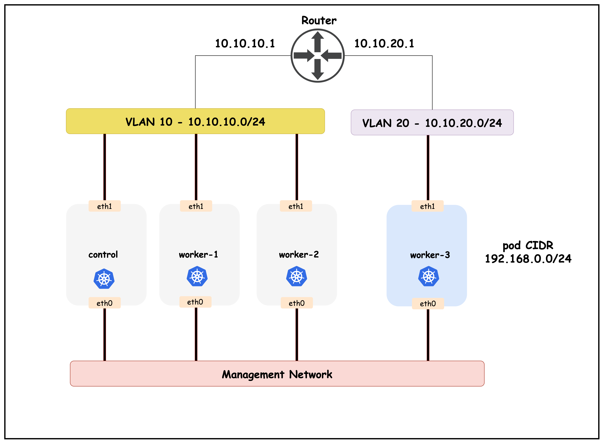
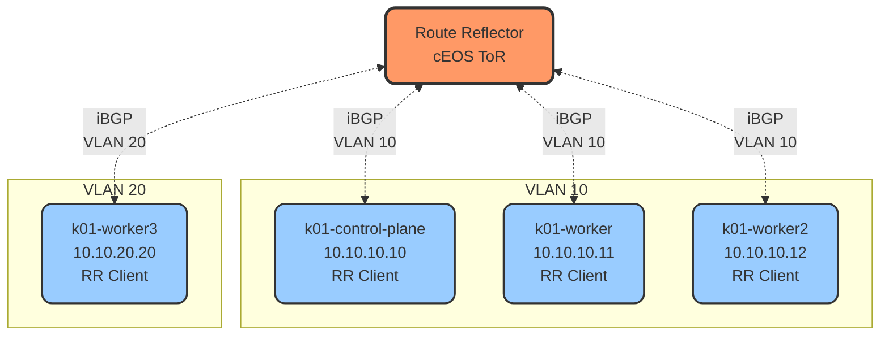
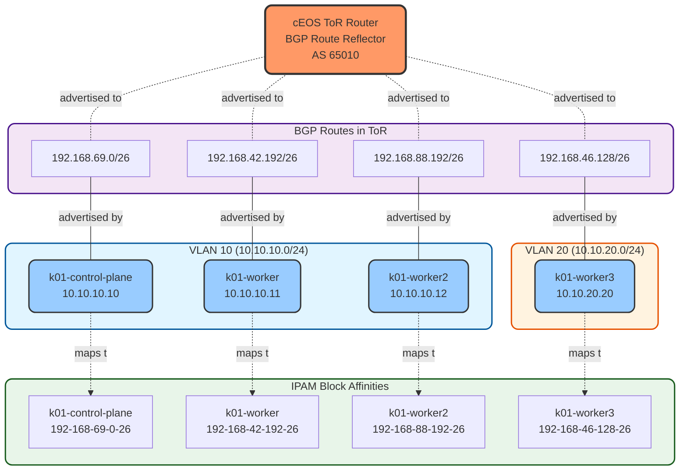
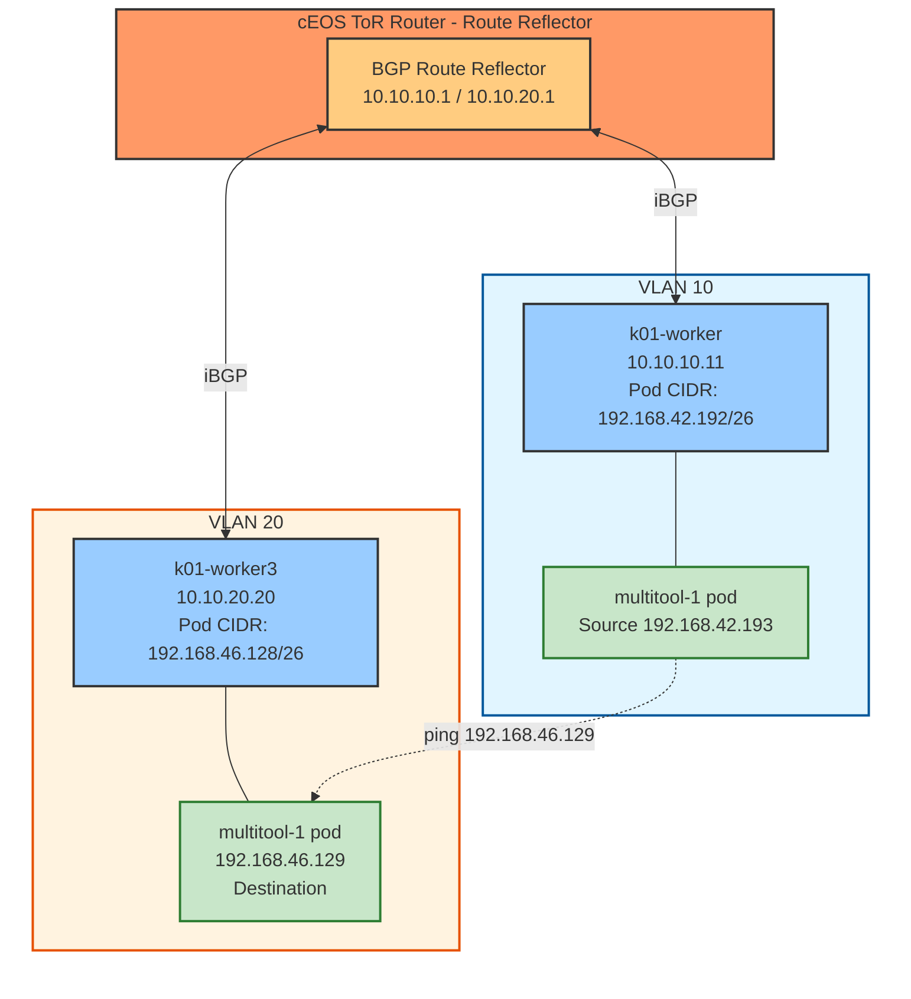
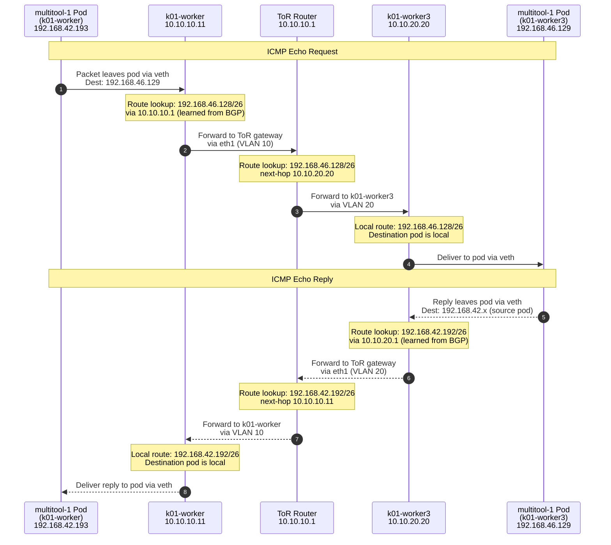

# Calico Advertise IPPool Using BGP

This lab demonstrates how to advertise Calico IP pools to external networks using BGP. You will learn how to configure BGP peering between Calico nodes and an upstream router to make pod IP addresses routable outside the Kubernetes cluster.

## Lab Setup
To setup the lab for this module **[Lab setup](../readme.md#lab-setup)**
The lab folder is - `/containerlab/10-calico-bgp-ippool`


## Lab

### 1. Inspect ContainerLab Topology

First, let's inspect the lab topology.

##### command
```bash
containerlab inspect topology.clab.yaml 
```
```
16:05:41 INFO Parsing & checking topology file=topology.clab.yaml
╭───────────────────────────┬──────────────────┬─────────┬───────────────────────╮
│            Name           │   Kind/Image     │  State  │     IPv4/6 Address    │
├───────────────────────────┼──────────────────┼─────────┼───────────────────────┤
│ k01-control-plane         │ ext-container    │ running │ 172.18.0.4            │
│                           │ kindest/node     │         │ fc00:f853:ccd:e793::4 │
├───────────────────────────┼──────────────────┼─────────┼───────────────────────┤
│ k01-worker                │ ext-container    │ running │ 172.18.0.5            │
│                           │ kindest/node     │         │ fc00:f853:ccd:e793::5 │
├───────────────────────────┼──────────────────┼─────────┼───────────────────────┤
│ k01-worker2               │ ext-container    │ running │ 172.18.0.2            │
│                           │ kindest/node     │         │ fc00:f853:ccd:e793::2 │
├───────────────────────────┼──────────────────┼─────────┼───────────────────────┤
│ k01-worker3               │ ext-container    │ running │ 172.18.0.3            │
│                           │ kindest/node     │         │ fc00:f853:ccd:e793::3 │
├───────────────────────────┼──────────────────┼─────────┼───────────────────────┤
│ clab-calico-bgp-lb-ceos01 │ arista_ceos      │ running │ 172.20.20.2           │
│                           │ ceos:4.34.0F     │         │ 3fff:172:20:20::2     │
├───────────────────────────┼──────────────────┼─────────┼───────────────────────┤
│ k01-control-plane         │ k8s-kind         │ running │ 172.18.0.4            │
│                           │ kindest/node     │         │ fc00:f853:ccd:e793::4 │
├───────────────────────────┼──────────────────┼─────────┼───────────────────────┤
│ k01-worker                │ k8s-kind         │ running │ 172.18.0.5            │
│                           │ kindest/node     │         │ fc00:f853:ccd:e793::5 │
├───────────────────────────┼──────────────────┼─────────┼───────────────────────┤
│ k01-worker2               │ k8s-kind         │ running │ 172.18.0.2            │
│                           │ kindest/node     │         │ fc00:f853:ccd:e793::2 │
├───────────────────────────┼──────────────────┼─────────┼───────────────────────┤
│ k01-worker3               │ k8s-kind         │ running │ 172.18.0.3            │
│                           │ kindest/node     │         │ fc00:f853:ccd:e793::3 │
╰───────────────────────────┴──────────────────┴─────────┴───────────────────────╯
```

Next, let's inspect the lab topology: First, export the kube.config file.

```
 export KUBECONFIG=/home/ubuntu/containerlab/10-calico-bgp-ippool/k01.kubeconfig
 ```
Verify the cluster nodes.
##### command
```
kubectl get nodes
```
##### output
```
kubectl get nodes
NAME                STATUS   ROLES           AGE   VERSION
k01-control-plane   Ready    control-plane   12m   v1.32.2
k01-worker          Ready    <none>          12m   v1.32.2
k01-worker2         Ready    <none>          12m   v1.32.2
k01-worker3         Ready    <none>          12m   v1.32.2
```

> [!Note]
> We are utilizing the same lab topology as the previous BGP lab that can be found here **[Lab setup](../8-calico-bgp-lb/README.md)**


### 2. Inspect IP Pools


#### 2.1 Verify the multiple IP pools configured in the `installation` resource

The following IP pools were configured in the installation resource. The installation resource can be found in the following file. [custom-resources.yaml][customResourcesDefinition]

```yaml
  calicoNetwork:
    ipPools:
    - name: default-ipv4-ippool
      blockSize: 26
      cidr: 192.168.0.0/17
      encapsulation: None
      natOutgoing: Disabled
      nodeSelector: all()
      disableBGPExport: false
    nodeAddressAutodetectionV4:
      cidrs:
        - 10.10.0.0/16
```

##### Explanation

- **name**: Identifier for the IP pool (`default-ipv4-ippool`)
- **blockSize**: Size of IP blocks allocated per node (26 = 64 IPs per block)
- **cidr**: IP address range for pod networking (`192.168.0.0/17`)
- **encapsulation**: Tunneling mode (`None` means no overlay, using native routing)
- **natOutgoing**: Controls NAT for traffic leaving the cluster (`Disabled` means no NAT)
- **nodeSelector**: Which nodes use this pool (`all()` applies to all nodes)
- **disableBGPExport**: Whether to advertise this pool via BGP (`false` means routes are advertised)
- **nodeAddressAutodetectionV4**: CIDR ranges used to detect node IP addresses (`10.10.0.0/16`)

Next, let's inspect IP pools.

##### command
```
kubectl get ippools
```

##### output

```
kubectl get ippools 
NAME                   CREATED AT
default-ipv4-ippool    2025-11-28T15:57:03Z
loadbalancer-ip-pool   2025-11-28T15:58:36Z
```

##### Explanation
Notice that there is a default IP pool configured by the operator based on the IPPool that was specified in the installation resource. You can ignore the load balance IP pool for this lab.


#### 2.2 Verify the IPAM block affinities

##### command
```
kubectl get blockaffinities
```

##### output
```
kubectl get blockaffinities
NAME                                CREATED AT
k01-control-plane-192-168-69-0-26   2025-11-28T15:57:49Z
k01-worker-192-168-42-192-26        2025-11-28T15:57:51Z
k01-worker2-192-168-88-192-26       2025-11-28T15:57:47Z
k01-worker3-192-168-46-128-26       2025-11-28T15:57:55Z
load-balancer-172-16-0-240-28       2025-11-28T15:58:37Z
```

### 3. Verify BGP Configuration

The topology diagram for this cluster setup is as follows:




#### 3.1 Verify the `bgpconfiguration` Resource

The BGP configuration resource can be found in [calico-cni-config/bgp-configuration.yaml](./calico-cni-config/bgp-configuration.yaml).

##### command
```bash
kubectl get bgpconfiguration default -o yaml
```

##### output

```yaml
apiVersion: crd.projectcalico.org/v1
kind: BGPConfiguration
metadata:
  name: default
spec:
  logSeverityScreen: Info
  asNumber: 65010
  nodeToNodeMeshEnabled: false
  serviceLoadBalancerIPs:
  - cidr: 172.16.0.240/28
  prefixAdvertisements:
  - cidr: 192.168.0.0/17
    communities:
    - 65010:100
```

##### expalanation

This BGP configuration defines how Calico handles Border Gateway Protocol routing.

- `asNumber`: `65010` - The Autonomous System Number assigned to this Calico deployment for BGP peering
- `nodeToNodeMeshEnabled`: `false` - Disables the full mesh BGP peering between all nodes (requires explicit BGP peer configuration)
- `serviceLoadBalancerIPs`: Defines IP ranges for LoadBalancer services that should be advertised
  - `cidr: 172.16.0.240/28` - A /28 subnet providing 16 IP addresses for LoadBalancer services


The `prefixAdvertisements` section controls which network prefixes are advertised via BGP to external peers:

- `cidr`: `192.168.0.0/17` - The network prefix to be advertised (a /17 subnet containing 32,768 IP addresses from 192.168.0.0 to 192.168.127.255)
- `communities`: `65010:100` - BGP community tag attached to the advertised prefix
  - Communities are used for route filtering and policy decisions at BGP peers
  - Format is `AS:value` where AS matches the asNumber (65010)
  - Can be used by upstream routers to apply specific routing policies to these prefixes
  - Enables granular control over route propagation and traffic engineering

#### 3.2 Verify BGP Peers

The BGP peer resources are used to create BGP peerings from the Kubernetes cluster to the upstream network. Let's verify the BGP peers for this lab.

The BGP peer resources are used to create BGP peerings from the Kubernetes cluster to the upstream network. Let's verify the BGP peers for this lab.

- [BGP peers for control, worker1 and worker2 which are in subnet or VLAN 10](./calico-cni-config/bgppeer-vlan-10.yaml)
- [BGP peer for worker3 which is in VLAN 20](./calico-cni-config/bgppeer-vlan-20.yaml)

The reason that there are two BGP peers is because the top of rack switch or the BGP peer IP is different for the two VLANs that we have in this topology.

##### command
```bash
kubectl get bgppeers
```

##### output
```
NAME              CREATED AT
bgppeer-vlan-10    2025-11-28T15:58:00Z
bgppeer-vlan-20    2025-11-28T15:58:00Z
```

Now let's inspect the detailed configuration for each BGP peer:

##### command
```bash
kubectl get bgppeer bgppeer-vlan-10 -o yaml
```

##### output
```yaml
apiVersion: crd.projectcalico.org/v1
kind: BGPPeer
metadata:
  name: bgppeer-vlan-10
spec:
  peerIP: 10.10.10.1           # IP address of your Arista switch
  asNumber: 65010             # AS number of the Arista switch
  nodeSelector: vlan == '10'  
```

##### Explanation

- `peerIP`: `10.10.10.1` - The IP address of the BGP peer (router/switch in VLAN 10)
- `asNumber`: `65010` - The Autonomous System Number of the peer (iBGP peering since it matches local AS)
- `nodeSelector`: `vlan == '10'` - Applies this BGP peering only to nodes with the label `vlan=10` (control-plane, worker, worker2)

##### command
```bash
kubectl get bgppeer bgppeer-vlan-20 -o yaml
```

##### output
```yaml
apiVersion: crd.projectcalico.org/v1
kind: BGPPeer
metadata:
  name: bgppeer-vlan20
spec:
  peerIP: 10.10.20.1
  asNumber: 65010
  nodeSelector: vlan == '20'
```

##### Explanation

- `peerIP`: `10.10.20.1` - The IP address of the BGP peer (router/switch in VLAN 20)
- `asNumber`: `65010` - The Autonomous System Number of the peer (iBGP peering)
- `nodeSelector`: `vlan == '20'` - Applies this BGP peering only to nodes with the label `vlan=20` (worker3)


#### 3.3 Verify BGP configuration in the ToR. 

The BGP configuration on the Arista cEOS router can be found in the startup configuration file: [ceos01-startup-config.cfg](./startup-config/ceos01-startup-config.cfg)

##### command
```bash
docker exec -it clab-calico-bgp-lb-ceos01 Cli
enable
show running-config | s bgp
```

##### output
```bash
router bgp 65010
  router-id 10.10.10.1
  bgp listen range 10.10.10.0/24 peer-group CALICO-K8S remote-as 65010
  bgp listen range 10.10.20.0/24 peer-group CALICO-K8S remote-as 65010
  neighbor CALICO-K8S peer group
  neighbor CALICO-K8S next-hop-self
  neighbor CALICO-K8S description "Calico Kubernetes Nodes"
  neighbor CALICO-K8S route-reflector-client
  !
  address-family ipv4
    neighbor CALICO-K8S activate
    network 10.10.10.0/24
    network 10.10.20.0/24
```

##### Explanation

This BGP router configuration on the Arista cEOS device establishes it as a BGP route reflector for the Calico cluster:

- `router bgp 65010` - Configures BGP with AS number 65010 (matching the Calico ASN)
- `router-id 10.10.10.1` - Sets the BGP router ID
- `bgp listen range` - Dynamically accepts BGP connections from:
  - `10.10.10.0/24` - Control plane subnet
  - `10.10.20.0/24` - Worker nodes subnet
- `neighbor CALICO-K8S peer group` - Defines a peer group for Calico nodes
- `next-hop-self` - Router advertises itself as next-hop for reflected routes
- `route-reflector-client` - Marks peers as route reflector clients (avoids full mesh requirement)
- `address-family ipv4` - Activates IPv4 BGP for the peer group and advertises node subnets


#### 3.4 Verfiy BGP Status in the ToR

This section demonstrates how to verify that BGP sessions between the Calico nodes and the ToR (Top of Rack) router are established and working correctly. Using CLI commands on the cEOS router (ToR), you'll confirm that all Kubernetes nodes are peered via BGP, and that the expected routing information is being exchanged. This validation step ensures that pod IPs from the Calico IPPools are being advertised to the external network as intended.

Let's first look at the established BGB peers in the ToR. 

##### command

```bash
show ip bgp summary 
```

##### output

```bash
ceos#show ip bgp summary 
BGP summary information for VRF default
Router identifier 10.10.10.1, local AS number 65010
Neighbor Status Codes: m - Under maintenance
  Description              Neighbor    V AS           MsgRcvd   MsgSent  InQ OutQ  Up/Down State   PfxRcd PfxAcc
  "Calico Kubernetes Nodes 10.10.10.10 4 65010             15        14    0    0 00:05:20 Estab   2      2
  "Calico Kubernetes Nodes 10.10.10.11 4 65010             16        13    0    0 00:05:20 Estab   2      2
  "Calico Kubernetes Nodes 10.10.10.12 4 65010             16        13    0    0 00:05:20 Estab   2      2
  "Calico Kubernetes Nodes 10.10.20.20 4 65010             15        13    0    0 00:05:20 Estab   2      2
```

##### Explanation

The BGP summary shows four established peering sessions with Calico nodes:

- ``10.10.10.10`` - k01-control-plane (VLAN 10)
- ``10.10.10.11`` - k01-worker (VLAN 10)
- ``10.10.10.12`` - k01-worker2 (VLAN 10)
- ``10.10.20.20`` - k01-worker3 (VLAN 20)

Each peer has received 2 prefixes (PfxRcd) from the route reflector clients.



Next, let's look at the routing table of the ToR. 

##### command
```
show ip route
```

##### output

```bash
ceos#show ip route

VRF: default
## truncated response. 

Gateway of last resort is not set

 C        10.10.10.0/24
       directly connected, Vlan10
 C        10.10.20.0/24
       directly connected, Vlan20
 B I      172.16.0.240/28 [200/0]
       via 10.10.10.10, Vlan10
 C        172.20.20.0/24
       directly connected, Management0
 B I      192.168.42.192/26 [200/0]
       via 10.10.10.11, Vlan10
 B I      192.168.46.128/26 [200/0]
       via 10.10.20.20, Vlan20
 B I      192.168.69.0/26 [200/0]
       via 10.10.10.10, Vlan10
 B I      192.168.88.192/26 [200/0]
       via 10.10.10.12, Vlan10
```

##### Explanation

The routing table shows that the ToR has learned the following pod routes via BGP:

- `192.168.42.192/26` - Pod CIDR block for k01-worker (10.10.10.11)
- `192.168.46.128/26` - Pod CIDR block for k01-worker3 (10.10.20.20)
- `192.168.69.0/26` - Pod CIDR block for k01-control-plane (10.10.10.10)
- `192.168.88.192/26` - Pod CIDR block for k01-worker2 (10.10.10.12)

The correlation between BGP routes and IPAM block affinities:

```yaml
k01-control-plane-192-168-69-0-26   2025-11-28T23:32:10Z
k01-worker-192-168-42-192-26        2025-11-28T23:32:11Z
k01-worker2-192-168-88-192-26       2025-11-28T23:32:07Z
k01-worker3-192-168-46-128-26       2025-11-28T23:32:11Z
```



Each Kubernetes node advertises its allocated IPAM block to the ToR router via BGP, making pod IPs routable from the external network.

#### 3.5 Verfiy BGP Status for a Node

Apply the following manifest

```yaml
kubectl apply -f -<<EOF
apiVersion: projectcalico.org/v3
kind: CalicoNodeStatus
metadata:
  name: k01-control-plane
spec:
  classes:
    - Agent
    - BGP
    - Routes
  node: k01-control-plane
  updatePeriodSeconds: 10
EOF
```

##### command

```bash
kubectl get caliconodestatus k01-control-plane -o json | jq '.status.routes.routesV4[] | select(.learnedFrom.sourceType == "BGPPeer" and .type == "FIB")'
```

##### output
```yaml
{
  "destination": "192.168.88.192/26",
  "gateway": "10.10.10.1",
  "interface": "eth1",
  "learnedFrom": {
    "peerIP": "10.10.10.1",
    "sourceType": "BGPPeer"
  },
  "type": "FIB"
}
{
  "destination": "192.168.42.192/26",
  "gateway": "10.10.10.1",
  "interface": "eth1",
  "learnedFrom": {
    "peerIP": "10.10.10.1",
    "sourceType": "BGPPeer"
  },
  "type": "FIB"
}
{
  "destination": "192.168.46.128/26",
  "gateway": "10.10.10.1",
  "interface": "eth1",
  "learnedFrom": {
    "peerIP": "10.10.10.1",
    "sourceType": "BGPPeer"
  },
  "type": "FIB"
```

##### explanation
The output above shows the IPv4 routes that the Calico node `k01-control-plane` has learned via BGP from the peer at `10.10.10.1` (the ToR router). Each object details a route including the destination prefix (e.g., `192.168.88.192/26`), the gateway IP, and the interface used to reach the gateway. The `learnedFrom.sourceType` is `"BGPPeer"`, indicating these routes were received via a BGP peering session, and `type` is `"FIB"`, meaning these routes are programmed into the node's Forwarding Information Base (FIB) and are being used for actual packet forwarding.

This output confirms that the node is successfully receiving external routes, and that BGP-based pod network advertisement is functioning as expected.

You can also confirm this by looking at the nodes routing table. 

First, `exec` into the control plane node. 
```bash
docker exec -it  k01-control-plane /bin/bash 
```

Next, let's grep for routes learned through BGP. 

```bash
root@k01-control-plane:/# ip route | grep bird
192.168.42.192/26 via 10.10.10.1 dev eth1 proto bird 
192.168.46.128/26 via 10.10.10.1 dev eth1 proto bird 
blackhole 192.168.69.0/26 proto bird 
192.168.88.192/26 via 10.10.10.1 dev eth1 proto bird 
```


### Testing Connectivity

Next, let's perform some connectivity testing. First retrieve the IP address of the `multitool-1` pod in `k01-worker3`. 


##### command
```bash
kubectl get pod -o json --field-selector spec.nodeName=k01-worker3 | jq -r '.items[] | select(.metadata.name | test("multitool-1")) | .status.podIP'
```
##### output
```
192.168.46.129
```

Let's also retrieve the IP address of the `multitool-1` pod in `k01-worker`

##### command
```bash
kubectl get pod -o json --field-selector spec.nodeName=k01-worker | jq -r '.items[] | select(.metadata.name | test("multitool-1")) | .status.podIP'
```
##### output
```
192.168.42.193
```


Next, let's `exec` into the `multitool-1` pod in node k01-worker

##### command
```bash
kubectl exec -it $(kubectl get pods -o wide --field-selector spec.nodeName=k01-worker | awk '/multitool-1/ {print $1}') -- /bin/sh

ping 192.168.46.129
```
##### output
```
PING 192.168.46.129 (192.168.46.129) 56(84) bytes of data.
64 bytes from 192.168.46.129: icmp_seq=1 ttl=61 time=1.97 ms
64 bytes from 192.168.46.129: icmp_seq=2 ttl=61 time=1.49 ms
64 bytes from 192.168.46.129: icmp_seq=3 ttl=61 time=1.56 ms
64 bytes from 192.168.46.129: icmp_seq=4 ttl=61 time=1.42 ms
64 bytes from 192.168.46.129: icmp_seq=5 ttl=61 time=1.56 ms
64 bytes from 192.168.46.129: icmp_seq=6 ttl=61 time=1.52 ms
64 bytes from 192.168.46.129: icmp_seq=7 ttl=61 time=1.77 ms
64 bytes from 192.168.46.129: icmp_seq=8 ttl=61 time=1.79 ms
```

##### explanation

The output above demonstrates successful connectivity between two pods (`multitool-1`) running on separate Kubernetes nodes (`k01-worker` and `k01-worker3`), each located in different subnets. The first command retrieves the pod IP address on `k01-worker3`, and the second command execs into the pod on `k01-worker` to ping that IP.

The successful ping replies confirm that Calico's BGP configuration is correctly advertising pod network routes between subnets. Each node's pod CIDR block is announced to the upstream router (ToR) via BGP, and the ToR redistributes these routes back to all nodes. As a result, packets between pods in different subnets are routed efficiently, without NAT or overlay tunneling, using native IP routing. This validates that cross-subnet pod-to-pod connectivity is working as intended in the lab setup.



#### Packet Flow: Life of a Ping

The following diagram illustrates the step-by-step journey of an ICMP packet from the source pod on `k01-worker` (VLAN 10) to the destination pod on `k01-worker3` (VLAN 20):



**Key observations:**

1. **No overlay/encapsulation**: Packets are routed using native IP routing, not tunneled
2. **BGP-learned routes**: Each node learns routes to other pod CIDRs via the ToR route reflector
3. **ToR as transit**: The ToR router forwards traffic between VLANs using BGP-learned routes
4. **TTL=61**: The ping output shows TTL=61, indicating 3 hops (64-3=61): Worker → ToR → Worker3 → Pod

The diagram above illustrates the cross-subnet pod-to-pod connectivity path. Traffic from the `multitool-1` pod on `k01-worker` (VLAN 10) is routed through the ToR (acting as a BGP route reflector), which forwards it to `k01-worker3` (VLAN 20) based on the BGP-learned routes. The reply follows the reverse path, demonstrating successful native IP routing without overlay encapsulation.

Next, let's `exec` into the ToR and ping the two `multitool-1` pod IPs 

##### command
```bash
docker exec -it clab-calico-bgp-lb-ceos01 Cli
ping 192.168.42.193

```

##### output

```bash
ceos>ping 192.168.42.193
PING 192.168.42.193 (192.168.42.193) 72(100) bytes of data.
80 bytes from 192.168.42.193: icmp_seq=1 ttl=63 time=4.02 ms
80 bytes from 192.168.42.193: icmp_seq=2 ttl=63 time=3.24 ms
80 bytes from 192.168.42.193: icmp_seq=3 ttl=63 time=0.711 ms
80 bytes from 192.168.42.193: icmp_seq=4 ttl=63 time=0.827 ms
80 bytes from 192.168.42.193: icmp_seq=5 ttl=63 time=0.784 ms

--- 192.168.42.193 ping statistics ---
5 packets transmitted, 5 received, 0% packet loss, time 15ms
rtt min/avg/max/mdev = 0.711/1.917/4.020/1.421 ms, ipg/ewma 3.783/2.884 ms
```

##### output

```bash
ping 192.168.46.129
PING 192.168.46.129 (192.168.46.129) 72(100) bytes of data.
80 bytes from 192.168.46.129: icmp_seq=1 ttl=63 time=1.06 ms
80 bytes from 192.168.46.129: icmp_seq=2 ttl=63 time=0.629 ms
80 bytes from 192.168.46.129: icmp_seq=3 ttl=63 time=0.480 ms
80 bytes from 192.168.46.129: icmp_seq=4 ttl=63 time=0.534 ms
80 bytes from 192.168.46.129: icmp_seq=5 ttl=63 time=0.859 ms

--- 192.168.46.129 ping statistics ---
5 packets transmitted, 5 received, 0% packet loss, time 4ms
rtt min/avg/max/mdev = 0.480/0.713/1.064/0.218 ms, ipg/ewma 1.034/0.888 ms
```

##### explanation

The outputs above confirm that the pod IPs are now reachable by the external network as well. 

## Summary

Here's a quick recap of what you just accomplished in this lab:

- You just advertised your Calico pod CIDRs via BGP through the ToR route reflector, so your pods are reachable without overlays or NAT.
- You walked through the IPPool, IPAM, BGPConfiguration, and BGPPeer resources to confirm they match the topology you built.
- You proved the BGP sessions and learned routes on both the nodes and the ToR, so pods can talk across subnets and from outside the cluster.
