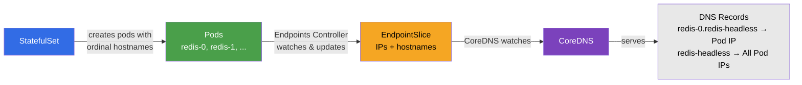

# Kubernetes Headless Services

This lab demonstrates how Kubernetes headless services work and how they differ from regular ClusterIP services. Headless services provide direct DNS-to-Pod IP resolution without a virtual IP (VIP), enabling direct pod-to-pod communication and are essential for stateful applications.

## Why are Headless Services Required

In standard Kubernetes services, a ClusterIP provides load balancing through kube-proxy and a stable VIP. However, some use cases require direct access to individual pods:

- **Stateful Applications**: Databases like Redis, MySQL, PostgreSQL, MongoDB, and Cassandra need clients to connect to specific replicas (e.g., primary vs replica).
- **Peer Discovery**: Distributed systems (Kafka, Elasticsearch, etcd) need pods to discover and communicate directly with each other.
- **Client-Side Load Balancing**: Applications that implement their own load balancing logic need access to all pod IPs.
- **Service Mesh Integration**: Some service meshes prefer direct pod addressing for fine-grained traffic control.

### How Headless Services Differ from ClusterIP

| Feature | ClusterIP Service | Headless Service |
|---------|-------------------|------------------|
| Virtual IP (VIP) | Yes (`clusterIP: <IP>`) | No (`clusterIP: None`) |
| DNS Resolution | Returns Service VIP | Returns Pod IPs directly |
| Load Balancing | kube-proxy handles | Client-side or none |
| iptables Rules | Created by kube-proxy | None (no VIP to NAT) |
| Use Case | General service discovery | Stateful apps, peer discovery |

### DNS Records Created by Headless Services

Headless services create different DNS records depending on the workload type:

**With StatefulSet:**
- **A Record**: `<service>.<namespace>.svc.cluster.local` → Returns all Pod IPs
- **A Record per Pod**: `<pod-name>.<service>.<namespace>.svc.cluster.local` → Returns specific Pod IP
- Example: `redis-0.redis-headless.default.svc.cluster.local` → Pod IP

**With Deployment/ReplicaSet:**
- **A Record**: `<service>.<namespace>.svc.cluster.local` → Returns all Pod IPs
- No individual pod DNS records (pods don't have stable identities)

## Lab Setup
To setup the lab for this module **[Lab setup](../README.md#lab-setup)**
The lab folder is - `/containerlab/headless-services`

## Deployment

1. **ContainerLab Topology Deployment**: Creates a 3-node Kind cluster using the `headless-services.clab.yaml` configuration
2. **Kubeconfig Setup**: Exports the Kind cluster's kubeconfig for kubectl access
3. **Calico Installation**: Downloads and installs calicoctl, then deploys Calico CNI components:
    - Calico Operator CRDs
    - Tigera Operator
    - Custom Calico resources with IPAM configuration
4. **Test Workload Deployment**: Deploys Redis StatefulSet with replication, Nginx Deployment with headless services, plus multitool pods for testing
5. **Verification**: Waits for all Calico components to become available before completion

Deploy the lab using:
```bash
cd containerlab/headless-services
chmod +x deploy.sh
./deploy.sh
```

## Lab

> [!Note]
> <mark>The outputs in this section will be different in your lab. When running the commands given in this section, make sure you replace IP addresses, interface names, and node names as per your lab.<mark>

After deployment, verify the cluster is ready by checking the ContainerLab topology status:

### 1. Inspect ContainerLab Topology

```bash
containerlab inspect -t headless-services.clab.yaml
```

##### output
```
╭─────────────────────────────────┬──────────────────────────┬─────────┬───────────────────────╮
│              Name               │      Kind/Image          │  State  │     IPv4/6 Address    │
├─────────────────────────────────┼──────────────────────────┼─────────┼───────────────────────┤
│ headless-services-control-plane │ k8s-kind                 │ running │ 172.18.0.3            │
│                                 │ kindest/node:v1.28.0     │         │ fc00:f853:ccd:e793::3 │
├─────────────────────────────────┼──────────────────────────┼─────────┼───────────────────────┤
│ headless-services-worker        │ k8s-kind                 │ running │ 172.18.0.2            │
│                                 │ kindest/node:v1.28.0     │         │ fc00:f853:ccd:e793::2 │
├─────────────────────────────────┼──────────────────────────┼─────────┼───────────────────────┤
│ headless-services-worker2       │ k8s-kind                 │ running │ 172.18.0.4            │
│                                 │ kindest/node:v1.28.0     │         │ fc00:f853:ccd:e793::4 │
╰─────────────────────────────────┴──────────────────────────┴─────────┴───────────────────────╯
```

### 2. Verify pods and services

```bash
# Set kubeconfig to use the cluster
export KUBECONFIG=/home/ubuntu/containerlab/headless-services/headless-services.kubeconfig

# Check all pods
kubectl get pods -o wide
```

##### output
```
NAME                                READY   STATUS    RESTARTS   AGE   IP               NODE                              NOMINATED NODE   READINESS GATES
multitool-2p4xk                     1/1     Running   0          5m    192.168.202.194  headless-services-worker          <none>           <none>
multitool-8h2js                     1/1     Running   0          5m    192.168.145.9    headless-services-control-plane   <none>           <none>
multitool-k9d3f                     1/1     Running   0          5m    192.168.156.3    headless-services-worker2         <none>           <none>
nginx-deployment-55d7bb4b86-vg4lt   1/1     Running   0          5m    192.168.156.5    headless-services-worker2         <none>           <none>
nginx-deployment-55d7bb4b86-xqh9d   1/1     Running   0          5m    192.168.202.196  headless-services-worker          <none>           <none>
redis-0                             1/1     Running   0          5m    192.168.202.195  headless-services-worker          <none>           <none>
redis-1                             1/1     Running   0          5m    192.168.156.4    headless-services-worker2         <none>           <none>
redis-2                             1/1     Running   0          5m    192.168.145.10   headless-services-control-plane   <none>           <none>
```

- **redis-0**: Master (primary) - accepts writes and replicates to redis-1, redis-2
- **redis-1, redis-2**: Replicas - connected to redis-0 using headless service DNS
- **nginx-deployment-***: Deployment pods with random suffixes
- **multitool-***: DaemonSet pods for testing on each node

##### command
```bash
kubectl get statefulset
```

##### output
```
NAME    READY   AGE
redis   3/3     5m
```

- **READY 3/3**: All 3 replicas of the Redis StatefulSet are running
- The StatefulSet ensures pods are created in order (redis-0 → redis-1 → redis-2) and maintains stable identities

##### command
```bash
kubectl get services
```

##### output
```
NAME              TYPE        CLUSTER-IP     EXTERNAL-IP   PORT(S)    AGE
kubernetes        ClusterIP   10.96.0.1      <none>        443/TCP    10m
nginx-clusterip   ClusterIP   10.96.204.67   <none>        80/TCP     5m
nginx-headless    ClusterIP   None           <none>        80/TCP     5m
redis-headless    ClusterIP   None           <none>        6379/TCP   5m
```

- **nginx-clusterip**: Regular ClusterIP service with VIP `10.96.204.67`
- **nginx-headless**: Headless service (`ClusterIP: None`) for the Deployment
- **redis-headless**: Headless service (`ClusterIP: None`) for the Redis StatefulSet

### 3. Compare ClusterIP vs Headless Service DNS Resolution

Exec into a multitool pod to test DNS resolution:

```bash
kubectl exec -it $(kubectl get pods -l app=multitool -o jsonpath='{.items[0].metadata.name}') -- sh
```

#### 3.1 - Regular ClusterIP Service DNS

##### command
```bash
dig +search nginx-clusterip
```

##### output
```
;; QUESTION SECTION:
;nginx-clusterip.default.svc.cluster.local. IN A

;; ANSWER SECTION:
nginx-clusterip.default.svc.cluster.local. 30 IN A 10.96.204.67
```

- Returns the **Service VIP** (10.96.204.67)
- kube-proxy handles load balancing to backend pods
- Client sees only one IP regardless of replica count

#### 3.2 - Headless Service DNS (Deployment)

##### command
```bash
dig +search nginx-headless
```

##### output
```
;; QUESTION SECTION:
;nginx-headless.default.svc.cluster.local. IN A

;; ANSWER SECTION:
nginx-headless.default.svc.cluster.local. 30 IN A 192.168.156.5
nginx-headless.default.svc.cluster.local. 30 IN A 192.168.202.196
```

- Returns **all Pod IPs** directly (no VIP)
- Client receives multiple A records
- Client-side load balancing or selection required
- No iptables/IPVS rules created for this service

#### 3.3 - Headless Service DNS (Redis StatefulSet)

##### command
```bash
dig +search redis-headless
```

##### output
```
;; QUESTION SECTION:
;redis-headless.default.svc.cluster.local. IN A

;; ANSWER SECTION:
redis-headless.default.svc.cluster.local. 30 IN A 192.168.202.195
redis-headless.default.svc.cluster.local. 30 IN A 192.168.156.4
redis-headless.default.svc.cluster.local. 30 IN A 192.168.145.10
```

- Returns all **Redis Pod IPs**
- Each pod has a stable network identity

### 4. Redis Pod-Specific DNS Records

The key advantage of headless services with StatefulSets is individual pod DNS records. This is essential for databases where you need to connect to specific instances (e.g., primary vs replica).

**How StatefulSets and Ordinals Work:**

Unlike Deployments that create pods with random suffixes (e.g., `nginx-deployment-55d7bb4b86-vg4lt`), StatefulSets assign each pod a **stable, predictable identity** using an ordinal index starting from 0. When you create a StatefulSet named `redis` with 3 replicas:

- Pods are created **in order**: `redis-0`, then `redis-1`, then `redis-2`
- Pods are deleted **in reverse order**: `redis-2` first, then `redis-1`, then `redis-0`
- Each pod's hostname matches its name (e.g., `redis-0` has hostname `redis-0`)
- The ordinal (0, 1, 2) can be extracted from the hostname to determine the pod's role

This ordering guarantee is critical for distributed systems:
- **Primary election**: `redis-0` can always be designated as master since it starts first
- **Ordered startup**: Replicas wait for the master to be ready before connecting
- **Graceful scaling**: When scaling down, the highest ordinal pods are removed first

Combined with a headless service, each pod gets a **unique DNS name**: `<pod-name>.<service-name>.<namespace>.svc.cluster.local`. This allows pods to discover and address each other by name, enabling peer-to-peer communication for replication, clustering, and leader election.

**How CoreDNS Creates DNS Records for StatefulSets:**

When a StatefulSet with a headless service is created, Kubernetes and CoreDNS work together to create the DNS records:

1. **StatefulSet Controller** creates pods with ordinal names (`redis-0`, `redis-1`, `redis-2`)
2. **Endpoints Controller** watches for pods matching the headless service selector and creates/updates **EndpointSlice** resources
3. **EndpointSlice** contains the pod IPs, ports, and importantly for StatefulSets, the **hostname** and **nodeName** of each pod
4. **CoreDNS** watches EndpointSlice resources and dynamically generates DNS records:
   - For the service: `redis-headless.default.svc.cluster.local` → All pod IPs (A records)
   - For each pod: `redis-0.redis-headless.default.svc.cluster.local` → Specific pod IP

The key difference from regular services is that CoreDNS uses the `hostname` field in the EndpointSlice to create individual pod DNS records. This field is only populated when the pod has a `hostname` set (which StatefulSets do automatically based on the ordinal).

**What is an EndpointSlice?**

An EndpointSlice is a Kubernetes resource that tracks the network endpoints (IP addresses and ports) for a Service. It was introduced as a more scalable replacement for the older Endpoints resource. Key characteristics:

- **Automatic creation**: Kubernetes automatically creates and manages EndpointSlices for each Service
- **Pod tracking**: Contains the IP addresses of all pods that match the Service's selector
- **Scalability**: Unlike Endpoints (limited to ~1000 endpoints), EndpointSlices can be split across multiple objects for large services
- **Rich metadata**: Includes additional information like `hostname`, `nodeName`, `zone`, and readiness conditions
- **Consumer**: CoreDNS and kube-proxy watch EndpointSlices to build DNS records and iptables/IPVS rules respectively

For headless services, CoreDNS reads the EndpointSlice to answer DNS queries directly with pod IPs (instead of a service VIP).

**Verify EndpointSlices for Headless Services:**

##### command
```bash
# View the EndpointSlice for the Redis headless service
kubectl get endpointslice -l kubernetes.io/service-name=redis-headless -o yaml
```

##### output (truncated)
```yaml
apiVersion: discovery.k8s.io/v1
kind: EndpointSlice
metadata:
  name: redis-headless-abc12
  labels:
    kubernetes.io/service-name: redis-headless
addressType: IPv4
endpoints:
- addresses:
  - 192.168.202.195
  conditions:
    ready: true
  hostname: redis-0          # <-- Key field for pod-specific DNS
  nodeName: headless-services-worker
  targetRef:
    kind: Pod
    name: redis-0
- addresses:
  - 192.168.156.4
  conditions:
    ready: true
  hostname: redis-1          # <-- Each pod has its hostname
  nodeName: headless-services-worker2
  targetRef:
    kind: Pod
    name: redis-1
- addresses:
  - 192.168.145.10
  conditions:
    ready: true
  hostname: redis-2
  nodeName: headless-services-control-plane
  targetRef:
    kind: Pod
    name: redis-2
ports:
- name: redis
  port: 6379
  protocol: TCP
```

Notice the `hostname` field in each endpoint - this is what CoreDNS uses to create individual pod DNS records like `redis-0.redis-headless`.

##### command
```bash
# Compare with Nginx headless service (Deployment - no hostnames)
kubectl get endpointslice -l kubernetes.io/service-name=nginx-headless -o yaml
```

##### output (truncated)
```yaml
apiVersion: discovery.k8s.io/v1
kind: EndpointSlice
metadata:
  name: nginx-headless-xyz89
  labels:
    kubernetes.io/service-name: nginx-headless
addressType: IPv4
endpoints:
- addresses:
  - 192.168.156.5
  conditions:
    ready: true
  # No hostname field - Deployment pods don't have stable hostnames
  nodeName: headless-services-worker2
  targetRef:
    kind: Pod
    name: nginx-deployment-55d7bb4b86-vg4lt
- addresses:
  - 192.168.202.196
  conditions:
    ready: true
  nodeName: headless-services-worker
  targetRef:
    kind: Pod
    name: nginx-deployment-55d7bb4b86-xqh9d
ports:
- name: http
  port: 80
  protocol: TCP
```

Notice the Deployment's EndpointSlice has **no `hostname` field** - this is why Deployment pods don't get individual DNS records like StatefulSet pods do.



**Key Components in the Flow:**

| Component | Role |
|-----------|------|
| **StatefulSet Controller** | Creates pods with stable hostnames (`redis-0`, `redis-1`, etc.) |
| **Headless Service** | Defines the selector and tells Kubernetes not to allocate a ClusterIP |
| **Endpoints Controller** | Creates EndpointSlice with pod IPs and hostnames |
| **EndpointSlice** | Stores pod addresses, ports, and hostnames for CoreDNS to consume |
| **CoreDNS** | Watches EndpointSlices and serves DNS queries with pod-specific records |

#### 4.1 - Query Individual Redis Pod DNS

##### command
```bash
dig +search redis-0.redis-headless
```

##### output
```
;; QUESTION SECTION:
;redis-0.redis-headless.default.svc.cluster.local. IN A

;; ANSWER SECTION:
redis-0.redis-headless.default.svc.cluster.local. 30 IN A 192.168.202.195
```

- **redis-0.redis-headless** resolves to `redis-0`'s specific IP
- Enables direct connection to a specific Redis instance

##### command
```bash
dig +search redis-1.redis-headless
```

##### output
```
;; ANSWER SECTION:
redis-1.redis-headless.default.svc.cluster.local. 30 IN A 192.168.156.4
```

##### command
```bash
dig +search redis-2.redis-headless
```

##### output
```
;; ANSWER SECTION:
redis-2.redis-headless.default.svc.cluster.local. 30 IN A 192.168.145.10
```

#### 4.2 - Test Connectivity to Specific Redis Instance

##### command
```bash
# Connect to redis-0 using its DNS name
redis-cli -h redis-0.redis-headless ping
```

##### output
```
PONG
```

- Direct connection to `redis-0` via its DNS name
- Essential for database primary/replica selection

### 5. Redis Replication via Headless Service DNS

This is the **key demonstration** of how headless services enable peer discovery. The Redis replicas (redis-1, redis-2) automatically discover and connect to the master (redis-0) using the headless service DNS name `redis-0.redis-headless`.

#### 5.1 - Verify Replication Status on Master

##### command
```bash
# Check replication info on the master (redis-0)
redis-cli -h redis-0.redis-headless INFO replication
```

##### output
```
# Replication
role:master
connected_slaves:2
slave0:ip=192.168.156.4,port=6379,state=online,offset=420,lag=0
slave1:ip=192.168.145.10,port=6379,state=online,offset=420,lag=0
master_failover_state:no-failover
master_replid:8a3f4e2c1b5d9a7e6f0c2b4d8a1e3f5c7d9b0a2e
master_replid2:0000000000000000000000000000000000000000
master_repl_offset:420
second_repl_offset:-1
repl_backlog_active:1
repl_backlog_size:1048576
repl_backlog_first_byte_offset:1
repl_backlog_histlen:420
```

Key observations:
- `role:master` - redis-0 is the master
- `connected_slaves:2` - Two replicas are connected
- `slave0` and `slave1` show the connected replica IPs and their sync state

#### 5.2 - Verify Replication Status on Replicas

##### command
```bash
# Check replication info on replica redis-1
redis-cli -h redis-1.redis-headless INFO replication
```

##### output
```
# Replication
role:slave
master_host:redis-0.redis-headless.default.svc.cluster.local
master_port:6379
master_link_status:up
master_last_io_seconds_ago:1
master_sync_in_progress:0
slave_read_repl_offset:420
slave_repl_offset:420
slave_priority:100
slave_read_only:1
replica_announced:1
connected_slaves:0
master_failover_state:no-failover
master_replid:8a3f4e2c1b5d9a7e6f0c2b4d8a1e3f5c7d9b0a2e
master_replid2:0000000000000000000000000000000000000000
master_repl_offset:420
second_repl_offset:-1
repl_backlog_active:1
repl_backlog_size:1048576
repl_backlog_first_byte_offset:1
repl_backlog_histlen:420
```

Key observations:
- `role:slave` - This is a replica
- `master_host:redis-0.redis-headless.default.svc.cluster.local` - **This is the key!** The replica discovered the master using the headless service DNS
- `master_link_status:up` - Successfully connected to master
- `slave_read_only:1` - Replica is in read-only mode

##### command
```bash
# Check replication on redis-2 as well
redis-cli -h redis-2.redis-headless INFO replication | grep -E "role|master_host|master_link_status"
```

##### output
```
role:slave
master_host:redis-0.redis-headless.default.svc.cluster.local
master_link_status:up
```

#### 5.3 - Test Data Replication

##### command
```bash
# Write data to the master
redis-cli -h redis-0.redis-headless SET mykey "Hello from master"
```

##### output
```
OK
```

##### command
```bash
# Read data from replica redis-1
redis-cli -h redis-1.redis-headless GET mykey
```

##### output
```
"Hello from master"
```

##### command
```bash
# Read data from replica redis-2
redis-cli -h redis-2.redis-headless GET mykey
```

##### output
```
"Hello from master"
```

- Data written to master is automatically replicated to all replicas
- Replicas discovered master using `redis-0.redis-headless` DNS name

#### 5.4 - Verify Replicas are Read-Only

##### command
```bash
# Try to write to a replica (should fail)
redis-cli -h redis-1.redis-headless SET anotherkey "test"
```

##### output
```
(error) READONLY You can't write against a read only replica.
```

- Replicas are read-only by default
- All writes must go to the master (redis-0)

#### 5.5 - How Peer Discovery Works

Let's examine the startup logs to see how replicas discover the master:

```bash
exit
kubectl logs redis-1 | head -20
```

##### output
```
This is replica redis-1, waiting for master redis-0...
Waiting for redis-0.redis-headless to be ready...
Master redis-0 is ready!
Starting as REPLICA (redis-1), replicating from redis-0.redis-headless
1:C 09 Dec 2024 10:00:00.000 * oO0OoO0OoO0Oo Redis is starting oO0OoO0OoO0Oo
1:C 09 Dec 2024 10:00:00.001 * Redis version=7.2.4, bits=64, commit=00000000, modified=0, pid=1
1:S 09 Dec 2024 10:00:00.010 * Connecting to MASTER redis-0.redis-headless.default.svc.cluster.local:6379
1:S 09 Dec 2024 10:00:00.015 * MASTER <-> REPLICA sync started
1:S 09 Dec 2024 10:00:00.020 * Full resync from master: 8a3f4e2c1b5d9a7e6f0c2b4d8a1e3f5c7d9b0a2e:0
```

The logs show:
1. Init container waits for master to be available via DNS
2. Replica starts with `--replicaof redis-0.redis-headless.default.svc.cluster.local 6379`
3. Redis connects to master using the headless service DNS name
4. Full sync is initiated from master to replica

### 6. Verify No iptables Rules for Headless Services

Connect to a worker node:

```bash
docker exec -it headless-services-worker /bin/bash
```

#### 6.1 - Check iptables for ClusterIP Service

##### command
```bash
iptables -t nat -S KUBE-SERVICES | grep nginx-clusterip
```

##### output
```
-A KUBE-SERVICES -d 10.96.204.67/32 -p tcp -m comment --comment "default/nginx-clusterip:http cluster IP" -m tcp --dport 80 -j KUBE-SVC-XXXXXXXX
```

- iptables rules exist for ClusterIP service
- kube-proxy programs DNAT rules for load balancing

#### 6.2 - Check iptables for Headless Services

##### command
```bash
iptables -t nat -S KUBE-SERVICES | grep nginx-headless
```

##### output
```
(no output)
```

- **No iptables rules** for headless services
- There's no VIP to NAT traffic to
- DNS returns pod IPs directly; routing uses normal pod routing

##### command
```bash
iptables -t nat -S KUBE-SERVICES | grep redis-headless
```

##### output
```
(no output)
```

- Same for Redis headless service - no iptables rules

## Summary

This lab demonstrated the key differences between ClusterIP and headless services:

| Aspect | ClusterIP Service | Headless Service |
|--------|-------------------|------------------|
| DNS Response | Service VIP | All Pod IPs |
| Load Balancing | kube-proxy (iptables/IPVS) | Client-side |
| iptables Rules | Yes | No |
| Pod-specific DNS | No | Yes (with StatefulSet) |
| Use Case | General services | Stateful apps, peer discovery |

Key takeaways:
- **Headless services** (`clusterIP: None`) bypass kube-proxy entirely
- DNS returns **pod IPs directly** instead of a VIP
- **StatefulSets** with headless services get individual pod DNS records (`<pod>.<service>.<ns>.svc.cluster.local`)
- **No iptables rules** are created for headless services
- Essential for **databases like Redis** requiring direct pod addressing and peer discovery
- **Redis replicas discover the master** using headless service DNS (`redis-0.redis-headless`)

## Additional Notes

### When to Use Headless Services

1. **StatefulSets**: Always pair with headless services for stable network identities
2. **Database Clusters**: Redis, MySQL, PostgreSQL, MongoDB, Cassandra
3. **Distributed Systems**: Kafka, Elasticsearch, etcd, ZooKeeper
4. **Custom Load Balancing**: When clients implement their own balancing logic
5. **Service Mesh**: Some meshes prefer direct pod addressing

### Headless Service Gotchas

- **No load balancing by default**: DNS returns all IPs; client must handle selection
- **DNS caching**: Clients may cache DNS responses; TTL is typically 30 seconds
- **Pod churn**: As pods restart, IPs change; clients should re-resolve DNS periodically
- **Not for general services**: Use ClusterIP for stateless services that benefit from kube-proxy load balancing

### DNS Record Types

- **A Record**: Returns IPv4 addresses
- **AAAA Record**: Returns IPv6 addresses (in dual-stack clusters)
- **SRV Record**: Returns port and hostname (use `dig SRV _redis._tcp.redis-headless.default.svc.cluster.local`)

### How Redis Replication Uses Headless Services

The Redis StatefulSet in this lab demonstrates a common pattern for database replication:

1. **Master Selection**: `redis-0` is designated as the master by ordinal convention
2. **DNS Discovery**: Replicas use `redis-0.redis-headless.default.svc.cluster.local` to find the master
3. **Init Container**: Waits for master DNS to resolve before starting replicas
4. **Replication**: Replicas connect to master using the stable DNS name
5. **Announcements**: Each pod announces its own DNS name (`redis-X.redis-headless`) for client connections

This pattern ensures:
- Replicas always find the master even after pod restarts
- Master's IP can change without breaking replication
- Clients can connect to specific roles (master vs replica) by DNS name

## Lab Cleanup
to cleanup the lab follow steps in **[Lab cleanup](../README.md#lab-cleanup)**
