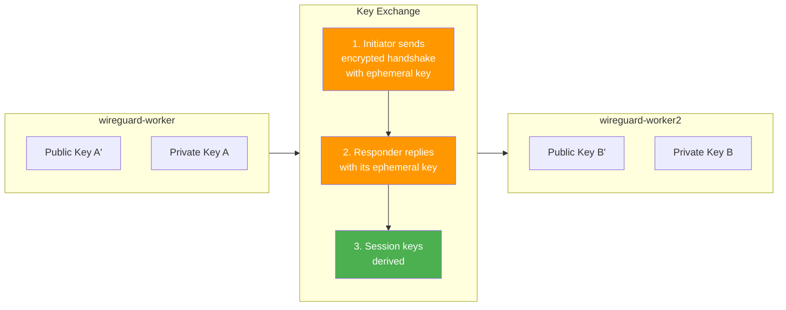
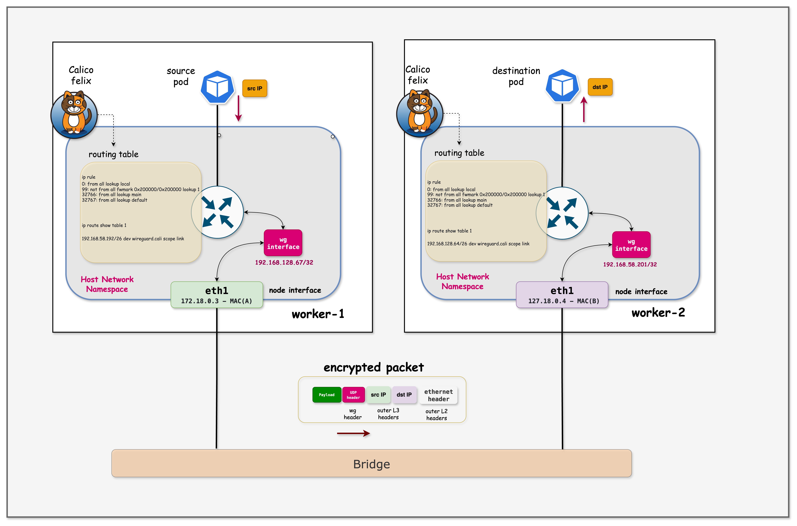

# Calico WireGuard Encryption

This lab demonstrates Calico's WireGuard encryption feature for securing pod-to-pod traffic between nodes. You'll see the clear difference between unencrypted and encrypted traffic using packet captures.

## Why WireGuard Encryption?

In Kubernetes environments, pod-to-pod traffic between nodes traverses the physical network infrastructure. Without encryption, this traffic is vulnerable to:

- **Eavesdropping**: Network administrators or attackers can capture and read pod traffic
- **Man-in-the-Middle Attacks**: Traffic can be intercepted and modified
- **Compliance Violations**: Many regulations require encryption of data in transit

Calico's WireGuard integration provides:

| Feature | Benefit |
|---------|---------|
| **Transparent Encryption** | No application changes required |
| **High Performance** | WireGuard is faster than IPsec |
| **Simple Configuration** | Enable with a single command |
| **Automatic Key Management** | Wireguard handles key rotation |

## How WireGuard Works with Calico

When WireGuard is enabled:

1. **Key Generation**: Each node generates a WireGuard key pair
2. **Peer Discovery**: Calico automatically configures WireGuard peers between nodes
3. **Tunnel Creation**: A `wireguard.cali` interface is created on each node
4. **Traffic Encryption**: All pod-to-pod traffic between nodes is encrypted via UDP port 51820

**Without WireGuard:**
```
Pod A (Node 1) → [Plain/VXLAN packet] → Physical Network → [Plain/VXLAN packet] → Pod B (Node 2)
                     ↑ Readable by anyone on the network
```

**With WireGuard:**
```
Pod A (Node 1) → [Encrypted WireGuard packet] → Physical Network → [Encrypted packet] → Pod B (Node 2)
                     ↑ Encrypted - unreadable without keys
```

## WireGuard Key Exchange and Cryptography

WireGuard uses modern cryptographic primitives and a simple key exchange mechanism. Understanding this helps explain how encryption and decryption work between nodes.

### Key Types

Each node has a **public/private key pair**:

| Key Type | Purpose | Storage |
|----------|---------|---------|
| **Private Key** | Used to decrypt incoming traffic and sign outgoing traffic | Kept secret on the node |
| **Public Key** | Shared with peers to encrypt traffic destined for this node | Distributed via Calico datastore |

```
┌─────────────────────────────────────────────────────────────────────────┐
│                     KEY PAIRS PER NODE                                   │
├─────────────────────────────────────────────────────────────────────────┤
│                                                                          │
│   wireguard-worker                        wireguard-worker2              │
│  ┌────────────────────┐                 ┌────────────────────┐           │
│  │ Private Key: [A]   │                 │ Private Key: [B]   │           │
│  │ (kept secret)      │                 │ (kept secret)      │           │
│  │                    │                 │                    │           │
│  │ Public Key: [A']   │◄───────────────►│ Public Key: [B']   │           │
│  │ (shared with peers)│   Key Exchange  │ (shared with peers)│           │
│  └────────────────────┘                 └────────────────────┘           │
│                                                                          │
└─────────────────────────────────────────────────────────────────────────┘
```

### How Key Exchange Works

WireGuard uses the **Noise Protocol Framework** (specifically Noise_IKpsk2) for key exchange:

1. **Static Keys**: Each node generates a long-term key pair (Curve25519)
2. **Ephemeral Keys**: For each handshake, temporary keys are generated for forward secrecy
3. **Session Keys**: The handshake derives symmetric session keys for actual data encryption



### Encryption and Decryption Flow

| Direction | Encryption Key Used | Decryption Key Used |
|-----------|---------------------|---------------------|
| Node A → Node B | Session key derived from A's private + B's public | Session key on Node B |
| Node B → Node A | Session key derived from B's private + A's public | Session key on Node A |

**Detailed Flow:**

```
╔═════════════════════════════════════════════════════════════════════════════╗
║                       ENCRYPTION/DECRYPTION FLOW                            ║
╠═════════════════════════════════════════════════════════════════════════════╣
║                                                                             ║
║  ┌─────────────────────────────────────────────────────────────────────┐    ║
║  │  SENDING (Node A → Node B)                                          │    ║
║  ├─────────────────────────────────────────────────────────────────────┤    ║
║  │                                                                     │    ║
║  │   1. Plaintext packet (HTTP request with passwords, tokens)         │    ║
║  │                              ↓                                      │    ║
║  │   2. WireGuard encrypts using:                                      │    ║
║  │      • Session key (derived from ECDH of A's private + B's public)  │    ║
║  │      • ChaCha20-Poly1305 cipher                                     │    ║
║  │                              ↓                                      │    ║
║  │   3. Encrypted packet sent via UDP port 51820                       │    ║
║  │                                                                     │    ║
║  └─────────────────────────────────────────────────────────────────────┘    ║
║                                                                             ║
║  ┌─────────────────────────────────────────────────────────────────────┐    ║
║  │  RECEIVING (on Node B)                                              │    ║
║  ├─────────────────────────────────────────────────────────────────────┤    ║
║  │                                                                     │    ║
║  │   4. Encrypted packet received on UDP 51820                         │    ║
║  │                              ↓                                      │    ║
║  │   5. WireGuard decrypts using:                                      │    ║
║  │      • Session key (derived from ECDH of B's private + A's public)  │    ║
║  │      • ChaCha20-Poly1305 cipher                                     │    ║
║  │                              ↓                                      │    ║
║  │   6. Original plaintext packet delivered to pod                     │    ║
║  │                                                                     │    ║
║  └─────────────────────────────────────────────────────────────────────┘    ║
║                                                                             ║
╚═════════════════════════════════════════════════════════════════════════════╝
```

### Cryptographic Primitives

WireGuard uses a fixed set of modern, high-performance cryptographic algorithms:

| Component | Algorithm | Purpose |
|-----------|-----------|---------|
| **Key Exchange** | Curve25519 (ECDH) | Generate shared secrets |
| **Encryption** | ChaCha20 | Encrypt packet payload |
| **Authentication** | Poly1305 | Authenticate packets (prevent tampering) |
| **Hashing** | BLAKE2s | Key derivation and hashing |

**Detailed Cryptographic Flow:**

```
╔═══════════════════════════════════════════════════════════════════════════════════════════════════╗
║  PHASE 1: THE HANDSHAKE (Generating the Keys)                                                     ║
║  Runs every few minutes to create a fresh encryption key                                          ║
╚═══════════════════════════════════════════════════════════════════════════════════════════════════╝
+--------------+-----------------------+----------------------------------+-------------------------+
|  PRIMITIVE   |         ROLE          |           EXACT INPUTS           |      EXACT OUTPUT       |
+--------------+-----------------------+----------------------------------+-------------------------+
|              | Key Exchange          | 1. Local Private Key (Static)    |                         |
|  Curve25519  | (ECDH)                | 2. Remote Public Key (Static)    | Raw Shared Secret       |
|              | *See "Recipe" below   | 3. Ephemeral Private Key (Rand)  | (32 bytes)              |
|              | for detailed steps    | 4. Ephemeral Public Key (Remote) |                         |
+--------------+-----------------------+----------------------------------+-------------------------+
|              |                       | 1. Raw Shared Secret (from Step1)|                         |
|  BLAKE2s     | Key Derivation        | 2. Protocol Context Strings      | Session Key             |
|              | (HKDF)                | 3. Handshake Hash (Transcript)   | (32 bytes)              |
|              |                       |                                  |                         |
+--------------+-----------------------+----------------------------------+-------------------------+

╔═══════════════════════════════════════════════════════════════════════════════════════════════════╗
║  THE "RECIPE": How the Session Key is Made                                                        ║
║  WireGuard uses HKDF to mix several DH operations into the final Session Key                      ║
╠═══════════════════════════════════════════════════════════════════════════════════════════════════╣
║                                                                                                   ║
║  Note: Both Static and Ephemeral keys are Curve25519 key PAIRS (private + public).                ║
║  • Static keys    → Long-term identity, stored on the node                                        ║
║  • Ephemeral keys → Fresh random keys generated per handshake, public keys exchanged in messages  ║
║  • Both use Curve25519: 32-byte random private key → derives 32-byte public key                   ║
║                                                                                                   ║
║  ╭─────────────────────────┬─────────────────────────────────────────────────────────────────╮    ║
║  │  DH COMBINATION         │  PURPOSE                                                        │    ║
║  ├─────────────────────────┼─────────────────────────────────────────────────────────────────┤    ║
║  │                         │                                                                 │    ║
║  │  Ephemeral + Ephemeral  │  ★ Forward Secrecy                                              │    ║
║  │  (Your Random Key +     │    Even if long-term keys are compromised later, past           │    ║
║  │   Server's Random Key)  │    sessions remain secure (ephemeral keys are discarded)        │    ║
║  │                         │                                                                 │    ║
║  ├─────────────────────────┼─────────────────────────────────────────────────────────────────┤    ║
║  │                         │                                                                 │    ║
║  │  Ephemeral + Static     │  ★ Secrecy                                                      │    ║
║  │  (Your Random Key +     │    Ensures only the server (who owns the static private         │    ║
║  │   Server's Identity Key)│    key) can decrypt your ephemeral contribution                 │    ║
║  │                         │                                                                 │    ║
║  ├─────────────────────────┼─────────────────────────────────────────────────────────────────┤    ║
║  │                         │                                                                 │    ║
║  │  Static + Ephemeral     │  ★ Response Security                                            │    ║
║  │  (Your Identity Key +   │    Ensures that the server's response can only be decrypted     │    ║
║  │   Server's Random Key)  │    by you (confidentiality for the client)                      │    ║
║  │                         │                                                                 │    ║
║  ├─────────────────────────┼─────────────────────────────────────────────────────────────────┤    ║
║  │                         │                                                                 │    ║
║  │  Static + Static        │  ★ Mutual Authentication                                        │    ║
║  │  (Your Identity Key +   │    Cryptographically binds the session to the static identities │    ║
║  │   Server's Identity Key)│    of both peers (Authentication)                               │    ║
║  │                         │                                                                 │    ║
║  ╰─────────────────────────┴─────────────────────────────────────────────────────────────────╯    ║
║                                                                                                   ║
║  All four DH results are mixed together via HKDF to produce the final Session Key                 ║
║                                                                                                   ║
╚═══════════════════════════════════════════════════════════════════════════════════════════════════╝

╔═══════════════════════════════════════════════════════════════════════════════════════════════════╗
║  PHASE 2: TRANSPORT (Protecting the Packet)                                                       ║
║  Runs for every single data packet sent over the tunnel                                           ║
╚═══════════════════════════════════════════════════════════════════════════════════════════════════╝
+--------------+-----------------------+----------------------------------+-------------------------+
|              |                       | 1. Session Key (from Phase 1)    | 1. Ciphertext           |
|  ChaCha20    | Encryption            | 2. Packet Counter (Nonce)        |    (Encrypted Data)     |
|              | (Stream Cipher)       | 3. Plaintext (Inner IP Packet)   | 2. One-Time Key         |
|              |                       |                                  |    (for Poly1305)       |
+--------------+-----------------------+----------------------------------+-------------------------+
|              |                       | 1. One-Time Key (from ChaCha20)  |                         |
|  Poly1305    | Authentication        | 2. Ciphertext (Encrypted Data)   | Authentication Tag      |
|              | (MAC)                 | 3. WG Header (Type, Index, etc.) | (16 bytes)              |
|              |                       |                                  |                         |
+--------------+-----------------------+----------------------------------+-------------------------+
```


### Viewing Keys in the Lab

You can view the public keys for each node:

```bash
# View public key for wireguard-worker
docker exec -it wireguard-worker wg show wireguard.cali public-key

# View all peer information including their public keys
docker exec -it wireguard-worker wg show wireguard.cali
```

## Lab Architecture

This lab deploys a realistic microservices scenario:

```
┌─────────────────────────────────────────────────────────────────────────┐
│                         MICROSERVICES DEMO                               │
├─────────────────────────────────────────────────────────────────────────┤
│                                                                          │
│   wireguard-worker                      wireguard-worker2                │
│  ┌──────────────────┐                  ┌──────────────────┐              │
│  │  frontend-client │ ──HTTP+Auth───▶  │   backend-api    │              │
│  │                  │                  │                  │              │
│  │  Sends requests  │                  │  Returns:        │              │
│  │  with:           │                  │  - User passwords│              │
│  │  - JWT tokens    │                  │  - AWS keys      │              │
│  │  - API keys      │                  │  - DB credentials│              │
│  │  - Session cookies│                 │  - Stripe keys   │              │
│  └──────────────────┘                  └──────────────────┘              │
│                                                                          │
│              ▲                                    ▲                       │
│              │        Physical Network           │                       │
│              └────────────────┬──────────────────┘                       │
│                               │                                          │
│                    WITHOUT WIREGUARD:                                    │
│                    All this data is visible!                             │
└─────────────────────────────────────────────────────────────────────────┘
```

The `frontend-client` continuously sends HTTP requests containing:
- JWT Bearer tokens
- API keys
- Session cookies
- Basic auth credentials

The `backend-api` responds with sensitive data:
- User passwords
- AWS access keys
- Database connection strings
- Stripe API keys

## Lab Setup

To setup the lab for this module **[Lab setup](../README.md#lab-setup)**
The lab folder is - `/containerlab/13-wireguard`

## Deployment

The `deploy.sh` script automates the complete lab setup:

1. **ContainerLab Topology Deployment**: Creates a 3-node Kind cluster (1 control-plane, 2 workers)
2. **Kubeconfig Setup**: Exports the Kind cluster's kubeconfig
3. **Calico Installation**: Deploys Calico CNI with VXLAN encapsulation (no encryption initially)
4. **Microservices Deployment**: Deploys frontend and backend pods on different nodes
5. **tcpdump Installation**: Installs tcpdump on worker nodes for packet capture

Deploy the lab:
```bash
cd containerlab/13-wireguard
chmod +x deploy.sh
./deploy.sh
```

## Lab Exercises

> [!Note]
> <mark>The outputs in this section will be different in your lab. When running the commands given in this section, make sure you replace IP addresses, interface names, and node names as per your lab.<mark>

### 1. Verify the Lab Setup

```bash
# Set kubeconfig
export KUBECONFIG=$(pwd)/wireguard.kubeconfig

# Check nodes
kubectl get nodes -o wide
```

##### Expected output
```
NAME                    STATUS   ROLES           AGE   VERSION
wireguard-control-plane Ready    control-plane   5m    v1.28.0
wireguard-worker        Ready    <none>          5m    v1.28.0
wireguard-worker2       Ready    <none>          5m    v1.28.0
```

##### command
```bash
# Check pods - ensure they're on different nodes
kubectl get pods -o wide
```

##### Expected output
```
NAME              READY   STATUS    RESTARTS   AGE     IP               NODE                NOMINATED NODE   READINESS GATES
backend-api       1/1     Running   0          7h57m   192.168.58.200   wireguard-worker2   <none>           <none>
frontend-client   1/1     Running   0          7h57m   192.168.128.66   wireguard-worker    <none>           <none>
```

> [!IMPORTANT]
> The pods must be on **different nodes** for this lab to work. WireGuard encrypts traffic between nodes, not within the same node. If both pods are on the same node, delete and recreate them until they land on different nodes.

### 2. Verify Current Encryption Status (None)

First, let's confirm that WireGuard is NOT enabled:

##### command
```bash
kubectl get felixconfiguration default -o yaml | grep -i wireguard
```

##### Expected output
```
(no output - WireGuard not configured)
```

##### command
```bash
# Check if wireguard interface exists on a node (it shouldn't)
docker exec -it wireguard-worker ip link show type wireguard
```

##### Expected output
```
(no output or error - no WireGuard interface)
```

### 3. Capture Unencrypted Traffic (Before WireGuard)

Now let's demonstrate that without WireGuard, we can see the pod traffic in plain text. The frontend is **continuously sending requests**, so you just need to capture!

#### 3.1 - Capture Traffic with Sensitive Data

Run this command to see passwords, API keys, and tokens flowing in plain text:

##### command
```bash
docker exec -it wireguard-worker2 tcpdump -Z root -i eth0 -A 2>/dev/null | grep -E --color=always 'password|secret|Bearer|API-Key|aws_|stripe_'
```

##### Expected output (sensitive data visible!)
```
"password": "xxx"
Authorization: Bearer eyJxxx.xxx.xxx
X-API-Key: sk_live_xxx
"aws_access_key": "AKIAxxx"
"aws_secret_key": "xxx"
"stripe_api_key": "sk_live_xxx"
```

**This is the security problem!** Anyone with network access can see:
- User passwords in API responses
- JWT tokens and API keys
- AWS credentials
- Database connection strings with passwords

Press `Ctrl+C` to stop the capture.

#### 3.2 - View Full HTTP Requests and Responses

To see more context around the sensitive data:

##### command
```bash
docker exec -it wireguard-worker2 timeout 10 tcpdump -Z root -i eth0 -A 2>/dev/null | head -150
```

You'll see full HTTP requests with headers like `Authorization: Bearer ...` and JSON responses containing passwords and API keys.

### 4. Enable WireGuard Encryption

Now let's enable WireGuard to encrypt all inter-node pod traffic.

#### 4.1 - Enable WireGuard via FelixConfiguration

##### command
```bash
kubectl patch felixconfiguration default --type='merge' -p '{"spec":{"wireguardEnabled":true}}'
```

##### Expected output
```
felixconfiguration.crd.projectcalico.org/default patched
```

#### 4.2 - Verify WireGuard is Enabled

##### command
```bash
kubectl get felixconfiguration default -o yaml | grep -i wireguard
```

##### Expected output
```
  wireguardEnabled: true
```

#### 4.3 - Wait for WireGuard Interface to be Created

It takes a few seconds for Calico to create the WireGuard interfaces on each node.

##### command
```bash
# Check for wireguard interface on worker node
docker exec -it wireguard-worker ip link show type wireguard
```

##### Expected output
```
10: wireguard.cali: <POINTOPOINT,NOARP,UP,LOWER_UP> mtu 1440 qdisc noqueue state UNKNOWN mode DEFAULT group default qlen 1000
    link/none
```

#### 4.4 - View WireGuard Configuration

##### command
```bash
# Show WireGuard peers and configuration
docker exec -it wireguard-worker wg show
```

##### Expected output
```
interface: wireguard.cali
  public key: eD2VBB3lnJqVkkYVk4BIhkfmw/BIVChjFA88CH6MREs=
  private key: (hidden)
  listening port: 51820
  fwmark: 0x200000

peer: FJ8Dm2CABHZGF7fQd1vKqrGTyccDQajiDdrLqjJ2G0c=
  endpoint: 172.18.0.4:51820
  allowed ips: 192.168.58.192/26, 192.168.58.192/32, 192.168.58.201/32
  latest handshake: 34 seconds ago
  transfer: 8.11 MiB received, 6.00 MiB sent

peer: /ANe/52zDtjZyaiDpHOYsM7KeyHwbvO0NagdNZzWi3M=
  endpoint: 172.18.0.2:51820
  allowed ips: 192.168.141.128/32, 192.168.141.128/26, 192.168.141.130/32
```

**Key Observations:**
- **wireguard.cali** interface is created
- **Public/private keys** are automatically generated
- **Listening port 51820** (WireGuard's standard port)
- **fwmark: 0x200000** - This is the firewall mark that WireGuard stamps on packets **after** encrypting them. It works with policy routing (`ip rule`) to prevent routing loops: unencrypted packets (no mark) are routed into the tunnel via Table 1, while encrypted packets (with `0x200000` mark) skip Table 1 and exit via the main table to `eth0`.
- **Peers** are automatically configured for other nodes
- **Allowed IPs** include pod CIDRs and node IPs.
  > **Note on Configuration:** Calico's **Felix** agent automatically configures these Allowed IPs. It calculates them to include the remote node's Pod CIDR (e.g., `192.168.140.64/26`) and the node's internal IP (e.g., `172.18.0.3/32`), ensuring traffic destined for those networks is routed through the tunnel. You do not need to manually configure peers or routes.

#### 4.5 - View WireGuard Interface IP Address

The WireGuard interface also has its own IP address assigned by Calico.

##### command
```bash
docker exec -it wireguard-worker ip addr show wireguard.cali
```

##### Expected output
```
10: wireguard.cali: <POINTOPOINT,NOARP,UP,LOWER_UP> mtu 1440 qdisc noqueue state UNKNOWN group default qlen 1000
    link/none 
    inet 192.168.128.67/32 scope global wireguard.cali
       valid_lft forever preferred_lft forever
```

**Key Observation:** The `wireguard.cali` interface is assigned an IP from the node's pod CIDR (`192.168.128.67/32`). This IP is used as the source address for encrypted tunnel traffic and is advertised to peers in the `allowed ips` list.


### 5. Capture Encrypted Traffic (After WireGuard)

Now let's see the difference with WireGuard enabled!

#### 5.1 - Try to Capture Sensitive Data (It's Encrypted!)

Run the same tcpdump grep command as before:

##### command
```bash
docker exec -it wireguard-worker2 timeout 15 tcpdump -Z root -i eth0 -A 2>/dev/null | grep -E 'password|secret|Bearer|API-Key|aws_|stripe_'
```

##### Expected output
```
(no output - the sensitive data is encrypted!)
```

**The passwords, API keys, and tokens are no longer visible!**

#### 5.2 - View the Encrypted WireGuard Packets

##### command
```bash
docker exec -it wireguard-worker2 tcpdump -Z root -i eth0 -c 10 'udp port 51820' 2>/dev/null
```

##### Expected output (just encrypted UDP packets)
```
tcpdump: verbose output suppressed, use -v[v]... for full protocol decode
listening on eth0, link-type EN10MB (Ethernet), snapshot length 262144 bytes
21:17:40.237446 IP wireguard-worker.kind.51820 > wireguard-worker2.51820: UDP, length 128
21:17:40.237487 IP wireguard-worker.kind.51820 > wireguard-worker2.51820: UDP, length 128
21:17:40.237905 IP wireguard-worker2.51820 > wireguard-worker.kind.51820: UDP, length 176
21:17:40.237936 IP wireguard-worker2.51820 > wireguard-worker.kind.51820: UDP, length 208
21:17:40.238456 IP wireguard-worker.kind.51820 > wireguard-worker2.51820: UDP, length 96
21:17:40.238624 IP wireguard-worker2.51820 > wireguard-worker.kind.51820: UDP, length 96
21:17:40.238769 IP wireguard-worker.kind.51820 > wireguard-worker2.51820: UDP, length 96
21:17:40.238832 IP wireguard-worker.kind.51820 > wireguard-worker2.51820: UDP, length 176
21:17:40.238932 IP wireguard-worker2.51820 > wireguard-worker.kind.51820: UDP, length 96
21:17:40.239262 IP wireguard-worker2.51820 > wireguard-worker.kind.51820: UDP, length 224
```

#### 5.3 - View Source and Destination IP Addresses

Use the `-n` flag to see numeric IP addresses in the outer IP headers:

##### command
```bash
docker exec -it wireguard-worker2 tcpdump -Z root -i eth0 -n -c 10 'udp port 51820' 2>/dev/null
```

##### Expected output
```
tcpdump: verbose output suppressed, use -v[v]... for full protocol decode
listening on eth0, link-type EN10MB (Ethernet), snapshot length 262144 bytes
21:18:10.123456 IP 172.18.0.3.51820 > 172.18.0.4.51820: UDP, length 128
21:18:10.123512 IP 172.18.0.3.51820 > 172.18.0.4.51820: UDP, length 128
21:18:10.123890 IP 172.18.0.4.51820 > 172.18.0.3.51820: UDP, length 176
21:18:10.123945 IP 172.18.0.4.51820 > 172.18.0.3.51820: UDP, length 208
21:18:10.124301 IP 172.18.0.3.51820 > 172.18.0.4.51820: UDP, length 96
```

**Key Observation:** The outer IP headers show **node IPs** (`172.18.0.3` ↔ `172.18.0.4`), not pod IPs. The original pod-to-pod traffic (e.g., `192.168.128.66` → `192.168.58.200`) is encrypted inside the UDP payload. This is how WireGuard hides the true source and destination of the inner traffic.


#### 5.4 - Try to Read the Payload (It's Unreadable!)

##### command
```bash
docker exec -it wireguard-worker2 timeout 5 tcpdump -Z root -i eth0 -A 'udp port 51820' 2>/dev/null | head -30
```

##### Expected output (encrypted binary garbage)
```
E....."@.@........#...........
.J..z..K.n..Q.x.*.......m..H.W..
..3.s.....R......j.K.Y..8.L....
(completely unreadable encrypted data)
```

**Key Observations:**
- Traffic now uses **UDP port 51820** (WireGuard)
- **NO passwords visible** - everything is encrypted
- **NO API keys visible** - everything is encrypted
- **NO HTTP headers visible** - everything is encrypted
- The payload is **completely unreadable**!

### 6. Traffic Comparison Summary

| Aspect | Without WireGuard | With WireGuard |
|--------|-------------------|----------------|
| **Encapsulation** | VXLAN (UDP 4789) | WireGuard (UDP 51820) |
| **Passwords Visible** | Yes (e.g. `xxx`) | No (encrypted) |
| **API Keys Visible** | Yes (e.g. `sk_live_xxx`) | No (encrypted) |
| **JWT Tokens Visible** | Yes (e.g. `Bearer eyJxxx`) | No (encrypted) |
| **AWS Credentials Visible** | Yes (e.g. `AKIAxxx`) | No (encrypted) |
| **HTTP Headers Visible** | Yes | No (encrypted) |

```
┌─────────────────────────────────────────────────────────────────────────┐
│                     TRAFFIC COMPARISON                                   │
├─────────────────────────────────────────────────────────────────────────┤
│                                                                         │
│  WITHOUT WireGuard (VXLAN):                                             │
│  ┌─────────────────────────────────────────────────────────────┐        │
│  │ Outer IP │ UDP 4789 │ VXLAN │ HTTP Request + Auth Headers   │        │
│  │ Header   │ Header   │ Header│ + Passwords + API Keys        │        │
│  └─────────────────────────────────────────────────────────────┘        │
│       ↑          ↑         ↑                    ↑                       │
│    Visible   Visible   Visible          ALL VISIBLE!                    │
│                                                                         │
│  WITH WireGuard:                                                        │
│  ┌───────────────────────────────────────────────────────────────────┐  │
│  │ Outer IP │ UDP 51820 │         ENCRYPTED PAYLOAD                  │  │
│  │ Header   │ Header    │  (HTTP, passwords, keys all encrypted)     │  │
│  └───────────────────────────────────────────────────────────────────┘  │
│       ↑          ↑                        ↑                             │
│    Visible   Visible              Completely Hidden                     │
│                                                                         │
└─────────────────────────────────────────────────────────────────────────┘

WireGuard Packet Structure (detailed):
┌──────────┬──────────┬─────────────────────────────────────────────────────┐
│ IP Header│UDP Header│              WireGuard Payload                      │
│ 20 bytes │ 8 bytes  │                                                     │
├──────────┴──────────┼────────┬────────┬─────────┬─────────┬───────┬──────┤
│      Visible        │ Type   │Reserved│Receiver │ Counter │Encrypt│ Auth │
│   (IPs + Port)      │1 byte  │3 bytes │Index    │ 8 bytes │ Data  │ Tag  │
│                     │        │        │4 bytes  │         │(var)  │16 B  │
└─────────────────────┴────────┴────────┴─────────┴─────────┴───────┴──────┘
```

### 7. Verify Routing Changes

WireGuard changes how traffic is routed between nodes. When enabled, Calico creates a `wireguard.cali` interface and updates the routing table so that traffic destined for pods on other nodes goes through the encrypted WireGuard tunnel.


**7.1 How WireGuard Routing Works (Policy Routing):**

WireGuard changes how traffic is routed between nodes. When enabled, Calico creates a `wireguard.cali` interface and updates the routing table so that traffic destined for pods on other nodes goes through the encrypted WireGuard tunnel.



1. **Pod sends packet** - frontend-client sends HTTP request to backend-api (e.g., 192.168.58.200)
2. **Policy Rule Match** - Kernel checks `ip rule` policies.
   - It sees the packet is **not** marked (no `fwmark 0x200000`).
   - Rule `not from all fwmark 0x200000 lookup 1` directs it to **Routing Table 1**.
3. **Table 1 Lookup** - Inside Table 1, a route exists for the destination: `192.168.58.192/26 dev wireguard.cali`.
4. **Encryption** - Packet enters `wireguard.cali`. WireGuard encrypts it, wraps it in UDP (port 51820), and **marks** the new packet with `0x200000`.
5. **Main Table Lookup** - The encrypted UDP packet is sent out. The kernel sees the `0x200000` mark, so it **skips** Table 1 (preventing a loop) and uses the **Main Table**.
6. **Network transit** - Main table routes the UDP packet via `eth0` to the destination node.
7. **Reception & Decryption** - Destination node receives UDP packet, decrypts it, and delivers it to the target pod.

##### command
```bash
# 1. View Policy Rules (Directs unencrypted traffic to Table 1)
docker exec -it wireguard-worker ip rule

# 2. View Table 1 Routes (Sends traffic into WireGuard tunnel)
docker exec -it wireguard-worker ip route show table 1
```

##### Expected output
```bash
# ip rule output:
0:      from all lookup local
99:     not from all fwmark 0x200000/0x200000 lookup 1  <-- The Magic Rule
32766:  from all lookup main

# ip route show table 1 output:
192.168.140.64/26 dev wireguard.cali scope link  <-- Route to remote pods
```

**Key Observation:** WireGuard uses **Policy Based Routing**. Unencrypted packets are forced into a special routing table (Table 1) that pushes them into the tunnel. Encrypted packets (marked by WireGuard) stay in the main table to leave the node via `eth0`.

**Cryptokey Routing & Outer Header Construction:**

When a packet enters the `wireguard.cali` interface, WireGuard and the kernel work together:

| Component | Responsibility |
|-----------|----------------|
| **WireGuard** | Looks up destination IP in `allowed ips` to find the correct **peer** |
| **WireGuard** | Selects the **encryption keys** associated with that peer |
| **WireGuard** | Encrypts the packet and wraps it in UDP (port 51820) |
| **WireGuard** | Sets the **destination IP:port** from the peer's `endpoint` |
| **WireGuard** | Applies `fwmark 0x200000` to the encrypted packet |
| **Kernel (Main Table)** | Determines the **outgoing interface** (e.g., `eth0`) |
| **Kernel (Main Table)** | Determines the **source IP** (e.g., `172.18.0.3`) |

```
┌─────────────────────────────────────────────────────────────────────────────┐
│  DETAILED PACKET FLOW                                                       │
├─────────────────────────────────────────────────────────────────────────────┤
│                                                                             │
│  1. Original Packet:  192.168.128.66 → 192.168.58.200 (Pod IPs)             │
│                              ↓                                              │
│  2. Table 1 routes packet to wireguard.cali                                 │
│                              ↓                                              │
│  3. WireGuard Processing:                                                   │
│     • Checks: "Which peer has 192.168.58.200 in allowed ips?"               │
│     • Found: Peer FJ8Dm2C... has "192.168.58.192/26"                        │
│     • Encrypts using FJ8Dm2C's session key                                  │
│     • Creates UDP packet → Destination: 172.18.0.4:51820 (peer's endpoint)  │
│     • Marks packet with fwmark 0x200000                                     │
│                              ↓                                              │
│  4. Kernel (Main Table):                                                    │
│     • Destination 172.18.0.4 → route via eth0                               │
│     • Source IP: 172.18.0.3 (eth0's address)                                │
│                              ↓                                              │
│  5. Final Packet on Wire:                                                   │
│     ┌─────────────────────────────────────────────────────────────────┐     │
│     │ Outer IP:  Src: 172.18.0.3  →  Dst: 172.18.0.4                  │     │
│     │ Outer UDP: Src: 51820       →  Dst: 51820                       │     │
│     │ Payload:   [Encrypted original packet]                          │     │
│     └─────────────────────────────────────────────────────────────────┘     │
│                                                                             │
└─────────────────────────────────────────────────────────────────────────────┘
```

This is why `allowed ips` is critical - it determines both **which peer to send to** and **which keys to use for encryption**.

### 8. Disable WireGuard (Optional)

To disable WireGuard and return to unencrypted traffic:

##### command
```bash
kubectl patch felixconfiguration default --type='merge' -p '{"spec":{"wireguardEnabled":false}}'
```

##### Verify
```bash
# WireGuard interface should disappear after a few seconds
docker exec -it wireguard-worker ip link show type wireguard
```

After disabling, you can run the tcpdump grep command again and see the sensitive data is once again visible!

## Summary

This lab demonstrated Calico's WireGuard encryption with a realistic microservices scenario:

| Aspect | Before WireGuard | After WireGuard |
|--------|------------------|-----------------|
| **Configuration** | VXLAN only | Single kubectl patch |
| **Passwords** | Visible in tcpdump | Encrypted |
| **API Keys** | Visible in tcpdump | Encrypted |
| **JWT Tokens** | Visible in tcpdump | Encrypted |
| **Port Used** | UDP 4789 | UDP 51820 |
| **Key Management** | N/A | Automatic |

**Key Takeaways:**

1. **Real Security Risk**: Without encryption, sensitive data (passwords, API keys, tokens) flows in plain text
2. **Easy to Enable**: Single command to enable encryption cluster-wide
3. **Transparent**: No application changes required
4. **Automatic Key Management**: Calico handles key generation and distribution
5. **Verifiable**: You can see the encryption working via packet captures
6. **Production Ready**: WireGuard is proven, high-performance encryption

## Troubleshooting

### WireGuard Interface Not Created

If the `wireguard.cali` interface doesn't appear:

```bash
# Check Felix logs
kubectl logs -n calico-system -l k8s-app=calico-node --tail=50 | grep -i wireguard

# Check if WireGuard kernel module is loaded
docker exec -it wireguard-worker lsmod | grep wireguard
```

### Traffic Still Using VXLAN

If traffic still goes through VXLAN after enabling WireGuard:

```bash
# Restart calico-node pods to pick up the change
kubectl rollout restart daemonset -n calico-system calico-node

# Wait for pods to restart
kubectl rollout status daemonset -n calico-system calico-node
```

### WireGuard Not Supported

WireGuard requires kernel support. If you see errors:

```bash
# Check kernel version (needs 5.6+ or backported module)
docker exec -it wireguard-worker uname -r

# Check for wireguard module
docker exec -it wireguard-worker modprobe wireguard
```

## Additional Notes

### Performance Considerations

WireGuard is designed for high performance:
- Uses modern cryptographic primitives (ChaCha20, Poly1305, Curve25519)
- Kernel-based implementation (faster than userspace IPsec)
- Typical overhead: 5-10% for most workloads

### IPv6 Support

Calico also supports WireGuard for IPv6 traffic:
```bash
kubectl patch felixconfiguration default --type='merge' -p '{"spec":{"wireguardEnabledV6":true}}'
```

### Statistics

View WireGuard statistics:
```bash
# Per-peer transfer statistics
docker exec -it wireguard-worker wg show wireguard.cali transfer
```

## Lab Cleanup

To cleanup the lab follow steps in **[Lab cleanup](../README.md#lab-cleanup)**

Or run:
```bash
chmod +x destroy.sh
./destroy.sh
```
