# Calico IPv4 and IPv6 - Dual-Stack Networking

This lab demonstrates Kubernetes dual-stack networking with Calico, where pods can communicate using both IPv4 and IPv6 to reach internal services and external destinations.

## Lab Topology


**Key Points:**
- **Nodes** connect to the ToR switch via eth1 with dual-stack addresses (IPv4 + IPv6)
- **Pods** receive both IPv4 (`192.168.x.x`) and IPv6 (`fd00:10:244::x`) addresses
- **External connectivity**: Pods ping `1.1.1.1` (IPv4) and `2001:db8::1` (IPv6) on the ToR loopback
- **Internal connectivity**: Pod-to-pod IPv6 uses VXLAN encapsulation

## What You'll Learn

- How to configure a dual-stack Kubernetes cluster with Calico
- How pods receive both IPv4 and IPv6 addresses
- How VXLAN encapsulation enables IPv6 pod-to-pod communication
- How pods can reach external IPv4 and IPv6 destinations
- How CoreDNS provides A (IPv4) and AAAA (IPv6) records for services

## What is Dual-Stack Networking?

Dual-stack networking means that network entities (nodes, pods, services) have both IPv4 and IPv6 addresses simultaneously. This allows applications to:

- Communicate over IPv4 with legacy systems
- Communicate over IPv6 with modern infrastructure
- Gradually transition from IPv4 to IPv6 without breaking compatibility

<mark>In this lab, pods can reach both an IPv4 destination (1.1.1.1) and an IPv6 destination (2001:db8::1) on an upstream router, demonstrating true dual-stack external connectivity.</mark>

## Lab Architecture

```
                    ┌─────────────────────────────────────────────────────┐
                    │              Arista cEOS Switch                      │
                    │                                                      │
                    │  VLAN 10 Interface:                                  │
                    │    IPv4: 10.10.10.1/24                              │
                    │    IPv6: fd00:10:10::1/64                           │
                    │                                                      │
                    │  Loopback0 (External Destination):                   │
                    │    IPv4: 1.1.1.1/32                                 │
                    │    IPv6: 2001:db8::1/128                            │
                    │                                                      │
                    └───────┬─────────────┬─────────────┬─────────────────┘
                            │ eth1        │ eth2        │ eth3
                            │             │             │
        ┌───────────────────┴───┐   ┌─────┴─────┐   ┌───┴───────────────────┐
        │  Control Plane        │   │  Worker   │   │  Worker2              │
        │                       │   │           │   │                       │
        │  eth1:                │   │  eth1:    │   │  eth1:                │
        │  IPv4: 10.10.10.10    │   │  10.10.   │   │  IPv4: 10.10.10.12    │
        │  IPv6: fd00:10:10::10 │   │  10.11    │   │  IPv6: fd00:10:10::12 │
        │                       │   │  fd00:    │   │                       │
        │  Pod CIDR:            │   │  10:10::  │   │  Pod CIDR:            │
        │  192.168.x.0/26 (v4)  │   │  11       │   │  192.168.x.0/26 (v4)  │
        │  fd00:10:244::/122(v6)│   │           │   │  fd00:10:244::/122(v6)│
        └───────────────────────┘   └───────────┘   └───────────────────────┘
```

### Network Configuration Summary

| Component | IPv4 Address | IPv6 Address |
|-----------|--------------|--------------|
| cEOS VLAN 10 | 10.10.10.1/24 | fd00:10:10::1/64 |
| cEOS Loopback0 | 1.1.1.1/32 | 2001:db8::1/128 |
| Control Plane (eth1) | 10.10.10.10/24 | fd00:10:10::10/64 |
| Worker (eth1) | 10.10.10.11/24 | fd00:10:10::11/64 |
| Worker2 (eth1) | 10.10.10.12/24 | fd00:10:10::12/64 |
| Pod Network | 192.168.0.0/16 | fd00:10:244::/48 |
| Service Network | 10.96.0.0/16 | fd00:10:96::/112 |

## Kind Cluster Configuration for Dual-Stack

To enable dual-stack networking in Kubernetes, the cluster must be configured at creation time. The Kind cluster configuration file (`dual-stack-no-cni.yaml`) contains the key settings:

```yaml
apiVersion: kind.x-k8s.io/v1alpha4
kind: Cluster
name: dual-stack
networking:
  disableDefaultCNI: true
  podSubnet: "192.168.0.0/16,fd00:10:244::/48"
  serviceSubnet: "10.96.0.0/16,fd00:10:96::/112"
  ipFamily: dual
```

### Configuration Explained

| Setting | Value | Description |
|---------|-------|-------------|
| `disableDefaultCNI` | `true` | Disables Kind's default CNI so we can install Calico |
| `podSubnet` | `192.168.0.0/16,fd00:10:244::/48` | Comma-separated IPv4 and IPv6 CIDRs for pods |
| `serviceSubnet` | `10.96.0.0/16,fd00:10:96::/112` | Comma-separated IPv4 and IPv6 CIDRs for services |
| `ipFamily` | `dual` | Enables dual-stack mode (both IPv4 and IPv6) |

### Node IP Configuration

Each node must be configured to advertise both IPv4 and IPv6 addresses to the Kubernetes API:

```yaml
nodes:
  - role: control-plane
    kubeadmConfigPatches:
      - |
        kind: InitConfiguration
        nodeRegistration:
          kubeletExtraArgs:
            node-ip: "10.10.10.10,fd00:10:10::10"
```

The `node-ip` parameter is a comma-separated list of the node's IPv4 and IPv6 addresses. This tells kubelet to register both addresses with the API server, enabling:
- Dual-stack node addressing
- Proper scheduling of dual-stack pods
- Correct endpoint selection for services

### Why These Settings Matter

1. **`ipFamily: dual`** - Without this, Kubernetes defaults to single-stack (IPv4 only)
2. **Comma-separated subnets** - The order matters: IPv4 first, then IPv6
3. **`node-ip` on each node** - Ensures kubelet registers both addresses; without this, nodes may only advertise one address family

<mark>⚠️ **Important:** Dual-stack must be configured at cluster creation time. You cannot convert a single-stack cluster to dual-stack after it's created.</mark>

## Calico IP Pools Configuration

After the cluster is created, Calico CNI is installed with dual-stack IP pools. The configuration is in `calico-cni-config/custom-resources.yaml`:

```yaml
apiVersion: operator.tigera.io/v1
kind: Installation
metadata:
  name: default
spec:
  calicoNetwork:
    ipPools:
      # IPv4 IP Pool for pods
      - name: default-ipv4-ippool
        blockSize: 26
        cidr: 192.168.0.0/16
        encapsulation: VXLANCrossSubnet
        natOutgoing: Enabled
        nodeSelector: all()

      # IPv6 IP Pool for pods
      - name: default-ipv6-ippool
        blockSize: 122
        cidr: fd00:10:244::/48
        encapsulation: VXLAN
        natOutgoing: Enabled
        nodeSelector: all()

    # Node address auto-detection (uses eth1 addresses)
    nodeAddressAutodetectionV4:
      cidrs:
        - 10.10.10.0/24
    nodeAddressAutodetectionV6:
      cidrs:
        - fd00:10:10::/64
```

### Configuration Explained

| Setting | IPv4 Pool | IPv6 Pool | Description |
|---------|-----------|-----------|-------------|
| **CIDR** | `192.168.0.0/16` | `fd00:10:244::/48` | Address range for pods |
| **Block Size** | `/26` (64 IPs) | `/122` (64 IPs) | Per-node allocation size |
| **Encapsulation** | `VXLANCrossSubnet` | `VXLAN` | How pod traffic is tunneled |
| **NAT Outgoing** | Enabled | Enabled | SNAT for external traffic |

### Node Address Detection

Calico needs to know which node IP addresses to use for VXLAN tunnels:

| Setting | CIDR | Purpose |
|---------|------|---------|
| `nodeAddressAutodetectionV4` | `10.10.10.0/24` | Use IPv4 addresses on eth1 for IPv4 VXLAN |
| `nodeAddressAutodetectionV6` | `fd00:10:10::/64` | Use IPv6 addresses on eth1 for IPv6 VXLAN |

This ensures Calico uses the `eth1` interface (connected to the cEOS switch) rather than the default Docker network interface.

## Lab Setup

To setup the lab for this module **[Lab setup](../README.md#lab-setup)**
The lab folder is - `/containerlab/14-calico-ipv6`

## Deployment

```bash
cd containerlab/14-calico-ipv6
chmod +x deploy.sh
./deploy.sh
```

The script deploys:
- An Arista cEOS switch with a dual-stack loopback interface
- A 3-node Kind cluster with dual-stack networking
- Calico CNI with IPv4 and IPv6 IP pools
- Test pods on each node

## Verification

> [!Note]
> <mark>The outputs in this section will be different in your lab. When running the commands given in this section, make sure you replace IP addresses, interface names, and node names as per your lab.</mark>

### 1. Set the kubeconfig

```bash
export KUBECONFIG=$(pwd)/dual-stack.kubeconfig
```

### 2. Inspect the ContainerLab Topology

```bash
containerlab inspect -t topology.clab.yaml
```

**Output:**
```
╭─────────────────────────────┬──────────────────────┬─────────┬───────────────────────╮
│            Name             │      Kind/Image      │  State  │     IPv4/6 Address    │
├─────────────────────────────┼──────────────────────┼─────────┼───────────────────────┤
│ clab-dual-stack-ceos01      │ arista_ceos          │ running │ 172.20.20.2           │
│                             │ ceos:4.34.0F         │         │                       │
├─────────────────────────────┼──────────────────────┼─────────┼───────────────────────┤
│ dual-stack-control-plane    │ k8s-kind             │ running │ 172.18.0.2            │
│                             │ kindest/node:v1.28.0 │         │ fc00:f853:ccd:e793::2 │
├─────────────────────────────┼──────────────────────┼─────────┼───────────────────────┤
│ dual-stack-worker           │ k8s-kind             │ running │ 172.18.0.3            │
│                             │ kindest/node:v1.28.0 │         │ fc00:f853:ccd:e793::3 │
├─────────────────────────────┼──────────────────────┼─────────┼───────────────────────┤
│ dual-stack-worker2          │ k8s-kind             │ running │ 172.18.0.4            │
│                             │ kindest/node:v1.28.0 │         │ fc00:f853:ccd:e793::4 │
╰─────────────────────────────┴──────────────────────┴─────────┴───────────────────────╯
```

### 3. Check the Nodes

```bash
kubectl get nodes -o wide
```

**Output:**
```
NAME                       STATUS   ROLES           AGE   VERSION   INTERNAL-IP
dual-stack-control-plane   Ready    control-plane   5m    v1.28.0   10.10.10.10
dual-stack-worker          Ready    <none>          5m    v1.28.0   10.10.10.11
dual-stack-worker2         Ready    <none>          5m    v1.28.0   10.10.10.12
```

### 4. Verify Node Dual-Stack Addresses

Each node has both IPv4 and IPv6 addresses on eth1 (connected to cEOS):

```bash
docker exec dual-stack-control-plane ip addr show eth1
```

**Output:**
```
3: eth1@if...: <BROADCAST,MULTICAST,UP,LOWER_UP> mtu 1500
    link/ether ...
    inet 10.10.10.10/24 scope global eth1
    inet6 fd00:10:10::10/64 scope global
    inet6 fe80::a8c1:abff:fe11:da52/64 scope link
```

#### Understanding IPv6 Address Scopes

You'll notice two types of IPv6 addresses with different scopes:

| Scope | Example | Routable? | Description |
|-------|---------|-----------|-------------|
| **global** | `fd00:10:10::10/64` | ✅ Yes | Manually configured, used for routing across networks |
| **link** | `fe80::a8c1:abff:.../64` | ❌ No | Auto-generated from MAC address, only valid on local link |

- **Scope global**: This is the address we configured. It's used for actual communication - when pods send traffic to external IPv6 destinations, this address is used as the source.
- **Scope link**: Automatically generated by the kernel on every IPv6-enabled interface. Used for neighbor discovery and local communication only (similar to IPv4's `169.254.x.x`).

### 5. Check the IP Pools

```bash
calicoctl get ippools -o wide
```

**Output:**
```
NAME                  CIDR               NAT    IPIPMODE   VXLANMODE        DISABLED   
default-ipv4-ippool   192.168.0.0/16     true   Never      CrossSubnet      false      
default-ipv6-ippool   fd00:10:244::/48   true   Never      Always           false      
```

### 6. Check Pod Dual-Stack Addresses

```bash
calicoctl get workloadendpoints -o wide
```

**Output:**
```
NAME                                                WORKLOAD        NODE                      NETWORKS                                                     INTERFACE
dual--stack--control--plane-k8s-multitool--xxx      multitool-xxx   dual-stack-control-plane  192.168.1.5/32,fd00:10:244:xxxx::5/128                       cali...
dual--stack--worker-k8s-multitool--yyy              multitool-yyy   dual-stack-worker         192.168.2.10/32,fd00:10:244:yyyy::a/128                      cali...
dual--stack--worker2-k8s-multitool--zzz             multitool-zzz   dual-stack-worker2        192.168.3.15/32,fd00:10:244:zzzz::f/128                      cali...
```

**Key observation:** Each pod has both an IPv4 and IPv6 address in the NETWORKS column.

## Testing External Dual-Stack Connectivity

This is the main demonstration of dual-stack networking - pods can reach external destinations via both IPv4 and IPv6.

### 1. Test External IPv4 Connectivity

Ping the cEOS loopback IPv4 address from a pod:

```bash
kubectl exec -it $(kubectl get pods -l app=multitool -o name | head -1) -- ping -c 3 1.1.1.1
```

**Output:**
```
PING 1.1.1.1 (1.1.1.1): 56 data bytes
64 bytes from 1.1.1.1: seq=0 ttl=63 time=0.892 ms
64 bytes from 1.1.1.1: seq=1 ttl=63 time=0.654 ms
64 bytes from 1.1.1.1: seq=2 ttl=63 time=0.712 ms
```

### 2. Test External IPv6 Connectivity

Ping the cEOS loopback IPv6 address from a pod:

```bash
kubectl exec -it $(kubectl get pods -l app=multitool -o name | head -1) -- ping6 -c 3 2001:db8::1
```

**Output:**
```
PING 2001:db8::1 (2001:db8::1): 56 data bytes
64 bytes from 2001:db8::1: seq=0 ttl=63 time=1.021 ms
64 bytes from 2001:db8::1: seq=1 ttl=63 time=0.734 ms
64 bytes from 2001:db8::1: seq=2 ttl=63 time=0.689 ms
```

<mark>🎉 **Success!** The pod can reach both IPv4 (1.1.1.1) and IPv6 (2001:db8::1) external destinations, demonstrating true dual-stack connectivity.</mark>

## How External Connectivity Works


### IPv4 Path (Pod → 1.1.1.1)

```
Pod (192.168.x.x) 
    → default route via 169.254.1.1 (Calico gateway)
    → Node routing table
    → Static route: 1.1.1.1 via 10.10.10.1 (eth1)
    → cEOS VLAN 10 interface (10.10.10.1)
    → cEOS Loopback0 (1.1.1.1) ✓
```

### IPv6 Path (Pod → 2001:db8::1)

```
Pod (fd00:10:244::x)
    → default IPv6 route via fe80::... (Calico gateway)
    → Node routing table
    → Static route: 2001:db8::/32 via fd00:10:10::1 (eth1)
    → cEOS VLAN 10 interface (fd00:10:10::1)
    → cEOS Loopback0 (2001:db8::1) ✓
```

## Testing Pod-to-Pod IPv6 Connectivity

Pod-to-pod communication uses VXLAN encapsulation over the node's IPv4 infrastructure:

```bash
# Get pod IPv6 addresses
calicoctl get workloadendpoints -o wide

# From one pod, ping another pod's IPv6
kubectl exec -it $(kubectl get pods -l app=multitool -o name | head -1) -- ping6 -c 3 <other-pod-ipv6>
```

**Output:**
```
PING fd00:10:244:yyyy::a (fd00:10:244:yyyy::a): 56 data bytes
64 bytes from fd00:10:244:yyyy::a: seq=0 ttl=62 time=0.543 ms
64 bytes from fd00:10:244:yyyy::a: seq=1 ttl=62 time=0.321 ms
```

## Dual-Stack Services

### Check the Services

The standard `kubectl get svc` command only shows the primary (IPv4) ClusterIP. To see both IPv4 and IPv6 addresses, use:

```bash
kubectl get svc -o custom-columns='NAME:.metadata.name,TYPE:.spec.type,CLUSTER-IPs:.spec.clusterIPs,PORTS:.spec.ports[*].port'
```

**Output:**
```
NAME                   TYPE        CLUSTER-IPs                         PORTS
kubernetes             ClusterIP   ["10.96.0.1","fd00:10:96::1"]       443
multitool-dual-stack   ClusterIP   ["10.96.x.x","fd00:10:96::xxxx"]    80
multitool-ipv6-only    ClusterIP   ["fd00:10:96::yyyy"]                80
```

You can also inspect a specific service to see its IP families:

```bash
kubectl get svc multitool-dual-stack -o yaml | grep -A5 "clusterIPs\|ipFamilies"
```

**Output:**
```yaml
  clusterIPs:
  - 10.96.x.x
  - fd00:10:96::xxxx
  ipFamilies:
  - IPv4
  - IPv6
  ipFamilyPolicy: RequireDualStack
```

### DNS Resolution

CoreDNS provides both A (IPv4) and AAAA (IPv6) records:

```bash
# Get IPv4 record
kubectl exec -it $(kubectl get pods -l app=multitool -o name | head -1) -- dig multitool-dual-stack.default.svc.cluster.local A +short

# Get IPv6 record  
kubectl exec -it $(kubectl get pods -l app=multitool -o name | head -1) -- dig multitool-dual-stack.default.svc.cluster.local AAAA +short
```

### Access Services by Name

```bash
kubectl exec -it $(kubectl get pods -l app=multitool -o name | head -1) -- sh
```

```bash
# Access via IPv4 (A record)
curl http://multitool-dual-stack

# Access via IPv6 (AAAA record)
curl -6 http://multitool-dual-stack

# Access IPv6-only service
curl http://multitool-ipv6-only
```

## Key Concepts

### Dual-Stack Traffic Flows

| Traffic Type | Path | Encapsulation |
|--------------|------|---------------|
| Pod → Pod (same node) | veth pair | None |
| Pod → Pod (different node, IPv4) | vxlan.calico | IPv4-in-IPv4 VXLAN |
| Pod → Pod (different node, IPv6) | vxlan-v6.calico | IPv6-in-IPv6 VXLAN |
| Pod → External IPv4 | Node eth1 → cEOS | None (native) |
| Pod → External IPv6 | Node eth1 → cEOS | None (native) |
| Pod → Service (IPv4) | kube-proxy/iptables | DNAT to pod |
| Pod → Service (IPv6) | kube-proxy/ip6tables | DNAT to pod |

### Why VXLAN for Pod-to-Pod?

VXLAN encapsulates IPv6 pod traffic for transmission between nodes. This allows:
- Pod-to-pod IPv6 communication across nodes
- No need for native IPv6 routing between nodes for internal traffic

### Understanding IPv6 VXLAN Routing

Calico creates a **separate VXLAN tunnel for IPv6** traffic called `vxlan-v6.calico`. This tunnel uses the node's IPv6 addresses (configured via `nodeAddressAutodetectionV6` - see [Calico IP Pools Configuration](#calico-ip-pools-configuration)) as the outer header.

#### 1. VXLAN Interface Details

```bash
docker exec dual-stack-control-plane ip -d link show vxlan-v6.calico
```

```
vxlan-v6.calico: <BROADCAST,MULTICAST,UP,LOWER_UP> mtu 1430 ...
    vxlan id 4096 local fd00:10:10::10 dev eth1 srcport 0 0 dstport 4789
```

| Field | Value | Description |
|-------|-------|-------------|
| `vxlan id 4096` | VNI | VXLAN Network Identifier for IPv6 traffic |
| `local fd00:10:10::10` | VTEP | Local tunnel endpoint - the node's IPv6 address |
| `dev eth1` | Underlay | The physical interface used for the tunnel |
| `dstport 4789` | Port | Standard VXLAN UDP port |
| `mtu 1430` | MTU | Reduced from 1500 to account for VXLAN overhead |

#### 2. IPv6 Routes via VXLAN

Routes to remote pod subnets go through the VXLAN interface:

```bash
docker exec dual-stack-control-plane ip -6 route | grep vxlan-v6
```

```
fd00:10:244:1b38:1133:7e2c:be1e:4d00/122 via fd00:10:244:... dev vxlan-v6.calico
fd00:10:244:b742:2d01:58:8f51:b000/122 via fd00:10:244:... dev vxlan-v6.calico
```

These `/122` blocks are the IPv6 pod CIDRs allocated to worker nodes. Traffic destined for these subnets is sent through `vxlan-v6.calico` and encapsulated.

#### 3. IPv6 Neighbor Table

The neighbor table maps remote pod subnet gateway addresses to MAC addresses:

```bash
docker exec dual-stack-control-plane ip -6 neigh show dev vxlan-v6.calico
```

```
fd00:10:244:1b38:1133:7e2c:be1e:4d00 lladdr 66:ee:a7:ef:78:65 PERMANENT
fd00:10:244:b742:2d01:58:8f51:b000 lladdr 66:52:6a:03:c1:3b PERMANENT
```

When a packet matches a route via `vxlan-v6.calico`, the kernel looks up the next-hop IPv6 address in the neighbor table to get the destination MAC address.

#### 4. Forwarding Database (FDB) Entries

The FDB tells the VXLAN interface which remote node to send the encapsulated packet to:

```bash
docker exec dual-stack-control-plane bridge fdb show dev vxlan-v6.calico
```

```
66:ee:a7:ef:78:65 dst fd00:10:10::11 self permanent
66:52:6a:03:c1:3b dst fd00:10:10::12 self permanent
```

Each entry maps a **MAC address** to the **remote node's IPv6 address**. The FDB is the final lookup - it determines the outer IPv6 destination for the VXLAN-encapsulated packet.

#### How IPv6 VXLAN Works

```mermaid
flowchart LR
    subgraph CP["Control Plane Node"]
        PA["Pod A<br/>fd00:10:244:c5ed::5"]
        VX1["vxlan-v6.calico<br/>VNI: 4096"]
    end

    subgraph Worker["Worker Node"]
        VX2["vxlan-v6.calico<br/>VNI: 4096"]
        PB["Pod B<br/>fd00:10:244:b742::a"]
    end

    PA -->|"1. Original IPv6 Packet"| VX1
    VX1 -->|"2. Encapsulated Packet<br/>Outer: fd00:10:10::10 → ::11<br/>UDP: 4789 | VNI: 4096<br/>Inner: Pod A → Pod B"| VX2
    VX2 -->|"3. Decapsulated"| PB

    style PA fill:#c8e6c9,stroke:#2e7d32
    style PB fill:#c8e6c9,stroke:#2e7d32
    style VX1 fill:#fff3e0,stroke:#ef6c00
    style VX2 fill:#fff3e0,stroke:#ef6c00
```



**Key points:**
- Calico uses **IPv6 as both the inner and outer header** for the VXLAN tunnel
- Each node's `vxlan-v6.calico` interface has its own IPv6 address from the pod CIDR
- The FDB provides the mapping from pod subnets to node IPv6 addresses
- This is separate from the IPv4 VXLAN (`vxlan.calico`) which handles IPv4 pod traffic

### Why Native Routing for External?

External destinations (like the cEOS loopback) require native IPv6 routing because:
- The destination is outside the pod network
- VXLAN is only for encapsulating pod-to-pod traffic
- Nodes need IPv6 addresses and routes to forward packets externally

### Application IPv6 Support

<mark>⚠️ **Important:** For IPv6 services to work, your application must listen on IPv6 addresses! Many applications default to IPv4 only (`0.0.0.0`). If your IPv6 service isn't working, check that the application is bound to `[::]` (all IPv6 addresses).</mark>

```bash
# Check if your app is listening on IPv6
kubectl exec -it <pod> -- netstat -tlnp
# Look for :::port entries (IPv6) vs 0.0.0.0:port (IPv4 only)
```

## cEOS Switch Configuration

The cEOS switch configuration can be found at `startup-configs/ceos01-startup-config.config`.

Key configurations:
- **VLAN 10**: Connects to all Kubernetes nodes
- **Loopback0**: Simulates external destination with both IPv4 and IPv6
- **Static routes**: Routes pod traffic back to the cluster

### Verify cEOS Configuration

```bash
docker exec -it clab-dual-stack-ceos01 Cli
```

```
enable
show ip interface brief
show ipv6 interface brief
show ip route
show ipv6 route
```

## Summary

This lab demonstrates:

1. **Dual-stack pod addressing** - Each pod receives both IPv4 and IPv6 addresses
2. **Separate VXLAN tunnels** - Calico creates `vxlan.calico` (IPv4) and `vxlan-v6.calico` (IPv6) for pod-to-pod traffic
3. **Native routing for external** - Pods reach external IPv4/IPv6 via node routing
4. **Dual-stack services** - Services can have both IPv4 and IPv6 ClusterIPs
5. **DNS support** - CoreDNS provides A and AAAA records for services

The key takeaway is that **dual-stack networking allows pods to communicate over both IPv4 and IPv6**, enabling gradual migration from IPv4 to IPv6 while maintaining backward compatibility.

## Lab Cleanup

```bash
./destroy.sh
```

Or follow steps in **[Lab cleanup](../README.md#lab-cleanup)**
