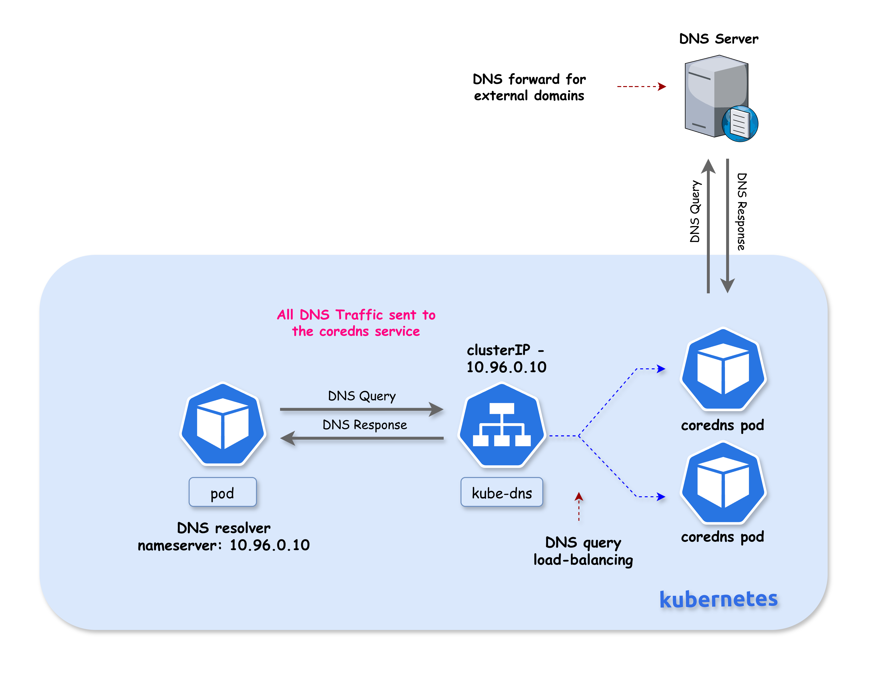
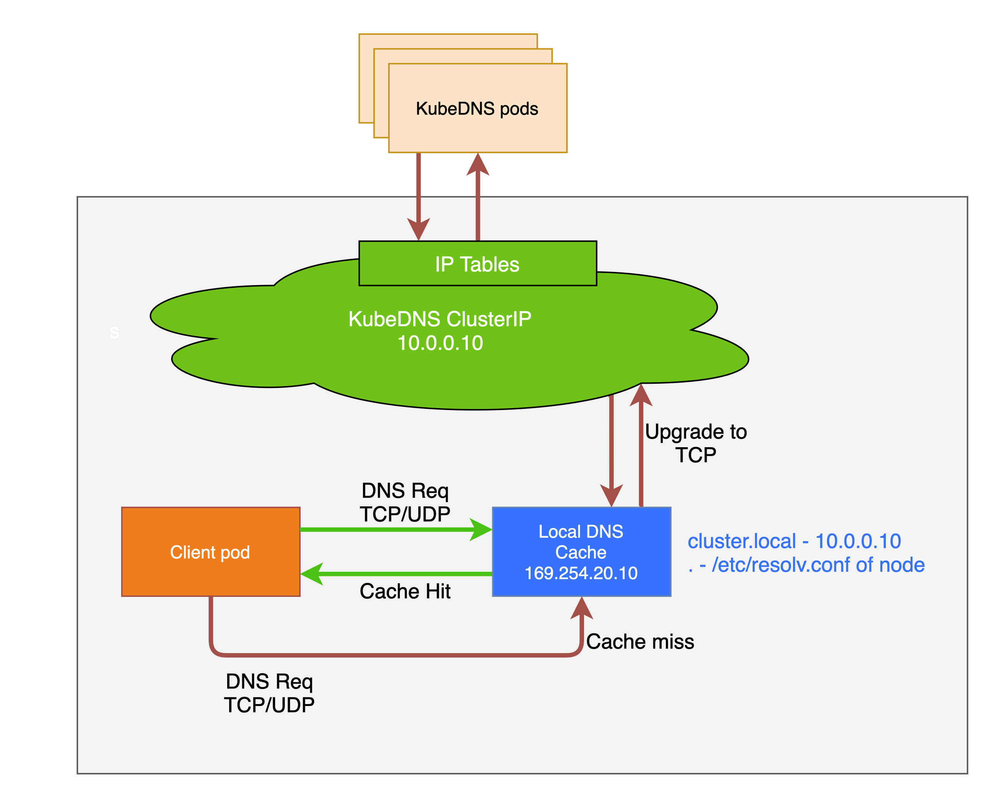
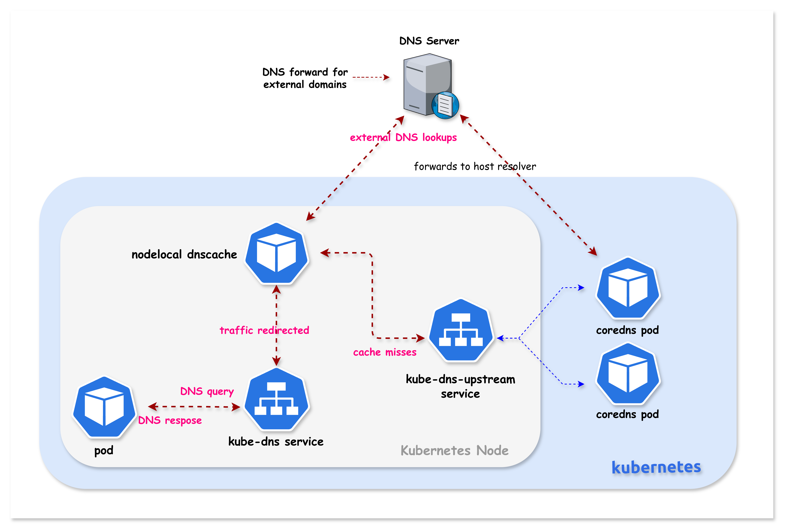
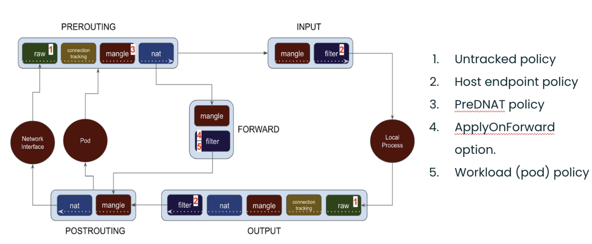

# NodeLocal DNSCache

This lab demonstrates how NodeLocal DNSCache improves DNS performance in Kubernetes by running a DNS caching agent on each node. You'll deploy NodeLocal DNSCache manually and learn how the transparent proxy method works.

## Why NodeLocal DNSCache?

In standard Kubernetes DNS architecture, all DNS queries from pods are sent to the CoreDNS service (kube-dns). NodeLocal DNSCache addresses several challenges with this architecture:



### Latency Improvement

With the current DNS architecture, pods with the highest DNS QPS may have to reach out to a **different node** if there is no local kube-dns instance. Having a local cache helps improve latency in such scenarios by serving responses from the same node.


### Conntrack Race Conditions

Skipping iptables DNAT and connection tracking helps **reduce conntrack races** and avoids UDP DNS entries filling up the conntrack table. This is a common cause of intermittent DNS failures in busy clusters.

### TCP Connection Handling

Connections from the local caching agent to kube-dns are upgraded to **TCP**. TCP conntrack entries are removed on connection close, in contrast with UDP entries that have to timeout (default `nf_conntrack_udp_timeout` is 30 seconds). This reduces conntrack table pressure.

### Reduced Tail Latency

Upgrading DNS queries from UDP to TCP reduces tail latency attributed to dropped UDP packets and DNS timeouts. Without NodeLocal DNSCache, timeouts can be up to **30 seconds** (3 retries + 10s timeout). Since the nodelocal cache listens for UDP DNS queries, **applications don't need to be changed**.

### Node-Level Metrics

NodeLocal DNSCache provides **metrics and visibility** into DNS requests at a node level, making it easier to debug DNS issues and monitor performance per node.

### Negative Caching

Negative caching (NXDOMAIN responses) can be enabled, reducing the number of queries to kube-dns for non-existent domains.

### Summary

| Benefit | Description |
|---------|-------------|
| **Local Cache** | DNS responses served from the same node |
| **No DNAT** | Bypasses kube-proxy's iptables DNAT rules |
| **No Conntrack** | NOTRACK rules prevent conntrack table issues |
| **TCP Upstream** | Uses TCP to CoreDNS (faster conntrack cleanup) |
| **UDP to Pods** | Pods still use UDP (no app changes needed) |
| **Per-Node Metrics** | Prometheus metrics per node |
| **Negative Caching** | NXDOMAIN responses cached locally |

> **Reference**: For more details, see the official Kubernetes documentation: [Using NodeLocal DNSCache in Kubernetes Clusters](https://kubernetes.io/docs/tasks/administer-cluster/nodelocaldns/)

> **💡 Note:** High DNS QPS usually isn't caused by "bad apps," but by concurrency, scale, retries, and startup synchronization—NodeLocal DNSCache exists because Kubernetes amplifies all of these at once.

## How NodeLocal DNSCache Works (iptables Mode)

When kube-proxy runs in **iptables mode**, NodeLocal DNSCache uses the transparent proxy method:

```
┌─────────────────────────────────────────────────────────────────────────────┐
│  Without NodeLocal DNSCache                                                  │
│                                                                              │
│  ┌─────────┐      10.96.0.10:53       ┌─────────────┐                       │
│  │   Pod   │ ────────────────────────►│   CoreDNS   │  (remote pod)         │
│  └─────────┘   (network traversal)    └─────────────┘                       │
│                                                                              │
├─────────────────────────────────────────────────────────────────────────────┤
│  With NodeLocal DNSCache (iptables mode)                                     │
│                                                                              │
│  ┌─────────┐      10.96.0.10:53       ┌──────────────────┐                  │
│  │   Pod   │ ────────────────────────►│ NodeLocal DNS    │  (same node!)    │
│  └─────────┘   (routed locally!)      │ Cache            │                  │
│                                       │                  │                  │
│                 Pod's resolv.conf     │ Binds locally:   │  cache miss      │
│                 still shows:          │ • 10.96.0.10  ◄──┼─────────────►    │
│                 nameserver 10.96.0.10 │ • 169.254.20.10  │    CoreDNS       │
│                                       └──────────────────┘                  │
└─────────────────────────────────────────────────────────────────────────────┘
```

### How Transparent Interception Works

1. **Virtual Interface Creation**: NodeLocal DNSCache creates a dummy network interface (`nodelocaldns`) on each node

2. **IP Binding**: The agent binds the kube-dns ClusterIP (`10.96.0.10`) directly to this local interface

3. **Local Routing**: When a pod sends a DNS query to `10.96.0.10`, the Linux kernel finds this IP bound to a local interface and routes it **locally**

4. **Transparent to Pods**: Pods don't need any configuration changes - they still use `10.96.0.10` as their nameserver

5. **Upstream Service**: A separate `kube-dns-upstream` service is created for cache misses



## Lab Setup

To setup the lab for this module **[Lab setup](../README.md#lab-setup)**

The lab folder is - `/containerlab/17-nodelocal-dnscache`

## Deployment

The `deploy.sh` script deploys a 3-node Kind cluster with Calico CNI. **NodeLocal DNSCache is NOT installed** - you will deploy it manually as part of this lab.

```bash
cd containerlab/17-nodelocal-dnscache
chmod +x deploy.sh
./deploy.sh
```

## Lab Exercises

> [!Note]
> <mark>The outputs in this section will be different in your lab. When running the commands given in this section, make sure you replace IP addresses, interface names, and node names as per your lab.</mark>

### 1. Verify the Lab Setup

```bash
# Set kubeconfig
export KUBECONFIG=$(pwd)/k01.kubeconfig

# Check nodes
kubectl get nodes -o wide

# Check CoreDNS pods
kubectl get pods -n kube-system -l k8s-app=kube-dns -o wide
```

##### Expected output
```
NAME                STATUS   ROLES           AGE   VERSION
k01-control-plane   Ready    control-plane   10m   v1.32.2
k01-worker          Ready    <none>          10m   v1.32.2
k01-worker2         Ready    <none>          10m   v1.32.2
```

### 2. Verify Current DNS Configuration (Before NodeLocal DNSCache)

Check the kube-dns service:

##### command
```bash
kubectl get svc kube-dns -n kube-system
```

##### Expected output
```
NAME       TYPE        CLUSTER-IP   EXTERNAL-IP   PORT(S)                  AGE
kube-dns   ClusterIP   10.96.0.10   <none>        53/UDP,53/TCP,9153/TCP   10m
```

Check how pods resolve DNS:

##### command
```bash
kubectl exec dns-test -- cat /etc/resolv.conf
```

##### Expected output
```
search default.svc.cluster.local svc.cluster.local cluster.local
nameserver 10.96.0.10
options ndots:5
```

Currently, all DNS queries go to `10.96.0.10`, which is handled by CoreDNS pods via kube-proxy.

---

## Part 2: Deploy NodeLocal DNSCache

Now you'll deploy NodeLocal DNSCache following the [official Kubernetes documentation](https://kubernetes.io/docs/tasks/administer-cluster/nodelocaldns/).

### 3. Copy the NodeLocal DNSCache Manifest

The manifest is provided in the `nodelocal-dnscache/` folder. Copy it to your working directory:

##### command
```bash
cp nodelocal-dnscache/nodelocaldns.yaml .
```

> **Note**: The original manifest can also be downloaded from:
> `https://raw.githubusercontent.com/kubernetes/kubernetes/master/cluster/addons/dns/nodelocaldns/nodelocaldns.yaml`

### 4. Set the Configuration Variables

The manifest contains placeholder variables. Some need manual replacement, others are auto-populated:

| Variable | Replaced By | Description |
|----------|-------------|-------------|
| `__PILLAR__LOCAL__DNS__` | **sed (manual)** | Local IP address for the cache (169.254.20.10) |
| `__PILLAR__DNS__DOMAIN__` | **sed (manual)** | Cluster DNS domain (`cluster.local`) |
| `__PILLAR__DNS__SERVER__` | **sed (manual)** | kube-dns ClusterIP (10.96.0.10) |
| `__PILLAR__CLUSTER__DNS__` | **Pod (auto)** | Upstream DNS for cluster.local queries |
| `__PILLAR__UPSTREAM__SERVERS__` | **Pod (auto)** | Upstream DNS for external queries |

##### command
```bash
# Get the kube-dns ClusterIP
kubedns=$(kubectl get svc kube-dns -n kube-system -o jsonpath={.spec.clusterIP})
echo "kube-dns ClusterIP: $kubedns"

# Set the cluster domain
domain="cluster.local"

# Set the local DNS IP (link-local address)
localdns="169.254.20.10"
```

### 5. Configure the Manifest for iptables Mode

Since Kind uses kube-proxy in **iptables mode**, we configure NodeLocal DNSCache to bind both the link-local IP AND the kube-dns ClusterIP:

##### command
```bash
sed -i "s/__PILLAR__LOCAL__DNS__/$localdns/g; s/__PILLAR__DNS__DOMAIN__/$domain/g; s/__PILLAR__DNS__SERVER__/$kubedns/g" nodelocaldns.yaml
```

##### Explanation

According to the [Kubernetes documentation](https://kubernetes.io/docs/tasks/administer-cluster/nodelocaldns/):

> In iptables mode, the `node-local-dns` pods listen on both the kube-dns service IP as well as `<node-local-address>`, so pods can look up DNS records using either IP address.

**Auto-populated variables**: The `__PILLAR__CLUSTER__DNS__` and `__PILLAR__UPSTREAM__SERVERS__` placeholders are **automatically populated by the node-local-dns pods** at startup. You do NOT need to replace these manually - they will remain as placeholders in the YAML file and the pod will substitute them when it starts.

### Understanding the Cache Configuration

Before deploying, let's examine the cache settings in the Corefile:

```
cluster.local:53 {
    errors
    cache {
            success 9984 30
            denial 9984 5
    }
    ...
}
.:53 {
    errors
    cache 30
    ...
}
```

#### Cache Settings Explained

| Zone | Setting | Value | Meaning |
|------|---------|-------|---------|
| `cluster.local` | `success 9984 30` | 9984 entries, 30s TTL | Cache up to 9984 successful responses for 30 seconds |
| `cluster.local` | `denial 9984 5` | 9984 entries, 5s TTL | Cache up to 9984 NXDOMAIN responses for 5 seconds |
| `.` (external) | `cache 30` | default entries, 30s TTL | Cache external DNS responses for 30 seconds |

#### Why Different TTLs?

| Response Type | TTL | Reason |
|---------------|-----|--------|
| **Success (30s)** | Longer | Stable responses can be cached longer |
| **Denial/NXDOMAIN (5s)** | Shorter | Failed lookups might succeed soon (new service created) |

#### Cache Size (9984 entries)

- Each cache can hold up to **9984 entries**
- Default CoreDNS cache uses ~30MB when full
- Separate limits for `success` and `denial` responses

#### Memory Impact

From the [Kubernetes documentation](https://kubernetes.io/docs/tasks/administer-cluster/nodelocaldns/):

> The default cache size is 10000 entries, which uses about 30 MB when completely filled.

If you need to reduce memory usage, you can lower the cache size:

```
cache {
    success 1000 30    # Reduce to 1000 entries
    denial 1000 5
}
```

### Understanding DNS Forwarding (Cluster vs External)

NodeLocal DNSCache handles cluster and external DNS queries differently. You can see this in the pod logs:

```
[INFO] Using config file:
cluster.local:53 {
    ...
    forward . 10.96.248.93 {        # <-- kube-dns-upstream (CoreDNS)
            force_tcp
    }
}
.:53 {
    ...
    forward . /etc/resolv.conf      # <-- Node's DNS servers
}
```

#### Forwarding Rules

| Zone | Forward To | Protocol | Description |
|------|------------|----------|-------------|
| `cluster.local` | `kube-dns-upstream` (10.96.x.x) | **TCP** | Cluster services → CoreDNS |
| `in-addr.arpa` | `kube-dns-upstream` | **TCP** | Reverse DNS for cluster IPs |
| `ip6.arpa` | `kube-dns-upstream` | **TCP** | Reverse DNS for IPv6 |
| `.` (external) | `/etc/resolv.conf` | UDP/TCP | External domains → Node's DNS |

#### Why TCP for Cluster Queries?

Cluster queries use `force_tcp` because:
- **TCP conntrack entries are removed on connection close**
- UDP entries must timeout (default 30 seconds)
- Reduces conntrack table pressure

#### External DNS Flow

```
┌─────────────────────────────────────────────────────────────────────────────┐
│  External DNS Query (e.g., google.com)                                       │
├─────────────────────────────────────────────────────────────────────────────┤
│                                                                              │
│  Pod ──► NodeLocal DNSCache ──► /etc/resolv.conf ──► External DNS Server    │
│          (169.254.20.10)        (Node's DNS)         (e.g., 8.8.8.8)        │
│                                                                              │
│  The node's /etc/resolv.conf typically contains:                            │
│  - Cloud provider DNS (AWS: 169.254.169.253, GCP: 169.254.169.254)          │
│  - Or custom upstream DNS servers                                           │
│                                                                              │
└─────────────────────────────────────────────────────────────────────────────┘
```

#### Cluster DNS Flow

```
┌─────────────────────────────────────────────────────────────────────────────┐
│  Cluster DNS Query (e.g., kubernetes.default.svc.cluster.local)             │
├─────────────────────────────────────────────────────────────────────────────┤
│                                                                              │
│  Pod ──► NodeLocal DNSCache ──► kube-dns-upstream ──► CoreDNS Pods          │
│          (10.96.0.10)           (TCP, force_tcp)      (192.168.x.x)         │
│                                                                              │
│  Cache miss queries are upgraded to TCP for better conntrack handling        │
│                                                                              │
└─────────────────────────────────────────────────────────────────────────────┘
```



### 6. Deploy NodeLocal DNSCache

##### command
```bash
kubectl create -f nodelocaldns.yaml
```

##### Expected output
```
serviceaccount/node-local-dns created
service/kube-dns-upstream created
configmap/node-local-dns created
daemonset.apps/node-local-dns created
```

### 7. Wait for NodeLocal DNSCache Pods to be Ready

##### command
```bash
kubectl get pods -n kube-system -l k8s-app=node-local-dns -o wide -w
```

Wait until all pods show `Running` status (press Ctrl+C to exit watch):

##### Expected output
```
NAME                   READY   STATUS    RESTARTS   AGE   IP            NODE
node-local-dns-xxxxx   1/1     Running   0          30s   192.168.1.2   k01-control-plane
node-local-dns-xxxxx   1/1     Running   0          30s   192.168.1.3   k01-worker
node-local-dns-xxxxx   1/1     Running   0          30s   192.168.1.4   k01-worker2
```

A NodeLocal DNSCache pod runs on **every node** in the cluster.

---

## Part 3: Verify NodeLocal DNSCache

### 8. Verify the kube-dns-upstream Service

NodeLocal DNSCache creates a new service for reaching CoreDNS on cache misses:

##### command
```bash
kubectl get svc -n kube-system | grep dns
```

##### Expected output
```
kube-dns            ClusterIP   10.96.0.10    <none>        53/UDP,53/TCP,9153/TCP   15m
kube-dns-upstream   ClusterIP   10.96.x.x     <none>        53/UDP,53/TCP            2m
```

| Service | Purpose |
|---------|---------|
| `kube-dns` | Original DNS service (ClusterIP now bound locally on each node) |
| `kube-dns-upstream` | Used by NodeLocal DNSCache to reach CoreDNS for cache misses |

### 9. Verify the Local Interface Binding

This is the key to transparent interception - check that the kube-dns ClusterIP is bound to a local interface.

First, identify which node the dns-test pod is running on (we'll use this node for all verification):

##### command
```bash
# Find which node the dns-test pod is on
NODE=$(kubectl get pod dns-test -o jsonpath='{.spec.nodeName}')
echo "dns-test pod is running on node: $NODE"

# Check the nodelocaldns interface on that node
docker exec $NODE ip addr show nodelocaldns
```

##### Expected output
```
X: nodelocaldns: <BROADCAST,NOARP> mtu 1500 qdisc noop state DOWN group default 
    link/ether 00:00:00:00:00:00 brd ff:ff:ff:ff:ff:ff
    inet 169.254.20.10/32 scope global nodelocaldns
       valid_lft forever preferred_lft forever
    inet 10.96.0.10/32 scope global nodelocaldns
       valid_lft forever preferred_lft forever
```

##### Explanation

**This is the magic!** The `nodelocaldns` interface has **both IPs bound**:
- `169.254.20.10/32` - Link-local IP 
- `10.96.0.10/32` - **The kube-dns ClusterIP!**

When a pod queries `10.96.0.10`, the kernel finds this IP on a local interface and routes it locally to NodeLocal DNSCache.

### 10. Verify Pod DNS Still Works (Transparently!)

##### command
```bash
kubectl exec dns-test -- cat /etc/resolv.conf
```

##### Expected output
```
search default.svc.cluster.local svc.cluster.local cluster.local
nameserver 10.96.0.10
options ndots:5
```

The pod configuration is **unchanged** - it still uses `10.96.0.10`. The difference is that queries are now handled locally!

##### command
```bash
kubectl exec dns-test -- nslookup kubernetes.default
```

##### Expected output
```
Server:         10.96.0.10
Address:        10.96.0.10#53

Name:   kubernetes.default.svc.cluster.local
Address: 10.96.0.1
```

---

## Part 4: Understanding the Packet Flow (Order of Operations)

This section explains exactly how DNS queries are intercepted by NodeLocal DNSCache. Understanding this flow is critical to understanding how NodeLocal DNSCache works.

### The Order of Operations

When a pod sends a DNS query to the kube-dns ClusterIP, here's what happens:

```
┌─────────────────────────────────────────────────────────────────────────────┐
│                    DNS Query - Order of Operations                           │
├─────────────────────────────────────────────────────────────────────────────┤
│                                                                              │
│  Step 1: PACKET INGRESS                                                     │
│  ─────────────────────                                                      │
│  Pod sends DNS query to kube-dns ClusterIP (10.96.0.10:53)                  │
│  Packet enters the node's network namespace via veth pair                   │
│                         │                                                    │
│                         ▼                                                    │
│  Step 2: RAW TABLE (FIRST!)                                                 │
│  ─────────────────────────                                                  │
│  The packet hits the raw table PREROUTING chain first                       │
│  NodeLocal DNSCache's NOTRACK rule matches → packet marked as UNTRACKED     │
│                         │                                                    │
│                         ▼                                                    │
│  Step 3: NAT TABLE (SKIPPED!)                                               │
│  ───────────────────────────                                                │
│  Packet reaches nat PREROUTING where kube-proxy's DNAT rules exist          │
│  BUT: DNAT requires conntrack to track translations                         │
│  Since packet is UNTRACKED, DNAT cannot operate → destination unchanged     │
│                         │                                                    │
│                         ▼                                                    │
│  Step 4: ROUTING DECISION                                                   │
│  ────────────────────────                                                   │
│  Kernel checks: "Where is 10.96.0.10?"                                      │
│  NodeLocal DNSCache bound 10.96.0.10 to local nodelocaldns interface        │
│  Kernel determines: "This is a LOCAL destination"                           │
│                         │                                                    │
│                         ▼                                                    │
│  Step 5: LOCAL DELIVERY                                                     │
│  ──────────────────────                                                     │
│  Packet goes through filter INPUT chain (ACCEPT rules match)                │
│  Packet delivered to NodeLocal DNSCache listening on 10.96.0.10:53          │
│                         │                                                    │
│            ┌────────────┴────────────┐                                      │
│            ▼                         ▼                                       │
│     Cache HIT               Cache MISS                                      │
│     Return response         Forward to kube-dns-upstream                    │
│     immediately             → CoreDNS pods                                  │
│                                                                              │
└─────────────────────────────────────────────────────────────────────────────┘
```


The diagram below is a good way to visualize packets traversing through the different iptables chains in the Linux kernel:



*Image source: [Understanding the policy enforcement options with Calico](https://www.tigera.io/blog/understanding-the-policy-enforcement-options-with-calico/)*

### 11. Validate Step 2: raw Table NOTRACK Rules

The `raw` table is processed **first** before any other table. NodeLocal DNSCache adds NOTRACK rules here:

##### command
```bash
docker exec $NODE iptables -t raw -S | grep -E "169.254.20.10|10.96.0.10"
```

##### Expected output
```
-A PREROUTING -d 169.254.20.10/32 -p udp -m udp --dport 53 -j NOTRACK
-A PREROUTING -d 169.254.20.10/32 -p tcp -m tcp --dport 53 -j NOTRACK
-A PREROUTING -d 10.96.0.10/32 -p udp -m udp --dport 53 -j NOTRACK
-A PREROUTING -d 10.96.0.10/32 -p tcp -m tcp --dport 53 -j NOTRACK
-A OUTPUT -d 169.254.20.10/32 -p udp -m udp --dport 53 -j NOTRACK
-A OUTPUT -d 169.254.20.10/32 -p tcp -m tcp --dport 53 -j NOTRACK
-A OUTPUT -d 10.96.0.10/32 -p udp -m udp --dport 53 -j NOTRACK
-A OUTPUT -d 10.96.0.10/32 -p tcp -m tcp --dport 53 -j NOTRACK
```

##### Why NOTRACK is Critical

| Effect | Explanation |
|--------|-------------|
| **Marks packet as UNTRACKED** | Conntrack subsystem ignores this packet |
| **DNAT cannot operate** | NAT targets require conntrack to track translations |
| **Destination stays unchanged** | Packet keeps original destination (10.96.0.10) |
| **Prevents conntrack races** | Eliminates UDP DNS failures from conntrack table races |

### 12. Validate Step 3: Kube-proxy DNAT Rules Still Exist

Kube-proxy's DNAT rules for kube-dns are still present, but they won't affect UNTRACKED packets:

##### command
```bash
docker exec $NODE iptables -t nat -S | grep "kube-dns:dns cluster IP" | head -2
```

##### Expected output
```
-A KUBE-SERVICES -d 10.96.0.10/32 -p udp -m comment --comment "kube-system/kube-dns:dns cluster IP" -m udp --dport 53 -j KUBE-SVC-TCOU7JCQXEZGVUNU
-A KUBE-SERVICES -d 10.96.0.10/32 -p tcp -m comment --comment "kube-system/kube-dns:dns-tcp cluster IP" -m tcp --dport 53 -j KUBE-SVC-ERIFXISQEP7F7OF4
```

##### Explanation

These DNAT rules would normally redirect traffic from `10.96.0.10` to CoreDNS pod IPs. However, because the DNS packets are marked UNTRACKED in the raw table, the DNAT target cannot function (it requires conntrack to track the address translation). The packet passes through with its destination unchanged.

### 13. Validate Step 4: Local Route for kube-dns IP

Verify that the kube-dns ClusterIP is bound to the local `nodelocaldns` interface:

##### command
```bash
docker exec $NODE ip addr show nodelocaldns
```

##### Expected output
```
X: nodelocaldns: <BROADCAST,NOARP> mtu 1500 qdisc noop state DOWN group default 
    link/ether 00:00:00:00:00:00 brd ff:ff:ff:ff:ff:ff
    inet 169.254.20.10/32 scope global nodelocaldns
       valid_lft forever preferred_lft forever
    inet 10.96.0.10/32 scope global nodelocaldns
       valid_lft forever preferred_lft forever
```

Verify the kernel considers this IP local:

##### command
```bash
docker exec $NODE ip route get 10.96.0.10
```

##### Expected output
```
local 10.96.0.10 dev lo src 10.96.0.10 uid 0
    cache <local>
```

The `local` keyword confirms the kernel routes packets destined for `10.96.0.10` to the local host.

### 14. Validate Step 5: Filter INPUT Rules

The filter table INPUT chain allows DNS traffic to the local cache:

##### command
```bash
docker exec $NODE iptables -S INPUT | grep -E "169.254.20.10|10.96.0.10"
```

##### Expected output
```
-A INPUT -d 169.254.20.10/32 -p udp -m udp --dport 53 -j ACCEPT
-A INPUT -d 169.254.20.10/32 -p tcp -m tcp --dport 53 -j ACCEPT
-A INPUT -d 10.96.0.10/32 -p udp -m udp --dport 53 -j ACCEPT
-A INPUT -d 10.96.0.10/32 -p tcp -m tcp --dport 53 -j ACCEPT
```

These ACCEPT rules ensure DNS traffic reaches the NodeLocal DNSCache process.

---

## Part 5: Verify the Complete Flow

### 15. Test DNS Resolution

##### command
```bash
kubectl exec dns-test -- nslookup kubernetes.default
```

##### Expected output
```
Server:         10.96.0.10
Address:        10.96.0.10#53

Name:   kubernetes.default.svc.cluster.local
Address: 10.96.0.1
```

The pod queries `10.96.0.10`, which is now handled locally by NodeLocal DNSCache!

### 17. Verify Cache Metrics

Check the cache statistics to confirm NodeLocal DNSCache is working.

First, identify which node the dns-test pod is running on, then find the node-local-dns pod on the **same node**:

##### command
```bash
# Find which node the dns-test pod is on
TEST_NODE=$(kubectl get pod dns-test -o jsonpath='{.spec.nodeName}')
echo "dns-test pod is running on: $TEST_NODE"

# Find the node-local-dns pod on the SAME node
NODELOCAL_POD=$(kubectl get pods -n kube-system -l k8s-app=node-local-dns --field-selector spec.nodeName=$TEST_NODE -o jsonpath='{.items[0].metadata.name}')
echo "node-local-dns pod on same node: $NODELOCAL_POD"

# Set up port-forwarding to that specific pod
kubectl port-forward -n kube-system $NODELOCAL_POD 9253:9253 &
sleep 2
```

##### View All Cache Metrics

##### command
```bash
curl -s http://127.0.0.1:9253/metrics | grep -E "coredns_cache_(hits|misses|requests).*10.96.0.10.*cluster.local"
```

##### Expected output
```
coredns_cache_hits_total{server="dns://10.96.0.10:53",type="denial",view="",zones="cluster.local."} 12
coredns_cache_hits_total{server="dns://10.96.0.10:53",type="success",view="",zones="cluster.local."} 9
coredns_cache_misses_total{server="dns://10.96.0.10:53",view="",zones="cluster.local."} 35
coredns_cache_requests_total{server="dns://10.96.0.10:53",view="",zones="cluster.local."} 56
```

Seeing requests to `10.96.0.10:53` confirms the transparent interception is working!

### 18. Test Cache Hits in Action

To see cache hits increasing, make repeated DNS queries:

##### command
```bash
# Check current cache hits
curl -s http://127.0.0.1:9253/metrics | grep "coredns_cache_hits_total.*success.*cluster.local"

# Make a DNS query
kubectl exec dns-test -- nslookup kubernetes.default

# Check cache hits again - should increase if it was a cache hit!
curl -s http://127.0.0.1:9253/metrics | grep "coredns_cache_hits_total.*success.*cluster.local"
```
The more you query the same domain, the more cache hits you'll see!

### 19. View Current Cache Entries

See how many DNS responses are currently cached:

##### command
```bash
curl -s http://127.0.0.1:9253/metrics | grep "coredns_cache_entries.*10.96.0.10"
```

##### Expected output
```
coredns_cache_entries{server="dns://10.96.0.10:53",type="denial",view="",zones="cluster.local."} 3
coredns_cache_entries{server="dns://10.96.0.10:53",type="success",view="",zones="cluster.local."} 1
```


Stop port-forward when done:
```bash
kill %1
```

> **Note**: CoreDNS does not expose individual cached domain names - only aggregate statistics.

---

## Part 6: Enable DNS Query Logging

You can enable logging in NodeLocal DNSCache to see individual DNS queries. This is useful for debugging but should be disabled in production due to log volume.

### 20. Enable Logging in the ConfigMap

Edit the node-local-dns ConfigMap to add the `log` directive:

##### command
```bash
kubectl edit configmap node-local-dns -n kube-system
```

Add `log` after each zone declaration in the Corefile:

```yaml
apiVersion: v1
data:
  Corefile: |
    cluster.local:53 {
        log                    # <-- Add this line
        errors
        cache {
            success 9984 30
            denial 9984 5
        }
        reload
        loop
        bind 169.254.20.10 10.96.0.10
        forward . __PILLAR__CLUSTER__DNS__ {
            force_tcp
        }
        prometheus :9253
        health 169.254.20.10:8080
    }
    in-addr.arpa:53 {
        log                    # <-- Add this line
        errors
        cache 30
        reload
        loop
        bind 169.254.20.10 10.96.0.10
        forward . __PILLAR__CLUSTER__DNS__ {
            force_tcp
        }
        prometheus :9253
    }
    ip6.arpa:53 {
        log                    # <-- Add this line
        errors
        cache 30
        reload
        loop
        bind 169.254.20.10 10.96.0.10
        forward . __PILLAR__CLUSTER__DNS__ {
            force_tcp
        }
        prometheus :9253
    }
    .:53 {
        log                    # <-- Add this line
        errors
        cache 30
        reload
        loop
        bind 169.254.20.10 10.96.0.10
        forward . __PILLAR__UPSTREAM__SERVERS__ {
            force_tcp
        }
        prometheus :9253
    }
```

Save and exit the editor (`:wq` in vim).

### 21. Restart NodeLocal DNS Pods

The pods need to be restarted to pick up the ConfigMap changes:

##### command
```bash
kubectl rollout restart daemonset node-local-dns -n kube-system
kubectl rollout status daemonset node-local-dns -n kube-system
```

### 22. View DNS Query Logs

Now make some DNS queries and watch the logs:

##### command
```bash
# Get the node-local-dns pod on the same node as dns-test
TEST_NODE=$(kubectl get pod dns-test -o jsonpath='{.spec.nodeName}')
NODELOCAL_POD=$(kubectl get pods -n kube-system -l k8s-app=node-local-dns --field-selector spec.nodeName=$TEST_NODE -o jsonpath='{.items[0].metadata.name}')

# Watch the logs
kubectl logs -n kube-system $NODELOCAL_POD -f &

# Make a DNS query
kubectl exec dns-test -- nslookup kubernetes.default
kubectl exec dns-test -- nslookup google.com
```

##### Expected log output
```
[INFO] 192.168.82.65:54312 - 42953 "A IN kubernetes.default.svc.cluster.local. udp 54 false 512" NOERROR qr,aa,rd 106 0.000232824s
[INFO] 192.168.82.65:38291 - 18276 "A IN google.com. udp 28 false 512" NOERROR qr,rd,ra 54 0.023451s
```

##### Understanding the Log Format

| Field | Example | Meaning |
|-------|---------|---------|
| Client IP | `192.168.82.65:54312` | Pod IP and source port |
| Query ID | `42953` | DNS query identifier |
| Query | `A IN kubernetes.default...` | Record type and domain |
| Protocol | `udp 54` | UDP, 54 bytes |
| Response | `NOERROR` | Successful resolution |
| Duration | `0.000232824s` | Time to resolve |

Stop watching logs:
```bash
kill %1
```

### 23. Disable Logging (Recommended for Production)

To disable logging, edit the ConfigMap and remove the `log` lines:

##### command
```bash
kubectl edit configmap node-local-dns -n kube-system
```

Remove all `log` lines from the Corefile, then restart the pods:

```bash
kubectl rollout restart daemonset node-local-dns -n kube-system
```

> **Warning**: Keep logging disabled in production - it generates significant log volume and can impact performance.

---

## Summary

### Order of Operations Recap

| Step | What Happens | Validation Command |
|------|--------------|-------------------|
| 1. Packet Ingress | Pod sends DNS to 10.96.0.10:53 | `kubectl exec dns-test -- nslookup kubernetes` |
| 2. raw Table | NOTRACK marks packet as untracked | `iptables -t raw -S \| grep 10.96.0.10` |
| 3. nat Table | DNAT skipped (requires conntrack) | `iptables -t nat -S \| grep kube-dns` |
| 4. Routing | Kernel sees 10.96.0.10 is local | `ip route get 10.96.0.10` |
| 5. Delivery | Packet delivered to local cache | `ip addr show nodelocaldns` |

### What You Learned

In this lab, you:

1. **Deployed NodeLocal DNSCache** manually following the official Kubernetes documentation
2. **Verified the transparent proxy** - pods use `10.96.0.10` with no configuration changes
3. **Understood the packet flow** - how NOTRACK + local IP binding intercepts DNS
4. **Explored iptables rules** - raw table NOTRACK and filter table ACCEPT rules

### Key Takeaways

| Concept | Explanation |
|---------|-------------|
| **raw table NOTRACK** | Marks DNS packets as untracked, preventing DNAT from operating |
| **Local IP binding** | kube-dns ClusterIP bound to nodelocaldns interface |
| **Routing decision** | Kernel routes to local interface instead of network |
| **Transparent to pods** | No pod configuration changes needed |
| **kube-dns-upstream** | Service for cache misses to reach CoreDNS |

### Why NOTRACK is Essential

Without NOTRACK, kube-proxy's DNAT rules would redirect DNS queries to CoreDNS pods. The NOTRACK target in the raw table:

1. **Runs first** - raw table is processed before nat table
2. **Disables conntrack** - packet marked as untracked
3. **Breaks DNAT** - NAT targets require conntrack to function
4. **Preserves destination** - packet keeps original destination (10.96.0.10)

This allows the routing decision to see `10.96.0.10` (bound locally) rather than a CoreDNS pod IP.

### iptables Mode vs IPVS Mode

| Aspect | iptables Mode (this lab) | IPVS Mode |
|--------|--------------------------|-----------|
| **Local binding** | Both `169.254.20.10` AND `10.96.0.10` | Only `169.254.20.10` |
| **Pod configuration** | No changes needed | Must use `--cluster-dns=169.254.20.10` |
| **Why** | Can bind kube-dns IP locally | IPVS already uses kube-dns IP for load balancing |

## Lab Cleanup

To cleanup the lab follow steps in **[Lab cleanup](../README.md#lab-cleanup)**

Or run:
```bash
chmod +x destroy.sh
./destroy.sh
```
