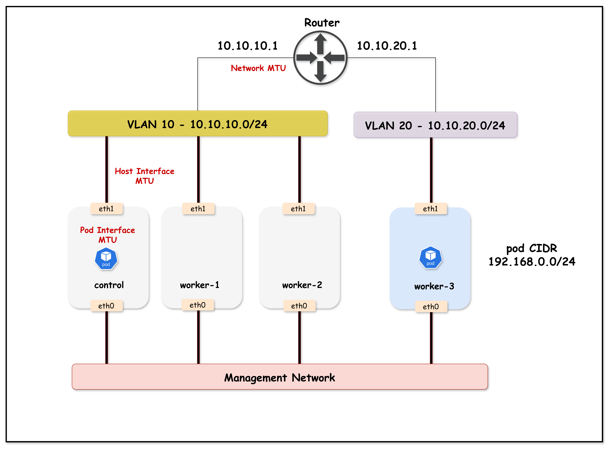

# MTU Configuration in Kubernetes with Calico

This lab demonstrates two critical MTU configuration concepts:

1. **Calico Pod Interface MTU**: How Calico's default MTU (1450) affects pod communication and how to configure it properly
2. **Network Infrastructure MTU**: How VLAN interface MTU affects cross-subnet Kubernetes communication

## What is MTU?

**MTU (Maximum Transmission Unit)** is the largest packet size that can be transmitted over a network. When a packet exceeds the MTU, it must be fragmented or dropped.

| Network Type | Common MTU | Description |
|--------------|------------|-------------|
| Standard Ethernet | 1500 bytes | Default for most networks |
| Jumbo Frames | 9000 bytes | Used in data centers for performance |
| VXLAN Overlay | 1450 bytes | 1500 - 50 bytes VXLAN overhead |
### MTU Anatomy Explained

The MTU affects the *entire packet*, which consists of several layered protocol headers and the actual payload:

```
┌─────────────────────────────────────────────────────────────────────────────┐
│                            Ethernet Frame                                   │
├──────────────┬──────────────┬──────────────────────┬───────────────────────┤
│   Ethernet   │     IP       │   TCP/UDP Header     │       Payload         │
│    Header    │   Header     │                      │       (Data)          │
│   14 bytes   │  20 bytes    │  20 bytes (TCP)      │      Variable         │
│              │              │   8 bytes (UDP)      │                       │
└──────────────┴──────────────┴──────────────────────┴───────────────────────┘
               │◄────────────────── MTU (e.g., 1500 bytes) ─────────────────►│
                                                     │◄─── MSS (Payload) ───►│
```

**Key Terms:**
- **MTU (Maximum Transmission Unit)**: Maximum IP packet size (IP Header + TCP/UDP Header + Payload) - excludes Ethernet header
- **MSS (Maximum Segment Size)**: Maximum payload size in a TCP segment (`MTU - 20 bytes IP - 20 bytes TCP = MSS`)

**Example with 1500 MTU:**
- MTU = 1500 bytes
- MSS = 1500 - 20 (IP) - 20 (TCP) = **1460 bytes**

**Example with 9000 MTU (Jumbo Frames):**
- MTU = 9000 bytes
- MSS = 9000 - 20 (IP) - 20 (TCP) = **8960 bytes**
>

## Lab Topology




**Lab Topology Overview:**
- Arista cEOS switch acting as the core switch, with VLAN 10 and 20 SVIs configured with jumbo (9000) and standard (1500) MTU for demonstration
- Kind Kubernetes cluster with 4 nodes:
  - `k01-control-plane`, `k01-worker`, and `k01-worker2`  in VLAN 10
  - `k01-worker3` in VLAN 20
- Calico CNI provides pod networking, initially with default MTU (1450) due to VXLAN overlays
- Netshoot pods (`netshoot-client`/`netshoot-server`) allow MTU and connectivity testing between nodes/VLANs

This lab setup helps visualize MTU mismatch issues between container network interfaces (Calico CNI) and the underlying physical/VLAN interfaces, demonstrating how improper MTU configuration can break Kubernetes networking for large packets (such as those used in TLS handshakes).


## Lab Setup

To setup the lab for this module **[Lab setup](../README.md#lab-setup)**
The lab folder is - `/containerlab/18-mtu`

## Deployment

```bash
cd containerlab/18-mtu
chmod +x deploy.sh
./deploy.sh
```

The script deploys:
- An Arista cEOS switch with 9000 byte MTU on VLAN interfaces
- A 4-node Kind cluster (nodes in two subnets/VLANs)
- Calico CNI with **default MTU** (1450 - not explicitly configured)
- Two netshoot pods for testing (client on worker, server on worker3)

## Lab Exercises

> [!Note]
> <mark>The outputs in this section will be different in your lab. When running the commands given in this section, make sure you replace IP addresses, interface names, and node names as per your lab.</mark>

---

## Part 1: Calico Pod Interface MTU

This section demonstrates how Calico's default MTU affects pod communication.

### 1.1 Verify Lab Setup

Set the kubeconfig and verify the cluster:

##### command
```bash
export KUBECONFIG=$(pwd)/mtu-lab.kubeconfig
kubectl get nodes -o wide
```

##### expected output
```
NAME                STATUS   ROLES           AGE   VERSION   INTERNAL-IP
k01-control-plane   Ready    control-plane   5m    v1.32.2   10.10.10.10
k01-worker          Ready    <none>          5m    v1.32.2   10.10.10.11
k01-worker2         Ready    <none>          5m    v1.32.2   10.10.10.12
k01-worker3         Ready    <none>          5m    v1.32.2   10.10.20.20
```

##### command
```bash
kubectl get pods -o wide
```

##### expected output
```
NAME              READY   STATUS    RESTARTS   AGE   IP              NODE
netshoot-client   1/1     Running   0          2m    192.168.x.x     k01-worker
netshoot-server   1/1     Running   0          2m    192.168.x.x     k01-worker3
```

### 1.2 Check Calico's Default Pod Interface MTU

Calico creates a veth pair for each pod. Let's check the MTU on the pod's interface:

##### command
```bash
kubectl exec netshoot-client -- ip link show eth0
```

##### expected output
```
3: eth0@if7: <BROADCAST,MULTICAST,UP,LOWER_UP> mtu 1450 qdisc noqueue state UP mode DEFAULT group default qlen 1000
    link/ether 3a:45:67:89:ab:cd brd ff:ff:ff:ff:ff:ff link-netnsid 0
```

**Key Observation:** The pod interface MTU is **1450 bytes** - this is Calico's default when no MTU is explicitly configured in the Installation resource.

### 1.3 Verify Host Interface MTU

The host interfaces are configured with jumbo frames (9000 bytes):

##### command
```bash
docker exec k01-worker ip link show eth1 | grep mtu
```

##### expected output
```
eth1@if...: <BROADCAST,MULTICAST,UP,LOWER_UP> mtu 9000 ...
```

### 1.4 Test Basic Ping (Small Packets)

First, get the server pod IP and store it in a variable:

##### command
```bash
SERVER_IP=$(kubectl get pod netshoot-server -o jsonpath='{.status.podIP}')
echo $SERVER_IP
```

Now test a regular ping (56 bytes data + 8 bytes ICMP header = 64 bytes total):

##### command
```bash
kubectl exec netshoot-client -- ping -c 3 $SERVER_IP
```

##### expected output
```
PING 192.168.x.x (192.168.x.x) 56(84) bytes of data.
64 bytes from 192.168.x.x: icmp_seq=1 ttl=62 time=0.543 ms
64 bytes from 192.168.x.x: icmp_seq=2 ttl=62 time=0.321 ms
64 bytes from 192.168.x.x: icmp_seq=3 ttl=62 time=0.298 ms
```

**Small packets work fine!**

### 1.5 Test Large Ping (Exceeds Pod MTU)

Now let's send a large ping that exceeds the pod interface MTU of 1450. We'll use 8900 bytes with the Don't Fragment flag (`-M do`):

##### command
```bash
kubectl exec netshoot-client -- ping -c 3 -s 8900 -M do $SERVER_IP
```

**Flags explained:**
- `-c 3`: Send 3 ping packets
- `-s 8900`: Set ICMP data payload size to 8900 bytes
- `-M do`: Set Don't Fragment (DF) bit - packet cannot be fragmented if it exceeds MTU

##### expected output
```
PING 192.168.x.x (192.168.x.x) 8900(8928) bytes of data.
ping: local error: message too long, mtu=1450
ping: local error: message too long, mtu=1450
ping: local error: message too long, mtu=1450
```

**The ping fails!** The error `message too long, mtu=1450` clearly shows that the pod interface MTU (1450) is preventing large packets from being sent.

### 1.6 Understanding the Problem

```
┌─────────────────────────────────────────────────────────────────────────────┐
│                     POD INTERFACE MTU LIMITATION                             │
├─────────────────────────────────────────────────────────────────────────────┤
│                                                                              │
│  You want to send: 8900 bytes                                               │
│                                                                              │
│  ┌──────────────────┐                                                       │
│  │  netshoot-client │                                                       │
│  │                  │                                                       │
│  │  eth0 MTU: 1450  │ ◄── Calico default, not configured!                   │
│  └────────┬─────────┘                                                       │
│           │                                                                  │
│           │  8900 bytes > 1450 MTU                                          │
│           │                                                                  │
│           ▼                                                                  │
│     ❌ BLOCKED!                                                             │
│     "message too long, mtu=1450"                                            │
│                                                                              │
│  The packet never even leaves the pod!                                      │
│                                                                              │
└─────────────────────────────────────────────────────────────────────────────┘
```

### 1.7 Fix: Configure MTU in Calico Installation Resource

To support jumbo frames, we need to configure the MTU in Calico's Installation resource. The MTU should be set to account for VXLAN overhead (50 bytes):

```
Pod MTU = Physical MTU - VXLAN Overhead
Pod MTU = 9000 - 50 = 8950
```

##### command
```bash
kubectl patch installation default --type='merge' -p '{"spec":{"calicoNetwork":{"mtu":8950}}}'
```

##### expected output
```
installation.operator.tigera.io/default patched
```

### 1.8 Restart Pods to Apply New MTU

The MTU change only applies to new pods. Delete and recreate the test pods:

##### command
```bash
kubectl delete pod netshoot-client netshoot-server
kubectl apply -f tools/01-netshoot-server.yaml
kubectl apply -f tools/02-netshoot-client.yaml
kubectl wait --for=condition=ready pod/netshoot-client pod/netshoot-server --timeout=60s
```

### 1.9 Verify New Pod Interface MTU

##### command
```bash
kubectl exec netshoot-client -- ip link show eth0
```

##### expected output
```
3: eth0@if9: <BROADCAST,MULTICAST,UP,LOWER_UP> mtu 8950 qdisc noqueue state UP mode DEFAULT group default qlen 1000
    link/ether 3a:45:67:89:ab:cd brd ff:ff:ff:ff:ff:ff link-netnsid 0
```

**The pod interface MTU is now 8950 bytes!**

### 1.10 Test Large Ping Again

Get the new server pod IP and test:

##### command
```bash
SERVER_IP=$(kubectl get pod netshoot-server -o jsonpath='{.status.podIP}')
kubectl exec netshoot-client -- ping -c 3 -s 8900 -M do $SERVER_IP
```

##### expected output
```
PING 192.168.x.x (192.168.x.x) 8900(8928) bytes of data.
8908 bytes from 192.168.x.x: icmp_seq=1 ttl=62 time=0.876 ms
8908 bytes from 192.168.x.x: icmp_seq=2 ttl=62 time=0.654 ms
8908 bytes from 192.168.x.x: icmp_seq=3 ttl=62 time=0.598 ms
```

**Large pings now work!** The proper MTU configuration allows jumbo frame communication between pods.

> **Understanding the Packet Sizes:**
> - `-s 8900` specifies the ICMP **data payload** (8900 bytes)
> - `8908 bytes` in the reply = payload (8900) + ICMP header (8 bytes)
> - `(8928)` in the first line = total IP packet = payload (8900) + ICMP header (8) + IP header (20)

### Part 1 Summary

| Scenario | Pod Interface MTU | 8900-byte Ping | Result |
|----------|-------------------|----------------|--------|
| Calico Default | 1450 | ❌ Fails | `message too long, mtu=1450` |
| MTU Configured | 8950 | ✅ Works | Packets transmitted successfully |

**Key Lesson:** During Calico installation, you **must** configure the MTU in the Installation resource to match your network infrastructure. The default 1450 MTU is designed for standard 1500-byte networks, not jumbo frames.

---

## Part 2: VLAN Interface MTU

This section demonstrates how network infrastructure MTU affects cross-subnet communication.

### 2.1 Verify Current VLAN MTU Configuration

Connect to the switch and check VLAN interface MTU:

##### command
```bash
docker exec -it clab-mtu-lab-ceos01 Cli
```

##### command
```
enable
show ip interface brief
```

##### expected output
```
Interface         IP Address           Status       Protocol           MTU
----------------- -------------------- ------------ -------------- ----------
Management0       172.20.20.x/24       up           up                1500
Vlan10            10.10.10.1/24        up           up                9000
Vlan20            10.10.20.1/24        up           up                9000
```

Both VLAN interfaces have 9000 byte MTU.

### 2.2 Test API Connectivity from Worker3

Worker3 is in VLAN 20 and must route through the switch to reach the API server in VLAN 10:

##### command
```bash
docker exec k01-worker3 curl -k --connect-timeout 10 https://10.10.10.10:6443/healthz
```

##### expected output
```
ok
```

**Cross-VLAN communication works** because VLAN MTU (9000) matches host MTU (9000).

### 2.3 Reduce VLAN 20 MTU to 1500

Now let's simulate a network misconfiguration - VLAN 20 has standard MTU while hosts use jumbo frames:

##### command
```bash
docker exec -it clab-mtu-lab-ceos01 Cli
```

##### command
```
enable
configure terminal
interface Vlan20
   mtu 1500
exit
end
```

##### Verify the change
```
show ip interface brief
```

##### expected output
```
Interface         IP Address           Status       Protocol           MTU
----------------- -------------------- ------------ -------------- ----------
Management0       172.20.20.x/24       up           up                1500
Vlan10            10.10.10.1/24        up           up                9000
Vlan20            10.10.20.1/24        up           up                1500
```

Exit the switch CLI:
```
exit
```

### 2.4 Test API Connectivity from Worker3 (FAILS!)

##### command
```bash
docker exec k01-worker3 curl -k --connect-timeout 10 https://10.10.10.10:6443/healthz
```

##### expected output
```
curl: (28) SSL connection timeout
```

**Communication fails!** The TLS handshake times out because large packets (like certificates) can't traverse the VLAN 20 SVI with 1500 MTU.

### 2.5 Compare with Worker (Same VLAN as API Server)

##### command
```bash
docker exec k01-worker curl -k --connect-timeout 10 https://10.10.10.10:6443/healthz
```

##### expected output
```
ok
```

**Same-VLAN communication still works** because traffic within VLAN 10 is L2 switched and doesn't go through the SVI.

### 2.6 Understanding the Failure

```
┌─────────────────────────────────────────────────────────────────────────────┐
│                     VLAN SVI MTU MISMATCH                                    │
├─────────────────────────────────────────────────────────────────────────────┤
│                                                                              │
│  SAME VLAN (worker → API server):                                           │
│  ┌────────────┐      L2 Switch      ┌────────────┐                          │
│  │   worker   │ ──────────────────► │    API     │                          │
│  │ VLAN 10    │    (no routing)     │   server   │                          │
│  └────────────┘                     └────────────┘                          │
│        ✅ Works - SVI MTU not involved                                      │
│                                                                              │
│  DIFFERENT VLAN (worker3 → API server):                                     │
│  ┌────────────┐    ┌─────────┐    ┌─────────┐    ┌────────────┐             │
│  │  worker3   │ ─► │ VLAN 20 │ ─► │ VLAN 10 │ ─► │    API     │             │
│  │  VLAN 20   │    │   SVI   │    │   SVI   │    │   server   │             │
│  │ MTU: 9000  │    │MTU:1500 │    │MTU:9000 │    │  VLAN 10   │             │
│  └────────────┘    └─────────┘    └─────────┘    └────────────┘             │
│        │               │                                                     │
│        │               └──► ❌ Packet dropped! (9000 > 1500)                │
│        │                                                                     │
│        └──► Sends 9000-byte packets (TLS certificate)                       │
│                                                                              │
└─────────────────────────────────────────────────────────────────────────────┘
```

### Why TLS Handshakes Fail (Don't Fragment Bit)

TLS/SSL connections are particularly vulnerable to MTU mismatches because of how TCP handles large packets:

#### 1. TCP Sets the Don't Fragment (DF) Bit

By default, TCP sets the **DF (Don't Fragment)** bit in the IP header. This means:
- Packets **cannot be fragmented** by intermediate routers/switches
- If a packet exceeds the path MTU, it is **dropped** (not fragmented)
- The sender relies on **Path MTU Discovery (PMTUD)** to learn the correct MTU

#### 2. Why TCP Uses DF by Default

| Reason | Explanation |
|--------|-------------|
| **Performance** | Fragmentation is expensive - each fragment needs separate processing |
| **Reliability** | If one fragment is lost, the entire packet must be retransmitted |
| **Reassembly overhead** | The receiver must buffer and reassemble fragments |
| **Security** | Fragmentation can be exploited for attacks |

#### 3. TLS Handshake Packet Sizes

During a TLS handshake, the server sends its certificate chain, which can be quite large:

| TLS Message | Typical Size | Exceeds 1500 MTU? |
|-------------|--------------|-------------------|
| ClientHello | 200-500 bytes | No |
| ServerHello | 100-200 bytes | No |
| **Certificate** | **2,000-10,000 bytes** | **Yes!** |
| ServerKeyExchange | 300-500 bytes | No |
| Finished | 50-100 bytes | No |

#### 4. What Happens with MTU Mismatch

```
┌─────────────────────────────────────────────────────────────────────────────┐
│                     TLS HANDSHAKE WITH MTU MISMATCH                          │
├─────────────────────────────────────────────────────────────────────────────┤
│                                                                              │
│  1. Client sends ClientHello (small packet) ────────────────► Server        │
│     ✅ Packet fits in MTU, delivered successfully                           │
│                                                                              │
│  2. Server sends ServerHello (small packet) ◄──────────────── Server        │
│     ✅ Packet fits in MTU, delivered successfully                           │
│                                                                              │
│  3. Server sends Certificate (LARGE packet ~4KB) ◄─────────── Server        │
│     │                                                                        │
│     │  TCP sets DF=1 (Don't Fragment)                                       │
│     │  Packet size: ~4000 bytes                                             │
│     │                                                                        │
│     ▼                                                                        │
│  ┌─────────────────────────────────────────┐                                │
│  │  Router/Switch with MTU 1500            │                                │
│  │                                         │                                │
│  │  4000 bytes > 1500 MTU                  │                                │
│  │  DF=1, cannot fragment                  │                                │
│  │                                         │                                │
│  │  ❌ PACKET DROPPED!                     │                                │
│  │                                         │                                │
│  │  Should send ICMP "Fragmentation        │                                │
│  │  Needed" but often blocked by firewalls │                                │
│  └─────────────────────────────────────────┘                                │
│                                                                              │
│  4. Client waits for Certificate... times out                               │
│     Result: "SSL connection timeout"                                        │
│                                                                              │
└─────────────────────────────────────────────────────────────────────────────┘
```

#### 5. Observing PMTUD in Action

In this lab, we can observe the ICMP "Fragmentation Needed" messages being sent by the switch. This requires **three terminals** running simultaneously.

##### Terminal Setup

Open three separate terminal windows/tabs:

| Terminal | Purpose |
|----------|---------|
| **Terminal 1** | tcpdump on control-plane (capture ICMP messages) |
| **Terminal 2** | Monitor session on Arista switch (optional, for switch-level capture) |
| **Terminal 3** | Initiate curl connection from worker3 |

---


##### Opening Additional Terminals

If you're running this lab on a remote EC2 instance, you can open additional terminals by SSH'ing from your local machine:

```bash
# From your local machine (in a new terminal window)
ssh -i ~/.ssh/id_rsa ubuntu@$(cat ec2_ip.txt)
```

Then navigate to the lab directory and set the kubeconfig:

```bash
cd ~/k824/container-labs/containerlab/18-mtu
export KUBECONFIG=$(pwd)/mtu-lab.kubeconfig
```

Repeat this process for each additional terminal you need (Terminal 2 and Terminal 3).

---


##### Terminal 1: Capture ICMP "Fragmentation Needed" Messages

On the control-plane node, capture ICMP Type 3 Code 4 (Destination Unreachable - Fragmentation Needed):

```bash
docker exec k01-control-plane tcpdump -i any -nn -vv 'icmp[icmptype] == 3 and icmp[icmpcode] == 4'
```

Leave this running and proceed to Terminal 2 (optional) or Terminal 3.

---

##### Terminal 2 (Optional): Monitor Traffic on Arista Switch

You can also capture traffic directly on the Arista switch using a monitor session:

```bash
docker exec -it clab-mtu-lab-ceos01 Cli
```

Configure the monitor session:
```
enable
configure terminal
monitor session sniff source Ethernet1 both
monitor session sniff destination cpu
end
```

Verify the monitor session is active:
```
show monitor session
```

Start the capture in bash:
```
bash
tcpdump -i mirror0 -n icmp or port 6443
```

Leave this running and proceed to Terminal 3.

---

##### Terminal 3: Trigger the TLS Connection

Initiate a curl request to the Kubernetes API from worker3:

```bash
docker exec k01-worker3 curl -k --connect-timeout 10 https://10.10.10.10:6443/healthz
```

This will timeout, but watch the output in Terminal 1 and Terminal 2.

---

##### Terminal 1 Expected Output

```
04:05:10.453582 eth1  In  IP (tos 0xc0, ttl 64, id 10183, offset 0, flags [none], proto ICMP (1), length 576)
    172.20.20.2 > 10.10.10.10: ICMP 10.10.20.20 unreachable - need to frag (mtu 1500), length 556
        IP (tos 0x0, ttl 63, id 34463, offset 0, flags [DF], proto TCP (6), length 1664)
    10.10.10.10.6443 > 10.10.20.20.54108: Flags [P.], seq 0:1612, ack 1, win 486, length 1612
```

**Key observations:**
- `172.20.20.2` (the switch) sends ICMP to `10.10.10.10` (control-plane)
- Message: `ICMP 10.10.20.20 unreachable - need to frag (mtu 1500)`
- The original packet was 1664 bytes with `flags [DF]` set
- The switch is telling the server "I can't forward this, my MTU is 1500"

---

##### Terminal 2 Expected Output (if using switch monitor)

```
04:01:24.249461 00:1c:73:c3:07:f5 (oui Arista Networks) > aa:c1:ab:34:7f:78, ethertype 802.1Q (0x8100), length 594: vlan 10, p 0, ethertype IPv4, ceos > 10.10.10.10: ICMP 10.10.20.20 unreachable - need to frag (mtu 1500), length 556
```

---

##### (Optional) Verify TCP Packets Have DF Bit Set

You can also verify that TCP packets have the Don't Fragment bit set:

```bash
docker exec k01-control-plane tcpdump -i eth1 host 10.10.20.20 -vv | grep -E 'DF|length'
```

This will show both the Don't Fragment flag and the packet length. Alternatively, for a cleaner output showing both in the same line:

```bash
docker exec k01-control-plane tcpdump -i eth1 host 10.10.20.20 -vv 2>/dev/null | awk '/DF/ {print; getline; if (/length/) print}'
```

Or simply remove the grep filter to see complete packet information including size:

```bash
docker exec k01-control-plane tcpdump -i eth1 host 10.10.20.20 -vv

##### expected output
```
04:05:52.951817 IP (tos 0x0, ttl 63, id 31917, offset 0, flags [DF], proto TCP (6), length 60)
04:05:52.951879 IP (tos 0x0, ttl 64, id 0, offset 0, flags [DF], proto TCP (6), length 60)
04:05:52.953156 IP (tos 0x0, ttl 63, id 31918, offset 0, flags [DF], proto TCP (6), length 52)
```

Notice `flags [DF]` - the Don't Fragment bit is set on all TCP packets.

---

##### Cleanup: Disable Monitor Session (Important!)

After capturing, disable the monitor session on the switch to avoid performance impact:

```bash
docker exec -it clab-mtu-lab-ceos01 Cli
```

```
enable
configure terminal
no monitor session sniff
end
```

Press `Ctrl+C` to stop the tcpdump processes in Terminal 1 and Terminal 2.

---

#### 6. Why PMTUD Fails: Reverse Path Filtering (RPF)

Even though the switch **IS** sending ICMP "Fragmentation Needed" messages, the TLS handshake still fails. But why?

##### The Hidden Culprit: RPF Drops the ICMP Messages

Look closely at the ICMP message source:

```
172.20.20.2 > 10.10.10.10: ICMP 10.10.20.20 unreachable - need to frag (mtu 1500)
```

The ICMP message comes from `172.20.20.2` - the **management interface** of the Arista switch, NOT from `10.10.20.20` (the original destination).

Linux has **Reverse Path Filtering (RPF)** enabled by default. RPF checks if the source IP of incoming packets would be routable back out the same interface. Since `172.20.20.2` is not reachable via `eth1` (it's on a different network), **the ICMP packet is silently dropped!**

```
┌─────────────────────────────────────────────────────────────────────────────┐
│                     Why ICMP Messages Are Dropped                           │
├─────────────────────────────────────────────────────────────────────────────┤
│                                                                             │
│   API Server (10.10.10.10) sends packet to worker3 (10.10.20.20)            │
│                                                                             │
│   Switch (VLAN 20 SVI) drops packet, sends ICMP "need to frag"              │
│   Source IP of ICMP: 172.20.20.2 (switch management IP)                     │
│                                                                             │
│   API Server receives ICMP on eth1:                                         │
│   - eth1 has route to 10.10.0.0/16                                          │
│   - 172.20.20.2 is NOT routable via eth1                                    │
│   - RPF check FAILS                                                         │
│   - ❌ ICMP packet DROPPED silently                                         │
│                                                                             │
│   Result: PMTUD never learns the correct MTU                                │
│                                                                             │
└─────────────────────────────────────────────────────────────────────────────┘
```

##### Verify RPF is Dropping Packets

Check the current RPF setting:

```bash
docker exec k01-control-plane sysctl net.ipv4.conf.all.rp_filter
```

##### expected output
```
net.ipv4.conf.all.rp_filter = 1
```

Value `1` means **strict mode** - packets are dropped if source IP isn't reachable via the incoming interface.

---

#### 7. Fix PMTUD: Disable Strict RPF

Set RPF to **loose mode** (value `2`), which only checks if the source IP is routable via ANY interface:

```bash
docker exec k01-control-plane sysctl -w net.ipv4.conf.all.rp_filter=2
```

##### expected output
```
net.ipv4.conf.all.rp_filter = 2
```

> ⚠️ **Security Warning:** Setting `rp_filter=2` (loose mode) is **NOT recommended for production environments**. Loose RPF weakens protection against IP spoofing attacks. This setting is used here only to demonstrate how PMTUD works when ICMP messages are not blocked.
>
> **The correct solution is to configure MTU values correctly across all network layers, not to weaken security settings.**

---

#### 8. Verify PMTUD Now Works

##### Terminal 1: Monitor MSS Negotiation

This terminal monitors the Maximum Segment Size (MSS) negotiation during TCP connection establishment.

**What is MSS?**
MSS (Maximum Segment Size) is a TCP option that specifies the maximum amount of data that a device can receive in a single TCP segment. It excludes TCP and IP headers, representing only the payload size.

**MSS Negotiation Process:**
- MSS is negotiated during the TCP three-way handshake (SYN, SYN-ACK, ACK)
- Each endpoint advertises its MSS value in the SYN and SYN-ACK packets
- Both sides select the smaller of the two advertised MSS values for the connection
- MSS is typically calculated as: MTU - IP header (20 bytes) - TCP header (20 bytes)
- Example: With MTU of 1500 bytes, the MSS would be 1460 bytes (1500 - 20 - 20)
- This negotiation ensures that packets don't exceed the path MTU and avoids fragmentation

```bash
docker exec k01-control-plane tcpdump -i eth1 host 10.10.20.20 -vv | grep mss
```

##### Terminal 2: Trigger Connection from worker3

```bash
docker exec k01-worker3 curl -k --connect-timeout 10 https://10.10.10.10:6443/healthz
```

##### Terminal 1 Expected Output

```
ip-10-10-20-20.ec2.internal.34458 > ip-10-10-10-10.ec2.internal.6443: Flags [S], ... options [mss 8960,...], length 0
ip-10-10-10-10.ec2.internal.6443 > ip-10-10-20-20.ec2.internal.34458: Flags [S.], ... options [mss 1460,...], length 0
```

**Key observations:**
- Client (worker3) sends SYN with `mss 8960` (based on its 9000 MTU interface)
- Server (API server) responds with `mss 1460` (adjusted based on cached PMTU!)

The server learned the correct path MTU from the ICMP message and is now advertising a smaller MSS. **The connection succeeds!**

##### Terminal 2 Expected Output

```
ok
```

##### Verify PMTU Cache in Routing Table

You can also verify the cached PMTU by checking the routing table:

```bash
docker exec k01-control-plane ip route get 10.10.20.20
```

##### expected output
```
10.10.20.20 via 10.10.10.1 dev eth1 src 10.10.10.10 uid 0 
    cache expires 192sec mtu 1500 
```

**Key observation:** The routing cache now shows `mtu 1500` for the destination `10.10.20.20`. This is the discovered path MTU that PMTUD learned from the ICMP "Fragmentation Needed" message. The TCP stack uses this cached value to calculate the MSS for future connections.

---

#### 9. Understanding What Happened

```
┌─────────────────────────────────────────────────────────────────────────────┐
│                     PMTUD Success with Loose RPF                            │
├─────────────────────────────────────────────────────────────────────────────┤
│                                                                             │
│   1. Previous connection attempt failed (packets too large)                 │
│                                                                             │
│   2. Switch sent ICMP "need to frag (mtu 1500)" from 172.20.20.2            │
│                                                                             │
│   3. With rp_filter=2 (loose mode):                                         │
│      - 172.20.20.2 IS routable (via default route or management network)    │
│      - RPF check PASSES                                                     │
│      - ✅ ICMP packet ACCEPTED                                              │
│                                                                             │
│   4. Linux TCP stack caches the PMTU (1500) for destination 10.10.20.0/24   │
│                                                                             │
│   5. Next connection: Server advertises MSS=1460 (1500 - 40 bytes headers)  │
│                                                                             │
│   6. All packets fit within 1500 MTU - connection succeeds!                 │
│                                                                             │
└─────────────────────────────────────────────────────────────────────────────┘
```

##### RPF Modes Explained

| Value | Mode | Behavior | Production Use |
|-------|------|----------|----------------|
| `0` | Disabled | No source validation | ❌ Insecure - allows IP spoofing |
| `1` | Strict | Source must be reachable via incoming interface | ✅ Recommended (default) |
| `2` | Loose | Source must be reachable via ANY interface | ⚠️ Not recommended - weakens spoofing protection |

---

#### 10. Reset RPF to Strict Mode (Recommended)

After the demonstration, restore strict RPF mode for security:

```bash
docker exec k01-control-plane sysctl -w net.ipv4.conf.all.rp_filter=1
```

---

#### 11. Key Takeaways

| Issue | Impact |
|-------|--------|
| **MTU mismatch** | Large packets dropped at bottleneck |
| **ICMP from unexpected source** | RPF drops PMTUD messages |
| **Silent failures** | No error, just timeouts |

**Lessons learned:**
1. **Configure MTU correctly from the start** - This is the only reliable solution
2. **Don't rely on PMTUD** - It can fail silently for many reasons (RPF, firewalls, etc.)
3. **Never use loose RPF in production** - It weakens security against IP spoofing attacks
4. **ICMP source IP matters** - Network devices may send ICMP from management interfaces, breaking PMTUD

### 2.12 Fix: Restore VLAN 20 MTU

Now let's fix the root cause by restoring the VLAN 20 MTU to 9000:

##### command
```bash
docker exec -it clab-mtu-lab-ceos01 Cli
```

##### command
```
enable
configure terminal
interface Vlan20
   mtu 9000
exit
end
exit
```

### 2.13 Verify Communication is Restored

##### command
```bash
docker exec k01-worker3 curl -k --connect-timeout 10 https://10.10.10.10:6443/healthz
```

##### expected output
```
ok
```

**Communication restored!**

### Part 2 Summary

| VLAN 20 MTU | RPF Mode | Worker3 → API Server | Result |
|-------------|----------|----------------------|--------|
| 9000 (matches hosts) | Any | ✅ Works | TLS handshake succeeds |
| 1500 (mismatch) | Strict (1) | ❌ Fails | SSL timeout - PMTUD blocked by RPF |
| 1500 (mismatch) | Loose (2) | ✅ Works | PMTUD succeeds, MSS adjusted (⚠️ not for production) |

**Key Lessons:**
1. **Configure MTU correctly** - Network infrastructure MTU must match or exceed host/pod MTU
2. **Don't rely on PMTUD** - It can fail silently due to RPF, firewalls, or ICMP from unexpected sources
3. **Never use loose RPF in production** - While `rp_filter=2` allows PMTUD to work, it weakens security against IP spoofing attacks

---

## Key Takeaways

### 1. Calico MTU Configuration

- Calico defaults to **1450 MTU** for pod interfaces
- For jumbo frame environments, you **must** configure MTU in the Installation resource
- Formula: `Pod MTU = Physical MTU - Encapsulation Overhead`
- For VXLAN with 9000 MTU: `9000 - 50 = 8950`

### 2. Network Infrastructure MTU

- VLAN SVI MTU affects **routed** (L3) traffic between subnets
- Same-VLAN traffic is **switched** (L2) and bypasses SVI MTU
- All layers must have consistent MTU: Pod → Host → Network

### 3. PMTUD and Reverse Path Filtering (RPF)

- PMTUD relies on ICMP "Fragmentation Needed" messages
- Network devices may send ICMP from their **management interface**, not the original destination
- Linux **RPF (Reverse Path Filtering)** may drop ICMP from unexpected source IPs
- Loose RPF mode (`rp_filter=2`) allows PMTUD to work, but is **NOT recommended for production** (weakens IP spoofing protection)
- **Don't rely on PMTUD** - configure MTU correctly from the start. This is the only reliable solution.

### 4. Common MTU Settings

| Environment | Physical MTU | Calico MTU | Pod Interface |
|-------------|--------------|------------|---------------|
| Standard | 1500 | Not set | 1450 (default) |
| Standard + VXLAN | 1500 | 1450 | 1450 |
| Jumbo Frames | 9000 | 8950 | 8950 |
| Jumbo + VXLAN | 9000 | 8950 | 8950 |

## Troubleshooting

| Symptom | Likely Cause | Solution |
|---------|--------------|----------|
| `message too long, mtu=1450` | Calico MTU not configured | Set MTU in Installation resource |
| Large pings fail, small work | MTU mismatch somewhere | Check all MTU values |
| Cross-VLAN TLS timeout | VLAN SVI MTU too low | Increase VLAN interface MTU |
| kubectl exec hangs | MTU affecting API traffic | Check inter-VLAN MTU |
| PMTUD not working | RPF dropping ICMP | Set `rp_filter=2` (loose mode) |
| ICMP "need to frag" ignored | ICMP from unexpected source IP | Check ICMP source, adjust RPF |

### RPF Debugging Commands

```bash
# Check current RPF setting
sysctl net.ipv4.conf.all.rp_filter

# Set loose mode (allows ICMP from any routable source)
sysctl -w net.ipv4.conf.all.rp_filter=2

# Capture ICMP "Fragmentation Needed" messages
tcpdump -i any -nn -vv 'icmp[icmptype] == 3 and icmp[icmpcode] == 4'

# Monitor MSS negotiation
tcpdump -i eth1 host <destination> -vv | grep mss
```

## Lab Cleanup

To cleanup the lab follow steps in **[Lab cleanup](../README.md#lab-cleanup)**

Or run:
```bash
chmod +x destroy.sh
./destroy.sh
```
