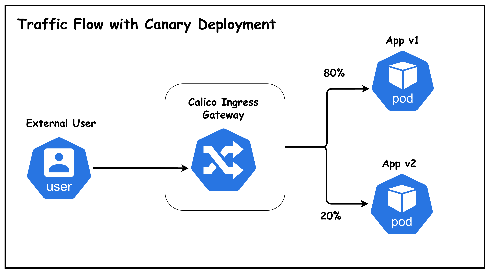
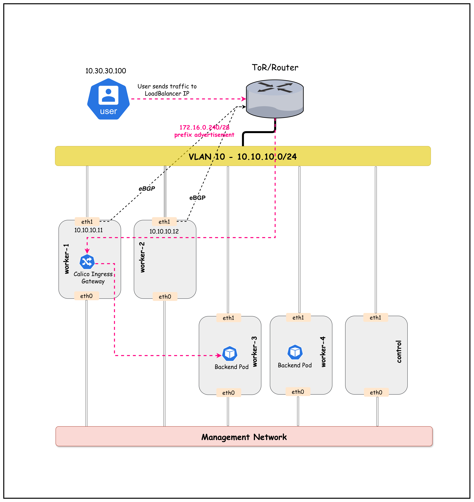

# Calico Ingress Gateway with Canary Deployments

This lab demonstrates Calico's Ingress Gateway feature, which provides Kubernetes Gateway API support for managing ingress traffic. You'll learn how to deploy an Envoy-based ingress gateway, expose services via LoadBalancer, and implement canary deployments with traffic splitting.

## What is Calico Ingress Gateway?

Calico Ingress Gateway integrates the Kubernetes Gateway API with Calico networking to provide a powerful, Envoy-based ingress solution. It enables:

| Feature | Description |
|---------|-------------|
| **Gateway API Support** | Uses standard Kubernetes Gateway API resources |
| **Envoy-based** | Leverages Envoy proxy for high-performance traffic management |
| **Traffic Splitting** | Route traffic to multiple backends with weighted distribution |
| **Canary Deployments** | Gradually roll out new versions with controlled traffic percentages |
| **BGP Integration** | Advertise gateway IPs via BGP for external accessibility |

## What is a Canary Deployment?

A **canary deployment** is a progressive release strategy where a new version of an application is gradually rolled out to a small subset of users before being fully deployed. This approach allows teams to:

- **Detect issues early** - Problems are caught with minimal user impact
- **Validate new features** - Test functionality with real traffic
- **Roll back quickly** - Revert to stable version if issues arise
- **Minimize risk** - Only a small percentage of users see the new version initially



## Lab Topology

This lab uses a topology with:
- **5 Kubernetes nodes**: 1 control-plane + 4 workers
- **2 BGP speaker nodes** (worker, worker2): Peer with ToR and host the ingress gateway
- **2 Non-BGP nodes** (worker3, worker4): Regular workload nodes
- **1 Arista cEOS ToR switch**: Routes traffic between VLANs
- **1 External user host**: Simulates external clients on VLAN 30



*Figure: Calico Ingress Gateway Lab Topology*


### Traffic Flow

1. **External user** on VLAN 30 sends HTTP request to Gateway LoadBalancer IP `172.16.0.241`
2. **ToR switch** has BGP-learned route to `172.16.0.240/28` via worker/worker2
3. **ECMP** distributes traffic across both BGP speaker nodes
4. **Envoy Gateway** receives traffic and applies HTTPRoute rules
5. **Traffic split**: 80% → app-v1 (stable), 20% → app-v2 (canary)
6. **Backend pods** (on any node) serve the response

## Lab Setup

To setup the lab for this module **[Lab setup](../README.md#lab-setup)**

The lab folder is - `/containerlab/19-calico-ingress`

## Lab

> [!Note]
> <mark>The outputs in this section will be different in your lab. When running the commands given in this section, make sure you replace IP addresses, interface names, and node names as per your lab.</mark>

### 1. Deploy the Lab

```bash
cd containerlab/19-calico-ingress
chmod +x deploy.sh
./deploy.sh
```

The deploy script will:
1. Deploy the ContainerLab topology
2. Install Calico with BGP configuration
3. Enable Calico Gateway API (creates GatewayClass)
4. Deploy demo applications (v1 and v2)

> [!Note]
> The Gateway, HTTPRoute, and ReferenceGrant resources are **not** pre-configured. You will create them manually in this lab to understand how they work together.

### 2. Set Up Environment

Set the kubeconfig for this lab:

```bash
export KUBECONFIG=$(pwd)/k01.kubeconfig
```

Verify the nodes are ready:

```bash
kubectl get nodes -o wide
```

```
NAME                STATUS   ROLES           AGE   VERSION   INTERNAL-IP    ...
k01-control-plane   Ready    control-plane   10m   v1.32.2   10.10.10.10    ...
k01-worker          Ready    <none>          9m    v1.32.2   10.10.10.11    ...
k01-worker2         Ready    <none>          9m    v1.32.2   10.10.10.12    ...
k01-worker3         Ready    <none>          9m    v1.32.2   10.10.10.13    ...
k01-worker4         Ready    <none>          9m    v1.32.2   10.10.10.14    ...
```

### 3. Verify BGP Peering

Only worker and worker2 (with `bgp-peer=true` label) should have BGP sessions with the ToR. List the nodes with this label:

```bash
kubectl get nodes -l bgp-peer=true
```

```
NAME          STATUS   ROLES    AGE   VERSION
k01-worker    Ready    <none>   10m   v1.32.2
k01-worker2   Ready    <none>   10m   v1.32.2
```

Connect to the cEOS switch to verify BGP sessions:

```bash
docker exec -it clab-calico-ingress-ceos01 Cli
```

Once in the CLI, check the BGP summary:

```
enable
show ip bgp summary
```

```
BGP summary information for VRF default
Router identifier 10.10.10.1, local AS number 65001
  Description              Neighbor    V AS           MsgRcvd   MsgSent  InQ OutQ  Up/Down State   PfxRcd PfxAcc
  "Calico BGP Peer Node 1" 10.10.10.11 4 65010             25        22    0    0 00:10:30 Estab   1      1
  "Calico BGP Peer Node 2" 10.10.10.12 4 65010             25        22    0    0 00:10:30 Estab   1      1
```

### 4. Verify Gateway API Components

#### 4.1 Check GatewayAPI Status

The deploy script enabled Calico's Gateway API feature with node placement configuration:

```bash
kubectl get gatewayapi
```

```
NAME      AGE
default   5m
```

View the GatewayAPI configuration:

```bash
kubectl get gatewayapi default -o yaml
```

```yaml
spec:
  gatewayClasses:
    - name: tigera-gateway-class
      gatewayDeployment:
        spec:
          template:
            spec:
              nodeSelector:
                bgp-peer: "true"
```

> [!Note]
> The `nodeSelector` in the GatewayAPI CR ensures that Envoy Gateway pods are deployed **only on BGP peer nodes** (worker, worker2). This is important because:
> - These nodes peer with the ToR switch and can advertise the LoadBalancer IP
> - Traffic enters through these nodes and is processed by the local Envoy proxy
> - This aligns the data plane (Envoy) with the BGP advertisement path

#### 4.2 Check GatewayClass

The `tigera-gateway-class` is automatically created when Gateway API is enabled:

```bash
kubectl get gatewayclass
```

```
NAME                   CONTROLLER                                      ACCEPTED   AGE
tigera-gateway-class   gateway.envoyproxy.io/gatewayclass-controller   True       5m
```

> [!Note]
> At this point, no Gateway resources exist yet. You will create them in the next sections.

### 5. Verify Application Deployments

Check that the application pods are running:

```bash
kubectl get pods -n ingress-gateway-demo -o wide
```

```
NAME                      READY   STATUS    RESTARTS   AGE   IP              NODE          ...
app-v1-5b9c7f8c4d-abc12   1/1     Running   0          5m    192.168.x.x     k01-worker3   ...
app-v1-5b9c7f8c4d-def34   1/1     Running   0          5m    192.168.x.x     k01-worker4   ...
app-v2-6c8d9e0f1a-ghi56   1/1     Running   0          5m    192.168.x.x     k01-worker3   ...
```

> [!Note]
> The application pods are scheduled on **worker3** and **worker4** (non-BGP nodes) using node affinity. This separates the workload nodes from the BGP speaker nodes (worker, worker2) that host the ingress gateway.

Verify the services are created:

```bash
kubectl get svc -n ingress-gateway-demo
```

```
NAME     TYPE        CLUSTER-IP      EXTERNAL-IP   PORT(S)   AGE
app-v1   ClusterIP   10.96.x.x       <none>        80/TCP    5m
app-v2   ClusterIP   10.96.x.x       <none>        80/TCP    5m
```

### 6. Create Gateway API Resources

Now you'll create the Gateway API resources to enable ingress traffic. This section walks through each resource and explains its purpose.

#### 6.1 Create the Gateway

The **Gateway** is the entry point for external traffic. It creates an Envoy-based load balancer that listens for HTTP traffic.

First, examine the Gateway manifest:

```bash
cat k8s-manifests/gateway.yaml
```

```yaml
# Gateway resource that creates an Envoy-based ingress gateway
# The gateway listens on port 80 for HTTP traffic (accepts all hostnames)
# Hostname filtering is done at the HTTPRoute level
apiVersion: gateway.networking.k8s.io/v1
kind: Gateway
metadata:
  name: calico-ingress-gateway
  namespace: default
spec:
  gatewayClassName: tigera-gateway-class
  listeners:
    - name: http
      protocol: HTTP
      port: 80
      allowedRoutes:
        namespaces:
          from: All
```

**Key configuration:**
- `gatewayClassName: tigera-gateway-class` - Uses the GatewayClass configured with nodeSelector for BGP peer nodes
- No `hostname` specified - The Gateway accepts requests for **any** hostname
- `allowedRoutes.namespaces.from: All` - Allows HTTPRoutes from any namespace to attach to this listener
- Hostname-based routing is handled at the **HTTPRoute** level (see next section)

Apply the Gateway:

```bash
kubectl apply -f k8s-manifests/gateway.yaml
```

```
gateway.gateway.networking.k8s.io/calico-ingress-gateway created
```

Wait a few seconds for the Gateway to be programmed, then verify it was created:

```bash
kubectl get gateway
```

```
NAME                      CLASS                  ADDRESS         PROGRAMMED   AGE
calico-ingress-gateway    tigera-gateway-class   172.16.0.241    True         30s
```

**What happened?** When the Gateway is created:
1. Calico deploys Envoy proxy pods in the `tigera-gateway` namespace
2. A LoadBalancer service is created with an IP from the BGP-advertised pool
3. The Envoy is configured to listen on port 80 for all incoming requests

#### 6.2 Create the ReferenceGrant

Before creating the HTTPRoute, you need to create a **ReferenceGrant**. This is a security mechanism that allows cross-namespace references.

**Why is this needed?** The HTTPRoute will be in the `default` namespace, but it needs to route traffic to Services in the `ingress-gateway-demo` namespace. Without a ReferenceGrant, this cross-namespace reference would be blocked for security reasons.

Examine the ReferenceGrant manifest:

```bash
cat k8s-manifests/reference-grant.yaml
```

```yaml
# ReferenceGrant allows the HTTPRoute in the default namespace
# to reference Services in the ingress-gateway-demo namespace
apiVersion: gateway.networking.k8s.io/v1beta1
kind: ReferenceGrant
metadata:
  name: allow-gateway-to-demo
  namespace: ingress-gateway-demo   # Lives in the TARGET namespace
spec:
  from:
    - group: gateway.networking.k8s.io
      kind: HTTPRoute
      namespace: default            # Allow HTTPRoutes FROM default namespace
  to:
    - group: ""
      kind: Service                 # To reference Services in THIS namespace
```

**Key points:**
- The ReferenceGrant is created in the `ingress-gateway-demo` namespace (where the Services are)
- It grants permission for HTTPRoutes from `default` namespace to reference Services here
- The namespace owner controls who can reference their resources

Apply the ReferenceGrant:

```bash
kubectl apply -f k8s-manifests/reference-grant.yaml
```

```
referencegrant.gateway.networking.k8s.io/allow-gateway-to-demo created
```

Verify it was created:

```bash
kubectl get referencegrant -n ingress-gateway-demo
```

```
NAME                    AGE
allow-gateway-to-demo   10s
```

#### 6.3 Create the HTTPRoute

Now create the **HTTPRoute** that defines how traffic should be routed to your backend services. This HTTPRoute implements a canary deployment with 80/20 traffic split.

Examine the HTTPRoute manifest:

```bash
cat k8s-manifests/httproute.yaml
```

```yaml
# HTTPRoute for traffic splitting between app-v1 (stable) and app-v2 (canary)
# Initial split: 80% to v1 (stable), 20% to v2 (canary)
# Hostname filtering: Only routes requests with Host: app.demo.lab
apiVersion: gateway.networking.k8s.io/v1
kind: HTTPRoute
metadata:
  name: canary-traffic-split
  namespace: default
spec:
  hostnames:
    - "app.demo.lab"                       # Only match requests with this Host header
  parentRefs:
    - name: calico-ingress-gateway         # Attach to our Gateway
      namespace: default
  rules:
    - matches:
        - path:
            type: PathPrefix
            value: /
      backendRefs:
        - name: app-v1
          namespace: ingress-gateway-demo  # Cross-namespace reference (allowed by ReferenceGrant)
          port: 80
          weight: 80                       # 80% of traffic
        - name: app-v2
          namespace: ingress-gateway-demo  # Cross-namespace reference (allowed by ReferenceGrant)
          port: 80
          weight: 20                       # 20% of traffic (canary)
```

**Key configuration:**
- `hostnames: ["app.demo.lab"]` - The HTTPRoute **only** matches requests with this Host header
- This is where hostname-based routing is configured (not at the Gateway level)
- Requests without the correct Host header will not match this route

Apply the HTTPRoute:

```bash
kubectl apply -f k8s-manifests/httproute.yaml
```

```
httproute.gateway.networking.k8s.io/canary-traffic-split created
```

Verify it was created:

```bash
kubectl get httproute
```

```
NAME                   HOSTNAMES        AGE
canary-traffic-split   ["app.demo.lab"] 10s
```

#### 6.4 Verify All Resources Are Connected

Now verify that all three resources are properly configured:

```bash
echo "=== Gateway ==="
kubectl get gateway

echo ""
echo "=== HTTPRoute ==="
kubectl get httproute

echo ""
echo "=== ReferenceGrant ==="
kubectl get referencegrant -n ingress-gateway-demo
```

```
=== Gateway ===
NAME                      CLASS                  ADDRESS         PROGRAMMED   AGE
calico-ingress-gateway    tigera-gateway-class   172.16.0.241    True         2m

=== HTTPRoute ===
NAME                   HOSTNAMES   AGE
canary-traffic-split               1m

=== ReferenceGrant ===
NAME                    AGE
allow-gateway-to-demo   1m
```

### 7. Check Gateway LoadBalancer Service

The Gateway created a LoadBalancer service that gets an IP from our BGP-advertised pool:

```bash
kubectl get svc -n tigera-gateway
```

```
NAME                                            TYPE           CLUSTER-IP     EXTERNAL-IP    PORT(S)        AGE
envoy-default-calico-ingress-gateway-xxxxxxxx   LoadBalancer   10.96.x.x      172.16.0.241   80:3xxxx/TCP   5m
```

Store the Gateway IP in an environment variable for later use:

```bash
GATEWAY_IP=$(kubectl get svc -n tigera-gateway -o jsonpath='{.items[0].status.loadBalancer.ingress[0].ip}')
echo "Gateway LoadBalancer IP: $GATEWAY_IP"
```

### 8. Verify BGP Route Advertisement

From the cEOS CLI, verify that the LoadBalancer IP is being advertised:
To access the cEOS CLI from your host, use the following command (replace `ceos01` with your switch node name if different):

```bash
docker exec -it clab-calico-ingress-ceos01 Cli
```

Once in the CLI, you can run the `show ip route` command as shown below:


```
show ip route
```

```
VRF: default

Gateway of last resort is not set

 C        10.10.10.0/24
           directly connected, Vlan10
 C        10.30.30.0/24
           directly connected, Vlan30
 B E      172.16.0.240/28 [200/0]
           via 10.10.10.11, Vlan10
           via 10.10.10.12, Vlan10
```

**Key Observation**: The LoadBalancer CIDR `172.16.0.240/28` is advertised via both BGP speaker nodes (ECMP).

### 9. Check HTTPRoute Configuration

List the HTTPRoutes:

```bash
kubectl get httproute
```

```
NAME                 HOSTNAMES   AGE
canary-traffic-split              5m
```

View the HTTPRoute details to see the traffic split configuration:

```bash
kubectl get httproute canary-traffic-split -o yaml
```

```yaml
spec:
  parentRefs:
  - name: calico-ingress-gateway
    namespace: default
  rules:
  - backendRefs:
    - name: app-v1
      namespace: ingress-gateway-demo
      port: 80
      weight: 80
    - name: app-v2
      namespace: ingress-gateway-demo
      port: 80
      weight: 20
    matches:
    - path:
        type: PathPrefix
        value: /
```

**Key Observation**: Traffic is split 80% to app-v1 (stable) and 20% to app-v2 (canary).

### 10. Test from External User Host

Now let's test the ingress gateway from the external user host on VLAN 30.

> [!Important]
> Since the Gateway is configured with hostname `app.demo.lab`, you must include the `Host` header in your requests. Without the correct Host header, the Gateway will not route your request.

#### 10.1 Verify User Host Connectivity

Check the user host's IP address:

```bash
docker exec -it clab-calico-ingress-user ip addr show eth1
```

```
1234: eth1@if1235: <BROADCAST,MULTICAST,UP,LOWER_UP> ...
    inet 10.30.30.100/24 scope global eth1
```

Verify the routing table includes the path to the LoadBalancer network:

```bash
docker exec -it clab-calico-ingress-user ip route
```

```
default via 172.20.20.1 dev eth0
10.30.30.0/24 dev eth1 proto kernel scope link src 10.30.30.100
172.16.0.0/16 via 10.30.30.1 dev eth1
172.20.20.0/24 dev eth0 proto kernel scope link src 172.20.20.x
```

#### 10.2 Test Single Request

Get the Gateway IP and test a single request using the hostname:

```bash
GATEWAY_IP=$(kubectl get svc -n tigera-gateway -o jsonpath='{.items[0].status.loadBalancer.ingress[0].ip}')
docker exec -it clab-calico-ingress-user curl -s -H "Host: app.demo.lab" http://$GATEWAY_IP | grep -o "App Version [12]"
```

```
App Version 1
```

The response will vary based on the traffic split.

> [!Note]
> The `-H "Host: app.demo.lab"` header is required because:
> - The Gateway listener is configured for hostname `app.demo.lab`
> - The HTTPRoute matches requests with this hostname
> - Without this header, Envoy won't match any routes and will return a 404

**Test without Host header (expected to fail):**

```bash
docker exec -it clab-calico-ingress-user curl -s http://$GATEWAY_IP
```

This returns an empty response or 404 because no route matches.

#### 10.3 Test Traffic Distribution

Run multiple requests to observe the traffic split:

```bash
GATEWAY_IP=$(kubectl get svc -n tigera-gateway -o jsonpath='{.items[0].status.loadBalancer.ingress[0].ip}')

for i in $(seq 100); do 
  docker exec clab-calico-ingress-user curl -s -H "Host: app.demo.lab" http://$GATEWAY_IP | grep -o "App Version [12]"
done | sort | uniq -c
```

```
     80 App Version 1
     20 App Version 2
```

**Key Observation**: Traffic is distributed approximately 80/20 between v1 and v2, matching our HTTPRoute configuration!

#### 10.4 Detailed Traffic Analysis

For a more detailed view with percentages:

```bash
GATEWAY_IP=$(kubectl get svc -n tigera-gateway -o jsonpath='{.items[0].status.loadBalancer.ingress[0].ip}')

for i in $(seq 200); do 
  docker exec clab-calico-ingress-user curl -s -H "Host: app.demo.lab" http://$GATEWAY_IP | grep -o "App Version [12]"
done | awk '
/Version 1/ {v1++}
/Version 2/ {v2++}
END {
  total=v1+v2
  printf("Version 1 (Stable): %d (%.1f%%)\nVersion 2 (Canary): %d (%.1f%%)\n",
         v1, v1/total*100, v2, v2/total*100)
}'
```

```
Version 1 (Stable): 161 (80.5%)
Version 2 (Canary): 39 (19.5%)
```

### 11. Adjust Traffic Split (Canary Progression)

As you gain confidence in the canary version, you can increase its traffic percentage.

#### 11.1 Increase Canary to 50%

Update the HTTPRoute to split traffic 50/50:

```bash
kubectl patch httproute canary-traffic-split --type='json' -p='[
  {"op": "replace", "path": "/spec/rules/0/backendRefs/0/weight", "value": 50},
  {"op": "replace", "path": "/spec/rules/0/backendRefs/1/weight", "value": 50}
]'
```

Verify the change was applied:

```bash
kubectl get httproute canary-traffic-split -o jsonpath='{.spec.rules[0].backendRefs}' | jq
```

```json
[
  {
    "name": "app-v1",
    "namespace": "ingress-gateway-demo",
    "port": 80,
    "weight": 50
  },
  {
    "name": "app-v2",
    "namespace": "ingress-gateway-demo",
    "port": 80,
    "weight": 50
  }
]
```

#### 11.2 Test New Traffic Distribution

Run the traffic test again to confirm the new 50/50 split:

```bash
GATEWAY_IP=$(kubectl get svc -n tigera-gateway -o jsonpath='{.items[0].status.loadBalancer.ingress[0].ip}')

for i in $(seq 100); do 
  docker exec clab-calico-ingress-user curl -s -H "Host: app.demo.lab" http://$GATEWAY_IP | grep -o "App Version [12]"
done | sort | uniq -c
```

```
     52 App Version 1
     48 App Version 2
```

#### 11.3 Complete Rollout (100% to v2)

When ready to complete the rollout, send all traffic to v2:

```bash
kubectl patch httproute canary-traffic-split --type='json' -p='[
  {"op": "replace", "path": "/spec/rules/0/backendRefs/0/weight", "value": 0},
  {"op": "replace", "path": "/spec/rules/0/backendRefs/1/weight", "value": 100}
]'
```

Test to confirm all traffic goes to v2:

```bash
GATEWAY_IP=$(kubectl get svc -n tigera-gateway -o jsonpath='{.items[0].status.loadBalancer.ingress[0].ip}')

for i in $(seq 10); do 
  docker exec clab-calico-ingress-user curl -s -H "Host: app.demo.lab" http://$GATEWAY_IP | grep -o "App Version [12]"
done
```

```
App Version 2
App Version 2
App Version 2
App Version 2
App Version 2
App Version 2
App Version 2
App Version 2
App Version 2
App Version 2
```

### 12. Rollback (If Needed)

If issues are detected, quickly rollback to the stable version:

```bash
kubectl patch httproute canary-traffic-split --type='json' -p='[
  {"op": "replace", "path": "/spec/rules/0/backendRefs/0/weight", "value": 100},
  {"op": "replace", "path": "/spec/rules/0/backendRefs/1/weight", "value": 0}
]'
```

All traffic now goes to v1 (stable).

### 13. View Envoy Gateway Pods

The Calico Gateway API deploys Envoy pods to handle ingress traffic:

```bash
kubectl get pods -n tigera-gateway
```

```
NAME                                                             READY   STATUS    RESTARTS   AGE
envoy-default-calico-ingress-gateway-75f8f111-85dc66bcbb-w55tr   2/2     Running   0          9m34s
envoy-gateway-55dff88856-8fgnt                                   1/1     Running   0          40m
```

Check which nodes the gateway pods are running on:

```bash
kubectl get pods -n tigera-gateway -o wide
```

```
NAME                                                             READY   STATUS      RESTARTS   AGE    IP               NODE          NOMINATED NODE   READINESS GATES
envoy-default-calico-ingress-gateway-75f8f111-85dc66bcbb-w55tr   2/2     Running     0          8m9s   192.168.81.67    k01-worker    <none>           <none>
envoy-gateway-55dff88856-8fgnt                                   1/1     Running     0          38m    192.168.81.66    k01-worker    <none>           <none>
tigera-gateway-api-gateway-helm-certgen-f8xdv                    0/1     Completed   0          13s    192.168.209.75   k01-worker3   <none>           <none>
```

> [!Note]
> The Envoy pods are running on **worker** or **worker2** (BGP peer nodes) because of the `nodeSelector: bgp-peer: "true"` configured in the GatewayAPI CR. This ensures that:
> - Envoy proxies run where BGP routes are advertised
> - High availability across both BGP speaker nodes can be configured with multiple replicas

## Architecture Deep Dive

### How Calico Ingress Gateway Works


### Key Components

| Component | Description |
|-----------|-------------|
| **GatewayAPI** | Calico CRD that enables Gateway API support |
| **GatewayClass** | Defines the controller (Envoy Gateway) |
| **Gateway** | Creates listener endpoints (Envoy deployment + LoadBalancer service) |
| **HTTPRoute** | Defines routing rules, including traffic splitting |
| **ReferenceGrant** | Allows cross-namespace service references |

### Understanding Gateway, HTTPRoute, and ReferenceGrant

These three resources work together to create a complete ingress solution. Understanding their relationship is crucial for configuring Gateway API correctly.

```
┌─────────────────────────────────────────────────────────────────────────────────────┐
│                   GATEWAY API RESOURCE RELATIONSHIP                                  │
├─────────────────────────────────────────────────────────────────────────────────────┤
│                                                                                     │
│   NAMESPACE: default                          NAMESPACE: ingress-gateway-demo       │
│   ─────────────────────                       ───────────────────────────────       │
│                                                                                     │
│   ┌─────────────────────────┐                                                       │
│   │       Gateway           │                                                       │
│   │  calico-ingress-gateway │                                                       │
│   │  ─────────────────────  │                                                       │
│   │  • Port: 80             │                                                       │
│   │  • Protocol: HTTP       │                                                       │
│   │  • Creates Envoy pods   │                                                       │
│   │  • Gets LoadBalancer IP │                                                       │
│   └───────────┬─────────────┘                                                       │
│               │                                                                     │
│               │ parentRefs                                                          │
│               │                                                                     │
│               ▼                                                                     │
│   ┌─────────────────────────┐                                                       │
│   │      HTTPRoute          │                 ┌─────────────────────────────────┐   │
│   │  canary-traffic-split   │    backendRefs  │       ReferenceGrant            │   │
│   │  ─────────────────────  │ ───────────────►│  allow-gateway-to-demo          │   │
│   │  • Path: /              │  (Cross-NS ref  │  ─────────────────────────────  │   │
│   │  • app-v1: 80% weight   │   requires      │  GRANTS PERMISSION:             │   │
│   │  • app-v2: 20% weight   │   permission)   │  • FROM: HTTPRoute in default   │   │
│   └─────────────────────────┘                 │  • TO: Services in this NS      │   │
│                                               └─────────────────────────────────┘   │
│                                                             │                       │
│                                                             │ Allows access to      │
│                                                             ▼                       │
│                                               ┌─────────────────────────────────┐   │
│                                               │         Services                │   │
│                                               │  ┌─────────┐    ┌─────────┐     │   │
│                                               │  │ app-v1  │    │ app-v2  │     │   │
│                                               │  │ (80%)   │    │ (20%)   │     │   │
│                                               │  └─────────┘    └─────────┘     │   │
│                                               └─────────────────────────────────┘   │
│                                                                                     │
└─────────────────────────────────────────────────────────────────────────────────────┘
```

#### Gateway Resource (`gateway.yaml`)

The **Gateway** is the entry point for external traffic into the cluster. It defines:

- **Where to listen**: Port 80 with HTTP protocol
- **Which controller to use**: The `tigera-gateway-class` (Envoy-based)
- **What gets created**: An Envoy deployment and a LoadBalancer service

```yaml
apiVersion: gateway.networking.k8s.io/v1
kind: Gateway
metadata:
  name: calico-ingress-gateway
  namespace: default
spec:
  gatewayClassName: tigera-gateway-class
  listeners:
    - name: http
      protocol: HTTP
      port: 80
```

When this Gateway is created, Calico:
1. Deploys Envoy proxy pods in the `tigera-gateway` namespace
2. Creates a LoadBalancer service that gets an IP from the BGP-advertised pool
3. Configures the Envoy to listen on the specified port

#### HTTPRoute Resource (`httproute.yaml`)

The **HTTPRoute** defines how incoming traffic should be routed to backend services. It:

- **Attaches to a Gateway** via `parentRefs`
- **Matches requests** based on path, headers, etc.
- **Routes to backends** with optional traffic weights for canary deployments

```yaml
apiVersion: gateway.networking.k8s.io/v1
kind: HTTPRoute
metadata:
  name: canary-traffic-split
  namespace: default
spec:
  parentRefs:
    - name: calico-ingress-gateway   # References the Gateway
      namespace: default
  rules:
    - matches:
        - path:
            type: PathPrefix
            value: /
      backendRefs:
        - name: app-v1
          namespace: ingress-gateway-demo  # Cross-namespace reference!
          port: 80
          weight: 80
        - name: app-v2
          namespace: ingress-gateway-demo  # Cross-namespace reference!
          port: 80
          weight: 20
```

**Important**: Notice that the HTTPRoute is in the `default` namespace, but it references Services in the `ingress-gateway-demo` namespace. This cross-namespace reference is not allowed by default for security reasons.

#### ReferenceGrant Resource (`reference-grant.yaml`)

The **ReferenceGrant** is a security mechanism that explicitly authorizes cross-namespace references. It answers the question: *"Who is allowed to reference resources in my namespace?"*

```yaml
apiVersion: gateway.networking.k8s.io/v1beta1
kind: ReferenceGrant
metadata:
  name: allow-gateway-to-demo
  namespace: ingress-gateway-demo  # Lives where the target resources are
spec:
  from:
    - group: gateway.networking.k8s.io
      kind: HTTPRoute
      namespace: default           # Allow HTTPRoutes FROM default namespace
  to:
    - group: ""
      kind: Service               # To reference Services in THIS namespace
```

**Key points about ReferenceGrant:**

| Aspect | Details |
|--------|---------|
| **Placement** | Must be in the **target** namespace (where the referenced services live) |
| **Ownership** | The namespace owner controls who can reference their resources |
| **Granularity** | Can limit by source namespace, resource kind, and target resource type |
| **Security Model** | Follows principle of least privilege - no implicit trust between namespaces |

#### Why ReferenceGrant Exists

Without ReferenceGrant, any HTTPRoute in any namespace could route traffic to any Service in any other namespace. This would create serious security issues:

1. **Unauthorized traffic steering**: A malicious HTTPRoute could intercept traffic meant for other services
2. **Service discovery exposure**: Attackers could probe for services across namespaces
3. **Namespace isolation violation**: Namespaces wouldn't provide meaningful security boundaries

ReferenceGrant ensures that the **owner of the target namespace** must explicitly opt-in to allow cross-namespace references.

#### How They Work Together

```
External Request → Gateway (default) → HTTPRoute (default) → ReferenceGrant check → Services (ingress-gateway-demo)
                   │                    │                     │
                   │                    │                     └─ "Is default/HTTPRoute allowed
                   │                    │                         to reference services here?"
                   │                    │                         ✓ Yes (ReferenceGrant exists)
                   │                    │
                   │                    └─ "Route to app-v1 (80%) and app-v2 (20%)
                   │                        in ingress-gateway-demo namespace"
                   │
                   └─ "Accept HTTP traffic on port 80"
```

**Workflow summary:**
1. **Gateway** accepts incoming traffic on port 80
2. **HTTPRoute** (attached to Gateway) evaluates routing rules
3. HTTPRoute wants to send traffic to Services in another namespace
4. Gateway API checks for a **ReferenceGrant** in the target namespace
5. **ReferenceGrant** authorizes HTTPRoutes from `default` to reference Services
6. Traffic is forwarded to the backend Services

### LoadBalancer Integration with BGP

The key to external access is the integration between:
1. **Calico LoadBalancer IPAM**: Assigns IPs from the configured pool
2. **BGP Advertisement**: Advertises LoadBalancer IPs to the ToR
3. **ECMP**: Distributes traffic across multiple BGP speaker nodes

```
BGP Route Advertisement:

  k01-worker (10.10.10.11)  ─────┐
  (bgp-peer=true)                │
           │                     ▼
           │              ┌─────────────────┐
    Advertises:           │   ToR Switch    │
    172.16.0.240/28       │   (AS 65001)    │
           │              │                 │
           │              │ Routes:         │
  k01-worker2 (10.10.10.12)│ 172.16.0.240/28│
  (bgp-peer=true)         │   via 10.10.11 │──►  Accessible from VLAN 30
           │              │   via 10.10.12 │
           └──────────────└─────────────────┘
```

## Use Cases for Canary Deployments

| Use Case | Description |
|----------|-------------|
| **Feature Rollouts** | Safely release new features to a subset of users |
| **Performance Testing** | Evaluate new version under real traffic |
| **Bug Detection** | Catch critical bugs with minimal user impact |
| **A/B Testing** | Compare different versions for metrics/engagement |
| **Compliance** | Gradual rollout in regulated environments |

## Summary

This lab demonstrated Calico's Ingress Gateway with canary deployment capabilities:

| Aspect | Configuration |
|--------|---------------|
| **Gateway Type** | Envoy-based via Gateway API |
| **External Access** | LoadBalancer with BGP advertisement |
| **Traffic Management** | HTTPRoute with weighted backends |
| **Initial Split** | 80% stable, 20% canary |
| **Progression** | Adjustable via kubectl patch |
| **Rollback** | Instant by changing weights |

**Key Takeaways:**

1. **Standard Gateway API**: Uses Kubernetes-native Gateway API resources
2. **BGP Integration**: LoadBalancer IPs are advertised to external networks
3. **Flexible Traffic Control**: Easily adjust traffic split percentages
4. **Zero-downtime Rollouts**: Gradually shift traffic without service interruption
5. **Quick Rollback**: Instantly revert by changing HTTPRoute weights

## Troubleshooting

### Gateway Not Getting IP

If the Gateway doesn't get a LoadBalancer IP:

```bash
# Check if IPPool exists
kubectl get ippools

# Check BGPConfiguration for serviceLoadBalancerIPs
kubectl get bgpconfiguration default -o yaml

# Check for any events
kubectl describe gateway calico-ingress-gateway
```

### Traffic Not Reaching Backend

If traffic doesn't reach the backend services:

```bash
# Check ReferenceGrant exists
kubectl get referencegrant -n ingress-gateway-demo

# Check HTTPRoute status
kubectl describe httproute canary-traffic-split

# Check Envoy pods are running
kubectl get pods -n tigera-gateway
kubectl logs -n tigera-gateway -l gateway.envoyproxy.io/owning-gateway-name=calico-ingress-gateway
```

### BGP Routes Not Advertised

If LoadBalancer IP is not reachable from external network:

```bash
# Check BGP sessions on cEOS
docker exec -it clab-calico-ingress-ceos01 Cli -c "show ip bgp summary"

# Check routes on cEOS
docker exec -it clab-calico-ingress-ceos01 Cli -c "show ip route"

# Check Calico BGP status
calicoctl node status
```

## Lab Cleanup

To cleanup the lab follow steps in **[Lab cleanup](../README.md#lab-cleanup)**

Or run:
```bash
chmod +x destroy.sh
./destroy.sh
```
