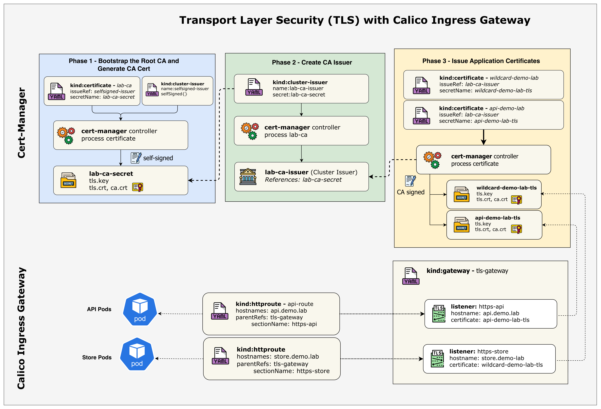
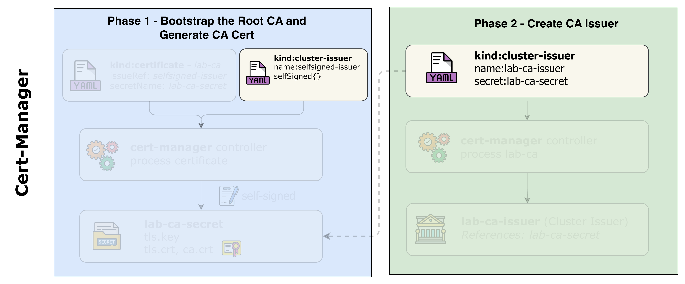
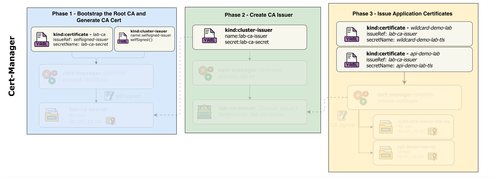
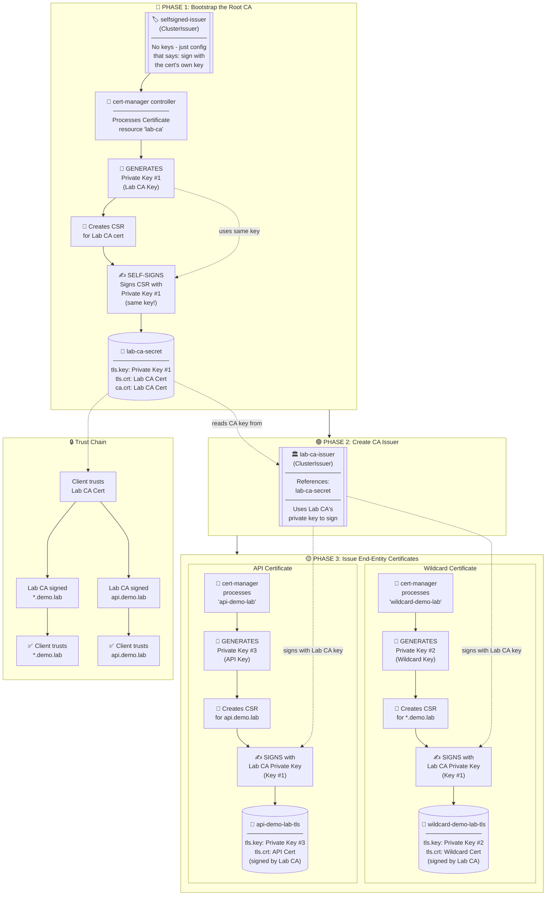
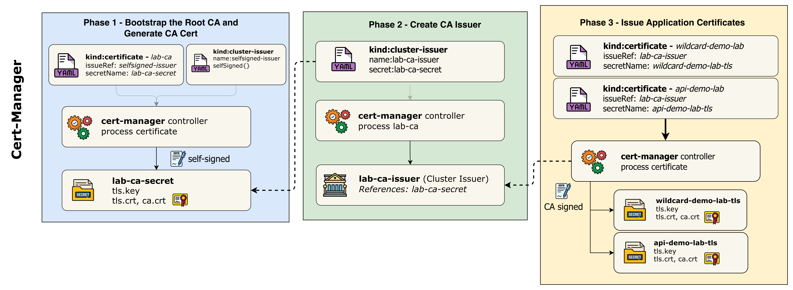
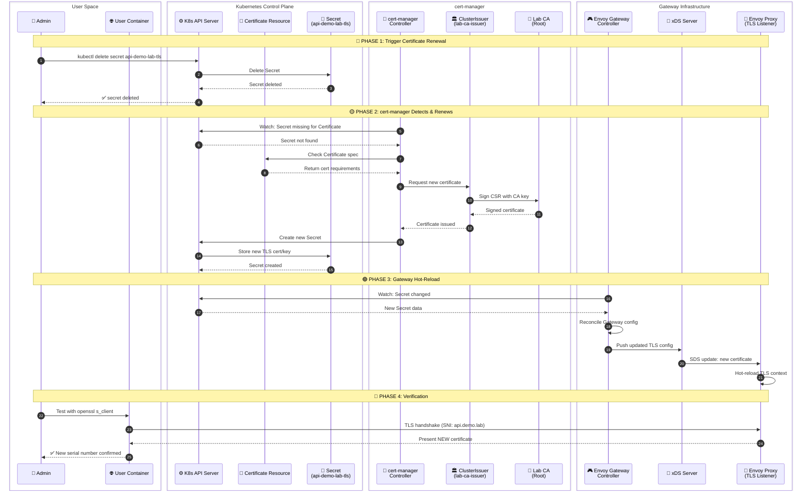

# Transport Layer Security (TLS) with Calico Ingress

This lab demonstrates automated TLS certificate lifecycle management using cert-manager with a local Certificate Authority (CA). You'll learn how to install cert-manager, configure ClusterIssuers with local CAs, and implement both wildcard and dedicated certificates for different services.

## Overview

### What is cert-manager?

cert-manager is a powerful Kubernetes add-on that automates the management and issuance of TLS certificates. It supports various certificate authorities including internal CAs, HashiCorp Vault PKI, self-signed certificates, and public CAs like Let's Encrypt.

| Feature | Description |
|---------|-------------|
| **Automated Issuance** | Automatically obtains certificates from CAs |
| **Automatic Renewal** | Renews certificates before expiry |
| **Multiple CA Types** | Supports internal CAs, Vault PKI, ACME, and more |
| **ClusterIssuers** | Cluster-wide certificate authority configuration |
| **Gateway API Integration** | Native support for Gateway API TLS |

### Certificate Strategies

This lab demonstrates two common certificate strategies:

**1. Wildcard Certificate (*.demo.lab)**
- **Used by**: store.demo.lab, blog.demo.lab
- **Pros**: Single certificate for multiple subdomains, easier management
- **Cons**: Broader scope if private key is compromised
- **Use case**: Multiple apps under the same domain

**2. Dedicated Certificate (api.demo.lab)**
- **Used by**: api.demo.lab
- **Pros**: Better isolation, independent lifecycle, can rotate without affecting others
- **Cons**: More certificates to manage
- **Use case**: Critical APIs requiring enhanced security isolation

## Lab Setup



**Prerequisites:**
- ContainerLab installed
- Docker installed
- kubectl configured

To setup the lab for this module **[Lab setup](../readme.md#lab-setup)**

The lab folder is - `/containerlab/20-ingress-tls`

## Lab Exercises

> [!Note]
> <mark>The outputs in this section will be different in your lab. When running the commands given in this section, make sure you replace IP addresses, interface names, and node names as per your lab.</mark>

### 1. Deploy and Verify the Lab

#### 1.1 Deploy the Lab Infrastructure

```bash
cd containerlab/20-ingress-tls
chmod +x deploy.sh
./deploy.sh
```

The deploy script will:
1. Deploy the ContainerLab topology
2. Install Calico with BGP configuration
3. Enable Calico Gateway API

> [!Note]
> cert-manager, demo applications, certificates, and Gateway resources are **not** pre-configured. You will install and create them manually in this lab to understand how they work together.

#### 1.2 Set Up Environment

Set the kubeconfig for this lab:

```bash
export KUBECONFIG=$(pwd)/k01.kubeconfig
```

Verify the nodes are ready:

```bash
kubectl get nodes -o wide
```

```
NAME                STATUS   ROLES           AGE   VERSION   INTERNAL-IP    ...
k01-control-plane   Ready    control-plane   10m   v1.32.2   10.10.10.10    ...
k01-worker          Ready    <none>          9m    v1.32.2   10.10.10.11    ...
k01-worker2         Ready    <none>          9m    v1.32.2   10.10.10.12    ...
k01-worker3         Ready    <none>          9m    v1.32.2   10.10.10.13    ...
k01-worker4         Ready    <none>          9m    v1.32.2   10.10.10.14    ...
```

#### 1.3 Verify GatewayClass

Confirm the GatewayClass is available:

```bash
kubectl get gatewayclass
```

```
NAME                   CONTROLLER                                      ACCEPTED   AGE
tigera-gateway-class   gateway.envoyproxy.io/gatewayclass-controller   True       5m
```

### 2. Install cert-manager

In this phase, you'll install cert-manager to manage TLS certificates in your cluster.

#### 2.1 Understand cert-manager Components

cert-manager consists of several components:

| Component | Description |
|-----------|-------------|
| **Controller** | Watches Certificate resources and issues certificates |
| **Webhook** | Validates and mutates cert-manager resources |
| **CA Injector** | Injects CA bundles into webhooks and API services |

#### 2.2 Install cert-manager

Install cert-manager using the official manifest:

```bash
kubectl apply -f https://github.com/cert-manager/cert-manager/releases/download/v1.16.2/cert-manager.yaml
```

```
namespace/cert-manager created
customresourcedefinition.apiextensions.k8s.io/certificaterequests.cert-manager.io created
customresourcedefinition.apiextensions.k8s.io/certificates.cert-manager.io created
customresourcedefinition.apiextensions.k8s.io/challenges.acme.cert-manager.io created
customresourcedefinition.apiextensions.k8s.io/clusterissuers.cert-manager.io created
customresourcedefinition.apiextensions.k8s.io/issuers.cert-manager.io created
customresourcedefinition.apiextensions.k8s.io/orders.acme.cert-manager.io created
...
deployment.apps/cert-manager created
deployment.apps/cert-manager-cainjector created
deployment.apps/cert-manager-webhook created
```

#### 2.3 Wait for cert-manager to be Ready

Wait for all cert-manager deployments to be available:

```bash
kubectl wait --for=condition=available --timeout=300s deployment/cert-manager -n cert-manager
kubectl wait --for=condition=available --timeout=300s deployment/cert-manager-webhook -n cert-manager
kubectl wait --for=condition=available --timeout=300s deployment/cert-manager-cainjector -n cert-manager
```

```
deployment.apps/cert-manager condition met
deployment.apps/cert-manager-webhook condition met
deployment.apps/cert-manager-cainjector condition met
```

#### 2.4 Verify cert-manager Installation

Check that cert-manager pods are running:

```bash
kubectl get pods -n cert-manager
```

```
NAME                                       READY   STATUS    RESTARTS   AGE
cert-manager-7f8d9b6c5d-xxxxx              1/1     Running   0          1m
cert-manager-cainjector-5c9d8b7c6d-xxxxx   1/1     Running   0          1m
cert-manager-webhook-6d8f9c7b5e-xxxxx      1/1     Running   0          1m
```

**What each pod does:**

| Pod | Description |
|-----|-------------|
| **cert-manager** | The main controller that watches for Certificate, CertificateRequest, and Issuer resources. It processes certificate requests, communicates with CAs, and stores issued certificates as Kubernetes Secrets. |
| **cert-manager-cainjector** | Injects CA certificates into webhook configurations, API services, and Custom Resource Definitions. This ensures that components trusting cert-manager-issued certificates have the correct CA bundle. |
| **cert-manager-webhook** | A validating and mutating admission webhook that validates cert-manager resources before they're persisted. It ensures Certificate and Issuer configurations are correct and converts between API versions. |

Verify cert-manager CRDs are installed:

```bash
kubectl get crds | grep cert-manager
```

```
certificaterequests.cert-manager.io       2024-01-15T12:00:00Z
certificates.cert-manager.io              2024-01-15T12:00:00Z
challenges.acme.cert-manager.io           2024-01-15T12:00:00Z
clusterissuers.cert-manager.io            2024-01-15T12:00:00Z
issuers.cert-manager.io                   2024-01-15T12:00:00Z
orders.acme.cert-manager.io               2024-01-15T12:00:00Z
```

#### 2.5 Test cert-manager with a Self-Signed Certificate

Before proceeding, let's verify cert-manager is working correctly by creating a test certificate. This smoke test validates that:

- The cert-manager **controller** can process Certificate resources
- The cert-manager **webhook** can validate and admit resources
- cert-manager can **generate real X.509 certificates** and store them as Kubernetes Secrets

> [!Note]
> This test uses a self-signed issuer because it requires no external dependencies and issues certificates instantly. The certificate created is a real, cryptographically valid X.509 certificate - just not trusted by browsers since it's self-signed. This same concept applies to the Lab CA we'll create later.

Create the test resources:

```bash
cat <<EOF | kubectl apply -f -
apiVersion: v1
kind: Namespace
metadata:
  name: cert-manager-test
---
apiVersion: cert-manager.io/v1
kind: Issuer
metadata:
  name: test-selfsigned
  namespace: cert-manager-test
spec:
  selfSigned: {}
---
apiVersion: cert-manager.io/v1
kind: Certificate
metadata:
  name: selfsigned-cert
  namespace: cert-manager-test
spec:
  dnsNames:
    - example.com
  secretName: selfsigned-cert-tls
  issuerRef:
    name: test-selfsigned
EOF
```

Verify the test certificate is issued:

```bash
kubectl get certificate -n cert-manager-test
```

```
NAME              READY   SECRET                AGE
selfsigned-cert   True    selfsigned-cert-tls   10s
```

When the Certificate resource was created:
1. cert-manager generated a private key
2. Created a Certificate Signing Request (CSR)
3. Signed the certificate using the self-signed issuer
4. Stored the certificate in a Kubernetes Secret (`selfsigned-cert-tls`)

You can inspect the actual certificate:

```bash
kubectl get secret selfsigned-cert-tls -n cert-manager-test -o jsonpath='{.data.tls\.crt}' | base64 -d | openssl x509 -text -noout | head -15
```

```
Certificate:
    Data:
        Version: 3 (0x2)
        Serial Number: ...
        Signature Algorithm: ecdsa-with-SHA256
        Issuer: 
        Validity
            Not Before: Jan 15 12:00:00 2024 GMT
            Not After : Apr 15 12:00:00 2024 GMT
        Subject: 
        Subject Public Key Info:
            Public Key Algorithm: id-ecPublicKey
```

Clean up the test resources:

```bash
kubectl delete namespace cert-manager-test
```

### 3. Deploy Demo Applications

In this phase, you'll deploy three demo applications that will be exposed via the TLS Gateway.

#### 3.1 Create the Demo Namespace

```bash
kubectl create namespace cert-manager-demo
```

```
namespace/cert-manager-demo created
```

#### 3.2 Examine the Store Application

First, examine the Store application manifest:

```bash
cat k8s-manifests/app-store.yaml
```

Key points:
- Creates a Deployment with nginx serving a custom HTML page
- Creates a ClusterIP Service on port 80
- Uses the `cert-manager-demo` namespace
- Pods are scheduled on non-BGP worker nodes (worker3, worker4)

#### 3.3 Deploy the Store Application

```bash
kubectl apply -f k8s-manifests/app-store.yaml
```

```
configmap/store-html created
deployment.apps/store created
service/store created
```

#### 3.4 Deploy the Blog Application

Examine and deploy the Blog application:

```bash
cat k8s-manifests/app-blog.yaml
```

```bash
kubectl apply -f k8s-manifests/app-blog.yaml
```

```
configmap/blog-html created
deployment.apps/blog created
service/blog created
```

#### 3.5 Deploy the API Application

Examine and deploy the API application:

```bash
cat k8s-manifests/app-api.yaml
```

```bash
kubectl apply -f k8s-manifests/app-api.yaml
```

```
configmap/api-html created
deployment.apps/api created
service/api created
```

#### 3.6 Verify Application Deployments

Check that all pods are running:

```bash
kubectl get pods -n cert-manager-demo -o wide
```

```
NAME                     READY   STATUS    RESTARTS   AGE   IP              NODE          ...
store-xxxxxxxxxx-xxxxx   1/1     Running   0          1m    192.168.x.x     k01-worker3   ...
store-xxxxxxxxxx-xxxxx   1/1     Running   0          1m    192.168.x.x     k01-worker4   ...
blog-xxxxxxxxxx-xxxxx    1/1     Running   0          1m    192.168.x.x     k01-worker3   ...
blog-xxxxxxxxxx-xxxxx    1/1     Running   0          1m    192.168.x.x     k01-worker4   ...
api-xxxxxxxxxx-xxxxx     1/1     Running   0          1m    192.168.x.x     k01-worker3   ...
api-xxxxxxxxxx-xxxxx     1/1     Running   0          1m    192.168.x.x     k01-worker4   ...
```

Check the services:

```bash
kubectl get svc -n cert-manager-demo
```

```
NAME    TYPE        CLUSTER-IP      EXTERNAL-IP   PORT(S)   AGE
store   ClusterIP   10.96.x.x       <none>        80/TCP    1m
blog    ClusterIP   10.96.x.x       <none>        80/TCP    1m
api     ClusterIP   10.96.x.x       <none>        80/TCP    1m
```

### 4. Create Certificate Issuers

In this phase, you'll create ClusterIssuers that define how certificates are obtained. Since this is a lab environment, we use **local Certificate Authorities** instead of public CAs like Let's Encrypt.



#### 4.1 Understand ClusterIssuers

Examine the ClusterIssuer manifest:

```bash
cat tls-config/cluster-issuers.yaml
```

This file contains two issuers for the lab:

| Issuer | Purpose |
|--------|---------|
| `selfsigned-issuer` | Bootstrapping - creates the root CA certificate |
| `lab-ca-issuer` | **Primary issuer** - signs certificates using the Lab CA |

**Self-Signed Issuer (for bootstrapping):**

```yaml
apiVersion: cert-manager.io/v1
kind: ClusterIssuer
metadata:
  name: selfsigned-issuer
spec:
  selfSigned: {}
```

**Lab CA Issuer (primary):**

```yaml
apiVersion: cert-manager.io/v1
kind: ClusterIssuer
metadata:
  name: lab-ca-issuer
spec:
  ca:
    secretName: lab-ca-secret
```

> [!Note]
> **Why use a local CA instead of self-signed certificates?**
> - Self-signed certs are signed by their own key (no trust chain)
> - CA-signed certs have a proper chain: `Root CA → Leaf Certificate`
> - You can trust the CA once and all issued certs are trusted
> - This mirrors how enterprise PKI and public CAs work

#### 4.2 Create the ClusterIssuers

```bash
kubectl apply -f tls-config/cluster-issuers.yaml
```

```
clusterissuer.cert-manager.io/selfsigned-issuer created
clusterissuer.cert-manager.io/lab-ca-issuer created
```

#### 4.3 Verify ClusterIssuers

Check that all issuers are ready:

```bash
kubectl get clusterissuers -o wide
```

```
NAME                READY   STATUS                                               AGE
selfsigned-issuer   True                                                         30s
lab-ca-issuer       False   Error initializing issuer: secret not found          30s
```

> [!Note]
> The `lab-ca-issuer` shows an error because we haven't created the CA certificate yet. This is expected - we'll create it in the next phase when we apply the certificates.

### 5. Issue Certificates

Now you'll create Certificate resources that request certificates from our Lab CA.



#### 5.1 Understand the Certificate Resources

Examine the certificates manifest:

```bash
cat tls-config/certificates.yaml
```

This file defines three certificates in a specific order:

**1. Lab CA Certificate** (creates the root CA - must be created first):

```yaml
apiVersion: cert-manager.io/v1
kind: Certificate
metadata:
  name: lab-ca
  namespace: cert-manager
spec:
  isCA: true                        # This is a CA certificate
  secretName: lab-ca-secret         # Where the CA cert/key is stored
  commonName: "Demo Lab Certificate Authority"
  duration: 87600h                  # 10 years validity
  issuerRef:
    name: selfsigned-issuer         # Self-sign the root CA
    kind: ClusterIssuer
```

**2. Wildcard Certificate** (for store.demo.lab and blog.demo.lab):

```yaml
apiVersion: cert-manager.io/v1
kind: Certificate
metadata:
  name: wildcard-demo-lab
  namespace: cert-manager-demo
spec:
  secretName: wildcard-demo-lab-tls
  commonName: "*.demo.lab"
  dnsNames:
    - "*.demo.lab"                  # Covers all subdomains
    - "demo.lab"                    # Also cover apex domain
  issuerRef:
    name: lab-ca-issuer             # Signed by our Lab CA
    kind: ClusterIssuer
```

**3. Dedicated Certificate** (for api.demo.lab only):

```yaml
apiVersion: cert-manager.io/v1
kind: Certificate
metadata:
  name: api-demo-lab
  namespace: cert-manager-demo
spec:
  secretName: api-demo-lab-tls
  commonName: "api.demo.lab"
  dnsNames:
    - "api.demo.lab"                # Only valid for this domain
  issuerRef:
    name: lab-ca-issuer             # Signed by our Lab CA
    kind: ClusterIssuer
```

> [!Note]
> **Certificate chain:** The Lab CA is self-signed, but the wildcard and API certificates are signed by the Lab CA. This creates a proper trust chain just like in production PKI environments.

**Certificate Chain & Key Generation Diagram:**



**Key Points:**

| Step | What Happens | Private Key | Who Signs |
|------|--------------|-------------|-----------|
| **1** | Lab CA Certificate created | cert-manager generates **Key #1** | Self-signed (Key #1 signs its own cert) |
| **2** | lab-ca-issuer configured | No new key - references lab-ca-secret | N/A - just config |
| **3** | Wildcard cert created | cert-manager generates **Key #2** | Lab CA (using Key #1) |
| **4** | API cert created | cert-manager generates **Key #3** | Lab CA (using Key #1) |

> [!IMPORTANT]
> **Self-signing explained:** When `selfsigned-issuer` processes a certificate, cert-manager generates a new private key, creates a CSR, then signs that CSR with the **same private key** it just generated. The certificate literally signs itself - that's why it's called "self-signed." This is only used for root CAs.



#### 5.2 Create the Certificates

```bash
kubectl apply -f tls-config/certificates.yaml
```

```
certificate.cert-manager.io/lab-ca created
certificate.cert-manager.io/wildcard-demo-lab created
certificate.cert-manager.io/api-demo-lab created
```

#### 5.3 Watch Certificate Issuance

Watch cert-manager issue the certificates:

```bash
kubectl get certificates -A -w
```

```
NAMESPACE           NAME                READY   SECRET                   AGE
cert-manager        lab-ca              False   lab-ca-secret            0s
cert-manager-demo   wildcard-demo-lab   False   wildcard-demo-lab-tls    0s
cert-manager-demo   api-demo-lab        False   api-demo-lab-tls         0s
cert-manager        lab-ca              True    lab-ca-secret            2s
cert-manager-demo   wildcard-demo-lab   True    wildcard-demo-lab-tls    3s
cert-manager-demo   api-demo-lab        True    api-demo-lab-tls         3s
```

Press `Ctrl+C` to exit the watch.

#### 5.4 Verify All Certificates Are Ready

```bash
kubectl get certificates -A
```

```
NAMESPACE           NAME                READY   SECRET                   AGE
cert-manager        lab-ca              True    lab-ca-secret            1m
cert-manager-demo   wildcard-demo-lab   True    wildcard-demo-lab-tls    1m
cert-manager-demo   api-demo-lab        True    api-demo-lab-tls         1m
```

#### 5.5 Verify ClusterIssuers Again

Now check the lab-ca-issuer:

```bash
kubectl get clusterissuers lab-ca-issuer
```

```
NAME            READY   STATUS                  AGE
lab-ca-issuer   True    Signing CA verified     2m
```

The issuer is now ready because the Lab CA certificate has been created.

#### 5.6 Examine Certificate Details

View the wildcard certificate details:

```bash
kubectl describe certificate wildcard-demo-lab -n cert-manager-demo
```

```yaml
Name:         wildcard-demo-lab
Namespace:    cert-manager-demo
...
Spec:
  Common Name:  *.demo.lab
  Dns Names:
    *.demo.lab
    demo.lab
  Duration:     2160h0m0s
  Issuer Ref:
    Group:      cert-manager.io
    Kind:       ClusterIssuer
    Name:       lab-ca-issuer
  Private Key:
    Algorithm:  ECDSA
    Size:       256
  Renew Before:  720h0m0s
  Secret Name:   wildcard-demo-lab-tls
Status:
  Conditions:
    Type:    Ready
    Status:  True
    Reason:  Ready
    Message: Certificate is up to date and has not expired
  Not After:               2024-04-15T12:00:00Z
  Not Before:              2024-01-15T12:00:00Z
  Renewal Time:            2024-03-16T12:00:00Z
```

#### 5.7 Verify TLS Secrets

Check that the TLS secrets have been created:

```bash
kubectl get secrets -n cert-manager-demo | grep tls
```

```
NAME                    TYPE                DATA   AGE
wildcard-demo-lab-tls   kubernetes.io/tls   3      2m
api-demo-lab-tls        kubernetes.io/tls   3      2m
```

Examine the wildcard certificate:

```bash
kubectl get secret wildcard-demo-lab-tls -n cert-manager-demo -o jsonpath='{.data.tls\.crt}' | base64 -d | openssl x509 -text -noout | head -20
```

```
Certificate:
    Data:
        Version: 3 (0x2)
        Serial Number: ...
        Signature Algorithm: ecdsa-with-SHA256
        Issuer: O = Demo Lab, CN = Demo Lab Certificate Authority
        Validity
            Not Before: Jan 15 12:00:00 2024 GMT
            Not After : Apr 15 12:00:00 2024 GMT
        Subject: O = Demo Lab, CN = *.demo.lab
        Subject Public Key Info:
            Public Key Algorithm: id-ecPublicKey
                Public-Key: (256 bit)
```

> [!Note]
> Notice the **Issuer** field shows "Demo Lab Certificate Authority" - this proves the certificate was signed by our Lab CA, not self-signed.

### 6. Configure TLS Gateway and Routes

In this final configuration phase, you'll create the Gateway with TLS listeners and HTTPRoutes for each application.

#### 6.1 Understand the TLS Gateway

Examine the Gateway manifest:

```bash
cat k8s-manifests/gateway.yaml
```

```yaml
apiVersion: gateway.networking.k8s.io/v1
kind: Gateway
metadata:
  name: tls-gateway
  namespace: default
spec:
  gatewayClassName: tigera-gateway-class
  listeners:
    # HTTP listener for HTTP to HTTPS redirects
    - name: http
      protocol: HTTP
      port: 80
      allowedRoutes:
        namespaces:
          from: All
    
    # HTTPS listener for store.demo.lab (wildcard cert)
    - name: https-store
      protocol: HTTPS
      port: 443
      hostname: "store.demo.lab"
      tls:
        mode: Terminate
        certificateRefs:
          - name: wildcard-demo-lab-tls
            namespace: cert-manager-demo
            kind: Secret
      allowedRoutes:
        namespaces:
          from: All
    
    # HTTPS listener for blog.demo.lab (same wildcard cert)
    - name: https-blog
      ...
    
    # HTTPS listener for api.demo.lab (dedicated cert)
    - name: https-api
      ...
```

**Key points:**
- Four listeners: HTTP (port 80) + three HTTPS (port 443)
- Each HTTPS listener has a specific hostname
- `tls.certificateRefs` points to the certificate secrets
- Store and Blog share the wildcard certificate
- API has its own dedicated certificate

#### 6.2 Create the TLS Gateway

```bash
kubectl apply -f k8s-manifests/gateway.yaml
```

```
gateway.gateway.networking.k8s.io/tls-gateway created
```

#### 6.3 Verify Gateway Status

Check that the Gateway is programmed:

```bash
kubectl get gateway tls-gateway
```

```
NAME          CLASS                  ADDRESS        PROGRAMMED   AGE
tls-gateway   tigera-gateway-class   10.100.1.100   True         30s
```

Note the external IP address - you'll use this to access the services.

#### 6.4 Check Gateway Details

View detailed Gateway status:

```bash
kubectl describe gateway tls-gateway | grep secret
```

Look for the listener statuses - all should show `Attached: True` and `ResolvedRefs: True`.

#### 6.5 Create the ReferenceGrant

The Gateway needs permission to reference secrets in the `cert-manager-demo` namespace. Examine and create the ReferenceGrant:

```bash
cat k8s-manifests/reference-grant.yaml
```

```bash
kubectl apply -f k8s-manifests/reference-grant.yaml
```

```
referencegrant.gateway.networking.k8s.io/allow-gateway-secrets created
```

#### 6.6 Understand HTTPRoutes

Examine the HTTPRoutes manifest:

```bash
cat k8s-manifests/httproutes.yaml
```

Each HTTPRoute:
- Attaches to the TLS Gateway
- Specifies a hostname
- Routes traffic to the appropriate backend service
- Includes HTTP to HTTPS redirect rules

#### 6.7 Create the HTTPRoutes

```bash
kubectl apply -f k8s-manifests/httproutes.yaml
```

```
httproute.gateway.networking.k8s.io/store-route created
httproute.gateway.networking.k8s.io/blog-route created
httproute.gateway.networking.k8s.io/api-route created
httproute.gateway.networking.k8s.io/http-redirect created
```

#### 6.8 Verify HTTPRoutes

Check the HTTPRoutes status:

```bash
kubectl get httproutes -n default
```

```
NAME            HOSTNAMES              AGE
store-route     ["store.demo.lab"]     30s
blog-route      ["blog.demo.lab"]      30s
api-route       ["api.demo.lab"]       30s
http-redirect                          30s
```

### 7. Test the Setup

Now let's test the complete TLS setup from the user container.

#### 7.1 Get the Gateway IP

```bash
GATEWAY_IP=$(kubectl get gateway tls-gateway -o jsonpath='{.status.addresses[0].value}')
echo "Gateway IP: $GATEWAY_IP"
```

#### 7.2 Add DNS Entries to User Container

Add the hostnames to the user container's /etc/hosts:

```bash
sudo docker exec clab-ingress-tls-user sh -c "echo '$GATEWAY_IP store.demo.lab blog.demo.lab api.demo.lab' >> /etc/hosts"
```

Verify the entries were added:

```bash
sudo docker exec clab-ingress-tls-user cat /etc/hosts
```

#### 7.3 Add Lab CA as Trusted Certificate

Extract the Lab CA certificate and copy it to the user container:

```bash
# Extract the Lab CA certificate from Kubernetes
kubectl get secret lab-ca-secret -n cert-manager -o jsonpath='{.data.tls\.crt}' | base64 -d > /tmp/lab-ca.crt

# Copy the CA certificate to the user container
sudo docker cp /tmp/lab-ca.crt clab-ingress-tls-user:/tmp/lab-ca.crt
```

Verify the CA certificate was copied:

```bash
sudo docker exec clab-ingress-tls-user cat /tmp/lab-ca.crt
```

```
-----BEGIN CERTIFICATE-----
MIIBqDCCAU... (Lab CA certificate content)
-----END CERTIFICATE-----
```

#### 7.4 Test HTTPS Access with Certificate Verification

Now test HTTPS access using the `--cacert` flag to verify the certificate against our Lab CA.

Test the Store application from the user container:

```bash
sudo docker exec clab-ingress-tls-user curl -v --cacert /tmp/lab-ca.crt https://store.demo.lab/ 2>&1 | grep -E "(subject|issuer|SSL|verify)"
```

```
* SSL connection using TLSv1.3 / TLS_AES_256_GCM_SHA384
*  SSL certificate verify ok.
*   subject: O=Demo Lab; CN=*.demo.lab
*   issuer: O=Demo Lab; OU=Infrastructure; CN=Demo Lab Certificate Authority
```

Test the Blog application:

```bash
sudo docker exec clab-ingress-tls-user curl -v --cacert /tmp/lab-ca.crt https://blog.demo.lab/ 2>&1 | grep -E "(subject|issuer|SSL|verify)"
```

```
* SSL connection using TLSv1.3 / TLS_AES_256_GCM_SHA384
*  SSL certificate verify ok.
*   subject: O=Demo Lab; CN=*.demo.lab
*   issuer: O=Demo Lab; OU=Infrastructure; CN=Demo Lab Certificate Authority
```

Test the API application (dedicated certificate):

```bash
sudo docker exec clab-ingress-tls-user curl -v --cacert /tmp/lab-ca.crt https://api.demo.lab/ 2>&1 | grep -E "(subject|issuer|SSL|verify)"
```

```
* SSL connection using TLSv1.3 / TLS_AES_256_GCM_SHA384
*  SSL certificate verify ok.
*   subject: O=Demo Lab; CN=api.demo.lab
*   issuer: O=Demo Lab; OU=Infrastructure; CN=Demo Lab Certificate Authority
```

> [!Note]
> Notice the `SSL certificate verify ok` message - this confirms the Lab CA is properly trusted and the certificate chain is valid. The `--cacert` flag tells curl to use our Lab CA certificate for verification.

#### 7.5 Test HTTP to HTTPS Redirect

Test that HTTP requests are redirected to HTTPS:

```bash
sudo docker exec clab-ingress-tls-user curl -v http://store.demo.lab/ 2>&1 | grep -E "(Location|HTTP)"
```

```
< HTTP/1.1 301 Moved Permanently
< Location: https://store.demo.lab/
```

#### 7.6 Verify Certificate Chain

Examine the full certificate chain for the wildcard cert:

```bash
sudo docker exec clab-ingress-tls-user sh -c "echo | openssl s_client -connect store.demo.lab:443 -servername store.demo.lab 2>/dev/null | openssl x509 -text -noout | grep -A2 'Subject:'"
```

#### 7.7 Test Certificate Renewal Simulation



**Component Interactions Explained:**

| Component | Role | Interaction |
|-----------|------|-------------|
| **cert-manager Controller** | Certificate lifecycle manager | Watches Certificate resources and their secrets, triggers renewal when needed |
| **Certificate Resource** | Desired state definition | Defines cert specs (duration, domains, issuer) |
| **ClusterIssuer** | CA configuration | References the Lab CA for signing certificates |
| **Lab CA** | Root Certificate Authority | Signs new certificates with its private key |
| **Secret** | Certificate storage | Stores `tls.crt` and `tls.key` for gateway consumption |
| **Envoy Gateway Controller** | Gateway reconciler | Watches secrets, updates xDS configuration |
| **xDS Server** | Config distribution | Pushes updated certificates to Envoy via SDS (Secret Discovery Service) |
| **Envoy Proxy** | TLS termination | Hot-reloads certificates without connection drops |

> [!TIP]
> The entire renewal process happens automatically and without downtime. The Envoy proxy performs a hot-reload of the TLS context, meaning existing connections continue uninterrupted while new connections receive the updated certificate.

cert-manager automatically renews certificates before expiry. Let's simulate a renewal and verify the new certificate is loaded by the Envoy gateway.

**Step 1: Note the current certificate serial number**

```bash
# Get the current certificate serial number from the gateway
sudo docker exec clab-ingress-tls-user sh -c "echo | openssl s_client -connect api.demo.lab:443 -servername api.demo.lab 2>/dev/null | openssl x509 -noout -serial"
```

```
serial=1A2B3C4D5E6F...
```

Save this serial number for comparison later.

**Step 2: Delete the certificate secret to trigger renewal**

```bash
kubectl delete secret api-demo-lab-tls -n cert-manager-demo
```

**Step 3: Watch cert-manager recreate the certificate**

```bash
kubectl get certificate api-demo-lab -n cert-manager-demo -w
```

```
NAME           READY   SECRET             AGE
api-demo-lab   False   api-demo-lab-tls   5m
api-demo-lab   True    api-demo-lab-tls   5m
```

Press `Ctrl+C` to exit the watch once it shows `READY=True`.

**Step 4: Verify the new certificate has a different serial number**

```bash
# Get the new certificate serial number from Kubernetes
kubectl get secret api-demo-lab-tls -n cert-manager-demo -o jsonpath='{.data.tls\.crt}' | base64 -d | openssl x509 -noout -serial
```

```
serial=7F8E9D0C1B2A...   # Different from the original!
```

**Step 5: Verify the gateway is serving the new certificate**

The Envoy gateway automatically picks up the new certificate from the Secret. Test it:

```bash
# Get the serial number being served by the gateway
sudo docker exec clab-ingress-tls-user sh -c "echo | openssl s_client -connect api.demo.lab:443 -servername api.demo.lab 2>/dev/null | openssl x509 -noout -serial"
```

```
serial=7F8E9D0C1B2A...   # Matches the new certificate!
```

**Step 6: Verify full connectivity with the new certificate**

```bash
sudo docker exec clab-ingress-tls-user curl -v --cacert /tmp/lab-ca.crt https://api.demo.lab/ 2>&1 | grep -E "(SSL|verify|subject)"
```

```
* SSL connection using TLSv1.3 / TLS_AES_256_GCM_SHA384
*  SSL certificate verify ok.
*   subject: O=Demo Lab; CN=api.demo.lab
```

> [!Note]
> The Envoy gateway watches for Secret changes and automatically reloads certificates without requiring a restart. This is a key feature for zero-downtime certificate rotation.

**Optional: Monitor Envoy Gateway Logs During Rotation**

You can watch the Envoy gateway logs to see certificate reload events in real-time:

```bash
# In a separate terminal, start watching the Envoy gateway logs
kubectl logs -n tigera-gateway -l gateway.envoyproxy.io/owning-gateway-name=tls-gateway -f
```

When you delete and recreate a certificate secret, you'll see log entries like:

```
[info] xDS: received config update for sds_cluster - version: xxx
[info] Secret resources updated: api-demo-lab-tls
[info] sds: updating secret for listener.443.api.demo.lab
```

You can also check the Envoy Gateway controller logs for Secret watch events:

```bash
# Watch the Envoy Gateway controller logs
kubectl logs -n envoy-gateway-system -l control-plane=envoy-gateway -f
```

Look for entries related to Secret reconciliation:

```
"msg":"reconciled Secret","namespace":"cert-manager-demo","name":"api-demo-lab-tls"
"msg":"updating xDS snapshot","gateway":"default/tls-gateway"
```

## Summary

This lab demonstrated automated TLS certificate management with cert-manager:

| Phase | What You Learned |
|-------|------------------|
| **Phase 1** | Install cert-manager and verify its components |
| **Phase 2** | Deploy demo applications that need TLS |
| **Phase 3** | Create ClusterIssuers for different CAs |
| **Phase 4** | Issue wildcard and dedicated certificates |
| **Phase 5** | Configure TLS Gateway with certificate references |
| **Phase 6** | Test and verify HTTPS connectivity |

**Certificate Strategy Summary:**

| App | Hostname | Certificate | Type |
|-----|----------|-------------|------|
| Store | store.demo.lab | *.demo.lab | Wildcard (shared) |
| Blog | blog.demo.lab | *.demo.lab | Wildcard (shared) |
| API | api.demo.lab | api.demo.lab | Dedicated |

**Key Takeaways:**

1. **cert-manager** automates the entire certificate lifecycle - issuance, renewal, and rotation
2. **ClusterIssuers** provide cluster-wide certificate authority configuration
3. **Local CAs** demonstrate the same concepts as production PKI without external dependencies
4. **Wildcard certificates** reduce management overhead for multiple subdomains
5. **Dedicated certificates** provide better security isolation for critical services
6. **Gateway API** provides native TLS termination with certificate references

## Troubleshooting

### cert-manager Not Installing

If cert-manager fails to install:

```bash
# Check if CRDs are installed
kubectl get crds | grep cert-manager

# Check cert-manager namespace
kubectl get pods -n cert-manager

# Check cert-manager logs
kubectl logs -n cert-manager -l app=cert-manager
```

### Certificate Not Ready

If a certificate is not becoming ready:

```bash
# Check certificate status
kubectl describe certificate <name> -n <namespace>

# Check certificate request
kubectl get certificaterequest -n <namespace>

# Check cert-manager logs
kubectl logs -n cert-manager -l app=cert-manager -f
```

### CA Issuer Shows "Secret Not Found"

If `lab-ca-issuer` shows an error about missing secret:

```bash
# Check if the Lab CA certificate was created
kubectl get certificate lab-ca -n cert-manager

# Verify the secret exists
kubectl get secret lab-ca-secret -n cert-manager

# If missing, re-apply the certificates
kubectl apply -f tls-config/certificates.yaml
```

### Gateway TLS Not Working

If TLS termination is not working:

```bash
# Check if secrets exist
kubectl get secrets -n cert-manager-demo | grep tls

# Check Gateway status
kubectl describe gateway tls-gateway

# Check Envoy proxy logs
kubectl logs -n tigera-gateway -l gateway.envoyproxy.io/owning-gateway-name=tls-gateway
```

## Additional Notes

### Switching Between Issuers

You can change a certificate's issuer without recreating it:

1. Update the certificate to use a different issuer:

```bash
# Example: Switch from lab-ca-issuer to selfsigned-issuer
kubectl patch certificate api-demo-lab -n cert-manager-demo --type='json' -p='[
  {"op": "replace", "path": "/spec/issuerRef/name", "value": "selfsigned-issuer"}
]'
```

2. Delete the existing secret to trigger re-issuance:

```bash
kubectl delete secret api-demo-lab-tls -n cert-manager-demo
```

3. Watch the certificate be re-issued:

```bash
kubectl get certificate api-demo-lab -n cert-manager-demo -w
```

### Certificate Rotation Best Practices

| Setting | Recommended Value | Reason |
|---------|-------------------|--------|
| Duration | 90 days | Industry standard, balances security & ops |
| Renew Before | 30 days | Allows time to fix issues |
| Private Key Algorithm | ECDSA P-256 | Modern, efficient, strong security |
| Key Rotation | Enabled | Fresh key on each renewal |

### cert-manager Architecture

```
┌─────────────────────────────────────────────────────────────────────────┐
│                        CERT-MANAGER ARCHITECTURE                        │
├─────────────────────────────────────────────────────────────────────────┤
│                                                                         │
│  ┌──────────────────┐    ┌──────────────────┐    ┌──────────────────┐   │
│  │   Controller     │    │    CA Injector   │    │     Webhook      │   │
│  │                  │    │                  │    │                  │   │
│  │ • Watches CRs    │    │ • Injects CA     │    │ • Validates CRs  │   │
│  │ • Issues certs   │    │   bundles        │    │ • Mutates CRs    │   │
│  │ • Multiple       │    │ • Updates        │    │ • Converts       │   │
│  │   issuer types   │    │   annotations    │    │   versions       │   │
│  └────────┬─────────┘    └──────────────────┘    └──────────────────┘   │
│           │                                                             │
│           ▼                                                             │
│  ┌─────────────────────────────────────────────────────────────────┐    │
│  │                      Custom Resources                           │    │
│  │  ┌───────────┐  ┌────────────┐  ┌───────────┐  ┌────────────┐   │    │
│  │  │ClusterIss.│  │Certificate │  │CertReq    │  │Order       │   │    │
│  │  └───────────┘  └────────────┘  └───────────┘  └────────────┘   │    │
│  └─────────────────────────────────────────────────────────────────┘    │
│                                                                         │
└─────────────────────────────────────────────────────────────────────────┘
```

### Certificate Issuance Flow

```
1. Certificate CR Created
         │
         ▼
2. cert-manager Controller detects Certificate
         │
         ▼
3. CertificateRequest CR created
         │
         ▼
4. Issuer processes request
         │
         ├── Self-signed: Generates immediately (signs with own key)
         │
         └── CA: Signs with CA private key (used in this lab)
         │
         ▼
5. TLS Secret created with certificate + key
         │
         ▼
6. Gateway picks up secret for TLS termination
         │
         ▼
7. HTTPS endpoint ready
```

> [!Note]
> In production with public CAs like Let's Encrypt, step 4 would include ACME challenges (HTTP-01 or DNS-01) to verify domain ownership. Our local CA skips this since we control both the CA and the domains.

## Lab Cleanup

To cleanup the lab follow steps in **[Lab cleanup](../readme.md#lab-cleanup)**

Or run:
```bash
chmod +x destroy.sh
./destroy.sh
```
