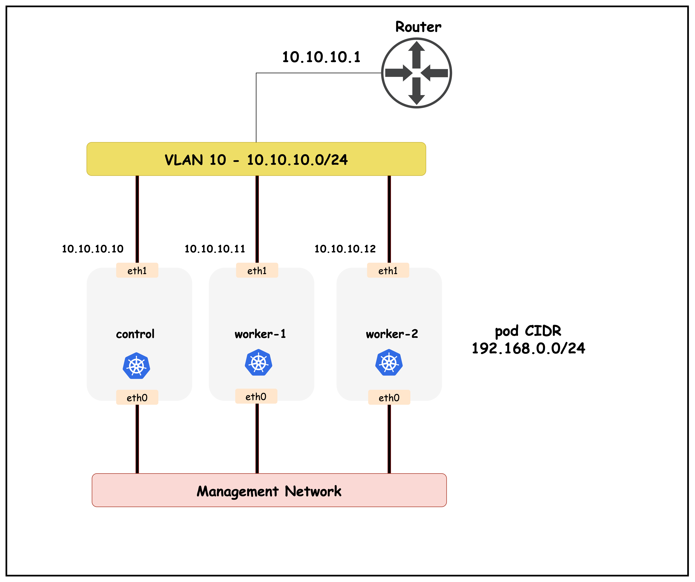
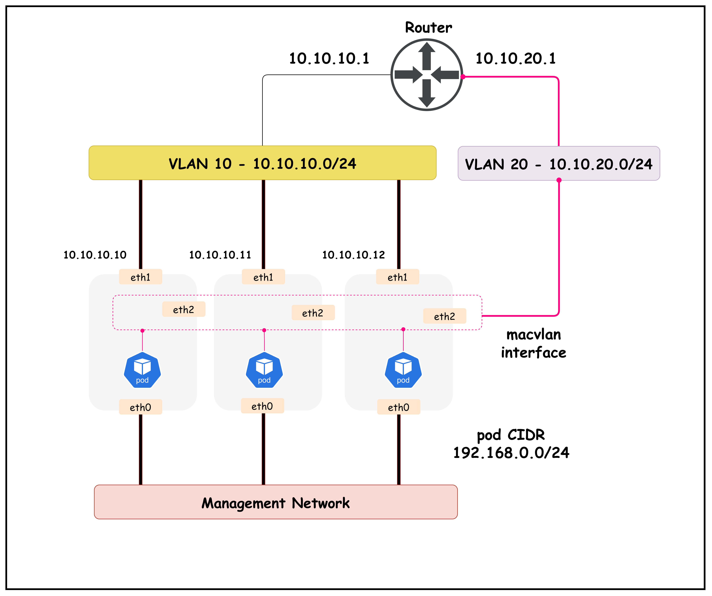
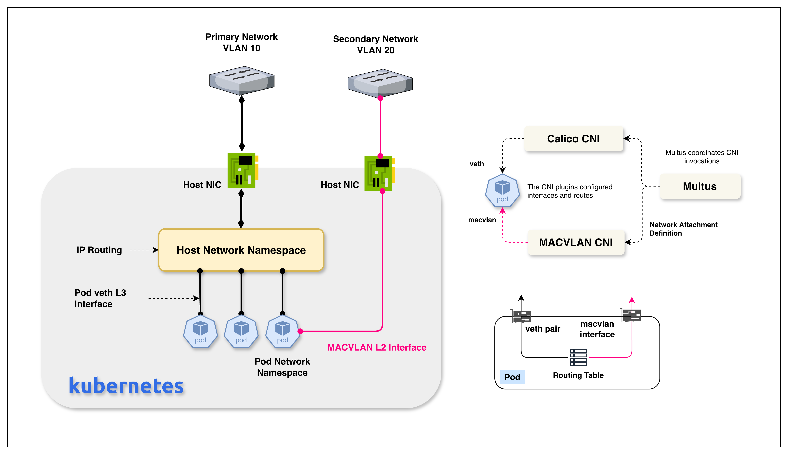

# Multi-Network using Multus and MACVLAN CNI

This lab demonstrates how to use macvlan CNI with Multus to attach pods directly to a VLAN network. The lab uses Calico as the primary CNI for pod networking and adds a second VLAN (VLAN 20) that pods can connect to using macvlan interfaces.

## Lab Overview

This lab shows:
- How to configure multiple VLANs on network infrastructure
- How to set up Multus CNI for secondary network interfaces
- How to use macvlan CNI to attach pods directly to a VLAN
- How pods can have both Calico (primary) and macvlan (secondary) interfaces

## Lab Architecture

- **VLAN 10**: Used by Calico for pod-to-pod networking
  - Control Plane: `10.10.10.10/24`
  - Worker 1: `10.10.10.11/24`
  - Worker 2: `10.10.10.12/24`
  - Switch Gateway: `10.10.10.1/24`

- **VLAN 20**: Used for macvlan pod attachments
  - Switch Gateway: `10.10.20.1/24`
  - Pod IP Range: `10.10.20.100-200/24`

## Topology



```
                    Arista cEOS Switch
                           |
        +------------------+------------------+
        |                  |                  |
   k01-control-plane   k01-worker      k01-worker2
   eth1: VLAN 10      eth1: VLAN 10    eth1: VLAN 10
   eth2: VLAN 20      eth2: VLAN 20    eth2: VLAN 20
```

Each node has:
- `eth1`: Connected to VLAN 10 (Calico pod network)
- `eth2`: Connected to VLAN 20 (macvlan network) - used directly as macvlan parent interface





## Lab Setup

To setup the lab for this module **[Lab setup](../readme.md#lab-setup)**

The lab folder is - `/containerlab/21-macvlan`

### Prerequisites

- ContainerLab installed
- Docker installed
- Arista cEOS image (`ceos:4.34.0F`) available

### Deploy the Lab

1. Navigate to the lab directory:
   ```bash
   cd containerlab/21-macvlan
   ```

2. Run the deploy script:
   ```bash
   ./deploy.sh
   ```

   This script will:
   - Import the Arista cEOS image if needed
   - Deploy the ContainerLab topology
   - Install Calico CNI
   - Install Multus CNI
   - Install CNI plugins (including macvlan)
   
   **Note**: You will need to manually apply the macvlan NetworkAttachmentDefinition (see step 5 below)

3. Export the kubeconfig:
   ```bash
   export KUBECONFIG=$(pwd)/k01.kubeconfig
   ```

## Lab Exercises

### 1. Inspect ContainerLab Topology

##### command
```bash
containerlab inspect topology.clab.yaml
```

##### output
```
| Name                   | Kind          | Image                | State   | IPv4 Address |
|------------------------|---------------|----------------------|---------|--------------|
| k01-control-plane      | ext-container | kindest/node:v1.32.2 | running | 172.18.0.2   |
| k01-worker             | ext-container | kindest/node:v1.32.2 | running | 172.18.0.3   |
| k01-worker2            | ext-container | kindest/node:v1.32.2 | running | 172.18.0.4   |
| clab-macvlan-ceos01    | arista_ceos   | ceos:4.34.0F         | running | 172.20.20.2  |
```

### 2. Verify Kubernetes Cluster

##### command
```bash
kubectl get nodes -o wide
```

##### output
```
NAME                STATUS   ROLES           AGE   VERSION
k01-control-plane   Ready    control-plane   47m   v1.32.2
k01-worker          Ready    <none>          46m   v1.32.2
k01-worker2         Ready    <none>          46m   v1.32.2
```

### 3. Verify VLAN 20 Interface Configuration

Check that `eth2` is up and configured on each node:

##### command
```bash
docker exec -it k01-control-plane ip link show eth2
docker exec -it k01-worker ip link show eth2
docker exec -it k01-worker2 ip link show eth2
```

##### output
```
3: eth2: <BROADCAST,MULTICAST,UP,LOWER_UP> mtu 1500 qdisc mq state UP mode DEFAULT group default qlen 1000
    link/ether 02:42:ac:12:00:02 brd ff:ff:ff:ff:ff:ff
```

The `eth2` interface is up and ready to be used as the parent interface for macvlan.

### 4. Install and Validate Multus CNI

Multus CNI enables pods to have multiple network interfaces.

#### 4.1 Install Multus CNI

##### command
```bash
kubectl apply -f https://raw.githubusercontent.com/k8snetworkplumbingwg/multus-cni/v4.0.2/deployments/multus-daemonset.yml
```

#### 4.2 Wait for Multus to be Ready

##### command
```bash
kubectl wait --for=condition=ready pod -l app=multus -n kube-system --timeout=120s
kubectl get pods -n kube-system | grep multus
```

##### output
```
kube-multus-ds-amd64-xxxxx   1/1     Running   0          30s
kube-multus-ds-amd64-yyyyy   1/1     Running   0          30s
kube-multus-ds-amd64-zzzzz   1/1     Running   0          30s
```

#### 4.3 View Multus Configuration

Examine the actual CNI configuration file that kubelet reads:

##### command
```bash
docker exec k01-control-plane cat /etc/cni/net.d/00-multus.conf
```

##### output
```json
{
  "cniVersion": "0.3.1",
  "name": "multus-cni-network",
  "type": "multus",
  "capabilities": {"portMappings":true},
  "kubeconfig": "/etc/cni/net.d/multus.d/multus.kubeconfig",
  "delegates": [
    {
      "cniVersion":"0.3.1",
      "name":"k8s-pod-network",
      "plugins":[
        {
          "type":"calico",
          "ipam":{"type":"calico-ipam"},
          ...
        },
        {
          "type":"portmap",
          "capabilities":{"portMappings":true}
        }
      ]
    }
  ]
}
```

### Understanding CNI Architecture

This section explains how CNI plugins work together. Understanding this is essential for troubleshooting and advanced configurations.

#### Key Directories

| Directory | Purpose |
|-----------|---------|
| `/etc/cni/net.d/` | Configuration files (JSON) - **what** to do |
| `/opt/cni/bin/` | Plugin binaries - **how** to do it |

**Critical Rule**: The `"type"` field in config files must match a binary name in `/opt/cni/bin/`.

#### CNI Invocation Flow

```
Pod Created
    ↓
Kubelet scans /etc/cni/net.d/ (alphabetical order)
    ↓
Selects first valid config (00-multus.conf)
    ↓
Reads "type": "multus" → Executes /opt/cni/bin/multus
    ↓
Multus delegates to primary CNI (Calico) → eth0 created
    ↓
Multus checks pod annotations for secondary networks
    ↓
If annotation exists → Invokes macvlan CNI → net1 created
```

#### How Multus Selects CNI Plugins

Multus uses a **two-tier configuration model**:

1. **Primary CNI** (from `delegates` array):
   - Always invoked for every pod
   - First delegate's first plugin becomes primary CNI
   - Creates `eth0` interface

2. **Secondary CNIs** (from NetworkAttachmentDefinitions):
   - Configured as Kubernetes Custom Resources
   - Invoked only when pods request them via annotations
   - Creates `net1`, `net2`, etc.

**The `plugins` array** within each delegate defines a **chain** of CNI plugins:
- **Calico**: Creates network interface, assigns IP, configures routes
- **Portmap**: Implements `hostPort` feature via iptables (not NodePort - that's handled by kube-proxy)

#### File Naming Matters

Files in `/etc/cni/net.d/` are processed alphabetically:
- `00-multus.conf` is read **before** `10-calico.conflist`
- The first valid config becomes the default network

##### command
```bash
docker exec k01-control-plane ls -la /etc/cni/net.d/
```

##### output
```
-rw------- 1 root root 1000 Jan 16 22:23 00-multus.conf
-rw------- 1 root root  713 Jan 16 22:21 10-calico.conflist
-rw------- 1 root root 2801 Jan 16 22:22 calico-kubeconfig
drwxr-xr-x 2 root root 4096 Jan 16 22:23 multus.d
```

#### Kubelet CNI Configuration

Kubelet uses default paths when not explicitly configured:
- **`cniConfDir`**: `/etc/cni/net.d`
- **`cniBinDir`**: `/opt/cni/bin`

You can verify kubelet's configuration:

##### command
```bash
docker exec k01-control-plane ps aux | grep kubelet
```

#### Verify CNI Plugin Types and Binaries

##### command
```bash
# Check configured CNI types
docker exec k01-control-plane cat /etc/cni/net.d/00-multus.conf | jq -r '.type, .delegates[0].plugins[].type'

# Verify binaries exist
docker exec k01-control-plane ls /opt/cni/bin/ | grep -E "multus|calico|macvlan|whereabouts|portmap"
```

##### output
```
calico
calico-ipam
multus
portmap
```

### 4.4 Install Whereabouts IPAM

Whereabouts IPAM provides cluster-wide IP allocation coordination, ensuring no IP conflicts across nodes.

**Important**: CRDs must be installed before the daemonset.

##### Step 1: Install CRDs

##### command
```bash
kubectl apply -f https://raw.githubusercontent.com/k8snetworkplumbingwg/whereabouts/v0.9.2/doc/crds/whereabouts.cni.cncf.io_ippools.yaml
kubectl apply -f https://raw.githubusercontent.com/k8snetworkplumbingwg/whereabouts/v0.9.2/doc/crds/whereabouts.cni.cncf.io_overlappingrangeipreservations.yaml
```

##### Step 2: Install DaemonSet

##### command
```bash
kubectl apply -f https://raw.githubusercontent.com/k8snetworkplumbingwg/whereabouts/v0.9.2/doc/crds/daemonset-install.yaml
kubectl wait --for=condition=ready pod -l app=whereabouts -n kube-system --timeout=120s
```

##### Step 3: Verify CRDs

##### command
```bash
kubectl get crd | grep whereabouts
```

##### output
```
ippools.whereabouts.cni.cncf.io                         2025-01-16T22:30:00Z
overlappingrangeipreservations.whereabouts.cni.cncf.io   2025-01-16T22:30:00Z
```

Both CRDs must be present. If missing, you'll see errors like:
```
error at storage engine: the server could not find the requested resource (get ippools.whereabouts.cni.cncf.io)
```

### 4.5 Install CNI Plugins

Install CNI plugins (including macvlan) on each node:

##### command
```bash
CNI_PLUGINS_VERSION="v1.4.0"
CNI_PLUGINS_URL="https://github.com/containernetworking/plugins/releases/download/${CNI_PLUGINS_VERSION}/cni-plugins-linux-amd64-${CNI_PLUGINS_VERSION}.tgz"

for node in k01-control-plane k01-worker k01-worker2; do
  echo "Installing CNI plugins on $node..."
  docker exec $node sh -c "curl -L ${CNI_PLUGINS_URL} | tar -C /opt/cni/bin -xz"
done
```

Verify macvlan is installed:

##### command
```bash
docker exec k01-control-plane ls -la /opt/cni/bin/ | grep macvlan
```

### 5. Create Macvlan NetworkAttachmentDefinition

Before deploying pods with macvlan interfaces, create a NetworkAttachmentDefinition:

##### command
```bash
cat calico-cni-config/macvlan-nad.yaml
```

##### output
```yaml
apiVersion: k8s.cni.cncf.io/v1
kind: NetworkAttachmentDefinition
metadata:
  name: vlan20-macvlan
  namespace: default
spec:
  config: |
    {
      "cniVersion": "0.3.1",
      "name": "vlan20-macvlan",
      "type": "macvlan",
      "master": "eth2",
      "mode": "bridge",
      "ipam": {
        "type": "whereabouts",
        "range": "10.10.20.100-10.10.20.200/24",
        "exclude": ["10.10.20.1/32"],
        "gateway": "10.10.20.1"
      }
    }
```

##### explanation

| Field | Description |
|-------|-------------|
| `type: macvlan` | Uses macvlan CNI plugin |
| `master: eth2` | Parent physical interface for macvlan |
| `mode: bridge` | Macvlan mode (allows same-host communication via switch) |
| `ipam.type: whereabouts` | Cluster-wide IP coordination (no conflicts across nodes) |
| `ipam.range` | IP range for allocation |
| `ipam.gateway` | VLAN 20 gateway (switch interface) |

**Macvlan Modes**:
- **`bridge`**: Same-host macvlan interfaces communicate (via switch when parent is physical)
- **`vepa`**: All traffic sent to external switch
- **`passthru`**: Single container gets full interface access
- **`private`**: No communication between same-host macvlan interfaces

Apply the NetworkAttachmentDefinition:

##### command
```bash
kubectl apply -f calico-cni-config/macvlan-nad.yaml
kubectl get network-attachment-definitions
```

##### output
```
NAME              AGE
vlan20-macvlan   5s
```

### 6. Deploy a Pod with Macvlan Interface

> [!Important]
> Complete step 5 first. Pods will fail if the NetworkAttachmentDefinition doesn't exist.

##### command
```bash
cat tools/macvlan-pod.yaml
```

##### output
```yaml
apiVersion: v1
kind: Pod
metadata:
  name: macvlan-test-pod
  namespace: default
  annotations:
    k8s.v1.cni.cncf.io/networks: vlan20-macvlan
spec:
  containers:
  - name: netshoot
    image: nicolaka/netshoot
    command: ["sleep", "infinity"]
```

The annotation `k8s.v1.cni.cncf.io/networks: vlan20-macvlan` tells Multus to attach a secondary macvlan interface.

##### command
```bash
kubectl apply -f tools/macvlan-pod.yaml
kubectl get pod macvlan-test-pod -o wide
```

### 7. Inspect Pod Network Interfaces

##### command
```bash
kubectl exec macvlan-test-pod -- ip addr show
```

##### output
```
1: lo: <LOOPBACK,UP,LOWER_UP> mtu 65536 ...
    inet 127.0.0.1/8 scope host lo
3: eth0@if4: <BROADCAST,MULTICAST,UP,LOWER_UP> mtu 1440 ...
    inet 192.168.0.1/32 scope global eth0
4: net1@if5: <BROADCAST,MULTICAST,UP,LOWER_UP> mtu 1500 ...
    link/ether 02:42:0a:0a:14:64 brd ff:ff:ff:ff:ff:ff
    inet 10.10.20.100/24 scope global net1
```

The pod has two interfaces:
- **`eth0`**: Primary interface from Calico (192.168.0.1/32)
- **`net1`**: Secondary interface from macvlan (10.10.20.100/24)

**Key**: The macvlan interface has its own **unique MAC address** - this is a defining characteristic of macvlan.

### 8. Validate on cEOS Switch

#### 8.1 Access the Switch

##### command
```bash
docker exec -it clab-macvlan-ceos01 Cli
enable
```

#### 8.2 Check MAC Address Table

##### command
```bash
show mac address-table vlan 20
```

##### output
```
Vlan    Mac Address       Type        Ports      Moves   Last Move
----    -----------       ----        -----      -----   ---------
  20    0242.0a0a.1464    DYNAMIC     Et4        1       0:00:15 ago
```

The switch learned the pod's MAC address (`0242.0a0a.1464` = `02:42:0a:0a:14:64`).

#### 8.3 Ping Pod from Switch

##### command
```bash
ping 10.10.20.100
```

##### output
```
64 bytes from 10.10.20.100: icmp_seq=1 ttl=64 time=0.123 ms
3 packets transmitted, 3 received, 0% packet loss
```

This demonstrates bidirectional Layer 2 connectivity - the switch can reach pods directly via VLAN 20.

#### 8.4 Check ARP Table

##### command
```bash
show arp
```

##### output
```
Address         Age (sec)  Hardware Addr    Type   Interface
10.10.20.100    00:00:05   0242.0a0a.1464   D      Vlan20
```

#### 8.5 Exit Switch CLI

##### command
```bash
exit
exit
```

### 9. Test Connectivity on VLAN 20

##### command
```bash
kubectl exec macvlan-test-pod -- ping -c 3 10.10.20.1
```

##### output
```
64 bytes from 10.10.20.1: seq=0 ttl=64 time=0.123 ms
3 packets transmitted, 3 packets received, 0% packet loss
```

### 10. Deploy Multiple Pods with Macvlan

> [!Important]
> Ensure the NetworkAttachmentDefinition from step 5 exists.

Deploy a DaemonSet to test macvlan on all nodes:

##### command
```bash
kubectl apply -f tools/macvlan-daemonset.yaml
kubectl get pods -l app=macvlan-test -o wide
```

##### output
```
NAME                    READY   STATUS    NODE
macvlan-test-ds-xxxxx   1/1     Running   k01-control-plane
macvlan-test-ds-yyyyy   1/1     Running   k01-worker
macvlan-test-ds-zzzzz   1/1     Running   k01-worker2
```

**Note**: The DaemonSet includes tolerations for control plane taints, allowing pods on all nodes.

### 11. Test Pod-to-Pod Communication on VLAN 20

Get pod IPs and test connectivity:

##### command
```bash
kubectl exec macvlan-test-ds-xxxxx -- ip addr show net1 | grep "inet "
kubectl exec macvlan-test-ds-yyyyy -- ip addr show net1 | grep "inet "
```

##### output
```
inet 10.10.20.100/24 scope global net1
inet 10.10.20.101/24 scope global net1
```

##### command
```bash
kubectl exec macvlan-test-ds-xxxxx -- ping -c 3 10.10.20.101
```

##### output
```
64 bytes from 10.10.20.101: seq=0 ttl=64 time=0.456 ms
3 packets transmitted, 3 packets received, 0% packet loss
```

Pods communicate directly on VLAN 20 at Layer 2, bypassing the Kubernetes overlay.

### 12. Compare Primary and Secondary Interfaces

##### command
```bash
kubectl exec macvlan-test-pod -- ip route show
```

##### output
```
default via 169.254.1.1 dev eth0
169.254.1.1 dev eth0 scope link
10.10.20.0/24 dev net1 proto kernel scope link src 10.10.20.100
192.168.0.0/16 via 169.254.1.1 dev eth0
```

| Route | Interface | Purpose |
|-------|-----------|---------|
| `default` | eth0 (Calico) | All general traffic |
| `10.10.20.0/24` | net1 (macvlan) | VLAN 20 traffic (more specific, takes precedence) |
| `192.168.0.0/16` | eth0 (Calico) | Pod network traffic |

**Key**: Primary CNI (Calico) sets the default route. Secondary CNIs add specific routes.

## Understanding Macvlan

### What is Macvlan?

Macvlan is a Linux kernel feature that creates virtual network interfaces, each with its own MAC address, from a single physical interface. Pods get direct Layer 2 connectivity to the network infrastructure.

### Macvlan vs. Other CNI Plugins

| CNI | Mechanism | Overhead |
|-----|-----------|----------|
| Calico/VXLAN | Overlay with encapsulation | Higher |
| Bridge CNI | Linux bridges | Medium |
| Macvlan | Direct Layer 2 attachment | Lowest |

### Use Cases

1. **Direct Network Access**: Pods need direct access to physical network infrastructure
2. **Performance**: Eliminates overlay network overhead
3. **Legacy Applications**: Applications requiring direct Layer 2 connectivity
4. **NFV**: VNFs that need to appear as physical network devices

## Summary

This lab demonstrates:

### Architecture
- **Kubernetes Cluster**: 3-node Kind cluster with Calico CNI
- **VLAN 10**: Calico network for standard pod communication
- **VLAN 20**: Macvlan network for direct Layer 2 pod attachments

### Key Components
- **Calico CNI**: Primary CNI for pod networking (creates `eth0`)
- **Multus CNI**: Enables multiple network interfaces per pod
- **Macvlan CNI**: Provides direct Layer 2 connectivity (creates `net1`)
- **Whereabouts IPAM**: Cluster-wide IP coordination for macvlan
- **NetworkAttachmentDefinition**: Defines secondary network configuration

### Key Learnings
- Multus delegates to primary CNI (first in `delegates` array) then processes pod annotations for secondary CNIs
- CNI config files in `/etc/cni/net.d/` reference binaries in `/opt/cni/bin/` via the `type` field
- File naming determines CNI selection order (alphabetical)
- Macvlan provides direct Layer 2 connectivity with unique MAC addresses per pod
- Pods can have both overlay (Calico) and underlay (macvlan) interfaces simultaneously

## Lab Cleanup

To cleanup the lab follow steps in **[Lab cleanup](../readme.md#lab-cleanup)**

```bash
./destroy.sh
```
