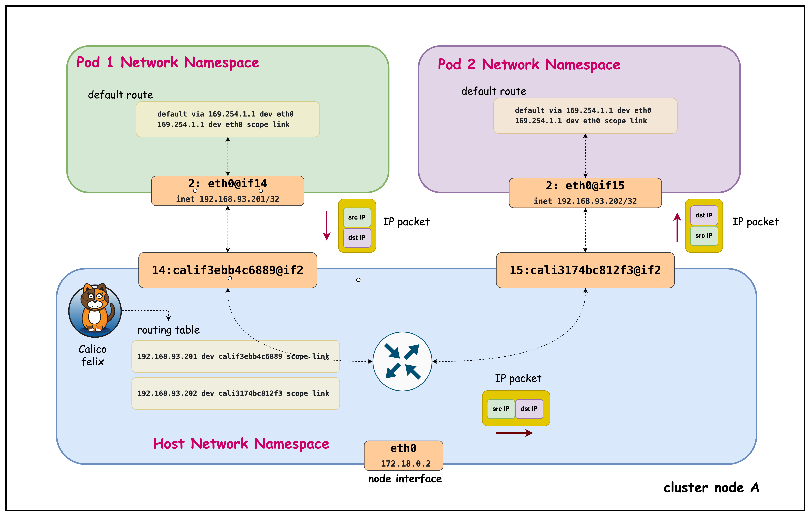
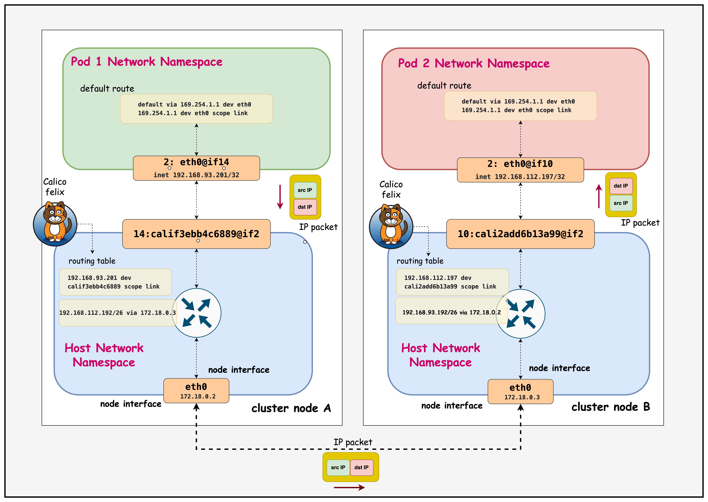

# Calico Pod Routing

This lab demonstrates Calico's pod routing functionality in a 3-node Kind Kubernetes cluster.

## Why Pod Routing is Required

In Kubernetes, pods need to communicate with each other seamlessly across the cluster, but this presents unique networking challenges that require sophisticated routing solutions. Pod routing is essential for several critical scenarios:

### **Pod-to-Pod Communication Within the Same Node**

Even when pods are on the same physical node, they operate in isolated network namespaces and require proper routing:

- **Per-Pod /32 & Namespace Isolation**: Each pod has its own network namespace with a /32 address and can't ARP directly for peer pod IPs, so traffic must be forwarded via the host.
- **Deterministic Host Routing (169.254.1.1)**: Calico installs per-pod routes and uses a uniform link‑local next hop to stitch veth pairs, removing L2 broadcast/ARP noise and ensuring predictable reachability.
- **Central Enforcement & Visibility**: Routing through the host enables NetworkPolicy enforcement, conntrack/stateful inspection, metrics, and rapid route lifecycle updates even for intra-node flows.


### **Pod-to-Pod Communication Between Different Nodes**

Cross-node pod communication introduces additional complexity requiring cluster-wide routing coordination:

- **Smarter Routing with Node Blocks**: Calico gives each node its own IP block (like a /26) instead of announcing every single pod IP. This means pod starts and stops don’t flood the network with updates, only block changes matter. It keeps routing stable, fast, and avoids blackholes when scaling, draining, or moving pods.
- **Keep Pod Identity (No SNAT)**: Retaining original pod IPs across nodes keeps NetworkPolicy, observability, and service load-balancing decisions accurate end-to-end.
- **Efficient, Predictable Traffic**: By routing per-node blocks directly, Calico avoids unnecessary tunneling, preserves MTU space, and uses ECMP for balanced paths. The result: lower latency, less overhead, and reliable cross-node performance.


**Calico addresses these challenges by providing a comprehensive routing solution that handles both same-node and cross-node scenarios through efficient route distribution.**


## Lab Setup

You need an EC2 instance or VM configured with containerlab. This repo provides a script to provision a preconfigured EC2 instance. 
📖 **[Back to Main Labs](../../README.md)** | 🚀 **[Deploy Lab Environment](../../README.md#deploying-the-lab-environment)**

Make sure you have cloned the repo to this machine prior to going through the rest of the steps in this lab. 

   ```
   git clone https://github.com/aadhilam/k8-networking-calico-containerlab.git
   ```

This lab consists of:
- 3-node Kind cluster (1 control-plane, 2 workers)
- Calico CNI with IPAM enabled
- Pod CIDR: 192.168.0.0/16
- Block size: /26 (64 IPs per block)
- Two multitool DaemonSets (multitool-1 and multitool-2) for testing pod-to-pod connectivity

## Deployment

The `deploy.sh` script automates the complete lab setup process:

1. **ContainerLab Topology Deployment**: Creates a 3-node Kind cluster using the `pod-routing.clab.yaml` configuration
2. **Kubeconfig Setup**: Exports the Kind cluster's kubeconfig for kubectl access
3. **Calico Installation**: Downloads and installs calicoctl, then deploys Calico CNI components:
   - Calico Operator CRDs
   - Tigera Operator
   - Custom Calico resources with IPAM configuration
4. **Test Pod Deployment**: Deploys two multitool DaemonSets for connectivity testing
5. **Verification**: Waits for all Calico components to become available before completion


Deploy the lab using:
```bash
cd containerlab/pod-routing
chmod +x deploy.sh
./deploy.sh
```

## Verify cluster setup

After deployment, verify the cluster is ready by checking the ContainerLab topology status:

### 1. Inspect ContainerLab Topology

```bash
containerlab inspect -t pod-routing.clab.yaml
```

##### Output Example:
```
03:35:37 INFO Parsing & checking topology file=pod-routing.clab.yaml
╭───────────────────────────┬──────────────────────┬─────────┬───────────────────────╮
│            Name           │      Kind/Image      │  State  │     IPv4/6 Address    │
├───────────────────────────┼──────────────────────┼─────────┼───────────────────────┤
│ pod-routing-control-plane │ k8s-kind             │ running │ 172.18.0.4            │
│                           │ kindest/node:v1.28.0 │         │ fc00:f853:ccd:e793::4 │
├───────────────────────────┼──────────────────────┼─────────┼───────────────────────┤
│ pod-routing-worker        │ k8s-kind             │ running │ 172.18.0.2            │
│                           │ kindest/node:v1.28.0 │         │ fc00:f853:ccd:e793::2 │
├───────────────────────────┼──────────────────────┼─────────┼───────────────────────┤
│ pod-routing-worker2       │ k8s-kind             │ running │ 172.18.0.3            │
│                           │ kindest/node:v1.28.0 │         │ fc00:f853:ccd:e793::3 │
╰───────────────────────────┴──────────────────────┴─────────┴───────────────────────╯
```

##### Explanation:
This output shows the ContainerLab topology status with three Kubernetes nodes running in Docker containers. All nodes are in "running" state with their assigned IPv4 and IPv6 addresses within the Docker bridge network (172.18.0.0/16).

### 2. Check Kubernetes Cluster Status

```bash
# Set kubeconfig to use the cluster
export KUBECONFIG=/home/ubuntu/containerlab/pod-routing/pod-routing.kubeconfig

# Check cluster nodes
kubectl get nodes -o wide
```

##### Output Example:
```
NAME                        STATUS   ROLES           AGE   VERSION   INTERNAL-IP   EXTERNAL-IP   OS-IMAGE                         KERNEL-VERSION   CONTAINER-RUNTIME
pod-routing-control-plane   Ready    control-plane   27h   v1.28.0   172.18.0.4    <none>        Debian GNU/Linux 11 (bullseye)   6.2.0-1012-aws   containerd://1.7.1
pod-routing-worker          Ready    <none>          27h   v1.28.0   172.18.0.2    <none>        Debian GNU/Linux 11 (bullseye)   6.2.0-1012-aws   containerd://1.7.1
pod-routing-worker2         Ready    <none>          27h   v1.28.0   172.18.0.3    <none>        Debian GNU/Linux 11 (bullseye)   6.2.0-1012-aws   containerd://1.7.1
```

##### Explanation:
This shows all three Kubernetes nodes are in "Ready" status running v1.28.0, confirming the cluster is healthy and operational for testing pod routing functionality.

## Pod Routing

### Verify that the Multitool Daemonset is Running

```bash
kubectl get pods -o wide
```


##### Output Example:
```
NAME                READY   STATUS    RESTARTS   AGE   IP                NODE                        NOMINATED NODE   READINESS GATES
multitool-1-7ltxg   1/1     Running   0          41m   192.168.112.197   pod-routing-worker2         <none>           <none>
multitool-1-cn99j   1/1     Running   0          41m   192.168.116.3     pod-routing-control-plane   <none>           <none>
multitool-1-vmn9d   1/1     Running   0          41m   192.168.93.201    pod-routing-worker          <none>           <none>
multitool-2-67htd   1/1     Running   0          40m   192.168.112.198   pod-routing-worker2         <none>           <none>
multitool-2-mf8vt   1/1     Running   0          40m   192.168.93.202    pod-routing-worker          <none>           <none>
multitool-2-xpgdk   1/1     Running   0          40m   192.168.116.4     pod-routing-control-plane   <none>           <none>
```

##### Explanation: 
Both DaemonSets (multitool-1 and multitool-2) are running successfully with one pod per node across all three cluster nodes, each pod receiving a unique IP address from their respective node's IP block.


### 1. Examine Pod-to-Pod Communication Within the Same Node

Connect to the pod and inspect its routing configuration:

#### Exec into the multitool-1 pod in the pod-routing-worker node

```bash
kubectl exec -it multitool-1-vmn9d  -- sh
```

#### Check IP Addresses

```bash
ip addr
```

##### Output Example:

```1: lo: <LOOPBACK,UP,LOWER_UP> mtu 65536 qdisc noqueue state UNKNOWN group default qlen 1000
    link/loopback 00:00:00:00:00:00 brd 00:00:00:00:00:00
    inet 127.0.0.1/8 scope host lo
       valid_lft forever preferred_lft forever
    inet6 ::1/128 scope host 
       valid_lft forever preferred_lft forever
2: eth0@if13: <BROADCAST,MULTICAST,UP,LOWER_UP> mtu 1450 qdisc noqueue state UP group default qlen 1000
    link/ether be:b0:71:df:a2:df brd ff:ff:ff:ff:ff:ff link-netnsid 0
    inet 192.168.93.200/32 scope global eth0
       valid_lft forever preferred_lft forever
    inet6 fe80::bcb0:71ff:fedf:64 scope link 
       valid_lft forever preferred_lft forever
```

##### Explanation:
The pod has IP address 192.168.93.200/32 from the node's allocated CIDR block (192.168.93.0/26), showing Calico's per-node IP block allocation for efficient routing.

#### Check Routing Table

```bash
ip route
```

##### Output Example:
```
ip route
default via 169.254.1.1 dev eth0 
169.254.1.1 dev eth0 scope link 
```

##### Explanation:
- **Default Route**: All traffic goes via 169.254.1.1 through eth0
- **169.254.1.1**: Calico's virtual next-hop IP (link-local address)
- **scope link**: The next-hop is directly reachable on the same network segment
- **Calico's Approach**: Uses a consistent next-hop IP across all pods, simplifying routing

#### Ping Another Pod in the Same Node

```
nohup ping 192.168.93.202 > samehostping.log 2>&1 &
```
##### Output Example:

This output confirms successful pod-to-pod communication within the same node, with TTL=63 showing the packet made one hop through the host's routing layer (decremented from the original TTL of 64).


```
cat samehostping.log

PING 192.168.93.202 (192.168.93.202) 56(84) bytes of data.
64 bytes from 192.168.93.202: icmp_seq=1 ttl=63 time=0.104 ms
64 bytes from 192.168.93.202: icmp_seq=2 ttl=63 time=0.095 ms
64 bytes from 192.168.93.202: icmp_seq=3 ttl=63 time=0.080 ms
64 bytes from 192.168.93.202: icmp_seq=4 ttl=63 time=0.083 ms
64 bytes from 192.168.93.202: icmp_seq=5 ttl=63 time=0.228 ms
```

Exit from Pod
```
exit
```

#### Connect to the Host Node

Access the worker node where the pod is scheduled:

```bash
docker exec -it pod-routing-worker /bin/bash
```
Now you're inside the Kubernetes worker node and can examine the host routing configuration.

```bash
# Find the route to the pod's IP address on the host
ip route | grep 192.168.93.202 
```

##### Output Example:
```
192.168.93.202 dev cali3174bc812f3 scope link 
```

##### Explanation:
This shows the host node's direct route to the pod IP (192.168.93.202) via the Calico veth interface (cali3174bc812f3), enabling intra-node pod communication without requiring a gateway.

Exit from the Node
```
exit
```

#### Exec into the multitool-2 pod in the pod-routing-worker node

Now we'll access the second pod (multitool-2) on the same <mark>**worker node**</mark> to examine its network configuration and compare it with the first pod.

```bash
kubectl exec -it multitool-2-mf8vt   -- sh
```
Capture Network Traffic on the Destination Pod

```
tcpdump -n
```

Output Example:
```
/ # tcpdump -n
tcpdump: verbose output suppressed, use -v[v]... for full protocol decode
listening on eth0, link-type EN10MB (Ethernet), snapshot length 262144 bytes
00:29:47.987595 IP 192.168.93.201 > 192.168.93.202: ICMP echo request, id 134, seq 42, length 64
00:29:47.987607 IP 192.168.93.202 > 192.168.93.201: ICMP echo reply, id 134, seq 42, length 64
00:29:48.175723 IP 192.168.93.201 > 192.168.93.202: ICMP echo request, id 131, seq 94, length 64
00:29:48.175737 IP 192.168.93.202 > 192.168.93.201: ICMP echo reply, id 131, seq 94, length 64
00:29:49.007696 IP 192.168.93.201 > 192.168.93.202: ICMP echo request, id 134, seq 43, length 64
00:29:49.007709 IP 192.168.93.202 > 192.168.93.201: ICMP echo reply, id 134, seq 43, length 64
00:29:49.203785 IP 192.168.93.201 > 192.168.93.202: ICMP echo request, id 131, seq 95, length 64
00:29:49.203801 IP 192.168.93.202 > 192.168.93.201: ICMP echo reply, id 131, seq 95, length 64
```

##### Explanation:
This tcpdump output shows bidirectional ICMP traffic between the two pods on the same worker node:
- **Source Pod (192.168.93.201)** sends echo requests to **Destination Pod (192.168.93.202)**
- **Immediate Replies**: Each request gets an immediate reply (microsecond-level timing), showing efficient intra-node communication
- **Multiple Ping Streams**: Notice different sequence IDs (134 and 131) indicating multiple concurrent ping processes
- **Same CIDR Block**: Both IPs are from the same node's /26 block (192.168.93.0/26), confirming same-host communication
- **No NAT/Encapsulation**: Original pod IPs are preserved, demonstrating Calico's native routing without tunneling overhead

The second pod (multitool-2) has IP address 192.168.93.202/32 on its eth0 interface, which is also from the same node's CIDR block (192.168.93.0/26) as the first pod, confirming both pods are on the same worker node.

Exit from the Pod
```
exit
```




### 3. Examine Pod-to-Pod Communication in Different Nodes

#### Exec into the multitool-1 pod in the pod-routing-worker node

```bash
kubectl exec -it multitool-1-vmn9d  -- sh
```
##### Ping the multitool-1 Pod in the pod-routing-worker2 Node

Now we'll test cross-node communication by pinging from the multitool-1 pod on **pod-routing-worker** (IP: 192.168.93.201) to the multitool-1 pod on **pod-routing-worker2** (IP: 192.168.112.197).

Start a continuous ping in the background to generate cross-node traffic for analysis:

```
 nohup ping 192.168.112.197 > ping.log 2>&1 &
```

After letting the ping run for a few seconds, check the results:

```
cat ping.log
```

##### Output Example:

This output confirms successful pod-to-pod communication between different nodes, with TTL=62 showing the packet made two hops (through the source node's routing layer and across the network to the destination node).

```
PING 192.168.112.197 (192.168.112.197) 56(84) bytes of data.
64 bytes from 192.168.112.197: icmp_seq=1 ttl=62 time=0.146 ms
64 bytes from 192.168.112.197: icmp_seq=2 ttl=62 time=0.122 ms
64 bytes from 192.168.112.197: icmp_seq=3 ttl=62 time=0.110 ms
64 bytes from 192.168.112.197: icmp_seq=4 ttl=62 time=0.117 ms
64 bytes from 192.168.112.197: icmp_seq=5 ttl=62 time=0.114 ms
64 bytes from 192.168.112.197: icmp_seq=6 ttl=62 time=0.111 ms
64 bytes from 192.168.112.197: icmp_seq=7 ttl=62 time=0.111 ms
64 bytes from 192.168.112.197: icmp_seq=8 ttl=62 time=0.116 ms
64 bytes from 192.168.112.197: icmp_seq=9 ttl=62 time=0.100 ms
```

 Exit from the Pod

```bash
exit
```

#### Connect to the Host Node of the Source Pod - pod-routing-worker

Now let's examine how the host node routes traffic to the destination pod on the other node:

```bash
docker exec -it pod-routing-worker /bin/bash
```

##### Check How the Host Routes Cross-Node Traffic

```bash
ip route get 192.168.112.197
```

##### Output Example
```
192.168.112.197 via 172.18.0.3 dev eth0 src 172.18.0.2 uid 0 
    cache 
```

##### Explanation
- **via 172.18.0.3**: Traffic to the destination pod is routed through this gateway (pod-routing-worker2 node)
- **dev eth0**: Traffic exits through the eth0 interface
- **src 172.18.0.2**: The routing table shows what source IP the host would use, not what the pod actually uses for its traffic. The pod uses its actual IP (192.168.93.201) as the source. Source NAT (SNAT) would only occur when pods communicate with external networks outside the cluster, where the node's IP replaces the pod IP for outbound traffic. For pod-to-pod communication within the cluster, no SNAT occurs - pods retain their original IPs.
- **cache**: This route is cached for performance

Exit from the Host Node

```bash
exit
```
#### Connect to the Host Node of the Destination Pod - pod-routing-worker2

Now let's examine how the destination node handles incoming traffic for its local pods:

```bash
docker exec -it pod-routing-worker2 /bin/bash
```

##### Check Local Pod Routing on the Destination Node

```bash
ip route | grep 192.168.112.197
```

##### Output Example:
```
192.168.112.197 dev cali2add6b13a99 scope link 
```

##### Explanation:
- **192.168.112.197**: The destination pod's IP address
- **dev cali2add6b13a99**: Traffic is routed directly to the Calico veth interface for this pod
- **scope link**: The destination is directly reachable on the local network segment (no gateway needed)
- **Local delivery**: Unlike cross-node routing, local pods are reached directly through their veth interfaces

Exit from the Destination Host Node

```bash
exit
```

#### Analyze Cross-Node Traffic at the Destination Pod

Now let's examine the actual traffic as it arrives at the destination pod to confirm end-to-end connectivity:

```bash
kubectl exec -it multitool-1-7ltxg -- sh
```

##### Capture Network Traffic on the Destination Pod

```bash
tcpdump -n
```

##### Output Example:
```
tcpdump: verbose output suppressed, use -v[v]... for full protocol decode
listening on eth0, link-type EN10MB (Ethernet), snapshot length 262144 bytes
02:15:06.941524 IP 192.168.93.201 > 192.168.112.197: ICMP echo request, id 30, seq 1, length 64
02:15:06.941540 IP 192.168.112.197 > 192.168.93.201: ICMP echo reply, id 30, seq 1, length 64
02:15:07.955649 IP 192.168.93.201 > 192.168.112.197: ICMP echo request, id 30, seq 1, length 64
02:15:07.955663 IP 192.168.112.197 > 192.168.93.201: ICMP echo reply, id 30, seq 2, length 64
02:15:08.975608 IP 192.168.93.201 > 192.168.112.197: ICMP echo request, id 30, seq 3, length 64
02:15:08.975620 IP 192.168.112.197 > 192.168.93.201: ICMP echo reply, id 30, seq 3, length 64
```

##### Explanation
- **Source IP (192.168.93.201)**: The original pod IP from pod-routing-worker is preserved throughout the journey
- **Destination IP (192.168.112.197)**: The target pod IP on pod-routing-worker2
- **ICMP echo request/reply**: Bidirectional ping traffic showing successful cross-node communication
- **No NAT**: Pod IPs remain unchanged, confirming Calico's native routing approach
- **Sequence numbers**: Show continuous traffic flow from the background ping process




## Summary

This hands-on lab explores how Calico enables pod-to-pod communication in Kubernetes through its advanced routing capabilities. You'll examine both intra-node (same node) and inter-node (cross-node) communication patterns, understand Calico's per-node IP block allocation strategy, and observe how packets flow through the network infrastructure. The lab uses practical examples with multitool pods to demonstrate routing tables, network interfaces, and traffic analysis across a 3-node Kind cluster.

## Lab Cleanup

When you're finished with the lab, you can clean up all resources using the automated cleanup script:

```bash
chmod +x destroy.sh
./destroy.sh
```
The destroy script will:
1. **Delete the Kind cluster** (pod-routing) and all associated containers
2. **Destroy the ContainerLab topology** if it exists
3. **Verify cleanup** by checking for remaining containers and networks
4. **Clean up local files** like generated kubeconfig files
5. **Optionally remove Kind images** (asks for user confirmation)

### (Optional) Manual Cleanup Steps

If you prefer to clean up manually, you can run these commands individually:

### 1. Destroy the ContainerLab Topology

```bash
sudo containerlab destroy -t pod-routing.clab.yaml
```

This command will:
- Stop and remove all containers (Kind cluster nodes)
- Remove virtual network links between containers
- Clean up the lab-specific Docker network
- Remove any ContainerLab-generated files

### 2. Verify Cleanup

Check that all lab containers have been removed:

```bash
# Verify no lab containers are running
docker ps | grep pod-routing

# Check for any remaining ContainerLab networks
docker network ls | grep clab
```

### 3. Optional: Remove Kind Images

If you want to free up disk space, you can also remove the Kind node images:

```bash
# List Kind images
docker images | grep kindest

# Remove Kind images (optional)
docker rmi kindest/node:v1.28.0
```

### 4. Clean Up Local Files

Remove generated kubeconfig files:

```bash
rm -f pod-routing.kubeconfig
```

**Note**: The ContainerLab destroy command is safe and will only remove resources created by this specific lab topology. It will not affect other Docker containers or networks on your system.
