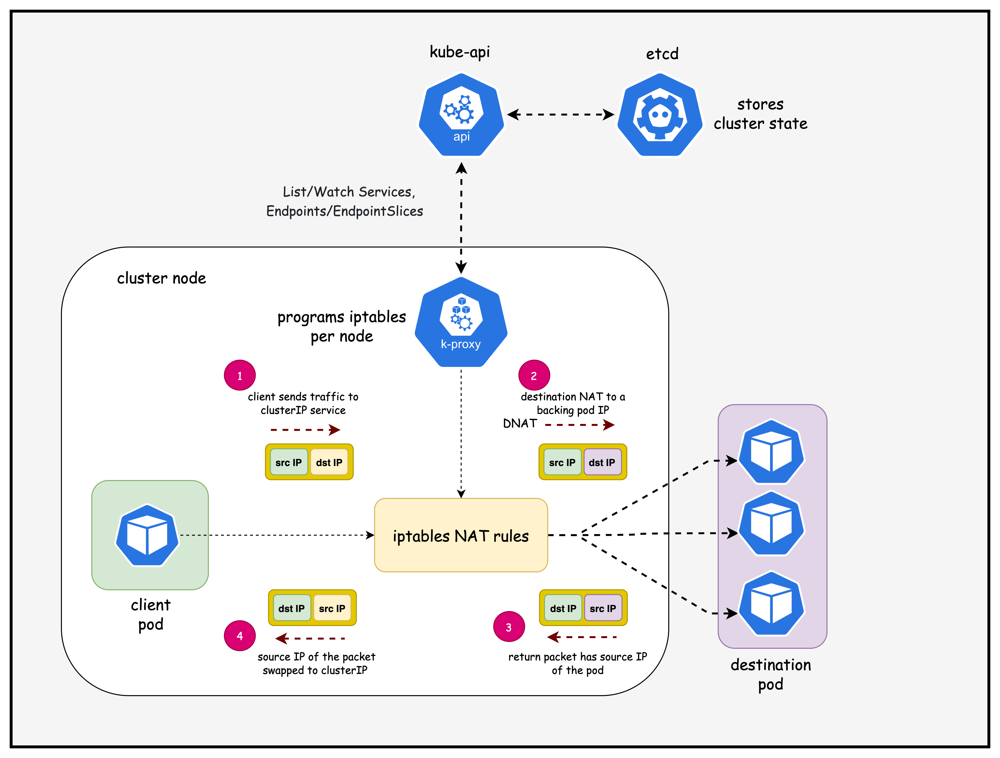
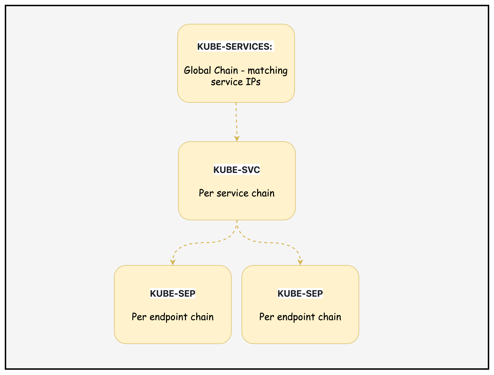
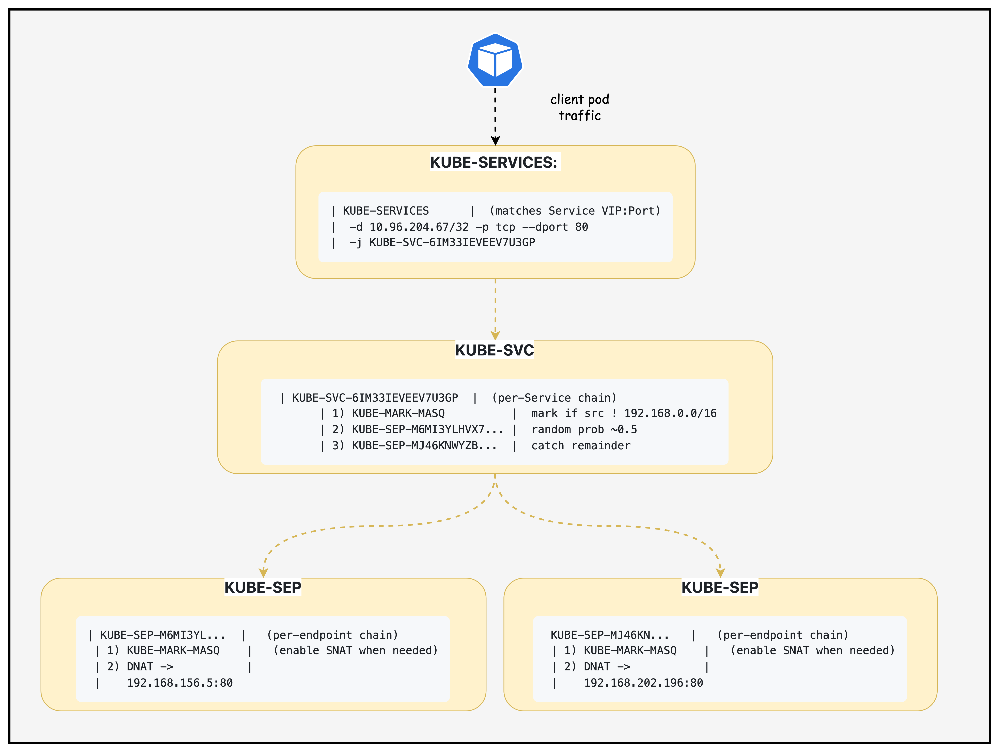

# Kubernetes Services - ClusterIP

Services provide a stable virtual IP and DNS name in front of pods. They decouple clients from pod lifecycles and provide simple L4 load balancing inside the cluster.

## Why are Kubernetes Services Required

- Pods are ephemeral: IPs change; clients need a stable endpoint.
- Load balancing: distribute traffic across replicas automatically.
- Service discovery: use DNS names instead of pod IPs.
- Controlled exposure: keep internal-only or expose externally as needed.

### The type of services

- ClusterIP: internal-only virtual IP for in-cluster access.
- NodePort: opens a port on every node (30000–32767).
- LoadBalancer: provisions an external LB (cloud/MetalLB).
- ExternalName: DNS CNAME to an external hostname; no proxying.
- Headless (`clusterIP: None`): no VIP; DNS returns pod IPs.

## Lab Setup
You need an EC2 instance or VM configured with containerlab. This repo provides a script to provision a preconfigured EC2 instance. 
📖 **[Back to Main Labs](../../README.md)** | 🚀 **[Deploy Lab Environment](../../README.md#deploying-the-lab-environment)**

Make sure you have cloned the repo to this machine prior to going through the rest of the steps in this lab. 

```
git clone https://github.com/aadhilam/k8-networking-calico-containerlab.git
```

This lab consists of:
- 3-node Kind cluster (1 control-plane, 2 workers)
- Calico CNI with IPAM enabled
- Pod CIDR: 192.168.0.0/16
- Block size: /26 (64 IPs per block)
- Two multitool DaemonSets (multitool-1 and multitool-2) and an nginx deployment with a cluster-ip service for testing pod to service connectivity

## Deployment

1. **ContainerLab Topology Deployment**: Creates a 3-node Kind cluster using the `k8s-services.clab.yaml` configuration
2. **Kubeconfig Setup**: Exports the Kind cluster's kubeconfig for kubectl access
3. **Calico Installation**: Downloads and installs calicoctl, then deploys Calico CNI components:
    - Calico Operator CRDs
    - Tigera Operator
    - Custom Calico resources with IPAM configuration
4. **Test Pod Deployment**: Deploys two multitool DaemonSets for connectivity testing and an nginx deployment with a cluster-ip service for testing pod to service connectivity
5. **Verification**: Waits for all Calico components to become available before completion


Deploy the lab using:
```bash
cd containerlab/k8s-services
chmod +x deploy.sh
./deploy.sh
```

## ClusterIP Service
Kubernetes Services of type ClusterIP provide an in-cluster virtual IP (VIP). kube-proxy on each node programs data-plane rules (iptables, IPVS, or userspace modes) to steer traffic sent to the Service VIP toward matching backend Pods.

## How kube-proxy Programs a ClusterIP Service

High-level flow and components:



Key steps when you create/update a ClusterIP Service:

- API event: You `kubectl apply` a Service; the apiserver stores it in `etcd` and updates `EndpointSlice` objects based on label selectors matching Pods.
- kube-proxy watch: Each node’s kube-proxy maintains watches on Services and EndpointSlices; it gets incremental updates.
- Program dataplane: kube-proxy translates the desired state into local dataplane rules:
  - iptables mode: Installs chains/rules that DNAT traffic destined to the Service VIP to one of the backend Pod IP:Port, with per-connection affinity and probability.
  - IPVS mode: Programs an in-kernel virtual server for the Service VIP with backend real servers (Pods), offering better scale and metrics.
- Traffic path: Any Pod on any node sending traffic to the Service ClusterIP hits local kube-proxy rules on its node, then gets load-balanced to a healthy backend Pod (local or remote). Return traffic follows normal routing (no SNAT needed in-cluster).

## Lab

After deployment, verify the cluster is ready by checking the ContainerLab topology status:

### 1. Inspect ContainerLab Topology

```bash
containerlab inspect -t k8s-services.clab.yaml
```

### 2. Verify pods and services in the default namespace

```
# Set kubeconfig to use the cluster
export KUBECONFIG=/home/ubuntu/containerlab/4-k8s-services/k8-services.kubeconfig

# Check cluster nodes
kubectl get pods -o wide
```

##### output
```
NAME                                READY   STATUS    RESTARTS   AGE   IP                NODE                        NOMINATED NODE   READINESS GATES
multitool-1-bgssq                   1/1     Running   0          8h    192.168.202.194   k8-services-worker          <none>           <none>
multitool-1-n5s2c                   1/1     Running   0          8h    192.168.145.9     k8-services-control-plane   <none>           <none>
multitool-1-vfr5n                   1/1     Running   0          8h    192.168.156.3     k8-services-worker2         <none>           <none>
multitool-2-cbbzt                   1/1     Running   0          8h    192.168.202.195   k8-services-worker          <none>           <none>
multitool-2-l8zhv                   1/1     Running   0          8h    192.168.145.10    k8-services-control-plane   <none>           <none>
multitool-2-skzmp                   1/1     Running   0          8h    192.168.156.4     k8-services-worker2         <none>           <none>
nginx-deployment-55d7bb4b86-vg4lt   1/1     Running   0          8h    192.168.156.5     k8-services-worker2         <none>           <none>
nginx-deployment-55d7bb4b86-xqh9d   1/1     Running   0          8h    192.168.202.196   k8-services-worker          <none>           <none>
```
 - Pods are healthy ✅ and spread across nodes; this confirms scheduling and readiness across the control plane and workers.
 - The Pod IP column shows routable pod CIDR addresses you’ll later see in EndpointSlices; capture them as expected backends.

##### command
```
kubectl get services -n default | grep nginx-service
```

##### output
```
nginx-service         ClusterIP   10.96.204.67   <none>        80/TCP              8h
```

 - Service VIP 🎯 is `10.96.204.67:80`; this is the stable in-cluster address clients use instead of pod IPs.
 - Type is ClusterIP, so it’s only reachable inside the cluster namespace via VIP or DNS (e.g., `nginx-service`).

##### command
```
kubectl get endpointslice | grep nginx-service
```

##### output
```
nginx-service-6zrf8         IPv4          80          192.168.156.5,192.168.202.196                  8h
```

 - EndpointSlice 🔗 lists backend Pod IPs that the Service will load-balance to; these should match the nginx pod IPs above.
 - This confirms kube-controller-manager populated endpoints and kube-proxy can program data-plane rules for this Service.


### 3. Test pod to service connectivity

Exec into the first multitool-1 pod scheduled in the worker node

##### command
```
kubectl exec -it multitool-1-bgssq  -- sh 
```
 - Opens a shell 🧰 inside the worker-scheduled test pod, letting you run network tools from an application-like vantage point.

##### command
```
telnet nginx-service 80 
```
 - Connects via Service DNS to port 80; a successful TCP handshake 🔌 proves name resolution and Service VIP routing are functional.

##### output
```
Connected to nginx-service
```
 - Connection established ✅ through kube-proxy to one of the nginx pods; this validates dataplane rules (iptables/IPVS) on the local node.

##### command
```
get
```
 - Sends a minimal HTTP request; although incomplete, it should elicit an HTTP response which is enough to validate L4→L7 reachability.

##### output
```
HTTP/1.1 400 Bad Request
Server: nginx/1.28.0
Date: Sun, 07 Sep 2025 04:33:42 GMT
Content-Type: text/html
Content-Length: 157
Connection: close

<html>
<head><title>400 Bad Request</title></head>
<body>
<center><h1>400 Bad Request</h1></center>
<hr><center>nginx/1.28.0</center>
</body>
</html>
Connection closed by foreign host
```
 - 400 Bad Request 📬 is expected for an incomplete HTTP request; it proves the request hit nginx and traversed the Service path end-to-end.


### 4. Examine iptables rules (ClusterIP path)


```
docker exec -it k8-services-worker /bin/bash
```
Traffic to a Service IP first hits KUBE-SERVICES, gets directed to a KUBE-SVC chain for load balancing, then lands in one of the KUBE-SEP endpoint chains where DNAT maps it to the actual Pod. This is how kube-proxy abstracts multiple Pods behind a single stable Service IP



#### 4.1 Locate Service Rule 🔎
##### command
```
iptables -t nat -S KUBE-SERVICES | grep nginx-service
```
##### output
```
-A KUBE-SERVICES -d 10.96.204.67/32 -p tcp -m comment --comment "default/nginx-service:http cluster IP" -m tcp --dport 80 -j KUBE-SVC-6IM33IEVEEV7U3GP
```
- What it shows
  - Matches TCP traffic to the Service VIP `10.96.204.67:80` and jumps to the per-service chain `KUBE-SVC-6IM33IEVEEV7U3GP`.
- Flags
  - `-t nat`: NAT table. `-S`: show rules in append syntax.
  - `-d <ip>/32`: exact destination IP. `-p tcp` + `--dport 80`: TCP 80.
  - `-m comment --comment`: human-readable note. `-j`: jump target.

#### 4.2 Inspect Service Chain ⚙️
##### command
```
iptables -t nat -L KUBE-SVC-6IM33IEVEEV7U3GP -n -v --line-numbers
```
##### output
```
Chain KUBE-SVC-6IM33IEVEEV7U3GP (1 references)
num   pkts bytes target            prot opt in  out source        destination
1        0     0 KUBE-MARK-MASQ   tcp  --  *    *   !192.168.0.0/16 10.96.204.67 /* default/nginx-service:http cluster IP */ tcp dpt:80
2        0     0 KUBE-SEP-M6MI3YLHVX7DA53R  all  --  *    *   0.0.0.0/0     0.0.0.0/0 /* default/nginx-service:http -> 192.168.156.5:80 */ statistic mode random probability 0.50000000000
3        0     0 KUBE-SEP-MJ46KNWYZBDUIDMY  all  --  *    *   0.0.0.0/0     0.0.0.0/0 /* default/nginx-service:http -> 192.168.202.196:80 */
```
- What it shows
  - Rule 1: mark for masquerade if client is outside `192.168.0.0/16`.
  - Rules 2–3: load-balance to endpoint chains; first with 50% probability, second catches remainder.
- Flags
  - `-L`: list rules. `-n`: no name resolution. `-v`: counters. `--line-numbers`: indices.
  - `!CIDR`: negation match. `statistic mode random`: probabilistic branching.

#### 4.3 Examine Endpoint DNAT #1 🎯
##### command
```
iptables -t nat -L KUBE-SEP-M6MI3YLHVX7DA53R -n -v --line-numbers
```
##### output
```
Chain KUBE-SEP-M6MI3YLHVX7DA53R (1 references)
num   pkts bytes target           prot opt in out source          destination
1        0     0 KUBE-MARK-MASQ  all  --  *   *   192.168.156.5   0.0.0.0/0 /* default/nginx-service:http */
2        0     0 DNAT            tcp  --  *   *   0.0.0.0/0       0.0.0.0/0 /* default/nginx-service:http */ tcp to:192.168.156.5:80
```
- What it shows
  - Packets routed here are DNATed to Pod `192.168.156.5:80`; the mark supports egress SNAT/masquerade if needed.
- Flag highlight
  - `DNAT ... to:<podIP>:<port>`: destination NAT to backend Pod.

#### 4.4 Examine Endpoint DNAT #2 🎯
##### command
```
iptables -t nat -L KUBE-SEP-MJ46KNWYZBDUIDMY -n -v --line-numbers
```
##### output
```
Chain KUBE-SEP-MJ46KNWYZBDUIDMY (1 references)
num   pkts bytes target           prot opt in out source           destination
1        0     0 KUBE-MARK-MASQ  all  --  *   *   192.168.202.196  0.0.0.0/0 /* default/nginx-service:http */
2        0     0 DNAT            tcp  --  *   *   0.0.0.0/0        0.0.0.0/0 /* default/nginx-service:http */ tcp to:192.168.202.196:80
```
- What it shows
  - Alternate backend Pod `192.168.202.196:80`; together with the prior endpoint, these are the two backends behind the Service.

#### 4.5 Traffic Flow 🧭
- `KUBE-SERVICES` matches Service VIP → jumps to `KUBE-SVC-6IM33IEVEEV7U3GP`.
- `KUBE-SVC-…` optionally marks for MASQ and probabilistically selects an endpoint.
- `KUBE-SEP-…` DNATs to the Pod IP:Port; return traffic may be SNATed per kube-proxy postrouting rules.

#### 4.6 Diagram: Chains and Flow 🧩

Context: ClusterIP Service `nginx-service` → VIP `10.96.204.67:80`
Endpoints: `192.168.156.5:80` and `192.168.202.196:80`



Legend
- KUBE-SERVICES: Global chain matching Service VIPs; jumps to per‑service.
- KUBE-SVC-<hash>: Per‑service chain; applies MASQ marks and load-balances.
- KUBE-SEP-<hash>: Per‑endpoint chain; DNATs to Pod IP:Port; may mark for MASQ.
- MASQ/SNAT: Ensures reply traffic returns correctly in certain topologies.

## Summary

This lab demonstrates how Kubernetes ClusterIP Services work under the hood, focusing on the kube-proxy implementation that translates Service virtual IPs into actual network traffic routing. You'll deploy a 3-node Kind cluster with Calico CNI, create test workloads (nginx deployment with ClusterIP service and multitool pods), and then deep-dive into the iptables rules that kube-proxy programs to enable service discovery and load balancing.

## Additional Notes
Notes and nuances:

- EndpointSlices: kube-proxy prefers EndpointSlices over legacy Endpoints for scalability; both represent the set of Pod IPs and ports selected by the Service.
- Session affinity: `sessionAffinity: ClientIP` makes kube-proxy pin a client IP to the same backend for a configurable timeout.
- Health checks: kube-proxy doesn’t probe Pods; it trusts the Endpoints/EndpointSlices populated by the control plane and readiness gates from kubelet.
- Node-local optimization: With `externalTrafficPolicy: Local` (for NodePort/LB) traffic may prefer local backends; for ClusterIP, kube-proxy can still choose local Pod IPs when available.
- Dual-stack: For dual-stack clusters, Services can have both IPv4/IPv6 VIPs; kube-proxy programs rules for each family.

## Lab Cleanup

When you're finished with the lab, you can clean up all resources using the automated cleanup script:

```bash
chmod +x destroy.sh
./destroy.sh
```
The destroy script will:
1. **Delete the Kind cluster** (k8s-services) and all associated containers
2. **Destroy the ContainerLab topology** if it exists
3. **Verify cleanup** by checking for remaining containers and networks
4. **Clean up local files** like generated kubeconfig files
5. **Optionally remove Kind images** (asks for user confirmation)

### (Optional) Manual Cleanup Steps

If you prefer to clean up manually, you can run these commands individually:

### 1. Destroy the ContainerLab Topology

```bash
sudo containerlab destroy -t k8s-services.clab.yaml
```

This command will:
- Stop and remove all containers (Kind cluster nodes)
- Remove virtual network links between containers
- Clean up the lab-specific Docker network
- Remove any ContainerLab-generated files

### 2. Verify Cleanup

Check that all lab containers have been removed:

```bash
# Verify no lab containers are running
docker ps | grep k8s-services

# Check for any remaining ContainerLab networks
docker network ls | grep clab
```

### 3. Optional: Remove Kind Images

If you want to free up disk space, you can also remove the Kind node images:

```bash
# List Kind images
docker images | grep kindest

# Remove Kind images (optional)
docker rmi kindest/node:v1.28.0
```

### 4. Clean Up Local Files

Remove generated kubeconfig files:

```bash
rm -f k8s-services.kubeconfig
```

**Note**: The ContainerLab destroy command is safe and will only remove resources created by this specific lab topology. It will not affect other Docker containers or networks on your system.