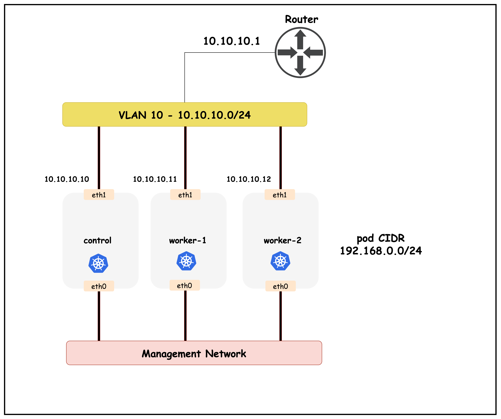
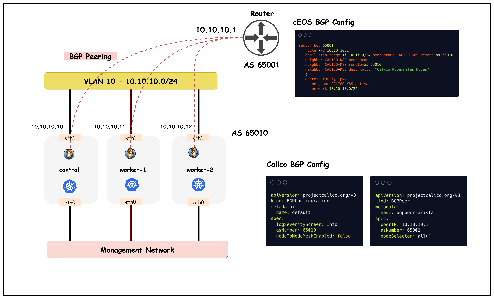

# Calico BGP

This lab demonstrates Calico's BGP (Border Gateway Protocol) functionality. BGP peering with upstream networks can be used to advertise pod as well as service CIDRs.

## Lab Setup
To setup the lab for this module **[Lab setup](../readme.md#lab-setup)**
The lab folder is - `/containerlab/calico-bgp`

## Lab

### 1. Inspect ContainerLab Topology

First, let's inspect the lab topology.

##### command
```bash
containerlab inspect topology.clab.yaml 
```
##### output
| Name                   | Kind          | Image                | State   | IPv4 Address | IPv6 Address         |
|------------------------|---------------|----------------------|---------|--------------|----------------------|
| k01-control-plane      | ext-container | kindest/node:v1.32.2 | running | 172.18.0.2   | fc00:f853:ccd:e793::2 |
| k01-worker             | ext-container | kindest/node:v1.32.2 | running | 172.18.0.3   | fc00:f853:ccd:e793::3 |
| k01-worker2            | ext-container | kindest/node:v1.32.2 | running | 172.18.0.4   | fc00:f853:ccd:e793::4 |
| clab-calico-bgp-ceos01 | arista_ceos   | ceos:4.34.0F         | running | 172.20.20.2  | 3fff:172:20:20::2 |
| k01-control-plane      | k8s-kind      | kindest/node:v1.32.2 | running | 172.18.0.2   | fc00:f853:ccd:e793::2 |
| k01-worker             | k8s-kind      | kindest/node:v1.32.2 | running | 172.18.0.3   | fc00:f853:ccd:e793::3 |
| k01-worker2            | k8s-kind      | kindest/node:v1.32.2 | running | 172.18.0.4   | fc00:f853:ccd:e793::4 |

Next, let's inspect the Kubernetes cluster.
```
export KUBECONFIG=/home/ubuntu/containerlab/calico-bgp/k01.kubeconfig
```
```
kubectl get nodes
```

```
NAME                STATUS   ROLES           AGE   VERSION
k01-control-plane   Ready    control-plane   47m   v1.32.2
k01-worker          Ready    <none>          46m   v1.32.2
k01-worker2         Ready    <none>          46m   v1.32.2
```

The following topology configuration can be seen in the `topology.clab.yaml` file.

```
    k01-control-plane:
      kind: ext-container
      exec:
        - "ip addr add dev eth1 10.10.10.10/24"

    k01-worker:
      kind: ext-container
      exec:
        - "ip addr add dev eth1 10.10.10.11/24"


    k01-worker2:
      kind: ext-container
      exec:
        - "ip addr add dev eth1 10.10.10.12/24"

  links:
    - endpoints: ["ceos01:eth1", "k01-control-plane:eth1"]
    - endpoints: ["ceos01:eth2", "k01-worker:eth1"]
    - endpoints: ["ceos01:eth3", "k01-worker2:eth1"]
```




### 2. Calico BGP Resources

#### 2.1 BGP Configuration

BGP Configuration is a cluster-wide resource that controls global BGP settings for Calico, including the AS number, logging levels, and whether to enable the default node-to-node mesh. This resource determines how Calico nodes will participate in BGP routing throughout the cluster.

```
apiVersion: projectcalico.org/v3
kind: BGPConfiguration
metadata:
  name: default
spec:
  logSeverityScreen: Info
  asNumber: 65010
  nodeToNodeMeshEnabled: false
```
##### explanation
This BGP Configuration sets up Calico's global BGP behavior for the cluster:
- **`asNumber: 65010`**: Assigns AS number 65010 to all Calico nodes in the cluster
- **`nodeToNodeMeshEnabled: false`**: Disables the default full mesh BGP peering between all Calico nodes
- **`logSeverityScreen: Info`**: Sets BGP logging level to Info for troubleshooting
- With mesh disabled, nodes will only peer with explicitly configured external BGP neighbors

#### 2.2 BGP Peer

BGP Peer resources define external BGP neighbors that Calico nodes should establish sessions with to exchange routing information. This allows Calico to advertise pod routes to external network infrastructure and receive routes from upstream routers.

```
apiVersion: projectcalico.org/v3
kind: BGPPeer
metadata:
  name: bgppeer-arista
spec:
  peerIP: 10.10.10.1           # IP address of your Arista switch
  asNumber: 65001              # AS number of the Arista switch
  nodeSelector: all()  
```

##### explanation
This BGP Peer configuration establishes external BGP peering with network infrastructure:
- **`peerIP: 10.10.10.1`**: IP address of the Arista switch to establish BGP session with
- **`asNumber: 65001`**: AS number of the external BGP peer (Arista switch)
- **`nodeSelector: all()`**: Applies this peering configuration to all Calico nodes in the cluster
- Once established, Calico will advertise pod subnet routes to the switch and receive external routes

### 3. cEOS BGP Configuration

This section shows the BGP configuration required on the Arista cEOS switch to establish peering with Calico nodes. The configuration uses a peer group to simplify management of multiple Calico node connections and enables dynamic peering using the listen range feature.

```
router bgp 65001
   router-id 10.10.10.1
   bgp listen range 10.10.10.0/24 peer-group CALICO-K8S remote-as 65010
   neighbor CALICO-K8S peer group
   neighbor CALICO-K8S remote-as 65010
   neighbor CALICO-K8S description "Calico Kubernetes Nodes"
   !
   address-family ipv4
      neighbor CALICO-K8S activate
      network 10.10.10.0/24
```

##### explanation
This cEOS BGP configuration establishes peering with Calico nodes:
- **`router bgp 65001`**: Configures BGP with AS number 65001 for the switch
- **`router-id 10.10.10.1`**: Sets the BGP router ID to the switch's IP address
- **`bgp listen range 10.10.10.0/24 peer-group CALICO-K8S remote-as 65010`**: Enables dynamic peering for any host in the subnet with AS 65010
- **`neighbor CALICO-K8S peer group`**: Creates a peer group template for Calico nodes
- **`neighbor CALICO-K8S remote-as 65010`**: Specifies the AS number for Calico peers
- **`neighbor CALICO-K8S activate`**: Activates the peer group for IPv4 address family
- **`network 10.10.10.0/24`**: Advertises the local subnet to BGP peers
- This allows the switch to automatically accept BGP connections from any Calico node in the 10.10.10.0/24 range

### 4. Validate BGP Peering

This section demonstrates how to verify that BGP peering configurations have been successfully applied to the Calico cluster. We'll use calicoctl commands to inspect the configured BGP peers and confirm they are ready to establish sessions.

#### 4.1 Validate BGP Peering in Calico

##### command
```
calicoctl get bgppeers
```
##### output
```
NAME             PEERIP       NODE    ASN     
bgppeer-arista   10.10.10.1   all()   65001   
```
##### explanation
This output shows the configured BGP peers in the Calico cluster:
- **`NAME`**: The name of the BGP peer resource (`bgppeer-arista`)
- **`PEERIP`**: The IP address of the external BGP neighbor (`10.10.10.1`)
- **`NODE`**: Node selector indicating which Calico nodes will peer (`all()` means all nodes)
- **`ASN`**: The AS number of the external peer (`65001`)
- This confirms the BGP peer configuration is active and all Calico nodes are configured to establish BGP sessions with the Arista switch

#### 4.2 Validate BGP Peering in cEOS

This section shows how to verify BGP peering status from the Arista cEOS switch perspective. We'll connect to the switch CLI and examine the BGP neighbor relationships to confirm that sessions are established with all Calico nodes.

```
docker exec -it clab-calico-bgp-ceos01 Cli
```

##### command
```
enable
show ip bgp summary
```

##### output
```
ceos#show ip bgp summary
BGP summary information for VRF default
Router identifier 10.10.10.1, local AS number 65001
Neighbor Status Codes: m - Under maintenance
  Description              Neighbor    V AS           MsgRcvd   MsgSent  InQ OutQ  Up/Down State   PfxRcd PfxAcc
  "Calico Kubernetes Nodes 10.10.10.10 4 65010             44        45    0    0 00:35:59 Estab   0      0
  "Calico Kubernetes Nodes 10.10.10.11 4 65010             44        47    0    0 00:35:59 Estab   0      0
  "Calico Kubernetes Nodes 10.10.10.12 4 65010             44        47    0    0 00:35:59 Estab 
  ```

##### Explanation
This BGP summary output from the cEOS switch shows successful peering with Calico nodes:
- **`Router identifier 10.10.10.1`**: The switch's BGP router ID
- **`local AS number 65001`**: Confirms the switch is using AS 65001
- **`Neighbor`**: Shows the IP addresses of connected Calico nodes (10.10.10.10, 10.10.10.11, 10.10.10.12)
- **`V AS`**: BGP version (4) and remote AS number (65010) for each peer
- **`MsgRcvd/MsgSent`**: Number of BGP messages exchanged, indicating active communication
- **`State`**: All peers show `Estab` (Established), confirming successful BGP sessions
- **`Up/Down`**: Duration that BGP sessions have been established
- **`PfxRcd/PfxAcc`**: Number of prefixes received and accepted from each peer
- This confirms that the cEOS switch has successfully established BGP peering with all three Calico nodes




## Summary

This lab successfully demonstrates Calico's BGP integration capabilities with external network infrastructure. The key components and learnings include:

### Architecture
- **Kubernetes Cluster**: 3-node Kind cluster (1 control-plane, 2 workers) running Calico CNI
- **Network Infrastructure**: Arista cEOS switch acting as external BGP peer
- **Network Topology**: Direct Layer 2 connectivity between Kubernetes nodes and switch via ContainerLab

### BGP Configuration
- **Calico Side**: AS 65010 with disabled node-to-node mesh, external BGP peering to switch
- **Switch Side**: AS 65001 with dynamic peer group accepting connections from Calico nodes
- **Peering**: Successful BGP sessions established between all Calico nodes and the cEOS switch
.

This lab provides a foundation for understanding how Calico can integrate with real-world network infrastructure using standard BGP protocols.
